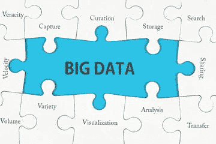
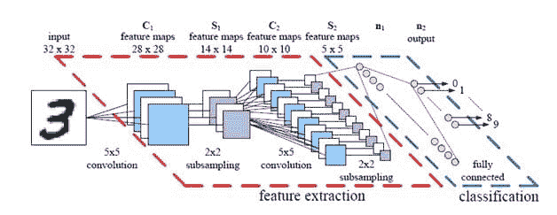
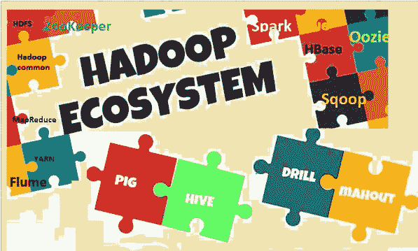

# 277 个数据科学关键术语，解释详尽

> 原文：[`www.kdnuggets.com/2017/09/data-science-key-terms-explained.html`](https://www.kdnuggets.com/2017/09/data-science-key-terms-explained.html)

本文展示了一系列与数据科学相关的关键术语，并提供简明扼要的定义，分为 12 个不同的主题。从大数据开始，一直到自然语言处理，这些定义涵盖了机器学习、数据库、Apache Hadoop 等多个方面。虽然可能需要一些时间，但一旦你掌握了这些术语，你应该对数据科学中的重要术语有一个清晰的了解。如果定义对你来说过于简略，也不用担心；在适当的地方有丰富的链接供你进行扩展阅读。

* * *

## 我们的前三大课程推荐

 1\. [Google 网络安全证书](https://www.kdnuggets.com/google-cybersecurity) - 快速进入网络安全职业生涯。

 2\. [Google 数据分析专业证书](https://www.kdnuggets.com/google-data-analytics) - 提升你的数据分析技能

 3\. [Google IT 支持专业证书](https://www.kdnuggets.com/google-itsupport) - 支持你的组织的 IT 工作

* * *

**20 个大数据关键术语，解释详尽**

大数据。如果你以某种方式来到这个网站，并且自从它开始流行[至少十多年以前](http://www.forbes.com/sites/gilpress/2013/05/09/a-very-short-history-of-big-data/)以来从未听说过这个术语，我真的不知道该说什么。

但仅仅听说过这个术语，或者参与（或反对）其随意使用，并不意味着你真正了解它的含义或其完全涵盖的内容。实际上，试图在一篇文章中详尽描述大数据是什么是毫无意义的，原因之一是没有公认的详尽描述，也不应该有。然而，收集一些与大数据相关的关键术语并不是个坏主意，因为这为进一步的工作奠定了共同的基础。

**12 个机器学习关键术语，解释详尽**

这是 KDnuggets 系列文章中的第一篇，提供相关术语（以机器学习为例）的简明解释，专门采用简洁明了的方式，适合那些希望隔离和定义术语的人。经过一些思考，我们确定这些基础但富有信息的文章在过去没有得到足够的曝光。

所以，让我们从机器学习及相关主题开始了解吧。

**10 个聚类关键术语解释**

聚类是一种数据分析方法，它将数据点分组，以“最大化类内相似性和最小化类间相似性”（由[Han, Kamber & Pei](http://hanj.cs.illinois.edu/bk3/)提出），而不使用预定义的点标签（即一种无监督学习技术）。本文介绍了聚类分析中常用技术的关键术语。

**14 个深度学习关键术语解释**

深度学习是一个相对较新的术语，尽管它在最近的在线搜索量激增之前就已经存在。由于在多个不同领域的令人难以置信的成功，深度学习在研究和行业中正经历着激增。深度学习是应用深度神经网络技术的过程——即具有多个隐藏层的神经网络架构——来解决问题。深度学习是一种过程，类似于数据挖掘，使用深度神经网络架构，这些架构是特定类型的机器学习算法。

**16 个数据库关键术语解释**

数据需要被策划、呵护和管理。它需要被存储和处理，以便将其转化为信息，并进一步精炼成知识。存储数据的机制，继而促进这些转化，显然是数据库。

本文介绍了 16 个关键的数据库概念及其简洁、直接的定义。

**15 个描述性统计学关键术语解释**

尽管统计学是数据科学的核心工具集，但往往被更实用的技术技能，如编程，所忽视。即使是机器学习算法，依赖于数学概念如代数和微积分——更不用说统计学了！——也常常被当作一个比实际需要的更高层次来处理，这可能导致“数据科学家”对其职业的一个关键方面缺乏基本理解。

**11 个预测分析入门关键术语解释**

本文汇编了 PAW 创始人 Eric Siegel 的畅销获奖书籍[《预测分析：预测谁会点击、购买、撒谎或死亡的力量》](http://www.thepredictionbook.com/)（修订版，2016 年）中包含的关键定义，这本书已经被 35 多所大学作为教科书采用——但阅读起来像流行科学，被称为“大数据的《怪诞经济学》”。

**20 个云计算关键术语解释**

云计算主要使公司能够更快地部署其应用程序，而无需过多的维护，这些维护由服务提供商管理。这也导致了更好的计算资源利用，根据业务的需求和要求进行调整。

虽然互联网充满了与云相关的术语，但这里有一些相当基础但重要的术语，任何人都应该了解这些术语。了解这些关键术语将帮助你理解行业发展和未来的云计算趋势。

**16 Hadoop 关键术语解析**

Hadoop 是一个由 Apache 基金会管理的非常强大的开源平台。Hadoop 平台建立在 Java 技术之上，能够在分布式集群环境中处理大量异构数据。其扩展能力使其非常适合分布式计算。

Hadoop 生态系统由 Hadoop 核心组件和其他相关工具组成。在核心组件中，Hadoop 分布式文件系统（HDFS）和 MapReduce 编程模型是两个最重要的概念。在相关工具中，Hive 用于 SQL，Pig 用于数据流，Zookeeper 用于服务管理等都是重要的。我们将详细解释这些术语。

**13 Apache Spark 关键术语解析**

Apache Spark 之所以如此受欢迎，其中一个原因是 Spark 为数据工程师和数据科学家提供了一个强大的统一引擎，该引擎既快速（在大规模数据处理上比 Apache Hadoop 快 100 倍），又易于使用。这使得数据从业者能够以更大规模互动解决机器学习、图计算、流处理和实时交互查询处理问题。

在这篇博客文章中，我们将讨论在使用 Apache Spark 时遇到的一些关键术语。

**12 物联网关键术语解析**

物联网（IoT）是一个概念，旨在允许互联网基础的通信在物理对象、传感器和控制器之间发生。本文将以直白的方式定义物联网的 12 个关键术语。

**18 自然语言处理关键术语解析**

本文旨在提供一个入门角色，采取简明的方式定义一些关键的自然语言处理术语。虽然阅读后你不会成为语言学专家，但我们希望你能更好地理解一些 NLP 相关的讨论，并获得如何进一步学习这些主题的视角。

这里有 18 个精选的自然语言处理术语，简明定义，并提供了适当的进一步阅读链接。

**相关**：

+   机器学习算法：简明技术概述 – 第一部分

+   深度学习与神经网络概述：初学者的基本概念

+   数据科学概述：初学者的基本概念

### 更多相关内容

+   [成为优秀数据科学家所需的 5 项关键技能](https://www.kdnuggets.com/2021/12/5-key-skills-needed-become-great-data-scientist.html)

+   [数据库关键术语，解析](https://www.kdnuggets.com/2016/07/database-key-terms-explained.html)

+   [描述性统计关键术语，解析](https://www.kdnuggets.com/2017/05/descriptive-statistics-key-terms-explained.html)

+   [机器学习关键术语，解析](https://www.kdnuggets.com/2016/05/machine-learning-key-terms-explained.html)

+   [深度学习关键术语，解析](https://www.kdnuggets.com/2016/10/deep-learning-key-terms-explained.html)

+   [自然语言处理关键术语，解析](https://www.kdnuggets.com/2017/02/natural-language-processing-key-terms-explained.html)
