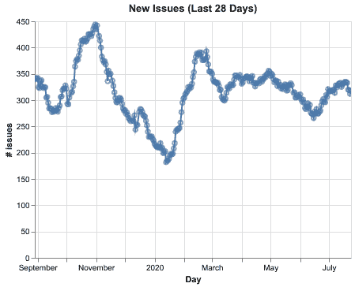
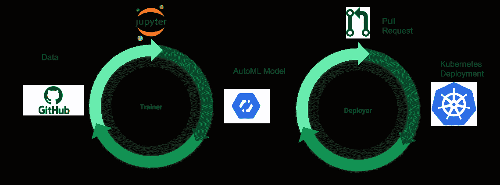
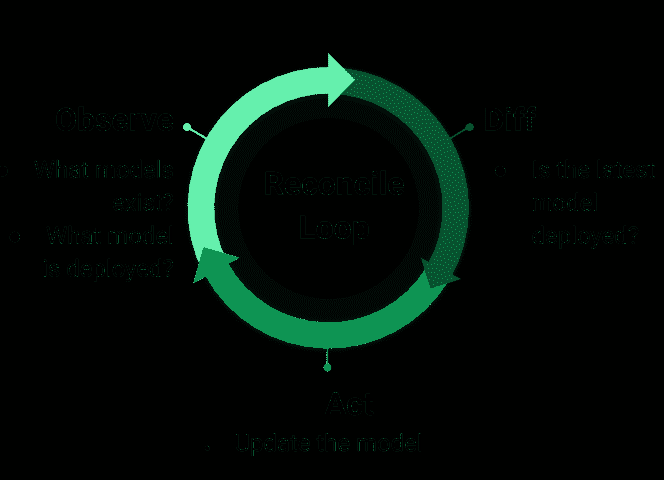
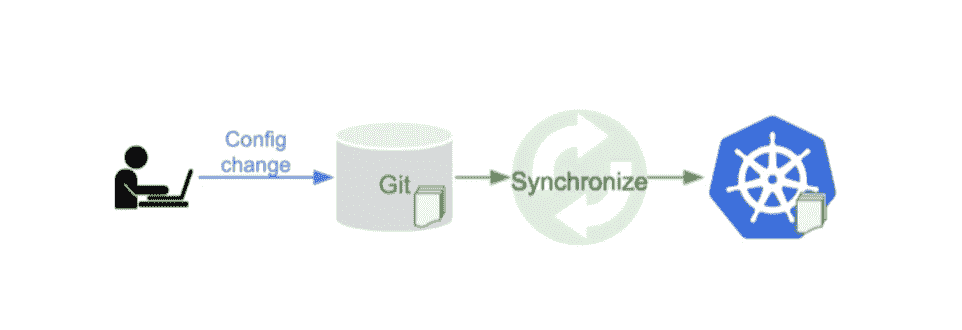
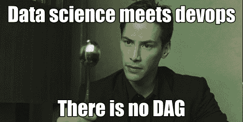

# 数据科学与 DevOps 相遇：使用 Jupyter、Git 和 Kubernetes 的 MLOps

> 原文：[`www.kdnuggets.com/2020/08/data-science-meets-devops-mlops-jupyter-git-kubernetes.html`](https://www.kdnuggets.com/2020/08/data-science-meets-devops-mlops-jupyter-git-kubernetes.html)

评论

**作者：[Jeremy Lewi](https://www.linkedin.com/in/jeremy-lewi-600aaa8/)，谷歌软件工程师 & [Hamel Husain](https://hamel.dev/)，GitHub 高级机器学习工程师**

### 问题

* * *

## 我们的前三名课程推荐

 1\. [Google 网络安全证书](https://www.kdnuggets.com/google-cybersecurity) - 快速进入网络安全职业生涯。

 2\. [Google 数据分析专业证书](https://www.kdnuggets.com/google-data-analytics) - 提升您的数据分析技能

 3\. [Google IT 支持专业证书](https://www.kdnuggets.com/google-itsupport) - 支持您的组织的 IT 工作

* * *

[Kubeflow](https://www.kubeflow.org/) 是一个快速发展的开源项目，使在 Kubernetes 上部署和管理机器学习变得简单。

由于 Kubeflow 的爆炸性流行，我们接收了大量的 GitHub 问题，这些问题必须被分类并转交给合适的主题专家。下图展示了过去一年中新开启的问题数量：



**图 1:** Kubeflow 问题数量

为了应对这种流量，我们开始投资一个叫做 [Issue Label Bot](https://github.com/marketplace/issue-label-bot) 的 GitHub 应用程序，它使用机器学习来自动标记问题。我们的 [第一个模型](https://github.com/marketplace/issue-label-bot) 是通过使用 GitHub 上流行的公共代码库集合来训练的，只预测了通用标签。随后，我们开始使用 [Google AutoML](https://cloud.google.com/automl/docs) 来训练一个特定于 Kubeflow 的模型。新模型能够以 72% 的平均精度和 50% 的平均召回率预测 Kubeflow 特定标签。这大大减少了与 Kubeflow 维护相关的问题管理的繁琐工作。下表包含了对 Kubeflow 特定标签在保留集上的评估指标。以下的 [精度和召回率](https://en.wikipedia.org/wiki/Precision_and_recall) 与我们为适应需求而调整的预测阈值一致。

| 标签 | 精度 | 召回率 |
| --- | --- | --- |
| area-backend | 0.6 | 0.4 |
| area-bootstrap | 0.3 | 0.1 |
| area-centraldashboard | 0.6 | 0.6 |
| area-components | 0.5 | 0.3 |
| area-docs | 0.8 | 0.7 |
| area-engprod | 0.8 | 0.5 |
| area-front-end | 0.7 | 0.5 |
| area-frontend | 0.7 | 0.4 |
| area-inference | 0.9 | 0.5 |
| area-jupyter | 0.9 | 0.7 |
| area-katib | 0.8 | 1.0 |
| area-kfctl | 0.8 | 0.7 |
| area-kustomize | 0.3 | 0.1 |
| area-operator | 0.8 | 0.7 |
| area-pipelines | 0.7 | 0.4 |
| area-samples | 0.5 | 0.5 |
| area-sdk | 0.7 | 0.4 |
| area-sdk-dsl | 0.6 | 0.4 |
| area-sdk-dsl-compiler | 0.6 | 0.4 |
| area-testing | 0.7 | 0.7 |
| area-tfjob | 0.4 | 0.4 |
| platform-aws | 0.8 | 0.5 |
| platform-gcp | 0.8 | 0.6 |

**表 1:** 各种 Kubeflow 标签的评估指标。

鉴于新问题的到来速度，定期重新训练我们的模型变成了一个优先事项。我们认为，持续重新训练和部署我们的模型以利用这些新数据对于保持模型的有效性至关重要。

### 我们的解决方案

我们的 CI/CD 解决方案如 [图 2](https://blog.kubeflow.org/mlops/#fig2) 所示。我们不显式地创建一个有向无环图（DAG）来连接 ML 工作流中的各个步骤（例如预处理、训练、验证、部署等）。相反，我们使用一组独立的控制器。每个控制器声明性地描述世界的期望状态，并采取必要的行动使实际状态与之匹配。这种独立性使我们可以使用最适合每个步骤的工具。更具体地说，我们使用

+   用于开发模型的 Jupyter 笔记本。

+   GitOps 用于持续集成和部署。

+   Kubernetes 和托管云服务用于基础设施。



**图 2:** 展示了我们如何进行 CI/CD。我们目前的管道由两个独立操作的控制器组成。我们通过描述我们希望存在的模型（即我们的模型“新鲜”的含义）来配置 Trainer（左侧）。Trainer 定期检查训练模型是否足够新鲜，如果不够新鲜则训练一个新模型。同样地，我们配置 Deployer（右侧）来定义部署模型与训练模型集合同步的含义。如果未部署正确的模型，它将部署一个新模型。

有关模型训练和部署的更多细节，请参考 [下面的驱动部分](https://blog.kubeflow.org/mlops/#actuation)。

### 背景

### 使用协调器构建弹性系统

协调器是一种被证明对构建弹性系统极其有用的控制模式。协调模式 [是 Kubernetes 工作原理的核心](https://book.kubebuilder.io/cronjob-tutorial/controller-overview.html)。图 3 展示了协调器的工作原理。协调器通过首先观察世界的状态来工作；例如，当前部署了什么模型。然后协调器将其与世界的期望状态进行比较并计算差异；例如，标签为“version=20200724”的模型应该被部署，但当前部署的模型标签为“version=20200700”。协调器随后采取必要的行动将世界驱动到期望状态；例如，打开一个拉取请求以更改部署的模型。



**图 3.** 我们的部署器应用的 Reconciler 模式示意图。

Reconciler 已被证明在构建弹性系统方面极为有用，因为一个良好实现的 Reconciler 提供了高度的信心，无论系统如何扰动，它最终都会恢复到期望的状态。

### 无 DAG

控制器的声明性特征意味着数据可以通过一系列控制器流动，而无需显式创建 DAG。与其使用 DAG，不如将一系列数据处理步骤表示为一组期望的状态，如下图 4 所示：


**图 4:** 说明了管道如何从独立的控制器中产生，而无需明确编码一个有向无环图（DAG）。这里我们有两个完全独立的控制器。第一个控制器确保每个元素 a[i] 都应该有一个元素 b[i]。第二个控制器确保每个元素 b[i] 都应该有一个元素 c[i]。

与许多传统的 DAG 基础工作流相比，这种基于 Reconciler 的范式提供了以下优势：

+   **抗故障能力**：系统持续寻求实现并维持期望的状态。

+   **工程团队自主性的增加：** 每个团队可以自由选择适合其需求的工具和基础设施。Reconciler 框架只要求控制器之间有最少的耦合，同时仍允许编写表达力强的工作流。

+   **经过实战检验的模式和工具**：这个基于 Reconciler 的框架并没有发明新的东西。Kubernetes 拥有丰富的工具生态系统，旨在简化控制器的构建。Kubernetes 的流行意味着有一个庞大且不断增长的社区熟悉这种模式及其支持工具。

### GitOps：通过拉取请求进行操作

GitOps，如图 5 所示，是一种管理基础设施的模式。GitOps 的核心思想是源代码控制（不一定是 git）应当是描述基础设施配置文件的真实来源。然后，控制器可以监视源代码控制并在配置更改时自动更新你的基础设施。这意味着要进行更改（或撤销更改），你只需打开一个拉取请求。



**图 5:** 要推送 Label Bot 的新模型，我们创建一个 PR 更新配置映射，以存储我们想要使用的 Auto ML 模型的 ID。当 PR 被合并后， [Anthos Config Management(ACM)](https://cloud.google.com/anthos-config-management/docs) 会自动将这些更改部署到我们的 GKE 集群。因此，后续的预测将使用新模型。 （图片由 [Weaveworks](https://www.weave.works/blog/automate-kubernetes-with-gitops) 提供）

### 综合起来：Reconciler + GitOps = 机器学习的 CI/CD

有了这些背景知识，我们接下来深入探讨如何通过结合 Reconciler 和 GitOps 模式来构建 CI/CD 以支持机器学习。

我们需要解决三个问题：

1.  我们如何计算世界的期望状态与实际状态之间的差异？

1.  我们如何进行必要的更改，以使实际状态与期望状态匹配？

1.  我们如何构建一个控制循环来持续运行 1 和 2？

### 计算差异

为了计算差异，我们只需编写执行我们需要的操作的 lambda 函数。因此，在这种情况下，我们编写了两个 lambda 函数：

1.  [第一个 lambda](https://github.com/kubeflow/code-intelligence/blob/faeb65757214ac93259f417b81e9e2fedafaebda/Label_Microservice/go/cmd/automl/pkg/server/server.go#L109)根据最近模型的年龄来确定是否需要重新训练。

1.  [第二个 lambda](https://github.com/kubeflow/code-intelligence/blob/faeb65757214ac93259f417b81e9e2fedafaebda/Label_Microservice/go/cmd/automl/pkg/server/server.go#L49)通过将最近训练的模型与在源代码控制中检查的配置映射中的模型进行比较来确定模型是否需要更新。

我们将这些 lambda 函数封装在一个简单的 Web 服务器中并部署到 Kubernetes 上。我们选择这种方法的原因之一是我们希望依赖 Kubernetes 的[git-sync](https://github.com/kubernetes/git-sync)将我们的仓库镜像到 pod 卷中。这使得我们的 lambda 函数变得非常简单，因为所有的 git 管理都由一个运行[git-sync](https://github.com/kubernetes/git-sync)的 side-car 处理。

### 执行

为了应用必要的更改，我们使用 Tekton 将我们用来执行各个步骤的不同 CLI 连接在一起。

### 模型训练

为了训练我们的模型，我们有一个[Tekton 任务](https://github.com/kubeflow/code-intelligence/blob/faeb65757214ac93259f417b81e9e2fedafaebda/tekton/tasks/run-notebook-task.yaml#L34)：

1.  使用[papermill](https://github.com/nteract/papermill) 运行我们的笔记本。

1.  使用[nbconvert](https://nbconvert.readthedocs.io/en/latest/)将笔记本转换为 HTML。

1.  使用[gsutil](https://cloud.google.com/storage/docs/gsutil)将 `.ipynb` 和 `.html` 文件上传到 GCS。

该笔记本从 BigQuery 中提取 GitHub Issues 数据，[从 BigQuery](https://medium.com/google-cloud/analyzing-github-issues-and-comments-with-bigquery-c41410d3308) 并生成适合导入到[Google AutoML](https://cloud.google.com/automl)的 GCS 上的 CSV 文件。然后，笔记本启动一个[AutoML](https://cloud.google.com/automl)任务来训练模型。

我们选择 AutoML 是因为我们希望专注于构建一个完整的端到端解决方案，而不是在模型上进行迭代。AutoML 提供了一个竞争性的基准，我们可以在未来尝试改进。

为了轻松查看执行的笔记本，我们将其转换为 HTML 并上传到[GCS，这使得公开提供静态内容变得容易](https://cloud.google.com/storage/docs/hosting-static-website)。这允许我们使用笔记本生成丰富的可视化来评估我们的模型。

### 模型部署

要部署我们的模型，我们有一个 [Tekton 任务](https://github.com/kubeflow/code-intelligence/blob/faeb65757214ac93259f417b81e9e2fedafaebda/tekton/tasks/update-model-pr-task.yaml#L68)：

1.  使用 kpt 更新我们的 configmap 为所需值。

1.  运行 git 将我们的更改推送到一个分支。

1.  使用一个包装器来操作 [GitHub CLI](https://github.com/cli/cli) (gh) 来创建 PR。

控制器确保每次只有一个 Tekton 管道在运行。我们配置我们的管道始终推送到相同的分支。这确保我们只会打开一个 PR 来更新模型，因为 GitHub 不允许从同一分支创建多个 PR。

一旦 PR 合并，[Anthos Config Mesh](https://cloud.google.com/anthos/config-management) 会自动将 Kubernetes 清单应用到我们的 Kubernetes 集群。

### 为什么选择 Tekton

我们选择 Tekton 是因为我们面临的主要挑战是顺序运行一系列 CLIs 在不同的容器中。Tekton 对此非常合适。重要的是，Tekton 任务中的所有步骤都在同一个 Pod 上运行，这允许使用 Pod 卷在步骤之间共享数据。

此外，由于 Tekton 资源是 Kubernetes 资源，我们可以采用相同的 GitOps 模式和工具来更新我们的管道定义。

### 控制循环

最后，我们需要构建一个控制循环，定期调用我们的 lambdas 并根据需要启动 Tekton 管道。我们使用 kubebuilder 创建了一个 [简单的自定义控制器](https://github.com/kubeflow/code-intelligence/tree/master/Label_Microservice/go)。我们控制器的协调循环将调用我们的 lambda 来确定是否需要同步，如果需要的话，使用哪些参数。如果需要同步，控制器会触发 Tekton 管道来执行实际更新。下面是我们的 [自定义资源](https://kubernetes.io/docs/concepts/extend-kubernetes/api-extension/custom-resources/) 的示例：

```py
apiVersion: automl.cloudai.kubeflow.org/v1alpha1
kind: ModelSync
metadata:
  name: modelsync-sample
  namespace: label-bot-prod
spec:
  failedPipelineRunsHistoryLimit: 10
  needsSyncUrl: http://labelbot-diff.label-bot-prod/needsSync
  parameters:
  - needsSyncName: name
    pipelineName: automl-model
  pipelineRunTemplate:
    spec:
      params:
      - name: automl-model
        value: notavlidmodel
      - name: branchName
        value: auto-update
      - name: fork
        value: git@github.com:kubeflow/code-intelligence.git
      - name: forkName
        value: fork
      pipelineRef:
        name: update-model-pr
      resources:
      - name: repo
        resourceSpec:
          params:
          - name: url
            value: https://github.com/kubeflow/code-intelligence.git
          - name: revision
            value: master
          type: git
      serviceAccountName: auto-update
  successfulPipelineRunsHistoryLimit: 10 
```

自定义资源指定了端点**needsSyncUrl**，用于计算是否需要同步的 lambda 和一个 Tekton PipelineRun**pipelineRunTemplate**，描述了在需要同步时创建的管道运行。控制器处理详细信息；例如，确保每个资源每次只有一个管道在运行，垃圾回收旧的运行等……所有繁重的工作都由 Kubernetes 和 kubebuilder 为我们处理。

注意，出于历史原因，kind **ModelSync** 和 apiVersion **automl.cloudai.kubeflow.org** 与控制器实际执行的内容不完全一致。我们计划在未来修复这个问题。

### 构建您自己的 CI/CD 管道

我们的代码库距离成熟的、易于重用的工具还很遥远。尽管如此，它是公开的，可以作为构建自己管道的有用起点。

以下是一些入门指引：

1.  使用 Dockerfile 来构建您自己的 [ModelSync 控制器](https://github.com/kubeflow/code-intelligence/blob/master/Label_Microservice/go/Dockerfile)

1.  [修改 kustomize 包](https://github.com/kubeflow/code-intelligence/tree/master/Label_Microservice/go/config/default) 以使用你的镜像并部署控制器

1.  根据你的用例定义一个或多个 lambda 函数

    +   你可以参考我们的 [Lambda 服务器](https://github.com/kubeflow/code-intelligence/blob/master/Label_Microservice/go/cmd/automl/pkg/server/server.go) 作为示例

    +   我们用 Go 编写了我们的代码，但你可以使用任何你喜欢的语言和 web 框架（例如 flask）

1.  定义适合你的用例的 Tekton 流水线；我们的流水线（见下文链接）可能是一个有用的起点

    +   [Notebook Tekton 任务](https://github.com/kubeflow/code-intelligence/blob/master/tekton/tasks/run-notebook-task.yaml) - 使用 papermill 运行 notebook 并上传到 GCS

    +   [PR Tekton 任务](https://github.com/kubeflow/code-intelligence/blob/master/tekton/tasks/update-model-pr-task.yaml) - Tekton 任务用于打开 GitHub PR

1.  根据你的用例定义 ModelSync 资源；你可以参考我们的资源作为示例

    +   [ModelSync 部署规范](https://github.com/kubeflow/code-intelligence/blob/master/Label_Microservice/auto-update/prod/modelsync.yaml) - YAML 用于持续部署标签机器人

    +   [ModelSync 训练规范](https://github.com/kubeflow/code-intelligence/blob/master/Label_Microservice/auto-update/prod/retrain-model.yaml) - YAML 用于持续训练我们的模型

如果你希望我们清理这些内容并在未来的 Kubeflow 版本中包含，请在问题 [kubeflow/kubeflow#5167](https://github.com/kubeflow/kubeflow/issues/5167) 中发言。

### 下一步

### 血统跟踪

由于我们没有明确的 DAG 表示 CI/CD 流水线中的步骤顺序，因此理解我们的模型的血统可能会很具挑战性。幸运的是，Kubeflow Metadata 通过使每个步骤记录其生成的输出所使用的代码和输入的信息变得容易，解决了这个问题。Kubeflow 元数据可以轻松恢复和绘制血统图。下图展示了我们 [xgboost 示例](https://github.com/kubeflow/examples/blob/master/xgboost_synthetic/build-train-deploy.ipynb) 的血统图示例。


**图 6：** 我们 [xgboost 示例](https://github.com/kubeflow/examples/blob/master/xgboost_synthetic/build-train-deploy.ipynb) 的血统跟踪 UI 截图。

我们的计划是让我们的控制器自动将血统跟踪信息写入元数据服务器，以便我们可以轻松了解生产中的内容的血统。

### 结论



构建 ML 产品是团队合作的成果。为了将模型从概念验证阶段转变为已发布的产品，数据科学家和 DevOps 工程师需要协作。为了促进这种协作，我们认为允许数据科学家和 DevOps 工程师使用他们首选的工具非常重要。具体来说，我们希望支持以下工具：数据科学家、DevOps 工程师和 [SRE](https://en.wikipedia.org/wiki/Site_Reliability_Engineering)。

+   Jupyter 笔记本用于模型开发。

+   GitOps 用于持续集成和部署。

+   Kubernetes 和托管云服务作为基础设施。

为了最大限度地提高每个团队的自主性并减少对工具的依赖，我们的 CI/CD 过程采用了去中心化的方法。我们的方法不是明确地定义一个连接步骤的 DAG，而是依赖于一系列可以独立定义和管理的控制器。我们认为这自然适用于责任可能在团队之间分配的企业；数据工程团队可能负责将网络日志转换为特征，建模团队可能负责从特征中生成模型，而部署团队可能负责将这些模型推向生产环境。

### 深入阅读

如果你想了解更多关于 GitOps 的内容，我们建议你查看 Weaveworks 的这个[指南](https://www.weave.works/technologies/gitops/)。

要学习如何构建自己的 Kubernetes 控制器， [kubebuilder 书籍](https://book.kubebuilder.io/) 提供了一个端到端的示例。

**[Jeremy Lewi](https://www.linkedin.com/in/jeremy-lewi-600aaa8/)** 是谷歌的软件工程师。

**[Hamel Husain](https://hamel.dev/)** 是 GitHub 的高级机器学习工程师。

[原文](https://blog.kubeflow.org/mlops/)。已获得许可转载。

**相关：**

+   我从 200 种机器学习工具中学到的东西

+   在边缘设备上实施 MLOps

+   端到端机器学习平台的概览

### 更多相关内容

+   [Kubernetes 实战：第二版](https://www.kdnuggets.com/2022/03/manning-kubernetes-action-second-edition.html)

+   [Kubernetes 中的高可用 SQL Server Docker 容器](https://www.kdnuggets.com/2022/04/high-availability-sql-server-docker-containers-kubernetes.html)

+   [数据科学中的 Git 速查表](https://www.kdnuggets.com/2022/11/git-data-science-cheatsheet.html)

+   [通过这个免费的 DevOps 速成课程释放你的潜力](https://www.kdnuggets.com/2023/03/corise-unlock-potential-with-this-free-devops-crash-course.html)

+   [每个初学者应该学习的 10 个必备 DevOps 工具](https://www.kdnuggets.com/10-essential-devops-tools-every-beginner-should-learn)

+   [数据科学家必备的 14 条 Git 命令](https://www.kdnuggets.com/2022/06/14-essential-git-commands-data-scientists.html)
