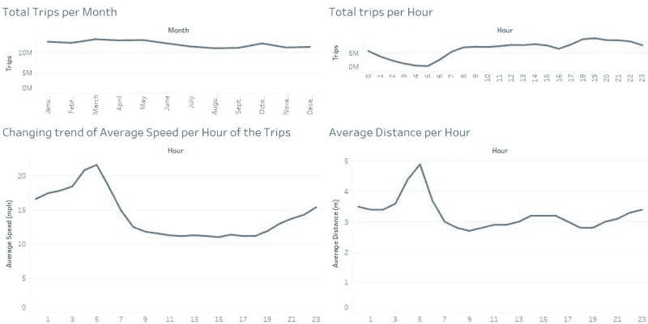
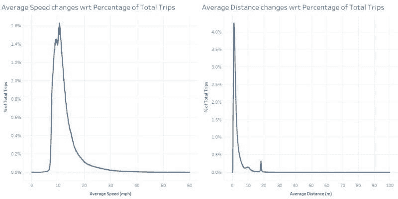

# NYC 出租车行程的数据科学：分析与可视化

> 原文：[`www.kdnuggets.com/2017/02/data-science-nyc-taxi-trips.html`](https://www.kdnuggets.com/2017/02/data-science-nyc-taxi-trips.html)

**由 Indu Khatri，约克大学 Schulich 商学院。**

当你决定处理真正的“Big Data”时，感觉就像梦想成真。让我为之狂热的数据是 NYC 出租车行程数据。感谢开放源代码技术的支持者，他们帮助了许多像我这样的新兴数据科学家学习和发展技能。NYC 出租车与豪华车委员会分享了近 11 亿次的纽约出租车行程信息（从 2009 年 1 月到 2015 年 6 月）。委员会发布了更新版的 13 亿次出租车行程数据（包括 2016 年 6 月之前的额外行程）。

* * *

## 我们的前 3 个课程推荐

 1\. [Google 网络安全证书](https://www.kdnuggets.com/google-cybersecurity) - 快速进入网络安全职业生涯。

 2\. [Google 数据分析专业证书](https://www.kdnuggets.com/google-data-analytics) - 提升你的数据分析技能

 3\. [Google IT 支持专业证书](https://www.kdnuggets.com/google-itsupport) - 支持你的组织 IT

* * *

我很快就意识到，当我尝试在我的 Acer 笔记本上探索这些数据时，它完全无能为力。作为计算机科学家和内心的商业女性，我在寻找一个能帮助我在这个数据集上测试数据科学技能的替代方案。像往常一样，Google 解决了我的问题！我使用了 Google BigQuery，它在云中存储了大量数据集，可以通过 SQL 查询进行探索。正如 Google 所说：“BigQuery 是 Google 完全托管的、PB 级别的、低成本的分析数据仓库。”（BigQuery 文档）。

为了进行我的分析，我可以访问 NYC 出租车与豪华车委员会上传的多个 CSV 文件，地址是：[www.nyc.gov/html/tlc/html/about/trip_record_data.shtml](http://www.nyc.gov/html/tlc/html/about/trip_record_data.shtml)。我本可以使用 ETL 过程从这些多个 CSV 文件中提取数据并加载到 BigQuery 中，但 Google 已经为我完成了这项工作。如果你对手动过程感兴趣，请参考这个精彩的博客：[tech.marksblogg.com/billion-nyc-taxi-rides-bigquery.html](http://tech.marksblogg.com/billion-nyc-taxi-rides-bigquery.html)。

BigQuery 提供了公共数据集，可以免费探索并集成到我们的软件应用中（在超过限制后可能收费——你可以查看定价计算器）。BigQuery 的 NYC TLC Trips 公共数据集包含了 2015 年之前的行程信息。这些数据包括了 NYC 黄色出租车记录的行程。以下是数据的链接：

+   [cloud.google.com/bigquery/public-data/nyc-tlc-trips](https://cloud.google.com/bigquery/public-data/nyc-tlc-trips)

+   [bigquery.cloud.google.com/dataset/bigquery-public-data:new_york](https://bigquery.cloud.google.com/dataset/bigquery-public-data:new_york)

我决定以如下方式继续我的分析：

### 1\. 探索了 2015 年的 TLC 黄出租车行程数据

以下是数据的表格描述。

| 表格 ID | bigquery-public-data:new_york.tlc_yellow_trips_2015 |
| --- | --- |
| 表格大小 | 18.7 GB |
| 行数 | 146,112,989 |

### 2\. 使用 BigQuery 的 StandardSQL 分析数据集

这是我用于分析的查询的简要概览：

### 3\. 使用 Tableau 进行解释性分析

我正在展示我的 Tableau 故事，展示了三个主要仪表板的自解释分析。

**第一个仪表板**讨论了以下趋势：

+   每月总旅行次数，

+   每小时总旅行次数，

+   每小时黄出租车的平均速度，

+   每小时黄出租车的平均行驶距离

**第二个仪表板**讨论了以下出租车行程相关信息：

+   热力图显示了给予司机的小费百分比（数据分为 24 小时的 7 周时间段），

+   5 个不同小费区间内的总行程百分比

**第三个仪表板**讨论了以下趋势：

+   以某个平均速度进行的总出租车行程的百分比。大多数平均速度在 5.50 到 39 mph 之间，

+   以某个平均距离进行的总出租车行程的百分比。大多数行程都在短距离内

**[点击这里探索 Tableau Public 上的仪表板](https://public.tableau.com/views/BigDataQueryNYCity/Story1?:embed=y&:display_count=yes)**。

PS：接下来的任务是进行预测分析。我计划建立一个多元回归模型来预测新行程的小费百分比。希望你觉得有帮助。请分享你的评论和建议！

**个人简介： [Indu Khatri](https://ca.linkedin.com/in/indukhatri)** 是一位大数据和机器学习爱好者，拥有计算机科学背景，并在 Accenture 和 Cerner 工作期间获得了多个奖项。她目前在 Schulich 商学院（约克大学，托伦托，加拿大）攻读商业分析硕士学位。

**相关内容：**

+   通过数据可视化提升工程智能的 Uber 案例

+   纽约出租车黑客马拉松——在公共出租车数据集中寻找隐私风险

+   汽车制造商必须围绕大数据进行合作

### 更多相关话题

+   [在纽约市的 Rev 3 与数据科学社区连接，排名第一的…](https://www.kdnuggets.com/2022/03/domino-connect-data-science-community-nyc-mlops-conference.html)

+   [数据科学、数据可视化与…的前 38 名 Python 库](https://www.kdnuggets.com/2020/11/top-python-libraries-data-science-data-visualization-machine-learning.html)

+   [KDnuggets 新闻 22:n16，4 月 20 日：学习的顶级 YouTube 频道](https://www.kdnuggets.com/2022/n16.html)

+   [数据科学中的绘图与数据可视化](https://www.kdnuggets.com/2022/06/plotting-data-visualization-data-science.html)

+   [用于数据可视化的 SQL：如何为图表和图形准备数据](https://www.kdnuggets.com/sql-for-data-visualization-how-to-prepare-data-for-charts-and-graphs)

+   [数据可视化的心理学：如何展示令人信服的数据](https://www.kdnuggets.com/the-psychology-of-data-visualization-how-to-present-data-that-persuades)
