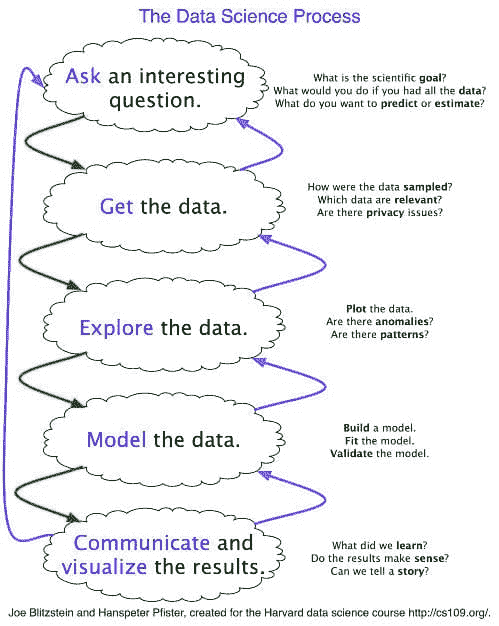

# 数据科学流程，重新发现

> 原文：[`www.kdnuggets.com/2016/03/data-science-process-rediscovered.html`](https://www.kdnuggets.com/2016/03/data-science-process-rediscovered.html)

上周，KDnuggets 的 热门推文 是对 [数据科学家的工作流程或过程是什么？](https://www.quora.com/What-is-the-work-flow-or-process-of-a-data-scientist) 的 Quora 回答。这个回答由自称为“神经科学家转数据科学家”的 Ryan Fox Squire 撰写，采用了**数据科学流程**来描述这种工作流程。

# 数据科学流程

* * *

## 我们的前 3 名课程推荐

 1\. [Google 网络安全证书](https://www.kdnuggets.com/google-cybersecurity) - 快速进入网络安全职业轨道。

 2\. [Google 数据分析专业证书](https://www.kdnuggets.com/google-data-analytics) - 提升你的数据分析技能

 3\. [Google IT 支持专业证书](https://www.kdnuggets.com/google-itsupport) - 支持你的组织 IT

* * *

数据科学流程是一个用于处理数据科学任务的框架，由 [哈佛大学 CS 109](http://cs109.github.io/2015/) 的 Joe Blitzstein 和 Hanspeter Pfister 制定。CS 109 的目标，[正如 Blitzstein 本人所述](https://www.quora.com/What-is-it-like-to-design-a-data-science-class/answer/Joe-Blitzstein)，是向学生介绍数据科学调查的整体过程，这一目标应能提供对框架本身的一些洞察。

以下是 Blitzstein 和 Pfister 框架的一个示例应用，关于每个阶段的技能和工具，由 Ryan Fox Squire 在他的回答中提供：

## **第 1 阶段：提出问题**

+   技能：科学、领域专长、好奇心

+   工具：你的大脑、与专家交流、经验

## **第 2 阶段：获取数据**

+   技能：网络爬虫、数据清洗、查询数据库、计算机科学知识

+   工具：python, pandas

## **第 3 阶段：探索数据**

+   技能：了解数据，提出假设，模式？异常？

+   工具：matplotlib, numpy, scipy, pandas, mrjob

## **第 4 阶段：建模数据**

+   技能：回归、机器学习、验证、大数据

+   工具：scikits learn, pandas, mrjob, mapreduce

## **第 5 阶段：传达数据**

+   技能：演讲、口语、视觉效果、写作

+   工具：matplotlib, adobe illustrator, powerpoint/keynote

Squire 然后（正确地）得出结论，数据科学工作流是一个非线性、迭代的过程，并且需要许多技能和工具来覆盖整个数据科学过程。Squire 还表示，他喜欢**数据科学过程**，因为它强调了提出问题以指导工作流的重要性，以及随着对数据的熟悉不断迭代问题和研究的重要性。

**数据科学框架**是一个创新的框架，用于解决数据科学问题。不是吗？

接下来，我们看看 CRISP-DM。

# CRISP-DM

与 Blitzstein & Pfister 提出的**数据科学过程**相比，并且由 Squire 进一步阐述，我们快速查看了*事实上的*官方（但无疑已过时）的数据挖掘框架（已扩展到数据科学问题），即跨行业数据挖掘标准过程（CRISP-DM）。尽管该标准不再积极维护，它仍然是一个受欢迎的框架，用于指导数据科学项目。

CRISP-DM 由以下步骤组成：

+   业务理解

+   数据理解

+   数据准备

+   建模

+   评估

+   部署

你可以在这些模型中看到相似之处：我们首先提出一个问题或寻求对某种特定现象的洞察，我们需要一些数据进行检查，这些数据必须以某种方式进行检查或准备，这些数据用于创建一个合适的模型，然后对生成的模型进行处理，无论是“部署”还是“传达”。尽管与 Blitzstein & Pfister 的**数据科学过程**相比，CRISP-DM 的工作流允许迭代性的问题解决，而且明显是非线性的。

就像标准本身不再维护一样，它的网站也没有维护。然而，你可以在其[维基百科页面](https://en.wikipedia.org/wiki/Cross_Industry_Standard_Process_for_Data_Mining)上获取有关 CRISP-DM 的更多信息。对于那些不熟悉 CRISP-DM 的人，[这个视觉指南](https://exde.files.wordpress.com/2009/03/crisp_visualguide.pdf)是一个很好的起点。

所以 CRISP-DM 显然是调查数据科学问题的基础框架，对吗？

# KDD 过程

与 CRISP-DM 出现的同时，KDD 过程已经完成了开发。KDD（知识发现数据库）过程，由 Fayyad、Piatetsky-Shapiro 和 Smyth 提出，是一个以“应用特定的数据挖掘方法进行模式发现和提取”为核心的框架。该框架包含以下步骤：

+   选择

+   预处理

+   转换

+   数据挖掘

+   解释

如果你认为“数据挖掘”一词类似于之前框架中的“建模”一词，那么 KDD 过程也相似。请注意此模型的迭代性质。

# 讨论

重要的是要注意，这些并不是此领域唯一的框架；[SEMMA（用于样本、探索、修改、建模和评估）](https://en.wikipedia.org/wiki/SEMMA)，来自 SAS，以及面向敏捷的[游击分析](http://guerrilla-analytics.net/)都值得提及。还有许多公司和行业中各种数据科学团队和个人无疑使用的内部流程。

那么，数据科学过程是对 CRISP-DM 的全新解读，CRISP-DM 只是 KDD 的再加工，还是一个全新的独立框架？嗯，是的，也不是。

就像数据科学可以被视为数据挖掘的现代版本一样，数据科学过程和 CRISP-DM **可能**被视为 KDD 过程的更新。需要明确的是，即使如此，也并不意味着它们变得不必要；对这些过程呈现方式的更新可能对新一代从更新的语言和“新”的框架视角来看待这些过程有所帮助，因此值得关注。

**每一个**JavaScript 库都值得吗？我不是这个领域的专家，但我会说可能不值得。虽然这并不是一个完美的类比，但基本观点是，在技术中，工具的使用经常会有所重叠。人们对新奇的事物和不同的东西很感兴趣，因此，即使新包装的术语与之前的术语完全相同或相对相似，也可以起到心理和实际的作用。

数据科学过程及其前身 CRISP-DM 基本上是 KDD 过程的再加工。这并非出于恶意或阴暗的含义；这并不是指责或指指点点。这只是一个简单的事实陈述：前面的东西影响后面的东西。最终，我们用于进行数据科学的任何框架或过程或步骤，只要它对我们有效并提供准确的结果，就值得使用。即使这恰好是数据科学过程，或者 CRISP-DM，或者 KDD 过程，或当你进入 Kaggle 比赛，或者你的老板让你对小部件数据进行聚类，或你尝试最新的深度学习研究论文时所采取的步骤。

**[马修·梅奥](https://www.linkedin.com/in/mattmayo13/)** ([**@mattmayo13**](https://twitter.com/mattmayo13)) 是一位数据科学家，也是 KDnuggets 的主编，KDnuggets 是一个开创性的在线数据科学和机器学习资源。他的兴趣包括自然语言处理、算法设计与优化、无监督学习、神经网络以及机器学习的自动化方法。马修拥有计算机科学硕士学位和数据挖掘研究生文凭。他的联系方式是 editor1 at kdnuggets[dot]com。

### 更多相关主题

+   [如何在几秒钟内处理拥有百万行的 DataFrame](https://www.kdnuggets.com/2022/01/process-dataframe-millions-rows-seconds.html)

+   [接近机器学习过程的框架](https://www.kdnuggets.com/2018/05/general-approaches-machine-learning-process.html)

+   [Python 中处理 CSV 文件的 3 种方法](https://www.kdnuggets.com/2022/10/3-ways-process-csv-files-python.html)

+   [KDnuggets™ 新闻 22:n06，2 月 9 日：数据科学编程…](https://www.kdnuggets.com/2022/n06.html)

+   [数据科学定义幽默：奇趣名言集…](https://www.kdnuggets.com/2022/02/data-science-definition-humor.html)

+   [5 个数据科学项目以学习 5 个关键数据科学技能](https://www.kdnuggets.com/2022/03/5-data-science-projects-learn-5-critical-data-science-skills.html)
