# Rotten Tomatoes 电影评分预测的数据科学项目：第一种方法

> 原文：[`www.kdnuggets.com/2023/06/data-science-project-rotten-tomatoes-movie-rating-prediction-first-approach.html`](https://www.kdnuggets.com/2023/06/data-science-project-rotten-tomatoes-movie-rating-prediction-first-approach.html)

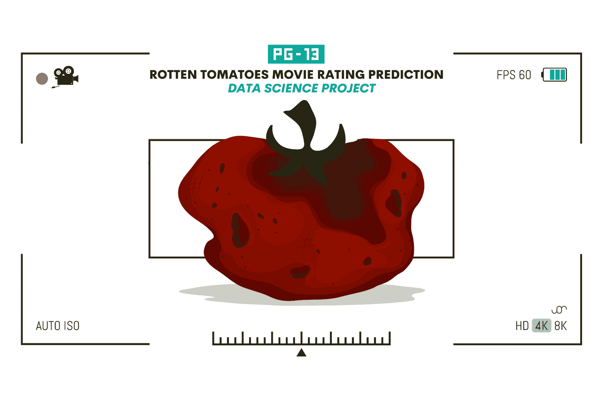作者提供的图像

毫无疑问，预测娱乐行业中电影的成功与否可以决定一个制片厂的财务前景。

* * *

## 我们的前三大课程推荐

 1\. [谷歌网络安全证书](https://www.kdnuggets.com/google-cybersecurity) - 快速进入网络安全职业生涯。

 2\. [谷歌数据分析专业证书](https://www.kdnuggets.com/google-data-analytics) - 提升您的数据分析技能

 3\. [谷歌 IT 支持专业证书](https://www.kdnuggets.com/google-itsupport) - 支持您所在组织的 IT

* * *

准确的预测使制片厂能够在营销、发行和内容创作等各个方面做出明智的决策。

最好的是，这些预测可以通过优化资源配置来最大化利润和最小化损失。

幸运的是，机器学习技术提供了一个强大的工具来解决这个复杂的问题。毫无疑问，通过利用数据驱动的洞察，制片厂可以显著改善其决策过程。

这个数据科学项目曾作为 Meta（Facebook）招聘过程中的家庭作业。在这项家庭作业中，我们将了解 Rotten Tomatoes 如何将电影标记为“烂片”、“新鲜”或“认证新鲜”。

为此，我们将制定两种不同的方法。


作者提供的图像

在我们的探索过程中，我们将讨论数据预处理、各种分类器以及潜在的改进，以提高模型的性能。

到本篇文章结束时，您将了解到如何利用机器学习来预测电影的成功以及如何将这些知识应用于娱乐行业。

但在深入之前，让我们先了解一下我们将要处理的数据。

# 第一种方法：基于数值特征和类别特征预测电影状态

在这种方法中，我们将结合数值特征和类别特征来预测电影的成功。

我们将考虑的特征包括预算、类型、时长和导演等因素。

我们将采用几种[机器学习算法](https://www.stratascratch.com/blog/machine-learning-algorithms-you-should-know-for-data-science/?utm_source=blog&utm_medium=click&utm_campaign=kdn+rotten+tomatoes)来构建我们的模型，包括决策树、随机森林以及具有特征选择的加权随机森林。


图片来自作者

让我们读取数据并看一眼。

这是代码。

```py
df_movie = pd.read_csv('rotten_tomatoes_movies.csv')
df_movie.head()
```

这是输出结果。

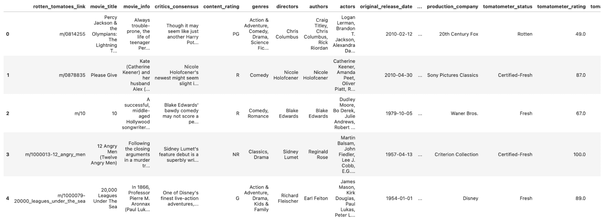

现在，让我们开始数据预处理。

我们的数据集中有很多列。

让我们来看看。

为了更好地理解统计特征，让我们使用 describe()方法。 这是代码。

```py
df_movie.describe()
```

这是输出结果。


现在，我们对数据有了一个快速概览，让我们进入预处理阶段。

## 数据预处理

在开始构建模型之前，预处理数据是至关重要的。

这涉及到通过处理类别特征并将其转换为数值表示来清理数据，并对数据进行缩放，以确保所有特征具有相等的重要性。

我们首先检查了 content_rating 列，以查看数据集中唯一的类别及其分布。

```py
print(f'Content Rating category: {df_movie.content_rating.unique()}')
```

然后，我们将创建一个条形图，以查看每个内容评级类别的分布。

```py
ax = df_movie.content_rating.value_counts().plot(kind='bar', figsize=(12,9))
ax.bar_label(ax.containers[0])
```

这是完整的代码。

```py
print(f'Content Rating category: {df_movie.content_rating.unique()}')
ax = df_movie.content_rating.value_counts().plot(kind='bar', figsize=(12,9))
ax.bar_label(ax.containers[0])
```

这是输出结果。

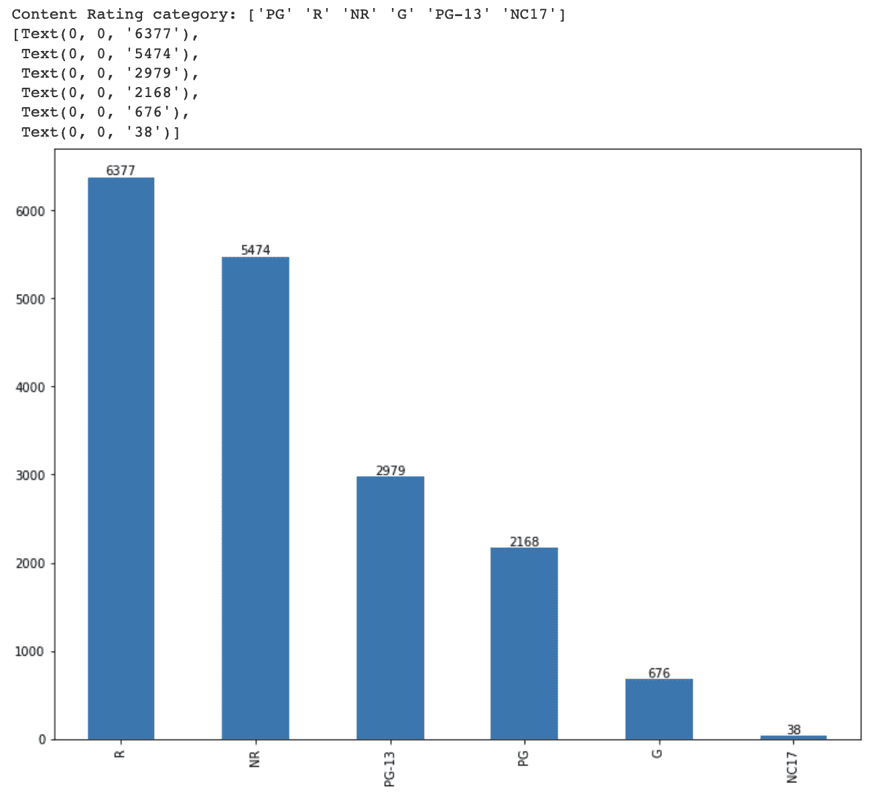

将类别特征转换为数值形式对我们的机器学习模型至关重要，因为这些模型需要数值输入。对于此数据科学项目中的多个元素，我们将应用两种普遍接受的方法：有序编码和独热编码。当类别表示一个强度的程度时，有序编码更好，而当没有提供幅度表示时，独热编码更为理想。对于“content_rating”资产，我们将使用独热编码方法。

这是代码。

```py
content_rating = pd.get_dummies(df_movie.content_rating)
content_rating.head()
```

这是输出结果。

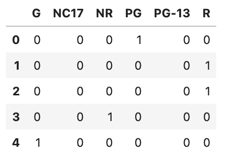

让我们继续处理另一个特征，audience_status。

这个变量有两个选项：‘Spilled’和‘Upright’。

我们已经应用了独热编码，现在是时候使用有序编码将这个类别变量转换为数值型变量了。

由于每个类别表示一个程度，我们将使用有序编码将这些类别转换为数值。

如前所述，首先找出唯一的受众状态。

```py
print(f'Audience status category: {df_movie.audience_status.unique()}')
```

然后，让我们创建一个条形图，并在条形上方打印值。

```py
# Visualize the distribution of each category
ax = df_movie.audience_status.value_counts().plot(kind='bar', figsize=(12,9))
ax.bar_label(ax.containers[0])
```

这是完整的代码。

```py
print(f'Audience status category: {df_movie.audience_status.unique()}')
# Visualize the distribution of each category
ax = df_movie.audience_status.value_counts().plot(kind='bar', figsize=(12,9))
ax.bar_label(ax.containers[0])
```

这是输出结果。


好的，现在是时候使用 replace 方法进行序数编码了。

然后让我们使用 head() 方法查看前五行。

这是代码。

```py
# Encode audience status variable with ordinal encoding
audience_status = pd.DataFrame(df_movie.audience_status.replace(['Spilled','Upright'],[0,1]))
audience_status.head()
```

这是输出结果。

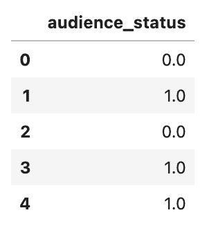

由于我们的目标变量 tomatometer_status 有三个不同的类别，“腐烂”、“新鲜”和“认证新鲜”，这些类别也表示一个量级的顺序。

这就是为什么我们会再次进行序数编码，将这些分类变量转换为数值变量。

这是代码。

```py
# Encode tomatometer status variable with ordinal encoding
tomatometer_status = pd.DataFrame(df_movie.tomatometer_status.replace(['Rotten','Fresh','Certified-Fresh'],[0,1,2]))
tomatometer_status
```

这是输出结果。

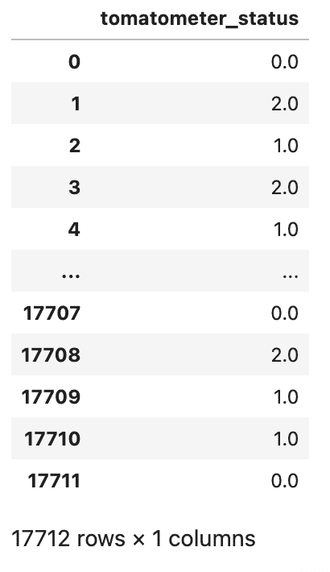

在将分类数据转换为数值数据后，现在是时候合并两个数据框了。我们将使用 Pandas 的 pd.concat() 函数，并使用 dropna() 方法删除所有列中包含缺失值的行。

接下来，我们将使用 head 函数查看新形成的数据框。

这是代码。

```py
df_feature = pd.concat([df_movie[['runtime', 'tomatometer_rating', 'tomatometer_count', 'audience_rating', 'audience_count', 'tomatometer_top_critics_count', 'tomatometer_fresh_critics_count', 'tomatometer_rotten_critics_count']], content_rating, audience_status, tomatometer_status], axis=1).dropna()
df_feature.head()
```

这是输出结果。


很好，现在让我们使用 describe 方法检查数值变量。

这是代码。

```py
df_feature.describe()
```

这是输出结果。


现在让我们使用 len 方法检查数据框的长度。

这是代码。

```py
len(df)
```

这是输出结果。


在移除缺失值的行并进行机器学习构建所需的转换后，我们的数据框现在有 17017 行。

现在让我们分析目标变量的分布情况。

正如我们从一开始一直在做的那样，我们将绘制一个条形图，并将值放在条形的顶部。

这是代码。

```py
ax = df_feature.tomatometer_status.value_counts().plot(kind='bar', figsize=(12,9))
ax.bar_label(ax.containers[0])
```

这是输出结果。


我们的数据集包含 7375 部“腐烂”、6475 部“新鲜”和 3167 部“认证新鲜”的电影，这表明存在类别不平衡问题。

这个问题将稍后解决。

暂时让我们将数据集拆分为测试集和训练集，使用 80% 对 20% 的拆分比例。

这是代码。

```py
X_train, X_test, y_train, y_test = train_test_split(df_feature.drop(['tomatometer_status'], axis=1), df_feature.tomatometer_status, test_size= 0.2, random_state=42)
print(f'Size of training data is {len(X_train)} and the size of test data is {len(X_test)}')
```

这是输出结果。


## 决策树分类器

在这一部分，我们将探讨决策树分类器，这是一种常用于分类问题的机器学习技术，有时也用于[回归](https://www.stratascratch.com/blog/overview-of-machine-learning-algorithms-regression/?utm_source=blog&utm_medium=click&utm_campaign=kdn+rotten+tomatoes)。

该分类器通过将数据点分成分支来工作，每个分支都有一个内部节点（包括一组条件）和一个叶节点（具有预测值）。

按照这些分支并考虑条件（True 或 False），数据点被分隔到适当的类别中。过程如下所示。


作者提供的图像

当我们应用决策树分类器时，可以调整多个超参数，如树的最大深度和叶节点的最大数量。

在第一次尝试中，我们将叶节点的数量限制为三个，以使树简单易懂。

首先，我们将创建一个最多有三个叶节点的决策树分类器。然后，在我们的训练数据上训练这个分类器，并用来生成测试数据上的预测。最后，我们将检查准确度、精确度和召回率指标，以评估我们有限决策树分类器的性能。

现在让我们一步步实现决策树算法，使用 sci-kit learn。

首先，让我们使用 scikit-learn 库中的 DecisionTreeClassifier() 函数定义一个最多有三个叶节点的决策树分类器对象。

random_state 参数用于确保每次运行代码时都产生相同的结果。

```py
tree_3_leaf = DecisionTreeClassifier(max_leaf_nodes= 3, random_state=2)
```

然后是时候在训练数据（X_train 和 y_train）上训练决策树分类器，使用 .fit() 方法。

```py
tree_3_leaf.fit(X_train, y_train)
```

接下来，我们使用训练好的分类器和预测方法对测试数据（X_test）进行预测。

```py
y_predict = tree_3_leaf.predict(X_test)
```

在这里，我们打印预测值与测试数据实际目标值的准确度分数和分类报告。我们使用 scikit-learn 库中的 accuracy_score() 和 classification_report() 函数。

```py
print(accuracy_score(y_test, y_predict))
print(classification_report(y_test, y_predict))
```

最后，我们将绘制混淆矩阵，以可视化决策树分类器在测试数据上的表现。我们使用 scikit-learn 库中的 plot_confusion_matrix() 函数。

```py
fig, ax = plt.subplots(figsize=(12, 9))
plot_confusion_matrix(tree_3_leaf, X_test, y_test, cmap='cividis', ax=ax)
```

这是代码。

```py
# Instantiate Decision Tree Classifier with max leaf nodes = 3
tree_3_leaf = DecisionTreeClassifier(max_leaf_nodes= 3, random_state=2)
# Train the classifier on the training data
tree_3_leaf.fit(X_train, y_train)
# Predict the test data with trained tree classifier
y_predict = tree_3_leaf.predict(X_test)
# Print accuracy and classification report on test data
print(accuracy_score(y_test, y_predict))
print(classification_report(y_test, y_predict))
# Plot confusion matrix on test data
fig, ax = plt.subplots(figsize=(12, 9))
plot_confusion_matrix(tree_3_leaf, X_test, y_test, cmap ='cividis', ax=ax)
```

这是输出结果。


从输出结果可以清楚地看到，我们的决策树表现良好，特别是考虑到我们将其限制为三个叶节点。一个简单分类器的优点是决策树可以被可视化且易于理解。

现在，为了理解决策树如何做出决策，让我们通过使用 sklearn.tree 的 plot_tree 方法来可视化决策树分类器。

这是代码。

```py
fig, ax = plt.subplots(figsize=(12, 9))
plot_tree(tree_3_leaf, ax= ax)
plt.show()
```

这是输出结果。

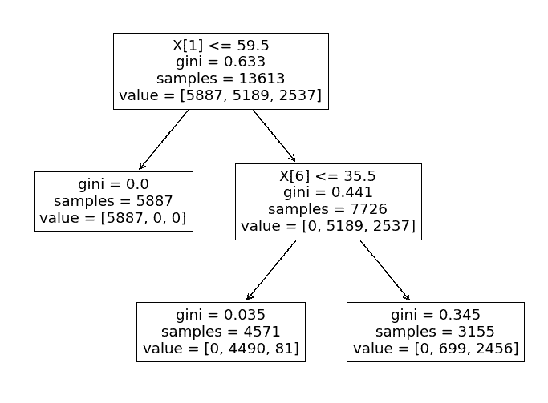

现在让我们分析这个决策树，找出它如何进行决策过程。

具体而言，算法使用'tomatometer_rating'特征作为每个测试数据点分类的主要决定因素。

+   如果'tomatometer_rating'小于或等于 59.5，则数据点被标记为 0（'Rotten'）。否则，分类器会继续到下一个分支。

+   在第二个分支中，分类器使用'tomatometer_fresh_critics_count'特征来分类剩余的数据点。

    +   如果该特征的值小于或等于 35.5，则数据点被标记为 1（'Fresh'）。

    +   如果不是，则标记为 2（'Certified-Fresh'）。

这一决策过程与 Rotten Tomatoes 用来分配电影状态的规则和标准紧密对齐。

根据 Rotten Tomatoes 网站，电影被分类为

+   如果他们的 tomatometer_rating 为 60%或更高，则标记为‘Fresh’。

+   如果低于 60%，则标记为'Rotten'。

我们的决策树分类器遵循类似的逻辑，若电影的 tomatometer_rating 低于 59.5，则分类为'Rotten'，否则为'Fresh'。

然而，在区分'Fresh'和'Certified-Fresh'电影时，分类器必须考虑更多的特征。

根据 Rotten Tomatoes，电影必须满足特定标准才能被分类为'Certified-Fresh'，例如：

+   Tomatometer 评分至少为 75%的电影。

+   至少要有五条来自顶级评论家的评论。

+   广泛上映的电影至少要有 80 条评论。

我们的有限决策树模型仅考虑了来自顶级评论家的评论数量，以区分'Fresh'和'Certified-Fresh'电影。

现在，我们理解了决策树的逻辑。因此，为了提高其性能，让我们遵循相同的步骤，但这次我们将不添加最大叶节点参数。

这是我们代码的逐步解释。这次我不会像之前那样过多扩展代码。

定义决策树分类器。

```py
tree = DecisionTreeClassifier(random_state=2)
```

在训练数据上训练分类器。

```py
tree.fit(X_train, y_train)
```

使用训练好的树分类器预测测试数据。

```py
y_predict = tree.predict(X_test)
```

打印准确率和分类报告。

```py
print(accuracy_score(y_test, y_predict))
print(classification_report(y_test, y_predict))
```

情节混淆矩阵。

```py
fig, ax = plt.subplots(figsize=(12, 9))
plot_confusion_matrix(tree, X_test, y_test, cmap ='cividis', ax=ax)
```

太好了，现在让我们一起查看它们。

这是完整代码。

```py
fig, ax = plt.subplots(figsize=(12, 9))
# Instantiate Decision Tree Classifier with default hyperparameter settings
tree = DecisionTreeClassifier(random_state=2)

# Train the classifier on the training data
tree.fit(X_train, y_train)

# Predict the test data with trained tree classifier
y_predict = tree.predict(X_test)

# Print accuracy and classification report on test data
print(accuracy_score(y_test, y_predict))
print(classification_report(y_test, y_predict))

# Plot confusion matrix on test data
fig, ax = plt.subplots(figsize=(12, 9))
plot_confusion_matrix(tree, X_test, y_test, cmap ='cividis', ax=ax)
```

这是输出结果。

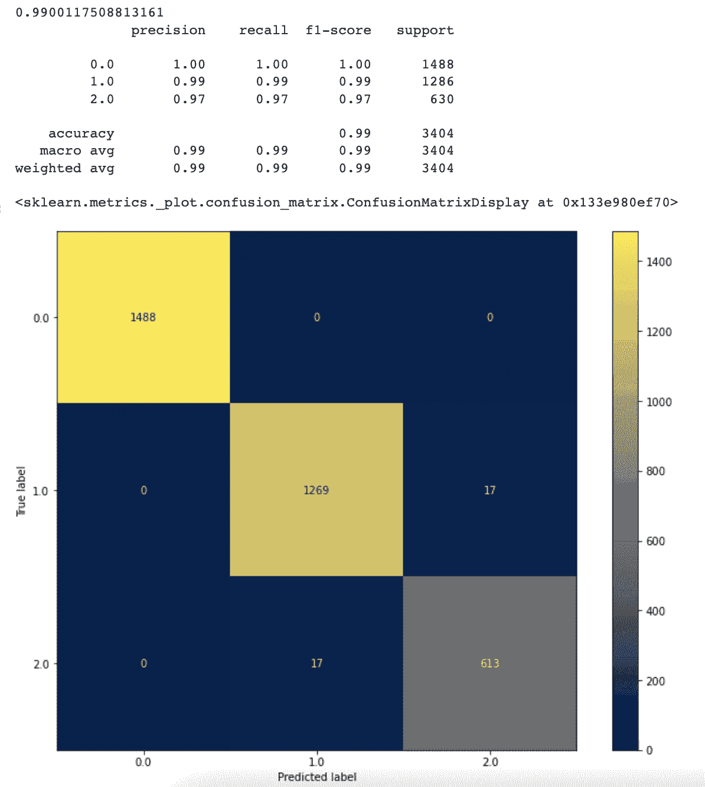

移除最大叶节点限制后，我们分类器的准确率、精确度和召回率都提高了。分类器现在的准确率达到 99%，而之前为 94%。

这表明当我们允许分类器自行选择最佳叶节点数量时，它的表现更好。

尽管当前结果看起来非常出色，但仍有更多的调优空间，以达到更好的准确率。在接下来的部分中，我们将探讨这个选项。

## 随机森林分类器

随机森林是由多个决策树分类器组合而成的集成算法。它使用 bagging 策略来训练每个决策树，其中包括随机选择训练数据点。由于这种技术，每棵树在训练数据的不同子集上进行训练。

Bagging 方法因使用自助法来抽样数据点而著名，使得同一数据点可以被多个决策树选择。

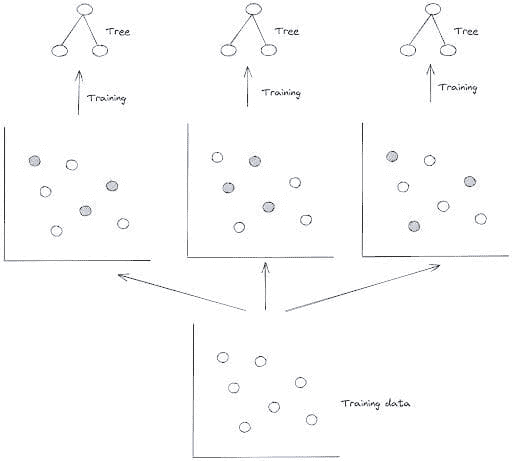

作者提供的图像

使用 scikit-learn，应用随机森林分类器非常简单。

使用 Scikit-learn 设置 [随机森林算法](https://www.stratascratch.com/blog/decision-tree-and-random-forest-algorithm-explained/?utm_source=blog&utm_medium=click&utm_campaign=kdn+rotten+tomatoes) 是一个简单的过程。

算法的性能，如决策树分类器的性能，可以通过更改超参数值来提高，比如决策树分类器的数量、最大叶子节点数和最大树深度。

我们首先使用默认选项。

让我们再次逐步查看代码。

首先，让我们使用 scikit-learn 库中的 RandomForestClassifier() 函数实例化一个随机森林分类器对象，并将 random_state 参数设置为 2，以确保结果可重复。

```py
rf = RandomForestClassifier(random_state=2)
```

然后，使用 .fit() 方法在训练数据（X_train 和 y_train）上训练随机森林分类器。

```py
rf.fit(X_train, y_train)
```

接下来，使用训练好的分类器对测试数据（X_test）进行预测，使用 .predict() 方法。

```py
y_predict = rf.predict(X_test)
```

然后，打印预测值与测试数据的实际目标值的准确率得分和分类报告。

我们再次使用 scikit-learn 库中的 accuracy_score() 和 classification_report() 函数。

```py
print(accuracy_score(y_test, y_predict))
print(classification_report(y_test, y_predict)) 
```

最后，让我们绘制一个混淆矩阵来可视化随机森林分类器在测试数据上的表现。我们使用 scikit-learn 库中的 plot_confusion_matrix() 函数。

```py
fig, ax = plt.subplots(figsize=(12, 9))
plot_confusion_matrix(rf, X_test, y_test, cmap ='cividis', ax=ax)
```

这里是完整的代码。

```py
# Instantiate Random Forest Classifier
rf = RandomForestClassifier(random_state=2)

# Train Random Forest Classifier on training data
rf.fit(X_train, y_train)

# Predict test data with trained model
y_predict = rf.predict(X_test)

# Print accuracy score and classification report
print(accuracy_score(y_test, y_predict))
print(classification_report(y_test, y_predict))

# Plot confusion matrix
fig, ax = plt.subplots(figsize=(12, 9))
plot_confusion_matrix(rf, X_test, y_test, cmap ='cividis', ax=ax)
```

这里是输出结果。


准确率和混淆矩阵结果显示，随机森林算法优于决策树分类器。这展示了像随机森林这样的集成方法相较于单个 [分类算法](https://www.stratascratch.com/blog/overview-of-machine-learning-algorithms-classification/?utm_source=blog&utm_medium=click&utm_campaign=kdn+rotten+tomatoes) 的优势。

此外，基于树的方法允许我们在模型训练后识别每个特征的重要性。因此，Scikit-learn 提供了 feature_importances_ 函数。

太好了，再次让我们一步步查看代码以理解它。

首先，使用 Random Forest Classifier 对象的 feature_importances_ 属性来获取数据集中每个特征的重要性分数。

重要性分数表示每个特征对模型预测性能的贡献程度。

```py
# Get the feature importance
feature_importance = rf.feature_importances_
```

接下来，特征重要性按重要性降序打印出来，以及对应的特征名称。

```py
# Print feature importance
for i, feature in enumerate(X_train.columns):
    print(f'{feature} = {feature_importance[i]}')
```

然后，为了从最重要到最不重要的特征进行可视化，让我们使用 numpy 中的 argsort()方法。

```py
# Visualize feature from the most important to the least important
indices = np.argsort(feature_importance)
```

最后，创建一个水平条形图来可视化特征重要性，y 轴上从最重要到最不重要排列特征，x 轴上显示对应的重要性分数。

这个图表让我们可以轻松识别数据集中最重要的特征，并确定哪些特征对模型性能的影响最大。

```py
plt.figure(figsize=(12,9))
plt.title('Feature Importances')
plt.barh(range(len(indices)), feature_importance[indices], color='b', align='center')
plt.yticks(range(len(indices)), [X_train.columns[i] for i in indices])
plt.xlabel('Relative Importance')
plt.show()
```

这是完整的代码。

```py
# Get the fature importance
feature_importance = rf.feature_importances_

# Print feature importance
for i, feature in enumerate(X_train.columns):
    print(f'{feature} = {feature_importance[i]}')

# Visualize feature from the most important to the least important
indices = np.argsort(feature_importance)

plt.figure(figsize=(12,9))
plt.title('Feature Importances')
plt.barh(range(len(indices)), feature_importance[indices], color='b', align='center')
plt.yticks(range(len(indices)), [X_train.columns[i] for i in indices])
plt.xlabel('Relative Importance')
plt.show()
```

这是输出。


从这个图中可以看出，模型在预测未见数据点时没有考虑 NR、PG-13、R 和 runtime 这些特征。在下一部分，我们将看看解决这个问题是否能提高模型的性能。

## 随机森林分类器与特征选择

这是代码。

在最后一部分，我们发现一些特征被我们的随机森林模型认为在预测中不太重要。

因此，为了提升模型的性能，让我们排除这些不太相关的特征，包括 NR、runtime、PG-13、R、PG、G 和 NC17。

在以下代码中，我们将首先获取特征重要性，然后将数据集拆分为训练集和测试集，但在代码块内部我们去除了这些不太重要的特征。然后我们将打印出训练集和测试集的大小。

这是代码。

```py
# Get the feature importance
feature_importance = rf.feature_importances_
X_train, X_test, y_train, y_test = train_test_split(df_feature.drop(['tomatometer_status', 'NR', 'runtime', 'PG-13', 'R', 'PG','G', 'NC17'], axis=1),df_feature.tomatometer_status, test_size= 0.2, random_state=42)
print(f'Size of training data is {len(X_train)} and the size of test data is {len(X_test)}')
```

这是输出。


太好了，由于我们去除了这些不太重要的特征，让我们看看性能是否有所提升。

因为我们做了太多次这个，所以我快速解释一下以下代码。

在以下代码中，我们首先初始化一个随机森林分类器，然后在训练数据上训练随机森林。

```py
rf = RandomForestClassifier(random_state=2)

rf.fit(X_train, y_train)
```

然后，我们使用测试数据计算准确性分数和分类报告并打印出来。

```py
print(accuracy_score(y_test, y_predict))
print(classification_report(y_test, y_predict))
```

最后，我们绘制混淆矩阵。

```py
fig, ax = plt.subplots(figsize=(12, 9))
plot_confusion_matrix(rf, X_test, y_test, cmap ='cividis', ax=ax)
```

这是完整的代码。

```py
# Initialize Random Forest class
rf = RandomForestClassifier(random_state=2)

# Train Random Forest on the training data after feature selection
rf.fit(X_train, y_train)

# Predict the trained model on the test data after feature selection
y_predict = rf.predict(X_test)

# Print the accuracy score and the classification report
print(accuracy_score(y_test, y_predict))
print(classification_report(y_test, y_predict))

# Plot the confusion matrix
fig, ax = plt.subplots(figsize=(12, 9))
plot_confusion_matrix(rf, X_test, y_test, cmap ='cividis', ax=ax)
```

这是输出。

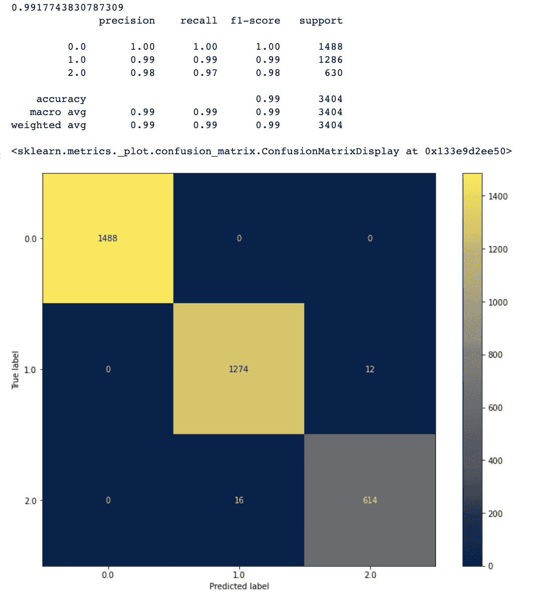

看起来我们新的方法效果相当好。

经过特征选择后，准确率提高到了 99.1%。

与之前的模型相比，我们的模型的假阳性和假阴性率也有所降低。

这表明，特征的数量增多并不总是意味着模型更好。一些不重要的特征可能会产生噪音，这可能是降低模型预测准确度的原因。

既然我们的模型性能已经提升到这个程度，让我们探索其他方法来检查是否能进一步提高。

## 带特征选择的加权随机森林分类器

在第一部分，我们意识到我们的特征有些不平衡。我们有三个不同的值，'Rotten'（由 0 表示）、'Fresh'（由 1 表示）和'Certified-Fresh'（由 2 表示）。

首先，让我们看看我们特征的分布。

这是可视化标签分布的代码。

```py
ax = df_feature.tomatometer_status.value_counts().plot(kind='bar', figsize=(12,9))
ax.bar_label(ax.containers[0])
```

这是输出。


很明显，‘Certified Fresh’特征的数据量远少于其他特征。

为了解决数据不平衡的问题，我们可以使用 SMOTE 算法等方法来过采样少数类，或在训练阶段向模型提供类别权重信息。

这里我们将使用第二种方法。

为了计算类别权重，我们将使用 scikit-learn 库中的`compute_class_weight()`函数。

在这个函数中，`class_weight`参数被设置为'balance'以处理类别不平衡，而`classes`参数被设置为 df_feature 中`tomatometer_status`列的唯一值。

`y`参数设置为 df_feature 中`tomatometer_status`列的值。

```py
class_weight = compute_class_weight(class_weight= 'balanced', classes= np.unique(df_feature.tomatometer_status), 
                      y = df_feature.tomatometer_status.values)
```

然后，创建一个字典来将类别权重映射到其相应的索引。

这是通过使用`dict()`函数和`zip()`函数将类别权重列表转换为字典完成的。

`range()`函数用于生成与类别权重列表长度对应的整数序列，然后用作字典的键。

```py
class_weight_dict = dict(zip(range(len(class_weight.tolist())), class_weight.tolist()
```

最后，让我们看看我们的字典。

```py
class_weight_dict
```

这是完整的代码。

```py
class_weight = compute_class_weight(class_weight= 'balanced', classes= np.unique(df_feature.tomatometer_status), 
                      y = df_feature.tomatometer_status.values)

class_weight_dict = dict(zip(range(len(class_weight.tolist())), class_weight.tolist()))
class_weight_dict
```

这是输出。


类别 0（'Rotten'）的权重最小，而类别 2（'Certified-Fresh'）的权重最大。

当我们应用随机森林分类器时，现在可以将这些权重信息作为参数包括进来。

剩余的代码与之前做过的许多次相同。

让我们用类别权重数据构建一个新的随机森林模型，在训练集上训练它，预测测试数据，并显示准确率和混淆矩阵。

这是代码。

```py
# Initialize Random Forest model with weight information
rf_weighted = RandomForestClassifier(random_state=2, class_weight=class_weight_dict)

# Train the model on the training data
rf_weighted.fit(X_train, y_train)

# Predict the test data with the trained model
y_predict = rf_weighted.predict(X_test)

#Print accuracy score and classification report
print(accuracy_score(y_test, y_predict))
print(classification_report(y_test, y_predict))

#Plot confusion matrix
fig, ax = plt.subplots(figsize=(12, 9))
plot_confusion_matrix(rf_weighted, X_test, y_test, cmap ='cividis', ax=ax)
```

这是输出。

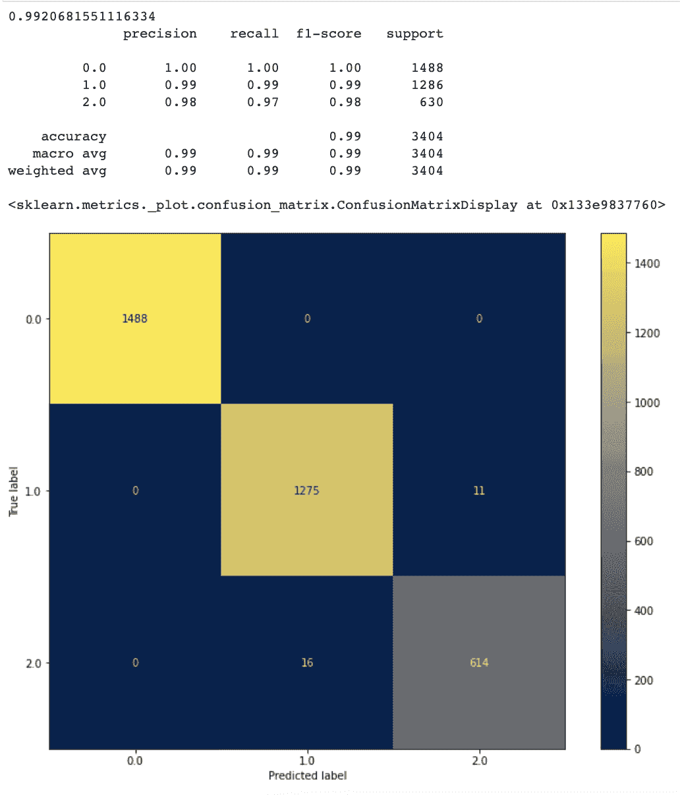

当我们添加类别权重时，模型的性能有所提升，现在准确率达到 99.2%。

“Fresh”标签的正确预测数量也增加了一次。

使用类别权重来解决数据不平衡问题是一种有效的方法，因为它鼓励我们的模型在训练阶段更加关注权重较高的标签。

**该数据科学项目链接：** [`platform.stratascratch.com/data-projects/rotten-tomatoes-movies-rating-prediction`](https://platform.stratascratch.com/data-projects/rotten-tomatoes-movies-rating-prediction?utm_source=blog&utm_medium=click&utm_campaign=kdn+rotten+tomatoes)

**[Nate Rosidi](https://www.stratascratch.com)** 是一名数据科学家，专注于产品策略。他也是一位讲授分析学的兼职教授，并且是[StrataScratch](https://www.stratascratch.com/)，一个帮助数据科学家准备顶级公司面试真实问题的平台的创始人。在[Twitter: StrataScratch](https://twitter.com/StrataScratch)或[LinkedIn](https://www.linkedin.com/in/nathanrosidi/)上与他联系。

### 更多相关主题

+   [烂番茄电影评分预测数据科学项目：…](https://www.kdnuggets.com/2023/07/data-science-project-rotten-tomatoes-movie-rating-prediction-second-approach.html)

+   [KDnuggets 新闻，7 月 5 日：一个糟糕的数据科学项目 • 10 个 AI…](https://www.kdnuggets.com/2023/n24.html)

+   [311 呼叫中心绩效：评级服务水平](https://www.kdnuggets.com/2023/03/boxplot-outlier-311-call-center-performance.html)

+   [使用 BQML 进行多变量时间序列预测](https://www.kdnuggets.com/2023/07/multivariate-timeseries-prediction-bqml.html)

+   [如何逐步成为数据科学家指南](https://www.kdnuggets.com/2021/05/guide-become-data-scientist.html)

+   [支持向量机：直观的方法](https://www.kdnuggets.com/2022/08/support-vector-machines-intuitive-approach.html)
