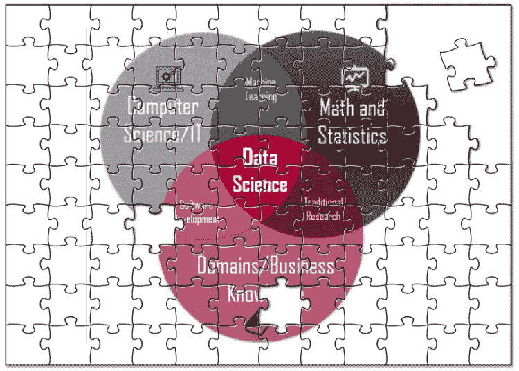
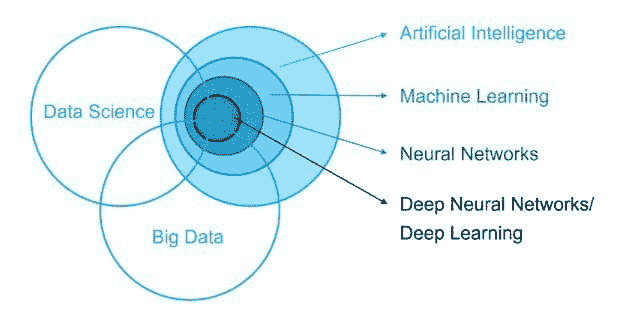

# 数据科学难题 — 2020 年版

> 原文：[`www.kdnuggets.com/2020/02/data-science-puzzle-2020-edition.html`](https://www.kdnuggets.com/2020/02/data-science-puzzle-2020-edition.html)

评论

关于数据科学韦恩图的一些看法（原始来源：[Saurav Dhungana](https://medium.com/craftdata-labs/on-building-effective-data-science-teams-4813a4b82939)）

* * *

## 我们的前三个课程推荐

 1\. [谷歌网络安全证书](https://www.kdnuggets.com/google-cybersecurity) - 快速进入网络安全职业的快车道。

 2\. [谷歌数据分析专业证书](https://www.kdnuggets.com/google-data-analytics) - 提升你的数据分析技能

 3\. [谷歌 IT 支持专业证书](https://www.kdnuggets.com/google-itsupport) - 支持你的组织的 IT 需求

* * *

新的一年已经到来，让我们重新审视数据科学难题的现状。数据科学领域中最重要的组成概念是什么？它们如何相互结合？这些概念中哪些在上一期之后变得更为重要，哪些则变得不那么重要？

由于距离我上次处理这个特定话题已经过去了几年，出于兴趣和比较的目的，值得看看这个。我们将首先回顾一下上次的概念定义，然后看看自那时以来情况有何变化。

我们从被认为是数据科学革命最初驱动因素的**大数据**开始。2017 年我所说的：

> 大数据仍然对数据科学很重要。无论你选择什么比喻，大数据都是继续推动数据科学革命的原材料。
> 
> 关于大数据，我相信从商业角度来看，数据获取和保留的正当性、大数据项目开始提供实际财务回报的期望，以及与数据隐私和安全相关的挑战，将成为不仅仅是 2017 年，而且在未来的大数据重要话题。简而言之，现在是时候从大数据中获得丰厚回报，并对其进行严格保护了。
> 
> 然而，正如其他人所言，大数据现在“就是如此”，也许不再是一个值得特别关注的实体，尽管它在过去十年中获得了很多关注。

虽然我通常不赞成对大多数关键术语进行大写处理，但“**大数据**”似乎之前需要这种处理，因为它具有近乎传奇的地位和品牌名称般的地位。请注意这次我已经撤销了这种地位，这与大数据不再是顶级数据科学术语的想法相一致。如最后一句话所暗示的，往前看，大数据仅仅是“数据”，我们可以将这一段摘录重新表述为，"*数据*是继续推动数据科学革命的原材料"。

看，现在我们都应该意识到数据对数据科学过程的重要性（这在名称中就已经体现了）。无论我们的数据是大还是小，或者处于数据规模光谱的其他位置，从一开始就不需要区分。我们都想对数据进行科学分析并提供价值，无论数据多还是少。“大数据”可能为我们提供更多或独特的分析和建模机会，但这似乎类似于在一开始就区分我们指甲的大小，以便知道需要带什么大小和类型的锤子来完成某项工作。

数据无处不在。大多数数据是大的。现在是时候不再强调这一点，就像我们不再说“智能”手机一样。现在的手机基本上都是智能的，特别指出这一点更多的是在讲述你自己，而不是手机。

然而，我坚持认为，随着时间的推移，数据隐私和安全相关的挑战只会变得越来越重要，我们还可以将伦理学纳入其中，尽管认真对待这些话题超出了本文的范围。

这是我上次关于**机器学习**作为数据科学组件的说法：

> 机器学习是数据科学的主要技术驱动因素之一。数据科学的目标是从数据中提取洞见，而机器学习是使这一过程能够自动化的引擎。机器学习算法不断促进计算机程序从经验中自动改进，这些算法在各种不同领域变得越来越重要。

我坚持这一观点，并且只会论证机器学习不仅是数据提取的主要技术驱动因素之一，它是*唯一的*主要技术驱动因素。

数据科学有很多方面；我们在本文中讨论了其中的几个。然而，当考虑从通过描述性统计或这些统计数据的可视化或某种业务智能报告——所有这些都可以在适当情况下提供非常有用和宝贵的启示——看不见的数据中提取洞见时，机器学习是自然的选择，这一路径本身就蕴含了自动化。

机器学习与数据科学并不完全等同；然而，鉴于机器学习在从数据中提取见解的依赖性，你可以理解那些经常混淆这两个概念的人。

关于数据科学领域的一些主要组件如何契合的看法（来源：[OmniSci](https://www.omnisci.com/learn/resources/data-science)）

那么**深度学习**怎么样呢？

> 深度学习也是一个过程；它是应用深度神经网络技术——具有多个隐藏层的神经网络架构（这是一种特殊类型的机器学习算法）来解决问题。作为一个过程，深度学习与神经网络的关系类似于数据挖掘与“传统”机器学习的关系（这是一种有些缺乏细微差别的比较，但在非常高的层面上我支持这种说法）。

深度学习是一种特定类型的机器学习，即利用深度神经网络进行洞察提取。神经网络在许多领域——特别是计算机视觉和自然语言处理——仍然提供最先进的结果，这也是它们常常被与机器学习区别对待的原因。虽然它们只是一个工具，但这个工具在特定的数据科学任务中往往表现出特别的实用性。

自从之前的数据科学难题文章以来，深度学习从在计算机视觉领域中占据主导地位并将目标瞄准自然语言处理，到现在已经完成了对 NLP 的全面覆盖。正如在计算机视觉中一样，深度学习算法现在并不是解决问题的唯一算法，但它们无疑已成为众多子任务中的首选之一，这也是有充分理由的。

数据科学与**人工智能**的关系似乎在过去三年中发生了相当大的变化。人工智能在那时似乎使用得要少得多。如今，每个机器学习和数据科学初创公司似乎都在从事人工智能业务，还有许多其他公司完全没有使用 AI。

那么人工智能是什么呢？注意，这里指的不是人工通用智能，即创造一种能够迅速适应新问题的智能，类似于人类智能。以下是我三年前对 AI 的看法：

> 在我看来，AI 是一个标准，是一个不断变化的目标，是一个无法达到的理想。
> 
> 但这并不意味着人工智能不值得追求；人工智能研究带来的回报以灵感和动力的形式出现。然而，正如你可能已经注意到的，人工智能有一个认知问题。正如数据挖掘曾经是一个引起许多人恐惧的主流术语（主要与隐私侵犯有关），人工智能从完全不同的角度使大众感到恐惧，这种恐惧类似于天网式的恐慌。我不知道我们该感谢媒体、埃隆·马斯克、人工智能与深度学习及其成功的混淆，还是其他完全不同的原因，但我认为结果是不可避免的：这种认知问题是真实存在的，未接触者变得越来越恐惧。
> 
> 还有这一点：尽管机器学习、人工智能、深度学习、计算机视觉和自然语言处理（以及这些“智能”技术的其他各种应用）都是独立且不同的领域和应用领域，即便是从业者和研究人员也不得不承认，除了过去常见的困惑和混淆外，还有一些不断演变的“概念蔓延”现象。这是可以理解的；这些领域最初都是其他领域（计算机科学、统计学、语言学等）的小众子学科，因此它们的不断演变是可以预见的。虽然在某种程度上确保所有应该对这些领域有基本理解的人确实具备这种理解很重要，但就其在数据科学等领域的应用而言，我谦虚地认为，过于深入语义上的争论从长远来看对从业者并没有太大益处。
> 
> 到 2030 年，人工智能和机器智能将与现在大相径庭，缺乏对这一不断演变的技术集合及其研究的基本理解，或者对其作为数据科学家的应用不持开放态度，将对你的长期成功产生不利影响。

正如我上面提到的，深入探讨人工智能到底是什么定义并不是我愿意做的事。我对什么可以被技术上归类为“人工智能”有一个模糊的概念，你也是如此；我们的模糊概念可能有所不同。我对人工智能的看法及其主要好处的根本性认识在于它的不可达性。人工智能代表了一组模糊定义的宏伟目标，我们离这些目标越近，就会被更宏伟的目标取代。

这就引出了**数据科学**：

> 数据科学是一个多方面的学科，它包括机器学习和其他分析过程、统计学及相关数学分支，并日益借鉴高性能科学计算，最终目的是从数据中提取洞察，并利用这些新获得的信息讲述故事。

我仍然喜欢这个定义。它简洁明了，把事情汇聚在一起，在我看来无需进一步阐述。不过我确实写了它，所以可能有些偏颇。

最后，我们来谈谈**统计学**。统计学如何融入数据科学的广阔领域？这是 Diego Kuonen 在我发布上一篇关于这一主题的文章三年后的看法：

> .[@mattmayo13](https://twitter.com/mattmayo13?ref_src=twsrc%5Etfw)，难道 [#统计学](https://twitter.com/hashtag/Statistics?src=hash&ref_src=twsrc%5Etfw) 不是拼图纸吗？
> 
> “[#数据科学](https://twitter.com/hashtag/DataScience?src=hash&ref_src=twsrc%5Etfw) 拼图”
> 
> > [`t.co/9E1zqJoDx6`](https://t.co/9E1zqJoDx6)[#大数据](https://twitter.com/hashtag/BigData?src=hash&ref_src=twsrc%5Etfw) [#机器学习](https://twitter.com/hashtag/ML?src=hash&ref_src=twsrc%5Etfw) [#深度学习](https://twitter.com/hashtag/DL?src=hash&ref_src=twsrc%5Etfw) [#人工智能](https://twitter.com/hashtag/AI?src=hash&ref_src=twsrc%5Etfw) [#分析](https://twitter.com/hashtag/Analytics?src=hash&ref_src=twsrc%5Etfw) [#物联网](https://twitter.com/hashtag/IoT?src=hash&ref_src=twsrc%5Etfw) [pic.twitter.com/zjcHkUChKO](https://t.co/zjcHkUChKO)
> > 
> — Diego Kuonen 教授 (@DiegoKuonen) [2017 年 1 月 25 日](https://twitter.com/DiegoKuonen/status/824255316347015169?ref_src=twsrc%5Etfw)

他是对的！如果数据科学是一个拼图，就像一个拼图，拼图纸在比喻上就是数据科学立足的基础。统计学就是那个基础。

这些就是数据科学的顶级概念，至少是我看到的。显然，这些并不是领域中唯一重要的方面。数据可视化等许多其他方面未被包含在此，许多人会争辩说这些也应当被包括在内。然而，我坚持我的选择，并将其他概念留待下次讨论。

最后，我要强调这只是一个人的观点，基于我过去几年对我的思维模型的调整。这不是事实，但这是我的看法，虽然我相信会有很多人不同意。

**相关**：

+   数据科学难题，再探讨

+   数据科学难题解析

+   机器学习难题解析

### 更多相关主题

+   [停止学习数据科学以寻找目标，找到目标去…](https://www.kdnuggets.com/2021/12/stop-learning-data-science-find-purpose.html)

+   [学习数据科学统计的顶级资源](https://www.kdnuggets.com/2021/12/springboard-top-resources-learn-data-science-statistics.html)

+   [成功数据科学家的 5 个特征](https://www.kdnuggets.com/2021/12/5-characteristics-successful-data-scientist.html)

+   [每个数据科学家都应该知道的三个 R 语言库（即使你使用 Python）](https://www.kdnuggets.com/2021/12/three-r-libraries-every-data-scientist-know-even-python.html)

+   [一个 90 亿美元的人工智能失败案例分析](https://www.kdnuggets.com/2021/12/9b-ai-failure-examined.html)

+   [是什么让 Python 成为初创公司的理想编程语言](https://www.kdnuggets.com/2021/12/makes-python-ideal-programming-language-startups.html)
