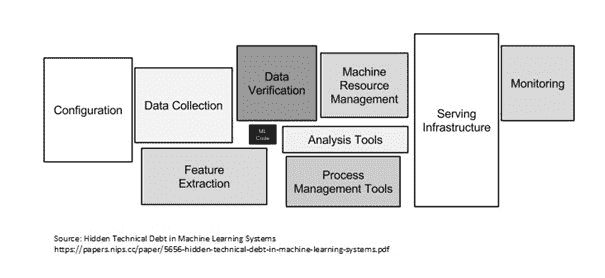

# 数据科学 - 需要系统工程方法

> 原文：[`www.kdnuggets.com/2017/10/data-science-systems-engineering-approach.html`](https://www.kdnuggets.com/2017/10/data-science-systems-engineering-approach.html)

 评论

### 背景

系统工程的学科起源于 1940 年代的贝尔实验室，并通过军事及 NASA 的复杂项目部署逐渐流行起来

根据[国际系统工程理事会](http://www.incose.org/AboutSE/WhatIsSE)的说法，***“系统工程是一门工程学科，其责任是创建和执行一种跨学科流程，以确保在整个系统的生命周期中以高质量、可信赖、成本效益和符合进度要求的方式满足顾客和利益相关方的需求。”***

* * *

## 我们的前三个课程推荐

 1\. [Google 网络安全证书](https://www.kdnuggets.com/google-cybersecurity) - 畅享网络安全职业快车道

 2\. [Google 数据分析专业证书](https://www.kdnuggets.com/google-data-analytics) - 提升你的数据分析能力

 3\. [Google IT 支持专业证书](https://www.kdnuggets.com/google-itsupport) - 支持你组织的 IT 工作

* * *

系统工程涵盖诸如：跨学科功能，端到端管理，复杂系统，生命周期管理，形式化需求工程，可靠性，后勤等方面。系统工程还采用了**“系统的系统”方法**。系统工程问题采用**以下步骤**解决（根据 INCOSE）：阐述问题，调查替代方案，建模系统，集成，推出系统，评估性能，重新评估。他们通常还涉及与系统思维基本思想相关的**系统模式**的工作。

那么，这些思想与数据科学有何关联呢？随着数据科学变得更加复杂，问题的性质要求更加全面的方法/系统思维方法。这尤其适用于深度学习等领域

### 数据科学中系统思维的需求

下面是数据科学中应用系统思维的两个例子

**1 机器学习在实际应用中只起到了很小的作用**

在论文[机器学习系统中的隐藏技术债务](https://papers.nips.cc/paper/5656-hidden-technical-debt-in-machine-learning-systems.pdf)中，Google 的一个团队表示，在现实世界的 ML 系统中，只有很小一部分是由 ML 代码组成的，如中间的小黑盒所示。所需的周围基础设施是庞大而复杂的。

文章继续说道

+   机器学习系统之所以复杂，是因为它们不仅存在维护传统代码的问题，还有一系列机器学习特定的问题。

+   复杂模型侵蚀了边界。不幸的是，通过规定具体的预期行为来强制执行机器学习系统的严格抽象边界是困难的。事实上，仅当期望的行为在没有依赖于外部数据的软件逻辑的情况下无法有效表达时，才需要机器学习。

+   Map-Reduce 对于迭代的机器学习算法来说是一个不好的抽象。

+   数据测试、可再现性和过程管理都增加了机器学习系统的复杂性。

**2）TensorLayer**

TensorLayer 是一项全新的开源计划，旨在解决部署实际深度学习模型的不断增长的复杂性。《TensorLayer: 一种高效深度学习开发的多功能库》(https://arxiv.org/abs/1707.08551)涵盖了许多系统工程问题。

`tensorlayer` 的体系结构如下所示。

如您所见，机器学习只是一个组件。如果您考虑采用端到端（系统工程）方法，则 tensorlayer 提供了四个模块：

1.  一个层模块，提供了神经元层的参考实现，可以灵活地相互连接以构建神经网络，

1.  一个模型模块，可帮助管理模型生命周期中产生的中间状态，

1.  一个数据集模块，管理可以被离线和在线学习系统使用的训练数据，

1.  一个工作流模块，支持并行训练任务的异步调度和故障恢复。

这克服了深度学习中日益增长的互动性问题，开发人员不得不花费大量时间来集成组件以进行神经网络的实验、管理中间训练状态、组织与培训相关的数据以及在不同事件中实现超参数调整。这样，整合应用程序（如 DRLs、GANs、模型交叉验证和超参数优化）的部署将更加容易。

### 结论

随着数据科学作为一门学科的成熟，我看到需要解决更加复杂和整体化的问题。为了实现这些目标，我们可以借鉴现有的系统工程等学科。我在[牛津大学物联网数据科学课程](https://www.conted.ox.ac.uk/courses/data-science-for-the-internet-of-things-iot)中讨论了这些问题。

**相关文章：**

+   **人工智能和物联网之间的动态关系**

+   **2 月最热门的 /r/MachineLearning 帖子：牛津深度自然语言处理课程；Scikit-learn 结果的数据可视化**

+   **物联网（IoT）数据科学与传统数据科学的十个不同之处**[/2016/09/data-science-iot-10-differences.html "Data Science for Internet of Things (IoT): Ten Differences From Traditional Data Science 的永久链接")

### 有关此主题的更多信息

+   [只需要教科书：一种革命性的 AI 培训方法](https://www.kdnuggets.com/2023/07/textbooks-all-you-need-revolutionary-approach-ai-training.html)

+   [机器学习中的特征工程实用方法](https://www.kdnuggets.com/2023/07/practical-approach-feature-engineering-machine-learning.html)

+   [我们不需要数据科学家，我们需要数据工程师](https://www.kdnuggets.com/2021/02/dont-need-data-scientists-need-data-engineers.html)

+   [烂番茄电影评分预测的数据科学项目：…](https://www.kdnuggets.com/2023/06/data-science-project-rotten-tomatoes-movie-rating-prediction-first-approach.html)

+   [烂番茄电影评分预测的数据科学项目：…](https://www.kdnuggets.com/2023/07/data-science-project-rotten-tomatoes-movie-rating-prediction-second-approach.html)

+   [2024 年你需要选择的 8 个数据工程岗位](https://www.kdnuggets.com/8-data-engineering-jobs-you-need-to-choose-from-in-2024)
