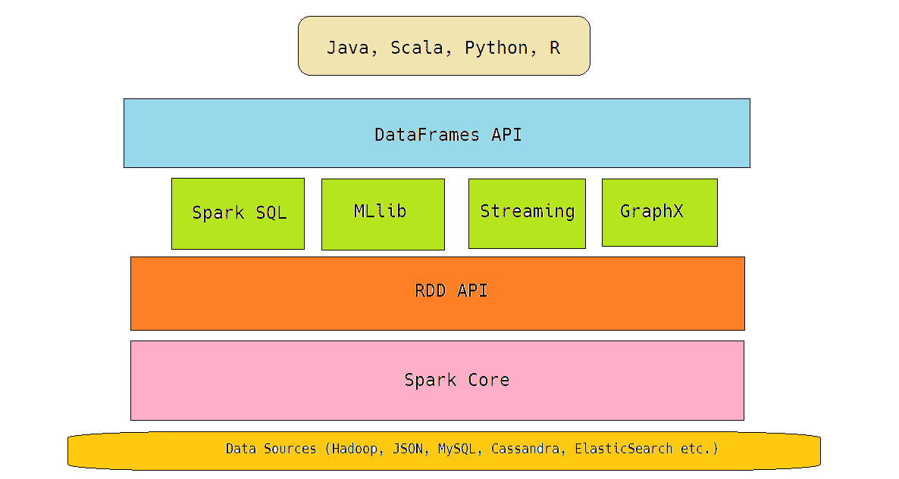

# 数据科学入门：面向软件工程师的入门教程系列

> 原文：[`www.kdnuggets.com/2017/05/data-science-tutorial-series-software-engineers.html`](https://www.kdnuggets.com/2017/05/data-science-tutorial-series-software-engineers.html)

**作者：Harris Brakmić，软件工程师。**

> **编辑说明**：这是针对新手的数据科学多部分教程的概述。作者给这个系列起了一个不同的——自嘲的——标题；以平常心看待，并认识到该系列的方法和内容是从软件工程的角度对数据科学各个方面进行全新审视的开始。

* * *

## 我们的三大课程推荐

 1\. [谷歌网络安全证书](https://www.kdnuggets.com/google-cybersecurity) - 快速进入网络安全职业道路。

 2\. [谷歌数据分析专业证书](https://www.kdnuggets.com/google-data-analytics) - 提升您的数据分析能力

 3\. [谷歌 IT 支持专业证书](https://www.kdnuggets.com/google-itsupport) - 支持您的组织 IT

* * *

PySpark 控制台。

**[第一部分：入门](http://blog.brakmic.com/data-science-for-losers/)**

要使用 Python 进行一些严肃的统计工作，应该使用像 Continuum Analytics 提供的合适发行版。当然，也可以手动安装所有所需的软件包（Pandas、NumPy、Matplotlib 等），但要注意复杂性和包依赖关系的繁琐。在本文中，我们将使用 Anaconda 发行版。在 Windows 上的安装非常简单，但要避免使用多个 Python 安装（例如，同时使用 Python3 和 Python2）。最好让 Anaconda 的 Python 二进制文件成为您的标准 Python 解释器。

**[第二部分：分析 Reddit 评论和查询数据库](http://blog.brakmic.com/data-science-for-losers-part-2/)**

模式无处不在，但许多模式无法立即被识别。这是我们在数据库、数据仓库和其他数据孤岛中深挖的原因之一。本文将使用 Pandas 的数据框架中的几种方法，并生成图表。我们还将创建数据透视表，并通过 ODBC 查询 MS SQL 数据库。在这种情况下，SqlAlchemy 将成为我们的助手，我们将看到即使是像我们这样的“失败者”也可以轻松合并和筛选 SQL 表，而无需触及 SQL 语法。不论任务是什么，首先总需要一个强大的工具集。比如我们将在这里使用的 Anaconda 发行版。我们的数据源将包括包含 Reddit 评论的 JSON 文件或像 Northwind 这样的 SQL 数据库。许多 90 年代的孩子都使用 Northwind 来学习 SQL。

所有可用子版块的最高评分评论。

**[第二部分附录：使用数据框进行 SQL 操作](http://blog.brakmic.com/data-science-for-losers-part-2-addendum/)**

所以，让我们谈谈我在过去两篇文章中忘记提到的一些 Pandas 特性。

**[第三部分：Scala 与 Apache Spark](http://blog.brakmic.com/data-science-for-losers-part-3-scala-apache-spark/)**

根据其定义，Spark 是一个快速、通用的大规模数据处理引擎。好吧，有人会说：但我们已经有 Hadoop 了，那我们为什么还要使用 Spark？对于这样的问题，我会回答说 Hadoop 是 EJB 的再发明，我们需要一些更灵活、更通用、更具扩展性并且……比 MapReduce 快得多的东西。Spark 以非常快的速度处理批处理和流处理。

**[第四部分：机器学习](http://blog.brakmic.com/data-science-for-losers-part-4-machine-learning/)**

从我非科学家的角度来看，我会将机器学习定义为人工智能研究的一个子集，它开发出能够从数据中获得知识并基于这些知识做出预测的自学习（或自我改进？）算法。然而，机器学习不仅仅局限于学术界或某些“开明的圈子”。我们每天都在使用机器学习，却没有意识到它的存在和实用性。机器学习在实际应用中的几个例子包括：垃圾邮件过滤器、语音识别软件、自动文本分析、“智能游戏角色”或即将到来的自动驾驶汽车。所有这些实体都基于某些机器学习算法做出决策。

Spark 堆栈中的数据框。

**[第五部分：Spark 数据框](http://blog.brakmic.com/data-science-for-losers-part-5-spark-dataframes/)**

在开始使用数据框之前，我们首先需要准备运行在 Jupyter（以前称为“IPython”）中的环境。在你下载并解压 Spark 包后，你会在 python/pyspark 目录下找到一些重要的 Python 库和脚本。这些文件在你启动控制台中的 PySpark REPL 时会用到。如你所知，Spark 支持 Java、Scala、Python 和 R。基于 Python 的 REPL 称为 PySpark，提供了通过 Python 脚本控制 Spark 的良好选项。

**[第六部分：Azure ML](http://blog.brakmic.com/data-science-for-losers-part-6-azure-ml/)**

在本文中，我们将探讨微软的 Azure 机器学习环境以及如何将云技术与 Python 和 Jupyter 结合使用。正如你所知道的，我在整个文章系列中广泛使用了这些技术，因此我对数据科学友好的环境有着强烈的看法。当然，这并不是说其他编程环境或语言，如 R，不好，因此你的意见可能会与我大相径庭，这没关系。此外，AzureML 也提供了非常好的 R 支持！因此，随时可以根据你的需要调整本文的所有内容。在开始之前，先说几句我为什么会想到写关于 Azure 和数据科学的文章。

**[第七部分：使用 Azure ML](http://blog.brakmic.com/data-science-for-losers-part-7-using-azure-ml/)**

在完成我的数据科学和机器学习基础课程时，我发现 Azure ML 内置支持 Jupyter 和 Python，这对我来说非常有趣，因为这使得 Azure ML 成为理想的实验平台。他们甚至将其中一个工作区域称为“实验”，因此可以预期良好的 Python（和 R）支持以及许多现成的模块。和其他技术爱好者一样，我迅速决定撰写一篇文章，描述 Azure ML 的一些关键部分。

**简介： [哈里斯·布拉克米奇](http://blog.brakmic.com/)** ([@brakmic](https://twitter.com/brakmic)) 是 Advarics GmbH 的软件开发工程师。他使用 Ractive、React、Backbone 和 DevExtreme 开发 Web 应用，并使用 C# 开发基于 Azure 的后台系统。

**相关：**

+   机器学习：全面详细概述

+   MXNet Python API 介绍

+   入门数据科学：你需要知道的事项

### 更多相关主题

+   [Pandas 入门教程](https://www.kdnuggets.com/2022/03/introductory-pandas-tutorial.html)

+   [新手强化学习](https://www.kdnuggets.com/2022/05/reinforcement-learning-newbies.html)

+   [软件开发工程师与软件工程师的区别](https://www.kdnuggets.com/2022/05/software-developer-software-engineer.html)

+   [高保真合成数据：适用于数据工程师和数据科学家](https://www.kdnuggets.com/2022/tonic-high-fidelity-synthetic-data-engineers-scientists-alike.html)

+   [我们不需要数据科学家，我们需要数据工程师](https://www.kdnuggets.com/2021/02/dont-need-data-scientists-need-data-engineers.html)

+   [数据科学家和数据工程师如何合作？](https://www.kdnuggets.com/2022/08/data-scientists-data-engineers-work-together.html)
