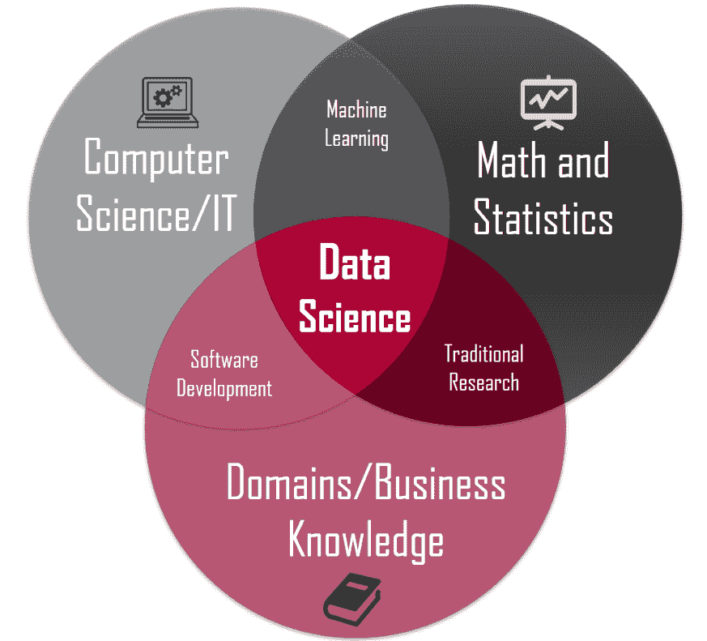

# 如何进入数据科学：为有志数据科学家提供的终极问答指南

> 原文：[`www.kdnuggets.com/2019/04/data-science-ultimate-questions-answers-aspiring-data-scientists.html`](https://www.kdnuggets.com/2019/04/data-science-ultimate-questions-answers-aspiring-data-scientists.html)

 评论

**作者：[Admond Lee](https://www.linkedin.com/in/admond1994/)**

那么……你想成为一名**数据科学家**？很好。你是一个自我驱动的人，对数据科学充满热情，并希望通过解决复杂问题为公司带来价值。很棒。但你在数据科学方面没有**零经验**，也不知道如何入门这个领域。**我明白。我也经历过这个阶段，真的非常理解你**。这就是为什么这篇文章专门献给你——充满热情和抱负的数据科学家——回答最常见的问题和挑战。

> * * *
> 
> ## 我们的前三个课程推荐
> ## 
>  1\. [谷歌网络安全证书](https://www.kdnuggets.com/google-cybersecurity) - 快速进入网络安全职业轨道
> 
>  2\. [谷歌数据分析专业证书](https://www.kdnuggets.com/google-data-analytics) - 提升你的数据分析技能
> 
>  3\. [谷歌 IT 支持专业证书](https://www.kdnuggets.com/google-itsupport) - 支持你的组织的 IT 需求
> 
> * * *
> 
> 如果数据是“新石油”，那么数据科学家的功能就像一个石油炼厂，将数据转换为能够节省成本和创造资本的洞察
> 
> — [Eva Short](https://www.linkedin.com/in/eva-short/)

下面所有的问题不是我提出的，而是你们——充满活力的数据科学社区。非常感谢你们对我之前的[LinkedIn 帖子](https://www.linkedin.com/feed/update/urn:li:activity:6460119534715138049)的支持，包括我从电子邮件和其他渠道收到的问题！*请注意，下面的问题没有特定顺序，因此可以跳到你觉得合适的部分。*

我希望通过分享我的经验，这篇文章能够揭示如何追求数据科学职业，并给你一些通用的指南，以使你的学习之旅更加愉快。让我们开始吧！

### 当前数据科学技能差距的趋势是什么？

国际数据公司（IDC）预测，全球大数据和商业分析的收入将在 2020 年超过[$210 亿](https://www.siliconrepublic.com/careers/data-science-skills-gap)。

根据[2018 年 8 月美国 LinkedIn 工作报告](https://economicgraph.linkedin.com/resources/linkedin-workforce-report-august-2018)，2015 年时数据科学技能人才的**过剩**。三年后，趋势发生了巨大的变化，越来越多的公司面临**数据科学技能人才的短缺**，因为大数据被越来越多地用于生成洞见和做出决策。

> 从经济学角度来看，这一切都与**供给**和**需求**有关。

**好消息**是：现在“形势”发生了变化。**坏消息**是：尽管数据科学领域的工作机会增加了，许多有志成为数据科学家的求职者仍然面临着由于技能缺口相对于当前市场需求的挑战，导致难以找到工作。

在接下来的部分中，你将看到如何提升数据科学技能，弥补“差距”，在众多候选人中脱颖而出，最终增加获得梦想工作的机会。

### 问题与答案

[(来源)](https://unsplash.com/photos/V3DokM1NQcs)

**1\. 需要哪些技能，以及如何补充这些技能？**

我会非常诚实地告诉你。学习所有数据科学的技能几乎是不可能的，因为范围实在太广。总会有一些技能（技术性/非技术性）是数据科学家不了解或未曾学习的，因为不同的企业需要不同的技能。

一般来说——根据我从其他数据科学家那里获得的经验和学习——要成为数据科学家，必须掌握一些核心技能。

**技术技能**。数学和统计学、编程以及商业知识。尽管无论使用何种编程语言都能表现出卓越的编程能力，但作为数据科学家，我们应该能够用商业上下文的语言解释我们的模型结果，并辅以数学和统计学。

[(来源)](https://towardsdatascience.com/introduction-to-statistics-e9d72d818745)

我仍然记得当我刚开始学习数据科学时，我读了这本教科书——[统计学习导论——R 语言应用](https://www.amazon.com/Introduction-Statistical-Learning-Applications-Statistics/dp/1461471370/ref=as_li_ss_tl?ie=UTF8&linkCode=ll1&tag=admond-20&linkId=7c20154d3e579c537decf3cbead8d412)。我强烈推荐这本教科书给初学者，因为这本书专注于统计建模和机器学习的基本概念，并提供了详细且直观的解释。如果你是一个数学硬核爱好者，也许你会更喜欢这本书：[统计学习的要素](https://www.amazon.com/Elements-Statistical-Learning-Prediction-Statistics/dp/0387848576/ref=as_li_ss_tl?ie=UTF8&linkCode=ll1&tag=admond1994-20&linkId=9227cfc7f0e3c430e6151a96d31369fd)。

*要学习编程技能*，特别是对于没有先前经验的初学者，我建议专注于学习一种语言（个人来说，我更喜欢 Python！????），因为这些概念也适用于其他语言，且 Python 更易于学习。[Python 或 R 的重要性和用途](https://www.datacamp.com/community/tutorials/r-or-python-for-data-analysis)在数据科学中一直是一个争论的话题。就个人而言，我认为应该关注如何帮助企业解决问题，而不论使用哪种语言。

最后，我不能强调足够的是，*理解业务知识*是极其重要的，正如我在[我的一篇文章中提到的（你可以在这里参考）](https://towardsdatascience.com/5-lessons-i-have-learned-from-data-science-in-real-working-experience-3532c1b41fd7)。

**软技能**。事实上，软技能比硬技能更重要。惊讶吗？我希望不会。

[LinkedIn 调查了 2,000 位商业领袖](https://learning.linkedin.com/blog/top-skills/the-skills-companies-need-most-in-2018--and-the-courses-to-get-t)，他们希望员工在 2018 年掌握的软技能有：领导力、沟通、协作和时间管理。我坚信这些软技能在数据科学家的日常工作中发挥着至关重要的作用。特别是，我在沟通技能的重要性上吃了不少苦头，你可以在[这里](https://towardsdatascience.com/5-lessons-i-have-learned-from-data-science-in-real-working-experience-3532c1b41fd7)阅读。

**2\. 如何在众多的训练营和在线课程中选择合适的？**

随着围绕 AI 和数据科学的炒作，很多人纷纷加入这股热潮，涌现出大量的 MOOC、训练营、在线课程和工作坊（免费/付费），希望能“赶上潮流”。

> *资源很多，**要有策略**。*

那么问题是：如何选择对你**合适**的学习材料？

我的筛选和选择适合自己的在线课程/工作坊的方法：

+   **理解没有单一最佳课程可以涵盖你所需的所有材料**。一些课程在某些领域有重叠，购买不同课程但大部分教学材料重复是不值得的。

+   **首先了解你需要学习什么**。千万不要仅仅因为华丽和吸引人的标题就进入一个课程。记得之前提到的技术技能吗？查看数据科学家的职位描述，你会发现公司对一些技能有共同的要求。现在你知道了所需技能和你缺乏的技能。太棒了。去寻找能帮助你提升知识（理论和实践）的课程吧。

+   **在线研究不同平台提供的最佳课程**。一旦你筛选出几门符合需求的课程，在掏钱报名之前，务必查看其他人的评价（非常重要！）。另一方面，很多免费课程也可以在 [Coursera](https://www.coursera.org/)、[Udemy](https://www.udemy.com/)、[Lynda](https://www.lynda.com/)、[Codecademy](https://www.codecademy.com/)、[DataCamp](https://www.datacamp.com/)、[Dataquest](https://www.dataquest.io/) 和其他平台找到。我是否也提到了 [YouTube?](https://www.youtube.com/) 是的，你明白了。

+   **提示：** 一些平台可能会提供财政援助来补贴你的课程费用（如 Coursera 等）。试试吧！

+   一些个人最喜欢的课程，对我帮助巨大：

    1.  **[机器学习](https://click.linksynergy.com/deeplink?id=zeF/0G0dYHo&mid=40328&murl=https%3A%2F%2Fwww.coursera.org%2Flearn%2Fmachine-learning)** 由 Coursera 的联合创始人 Andrew Ng 教授。

    1.  **[Python 数据科学与机器学习训练营](https://click.linksynergy.com/deeplink?id=zeF/0G0dYHo&mid=39197&murl=https%3A%2F%2Fwww.udemy.com%2Fpython-for-data-science-and-machine-learning-bootcamp%2F)** 由 Jose Portilla 教授。

    1.  **[深度学习 A-Z™：动手构建人工神经网络](https://click.linksynergy.com/deeplink?id=zeF/0G0dYHo&mid=39197&murl=https%3A%2F%2Fwww.udemy.com%2Fdeeplearning%2F)** 由 Kirill Eremenko 和 Hadelin de Ponteves 教授。

    1.  **[Python 数据科学基础培训](https://www.lynda.com/Python-tutorials/Python-Data-Science-Essential-Training/520233-2.html)** 由 Lillian Pierson 教授。

    1.  **[终极动手 Hadoop——掌控大数据！](https://click.linksynergy.com/deeplink?id=zeF/0G0dYHo&mid=39197&murl=https%3A%2F%2Fwww.udemy.com%2Fthe-ultimate-hands-on-hadoop-tame-your-big-data%2F)** 由 Frank Kane 教授。

**3\. 从开源资源学习是否足够成为数据科学家？**

我认为，从开源资源中学习足以让你开始数据科学的学习，任何进一步的学习则是为了进一步发展数据科学家的职业生涯，这也取决于业务需求。

**4\. 初学者（来自完全不同的背景）是否应该先通过阅读材料来了解基础知识？你会推荐哪本书？**

[（来源）](https://unsplash.com/photos/YLSwjSy7stw)

学习没有固定的路径，所有道路通向罗马。阅读材料无疑是了解基础的好开始，我也是这样做的！

只要注意不要试图阅读和记忆数学和算法的琐碎细节。因为很可能，你会在编码时遇到实际问题时，忘记所有内容而没有真正应用这些概念。

**只需了解和掌握足够的基础知识即可启动，然后继续向下一个步骤前进**。务实一点。不要试图掌握一切，因为完美主义往往是不知不觉中拖延和无法前进的最佳原因。

以下是一些我建议阅读的书籍，用于理解 Python、机器学习和深度学习的基础知识（希望有所帮助！）：

+   [学习 Python](https://www.amazon.com/Learning-Python-5th-Mark-Lutz/dp/1449355730/ref=as_li_ss_tl?ie=UTF8&linkCode=ll1&tag=admond-20&linkId=4497aa20eee542a8c0d91e0467082b61)

+   [Python 数据分析](https://www.amazon.com/Python-Data-Analysis-Wrangling-IPython-ebook/dp/B075X4LT6K/ref=as_li_ss_tl?keywords=python+for+data+analysis&qid=1540663027&s=Books&sr=1-1&ref=sr_1_1&linkCode=ll1&tag=admond-20&linkId=838bdee3bf4ca017f2bc905cd3680f71)

+   [统计学习导论](https://www.amazon.com/Introduction-Statistical-Learning-Applications-Statistics/dp/1461471370/ref=as_li_ss_tl?ie=UTF8&linkCode=ll1&tag=admond-20&linkId=c2ad3002d66dedbf31e497bcb68e02bc)

+   [绝对初学者的机器学习](https://www.amazon.com/Machine-Learning-Absolute-Beginners-Introduction-ebook/dp/B07335JNW1/ref=as_li_ss_tl?keywords=Machine+Learning+for+Absolute+Beginners&qid=1540663090&s=Books&sr=1-1&ref=sr_1_1&linkCode=ll1&tag=admond-20&linkId=bfca58c38d6bbd55f854b17ada94b60d)

+   [Python 机器学习](https://www.amazon.com/Python-Machine-Learning-scikit-learn-TensorFlow-ebook/dp/B0742K7HYF/ref=as_li_ss_tl?keywords=python+machine+learning&qid=1540663125&s=Kindle+Store&sr=1-3&ref=sr_1_3&linkCode=ll1&tag=admond-20&linkId=4ca1122a8d1a78131bbb3cb0c2721db8)

+   [Python 数据科学手册](https://www.amazon.com/Python-Data-Science-Handbook-Essential-ebook/dp/B01N2JT3ST/ref=as_li_ss_tl?keywords=python+for+data+analysis&qid=1540663027&s=Books&sr=1-2&ref=sr_1_2&linkCode=ll1&tag=admond-20&linkId=0bb8a753123e4b54f1fa6dc463585e28)

+   [Python 机器学习入门](https://www.amazon.com/Introduction-Machine-Learning-Python-Scientists-ebook/dp/B01M0LNE8C/ref=as_li_ss_tl?keywords=Introduction+to+Machine+Learning+with+Python&qid=1540663169&s=Kindle+Store&sr=1-3&ref=sr_1_3&linkCode=ll1&tag=admond-20&linkId=ef0cdad1f4b619602c893f0a7e11953f)

+   [使用 Python 进行深度学习](https://www.amazon.com/Deep-Learning-with-Python/dp/B07H5RKKB6/ref=as_li_ss_tl?keywords=Deep+Learning+with+Python&qid=1540663200&s=Kindle+Store&sr=1-3&ref=sr_1_3&linkCode=ll1&tag=admond-20&linkId=0c070545ee2c6e12f21df5a6e0df0225)

+   [使用 Keras 进行深度学习](https://www.amazon.com/Deep-Learning-Keras-Implementing-learning/dp/1787128423/ref=as_li_ss_tl?ie=UTF8&linkCode=ll1&tag=admond-20&linkId=36a4f6d25c456e498ac93033772b2c77)

**5. 如何平衡理解商业问题（制定解决方案）和发展技术技能（编码、核心数学知识等）？**

我开始时先发展我的技术技能，然后再去理解商业问题和制定解决方案。

商业问题告诉你是什么和为什么。要解决一个商业问题，首先必须了解如何解决这个问题。而“如何”来自于技术技能。同样，方法取决于情况，我的建议主要基于个人经验。

**6. 我们如何克服作为数据科学家职业生涯初期的挑战？**

许多有志的数据科学家（包括我）面临的一个主要挑战是[数据科学是信息的海洋](https://software.intel.com/articles/data-science-is-an-ocean-of-information-stay-focused?cid=em-elq-29785&utm_source=elq&utm_medium=email&utm_campaign=29785&elq_cid=3557344)。我们很容易因为接收到来自不同方向的各种建议和资源（在线课程、研讨会、网络研讨会、聚会等等）而失去焦点。保持专注。知道你拥有的和你需要的，并全力以赴。

在我的数据科学旅程中，挑战无数，但这些挑战也塑造了今天的我。我会尽力解释我面临的主要挑战以及如何克服它们：

+   **当我刚开始时，被众多资源搞得很困惑。** 我通过艰难的方式筛选出干扰。听数据科学家的播客和观看他们的网络研讨会，阅读大量关于如何在这一领域发展职业的数据科学文章，尝试不同的在线课程，参与 LinkedIn 上的数据科学社区并从中学习。最终，我只专注于那些对我有帮助的资源，并在这篇文章中分享了它们。

+   **曾经有一段时间我差点放弃。** 当学习曲线过于陡峭，我开始怀疑自己时，放弃的念头出现了。我真的能做到这一点吗？我真的走在正确的道路上吗？**激情和耐心**让我重新找回方向，坚持不懈地努力奋斗。

> 你的工作将占据你生活的大部分，唯一真正让你感到满意的方式是做你认为伟大的工作。而做伟大工作的唯一方法就是热爱你所做的事情。
> 
> — 史蒂夫·乔布斯

+   **获得数据科学家职位（[或类似工作但不同职位](https://towardsdatascience.com/why-did-i-reject-a-data-scientist-job-f2e56117fdae)）**。我希望我能早些阅读由[Favio Vázquez](https://medium.com/@faviovazquez)撰写的这些文章——[如何获得数据科学家的职位？](https://towardsdatascience.com/how-to-get-a-job-as-a-data-scientist-f417078fe13e) 和 [获得数据科学家职位的两面性](https://towardsdatascience.com/the-two-sides-of-getting-a-job-as-a-data-scientist-a4571acc58bc)。由于就业市场竞争激烈，获得工作对我来说并不容易。我提交了大量简历却无济于事。*我深思熟虑，认为肯定有什么地方出了问题*。我改变了我的方法，开始建立网络：参加聚会和研讨会，在网上分享我的学习经验，接触职业招聘会上的潜在雇主，并以更系统的方式进行分享，在提交简历后进行跟进等等。情况开始发生变化，机会也开始敲响我的门。

**7\. 如何在简历中呈现我的工作经验，以便我会被录用，并且我的经验会被认可？**

我相信这里存在一个误解——你不会仅仅凭借简历上的经验就被录用。事实上，你的简历是获得下一个阶段申请——面试的第一张入场券的方式之一。

因此，学习如何在简历中写出工作经验对获得入场券确实很重要。研究表明，**平均招聘人员在决定申请者是否适合职位之前，会扫描简历[六秒](http://cdn.theladders.net/static/images/basicSite/pdfs/TheLadders-EyeTracking-StudyC2.pdf)**。换句话说，要通过简历测试，你的简历只有**六秒钟的时间给潜在雇主留下正确的印象**。就个人而言，我参考了以下资源来打磨我的简历：

+   [Vault](http://www.vault.com/resumes)

+   [TopResume](https://www.topresume.com/career-advice)

+   **[优化指南（个人偏好！）](https://www.optimizeguide.com/)**

+   [简历专家提供职业建议](https://www.facebook.com/businessinsider/videos/10153537949019071/)

+   [如何通过 6 秒简历测试](https://www.topresume.com/career-advice/how-to-pass-the-6-second-resume-test)

+   [如何为数据科学职位量身定制学术简历](https://www.linkedin.com/pulse/how-tailor-your-academic-cv-data-science-roles-jason-byrne/?trackingId=3ykuEpfW%2BISNc%2Fx9YFbIZQ%3D%3D)

+   [招聘经理在数据科学家的简历中寻找什么？](https://www.linkedin.com/pulse/what-do-hiring-managers-look-data-scientists-cv-ben-dias/)

+   [你简历上需要的 14 件事，以获得理想工作](https://www.elitedaily.com/money/14-signs-you-have-a-strong-resume/617472)

**8\. 什么样的作品集可以帮助我们获得数据科学或机器学习领域的第一份工作？**

[（来源）](https://unsplash.com/photos/gPRvTP0sZ2M)

在我[第一篇 Medium 文章](https://towardsdatascience.com/my-journey-from-physics-into-data-science-5d578d0f9aa6)中，我提到了建立作品集的重要性。如果没有一个好的作品集，拥有一个精致的简历也不足以让你获得面试机会。

在雇主第一次浏览你的简历后，他们想了解你更多的背景，这就是你的作品集发挥作用的地方。虽然你可能会想知道如何从头开始建立一个作品集，但可以从**记录你的学习历程**开始。通过社交媒体平台（LinkedIn、Medium、Facebook、Instagram、个人博客——都可以）分享你的学习经验、错误、收获——技术性或非技术性——。

**对在摄像机前讲话感兴趣？** 那就开始制作视频（采访其他有抱负的/成熟的数据科学家）并分享在 YouTube 上。**擅长写作？** 那就开始在不同平台上写你感兴趣的主题。如果你对视觉和写作不感兴趣，那么**联系他人并进行播客**。

**我的意思是：** 利用互联网建立你的作品集和获得关注的机会确实丰富，或者可能引起未来雇主的注意。

我做过的最好的决定之一是与数据科学社区在[LinkedIn](https://www.linkedin.com/in/admond1994/)互动，并在[Medium](https://medium.com/@admond1994)上记录我的学习历程。我在 LinkedIn 上通过紧密联系的数据科学社区，在这种有利于分享和学习的环境中学到了最多。

渐渐地，我学会了（还在学习中！）如何利用我从不同来源获得的经验在 LinkedIn 上建立我的作品集。在这个过程中，我收到了来自不同招聘人员的职位机会信息，甚至有机会和他们中的一些人喝咖啡聊聊天！

**— 更多资源 —**

此时，你可能会想，为什么我一下子分享了这么多资源。好吧，我的简单秘诀是：**收藏我觉得有用的网站和文章，并时不时参考它们。**

这证明是极其有用的，当我需要一些参考和复习时非常方便。我可以分享整个收藏的网站列表，但这对于这篇文章来说可能太长了（或许在其他文章中吧）。

尽管如此，我还是列出了一些有用的资源：

+   **[Towards Data Science](https://towardsdatascience.com/)，[Quora](https://www.quora.com/)，[DZone](https://dzone.com/)，KDnuggets，[Analytics Vidhya](https://www.analyticsvidhya.com/)，[DataTau](http://www.datatau.com/news)，[fast.ai](http://www.fast.ai/)**

+   **网络研讨会** — [数据科学办公时间](https://www.youtube.com/channel/UC5c7r0SlnNmPfqxEyni71FA), [数据科学连接](https://www.youtube.com/channel/UCr6_XCxMLXWGguWZi_93n7w), [数据科学的人物](https://www.youtube.com/channel/UCU9GTVEPqlSNRDHypVf3BRw)

+   [数据讲故事：商业专业人士的数据可视化指南](https://www.amazon.com/gp/product/1119002257/ref=as_li_ss_tl?ie=UTF8&linkCode=ll1&tag=admond-20&linkId=8a8b531f394d313be3d43f351b49e0c2)

+   [进入数据领域的绝佳指南](http://www.data-mania.com/blog/guide-to-breaking-into-data/)

+   [10 个必备的数据科学技能](https://www.kdnuggets.com/2016/05/10-must-have-skills-data-scientist.html?utm_content=buffer7c1a3&utm_medium=social&utm_source=linkedin.com&utm_campaign=buffer)

+   [我的数据科学与机器学习，初学者学习路径](https://www.linkedin.com/pulse/my-data-science-machine-learning-beginners-path-vin-vashishta/?trackingId=J16vYmqLQEZ5wr4oElpnNA%3D%3D)

+   [机器学习大师](https://machinelearningmastery.com/)

+   [24 个终极数据科学项目，提升你的知识和技能](https://www.analyticsvidhya.com/blog/2018/05/24-ultimate-data-science-projects-to-boost-your-knowledge-and-skills/)

### 关注激励人心的数据科学家和专业人士

[（来源）](https://unsplash.com/photos/McIrFk1i5eg)

LinkedIn 上的数据科学社区非常棒，我强烈建议你关注下面提到的激励人心的数据科学家和专业人士：

+   [Randy Lao](https://www.linkedin.com/in/randylaosat/)

+   [Kyle McKiou](https://www.linkedin.com/in/kylemckiou/)

+   [Favio Vázquez](https://www.linkedin.com/in/faviovazquez/)

+   [Vin Vashishta](https://www.linkedin.com/in/vineetvashishta/)

+   [Eric Weber](https://www.linkedin.com/in/eric-weber-060397b7/)

+   [Sarah Nooravi](https://www.linkedin.com/in/snooravi/)

+   [Kate Strachnyi](https://www.linkedin.com/in/kate-strachnyi-data/)

+   [Tarry Singh](https://www.linkedin.com/in/tarrysingh/)

+   [Karthikeyan P.T.R.](https://www.linkedin.com/in/karthikeyanptr/)

+   [Megan Silvey](https://www.linkedin.com/in/megan-silvey/)

+   [Imaad Mohamed Khan](https://www.linkedin.com/in/imaad-mohamed-khan-218b3999/)

+   [Andreas Kretz](https://www.linkedin.com/in/andreas-kretz/)

+   [Andriy Burkov](https://www.linkedin.com/in/andriyburkov/)

+   [Carla Gentry](https://www.linkedin.com/in/datanerd13/)

+   [Nic Ryan](https://www.linkedin.com/in/nicryandataguy/)

+   [Beau Walker](https://www.linkedin.com/in/beauthescientist/)

### 最后的想法

[勇敢踏出第一步](https://unsplash.com/photos/wPlzrculha8)

*你已经到达这里了？！感谢阅读。*

这是迄今为止最长的一篇文章，还有很多我迫切想与你分享的内容（也许在下一篇文章中，谁知道呢？????）。

> *不要让任何人用他们的时间表催促你*

希望我的分享已经解答了你心中的疑问。无论何时你在数据科学之旅中遇到障碍，请记住你并不孤单，我们都在这里作为社区的一部分来帮助你。只要联系我，我会非常乐意帮助你！

现在你已经找到了你的问题的答案（如果你还有其他问题，请在下面留言），是时候为实现你作为数据科学家志向的**终极目标**采取**巨大的行动**了。没有哪一步行动是微不足道的。只需一步步向前推进。当你濒临放弃时，**坚持**是关键。

一如既往，如果你有任何问题或意见，请随时在下面留下反馈，或者你可以通过[LinkedIn](https://www.linkedin.com/in/admond1994/)与我联系。到那时，下一个帖子见！ ????

你可以在[LinkedIn](https://www.linkedin.com/in/admond1994/)、[Medium](https://medium.com/@admond1994)、[Twitter](https://twitter.com/admond1994)和[Facebook](https://www.facebook.com/admond1994)上与他联系，或**[在这里预约电话咨询](http://bit.ly/book-a-call-with-admond)**。

**简介：[Admond Lee](https://www.linkedin.com/in/admond1994/)** 是一名大数据工程师，行动中的数据科学家。他被誉为帮助初创企业创始人和各种公司通过深度数据科学和行业专业知识解决问题的备受追捧的数据科学家和顾问之一。

[原文](https://towardsdatascience.com/how-to-go-into-data-science-c1f6ef258438)。经授权转载。

**相关：**

+   选择最佳机器学习课程的完整指南

+   如何在数据科学、AI、大数据领域工作

+   关于数据科学职位申请的秘密

### 更多相关话题

+   [停止学习数据科学以寻找目标，转而寻找目标…](https://www.kdnuggets.com/2021/12/stop-learning-data-science-find-purpose.html)

+   [学习数据科学统计的顶级资源](https://www.kdnuggets.com/2021/12/springboard-top-resources-learn-data-science-statistics.html)

+   [成功数据科学家的 5 个特征](https://www.kdnuggets.com/2021/12/5-characteristics-successful-data-scientist.html)

+   [每个数据科学家都应该知道的三个 R 库（即使你使用 Python）](https://www.kdnuggets.com/2021/12/three-r-libraries-every-data-scientist-know-even-python.html)

+   [一个 90 亿美元的 AI 失败案例研究](https://www.kdnuggets.com/2021/12/9b-ai-failure-examined.html)

+   [是什么让 Python 成为初创企业理想的编程语言](https://www.kdnuggets.com/2021/12/makes-python-ideal-programming-language-startups.html)
