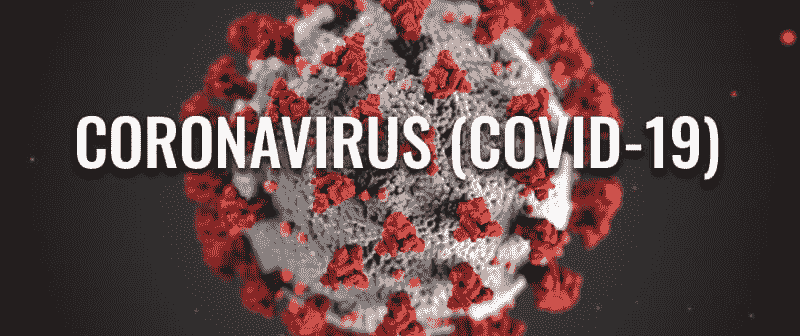

# 数据科学如何被用来理解 COVID-19

> 原文：[`www.kdnuggets.com/2020/04/data-science-understand-covid-19.html`](https://www.kdnuggets.com/2020/04/data-science-understand-covid-19.html)

评论 

来源：[联合国](https://www.un.org/development/desa/indigenouspeoples/covid-19.html)

* * *

## 我们的前三大课程推荐

 1\. [谷歌网络安全证书](https://www.kdnuggets.com/google-cybersecurity) - 快速开启网络安全职业生涯

 2\. [谷歌数据分析专业证书](https://www.kdnuggets.com/google-data-analytics) - 提升你的数据分析能力

 3\. [谷歌 IT 支持专业证书](https://www.kdnuggets.com/google-itsupport) - 支持你的组织在 IT 方面

* * *

COVID-19 的迅速传播和全球影响可能让人感到无助和恐惧，因为新型冠状病毒的升级迫使他们改变日常生活的许多方面。

然而，人们可以通过了解数据科学家如何努力学习 COVID-19 的更多信息，在这些不确定的时期中感受到一丝希望。

### 数据科学可以提供冠状病毒结果的准确图景

医疗专业人士和其他人必须获取有关冠状病毒情况每日变化的正确且最新的信息。包括约翰斯·霍普金斯大学、IBM 和 Tableau 在内的多个组织，[已发布互动数据库](https://www.zdnet.com/article/how-to-track-the-coronavirus-dashboard-delivers-real-time-view-of-the-deadly-virus/)，提供实时病毒情况的视图。

这些来源中的许多都引用了由可信机构如美国疾病控制与预防中心 (CDC) 和世界卫生组织 (WHO) 提供的数据。它们还包括这些机构的直接链接，以便人们可以快速、轻松地获取可靠的信息。

使用这些数据库可以告知人们确认病例、死亡人数和康复人数。无论一个人是参与抗击冠状病毒的前线工作者还是试图保持知情的普通公民，他们都可以在一个地方获得全部或大部分所需的信息。

### 数据科学家设计了一种更快捷的接触者追踪处理方式

接触者追踪是一种有效的方式来减缓 COVID-19 的传播。它涉及在个人确诊后与其密切接触的人取得联系，并告知他们进行自我隔离。尽管接触者追踪非常耗时，但随着越来越多的人认真对待社交距离，它变得越来越容易。

数据科学家和医学专家们在[牛津大学](http://www.ox.ac.uk/news/2020-03-17-infectious-disease-experts-provide-evidence-coronavirus-mobile-app-instant-contact)联合合作，以提高接触者追踪的效率。参与项目的专家们指出，数学模型显示传统的公共卫生接触者追踪方法速度不够快，无法彻底减缓 COVID-19 的传播。

他们创建了一个基于手机的解决方案，以消除人们手动拨打联系人电话的需要。相反，这些联系者会收到确认自我隔离需要的短信。研究人员澄清，如果这种方法能获得国家领导人的支持而不是由独立应用开发者主导，它将最为有效。

目前没有国家使用这种方法。然而，鉴于手机的市场渗透率和人们对接收短信的熟悉程度，很容易理解这种方法为何有意义。

### 每个人都可以在帮助科学家抗击冠状病毒中发挥作用

许多 COVID-19 患者只有轻微症状或根本没有症状。此外，经典症状包括发烧和咳嗽——这两种问题并不局限于冠状病毒。这些因素可能使人们更容易无意中传播疾病。但开发人员创建了一个[利用数据共享帮助](https://www.techradar.com/news/this-covid-19-tracking-app-lets-you-help-scientists-study-the-coronavirus)医学专家了解更多关于病毒的信息的应用程序。

这个应用程序叫做 Covid Symptom Tracker，[已有至少](https://www.techradar.com/news/this-covid-19-tracking-app-lets-you-help-scientists-study-the-coronavirus) 200,000 名用户。即使人们没有症状或不认为自己的症状与 COVID-19 相关，他们也可以并且应该与应用程序互动。研究人员对冠状病毒了解得越多，他们就越能有效应对。

人们通过应用程序进行简短的每日症状检查。他们还提供年龄和邮政编码，并披露任何既往疾病。这些信息帮助科学家确定受影响或有风险的群体。应用程序不会将用户数据用于商业目的，但会将数据提供给致力于阻止冠状病毒的人员，包括一些卫生组织的工作人员。

### 数据科学家利用机器学习更快地寻找可能的治疗方法

除了限制 COVID-19 传播的竞争外，科学家们还在尽快揭示有效的治疗方法。哥伦比亚大学数据科学项目的两名毕业生转向机器学习以提供帮助。实验室中抗体发现的典型过程需要数年时间。然而，这种方法[仅需一周](https://datascience.columbia.edu/dsi-alumni-use-machine-learning-discover-coronavirus-treatments)即可筛选出具有高成功可能性的治疗性抗体。

采用这种方法的团队表示，这种方法的成本也低于传统方法。人类仍然是过程的一部分，因为他们必须测试机器学习算法识别出的最有前景的基因序列。然而，使用这种加快的方法可能在有效找到对冠状病毒患者有效的干预措施方面至关重要。

### 数据科学可以帮助追踪传播情况

数据科学专家还得出结论，图数据库在展示 COVID-19 的传播方式方面发挥了重要作用。图数据库显示了人、地点或事物之间的链接。科学家们将每个实体称为节点，而它们之间的连接则是“边”。结果提供了事物之间关系的可视化表示（如果有的话）。

在冠状病毒爆发的早期，中国的数据科学家创建了一个名为 Epidemic Spread 的图数据库工具。它允许用户输入与他们所经历的旅行相关的识别信息 [如航班号或汽车牌照](https://www.datanami.com/2020/03/12/tracking-the-spread-of-coronavirus-with-graph-databases/)。数据库随后会告知这些用户是否有确诊的冠状病毒病例的人员曾进行过相同的旅行，并可能将其传播给同乘的乘客。

### 对抗 COVID-19 的进展

尽可能多地了解冠状病毒将挽救生命。这只是数据科学家用他们的技能来帮助的迷人方式之一。

**简介: [凯拉·马修斯](http://productivitybytes.com/subscribe-to-productivity-bytes/)** 讨论技术和大数据，曾在《The Week》、《The Data Center Journal》和《VentureBeat》等出版物上发表文章，并从事写作工作超过五年。要阅读更多凯拉的文章，[**订阅她的博客 Productivity Bytes**](http://productivitybytes.com/subscribe-to-productivity-bytes/)。

**相关内容：**

+   数据科学家最佳免费流行病学课程

+   5 种数据科学家应对 COVID-19 的方式以及 5 种应避免的行动

+   COVID-19 可视化：有效可视化在疫情叙事中的力量

### 更多相关话题

+   [我如何在 2 个月内获得 4 个数据科学职位并使收入翻倍…](https://www.kdnuggets.com/2021/01/data-science-offers-doubled-income-2-months.html)

+   [成为数据科学家的挑战](https://www.kdnuggets.com/2022/02/data-scientist-challenges.html)

+   [使用 SQL 理解数据科学职业趋势](https://www.kdnuggets.com/using-sql-to-understand-data-science-career-trends)

+   [图表：理解数据的自然方式](https://www.kdnuggets.com/2022/10/manning-graphs-natural-way-understand-data.html)

+   [24 本最佳（且免费的）理解机器学习的书籍](https://www.kdnuggets.com/2020/03/24-best-free-books-understand-machine-learning.html)

+   [挑选示例以理解机器学习模型](https://www.kdnuggets.com/2022/11/picking-examples-understand-machine-learning-model.html)
