# 数据科学家类型

> 原文：[`www.kdnuggets.com/2020/01/data-scientist-archetypes.html`](https://www.kdnuggets.com/2020/01/data-scientist-archetypes.html)

评论

[观看原版 Metis DemystifyDS 会议演讲及问答](https://youtu.be/M_dc-XzApGA)

[获取幻灯片](https://docs.google.com/presentation/d/1HoGMJDCTaBXEN5QTULPWaeohpiCpXAqChNYRshAybbg/edit?usp=sharing)

当你第一次进入数据科学领域时，或者即使你已经在其中待了一段时间，你也可能会被工具的数量和所需技能的广泛范围所压倒。关于成为数据科学家所需条件的博客文章往往变成了你尚未掌握的技能和尚未学习的工具的清单。这令人气馁。而且这也是适得其反的。

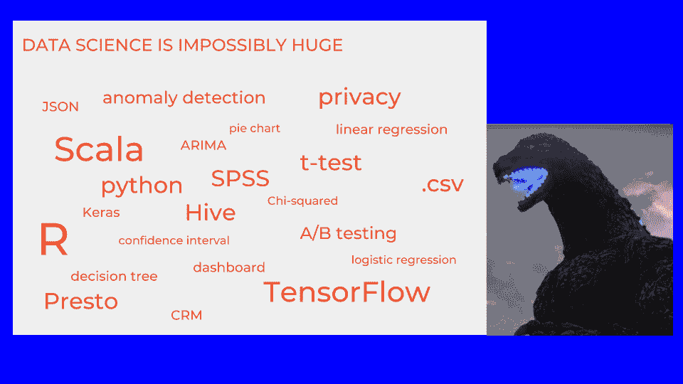

我的目标是为你提供一张地图，以帮助你在数据科学广阔的领域中导航。这个目标是帮助你优先考虑你想学习的内容和想做的事情，以免你感到迷失。

这些想法不仅仅是我的。这些想法基于与这里列出的数据科学家进行的一系列访谈，他们来自几个不同的公司，以及来自学术数据科学项目的贡献者。基础思想被总结在 [一个公共文档](https://github.com/brohrer/academic_advisory)中，作为一个行业数据科学家对学术数据科学项目的资源——一个虚拟行业咨询委员会的尝试。你从中获得的任何见解，我都归功于这个小组，而任何错误或不准确之处可能只是我个人的原因。总的来说，这是许多人深思熟虑后的观点的汇编。

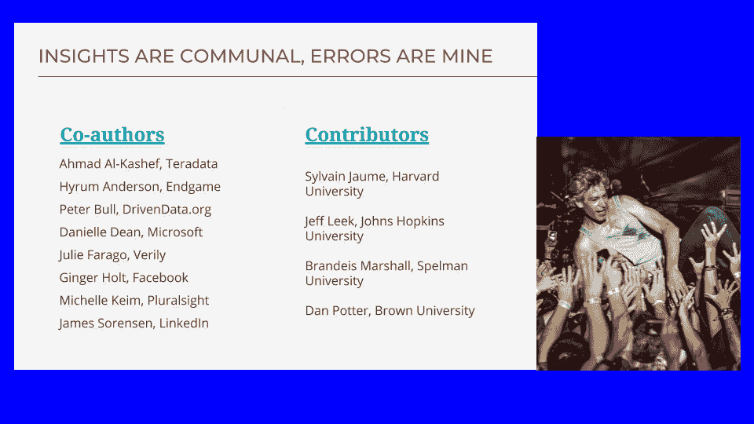

数据科学之所以感觉如此庞大，是因为它不再是一个单一领域。实际上，它有三个独立的支柱。**数据分析**，将原始信息转化为可以行动的知识或驱动决策的知识。**数据建模**，使用我们拥有的数据来估计我们希望拥有的数据。然后是**数据工程**，将这些分析和建模活动整合起来，使一切运行得更快、更稳健，并且处理更大数量的数据。

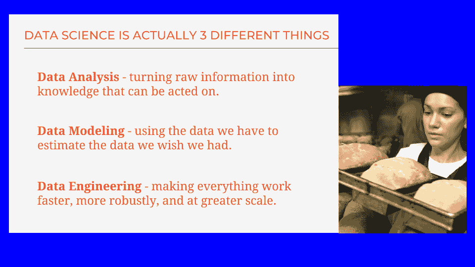

这三个领域都是独立的。它们需要不同的技能和工具。让我们更深入地探讨每一个。

### 数据分析

数据分析有几个方面，即将数据转化为我们可以用来做决策的信息。

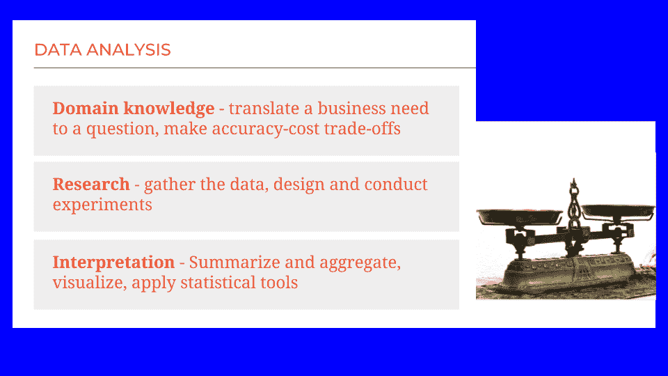

**领域知识** 是将业务需求或实际问题转化为问题的能力。这涉及到在答案的准确性和寻找答案所需的时间与金钱之间做出权衡。领域知识对于解释数据也是绝对必要的，它不仅包括理解呈现的数字和标签，还包括了解它们在现实世界中的反映，以及我们对其准确性可以做出的现实假设。

将信息转化为行动的另一个重要部分是**研究**。这可以像执行正确的 Google 搜索和阅读几份文档一样简单。通常，这涉及到对现有过程进行仪器化，例如日志记录代码，或在生产线上添加传感器，或进行调查。对于某些应用，研究涉及实验的精心设计。这需要使用复杂的统计工具来规划将收集哪些信息、如何收集以及如何在事后分析。

最后，数据分析的一个重要部分是**解释**。在面对大量数据时，我们如何总结、汇总、可视化它，并利用统计摘要从大量的数据中提炼出知识。特别是，我想强调可视化的艺术。将数字转化为易于解释并传达有用信息的图像是一种艺术，也是一门科学。它涉及到对人类视觉感知和理解的直觉感受。

### 数据建模

数据建模也有几个主要的子类别。这通常被称为机器学习。它不过是创建一个数据的简化描述，你可以用它来对未测量的数据进行估算。机器学习的三个主要子类是监督学习、无监督学习和自定义模型开发。

**监督学习** 使用标记的示例来发现模式。这些可以是分类标签，例如：这个客户在购买后一个月内是否重新访问了我们的网站，是或否？示例也可以用数字进行标记。例如：一个视频获得了多少次观看？使用大量带标签的示例，配有其类别或值，监督学习算法可以提取出潜在的模式。如果标签是分类的，这被称为*分类*。如果这些标签是数值的，这被称为*回归*。此外，有时目标不是对未来示例进行特定预测，而只是确定它们是否符合先前看到的模式。这被称为*异常检测*。

机器学习的第二个主要领域叫做**无监督学习**，这表明数据没有标签。我们不知道结果或正确答案。在无监督学习中，目标是发现数据分布中的模式。在*聚类*中，会识别出彼此之间比与数据集其他部分距离更近的数据点组。这些是数据中的自然分组。可以用来找到在超市购买类似物品的顾客。

在*降维*中，也会识别出那些倾向于以相似或协调的方式表现的变量组，例如共同作用以产生期望特征的基因。在降维中，聚类的不是数据点，而是变量。不是表的行，而是列。

在应用数据建模中，**自定义算法开发**非常常见。监督学习和无监督学习方法都是通用的。它们开始时对数据来源、数据含义和数据领域假设非常少。通用算法可以凭借强大的统计能力处理这些情况。当你拥有大量的数据时，它们表现最佳。

然而，在实际应用中，我们往往没有足够多的数据，也没有足够的数据来依赖于简单的机器学习技术。当这种情况发生时，我们就需要进行**自定义算法开发**。我们在算法中加入我们已知或可以合理假设的领域信息。例如，在农业行业，一个重要的建模问题是预测玉米田的产量，即收获谷物的总重量。这是一个极其复杂的系统，涉及土壤质地和化学成分、遗传学、温度和湿度等因素的相互作用。而且需要一年时间才能收集一个数据点。使用简单的机器学习方法来学习完整的作物模型是不现实的。然而，地质学家、化学家、生物学家、气象学家和遗传学家都对这个系统的各个部分进行了调查和描述。通过整合已知的信息并做出合理的假设，可以创建一个可处理的作物模型。

### 数据工程

数据工程是数据科学的第三个支柱。它有几个主要领域。**数据管理**是存储、移动和处理数据的过程。对于几千或甚至几百万个数据点的数据集来说，这很简单。但当单个数据点变得非常复杂，例如个体的基因组，或数据点数量达到数十亿或数万亿时，数据就不再适合放入笔记本电脑的 RAM 中，需要使用全新的工具。

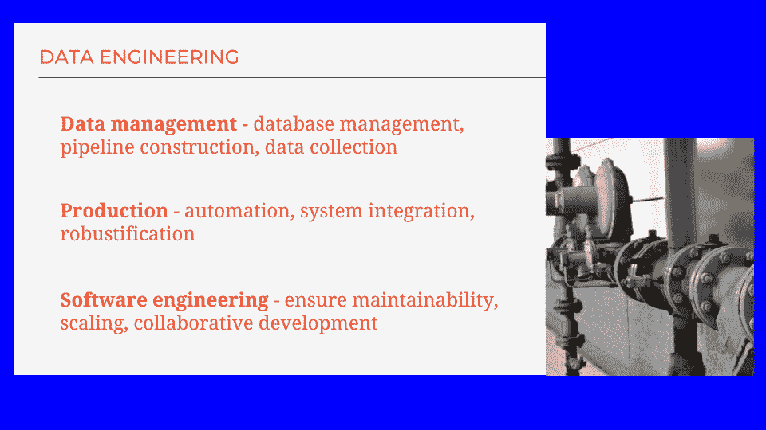

数据工程师的另一个重要任务是将在原型中表现良好的代码准备好在更广泛的环境中运行。 在 Jupyter notebook 中构建模型是一回事，但要使其能够处理每一个客户请求，代码需要与公司其余的代码库兼容，并且需要能够以适当的格式接收数据和发布结果。任何故障或失败都需要优雅地处理，系统需要对恶意或不良用户进行保护。从平稳运行的原型到**生产**代码之间的差距很大，数据工程的一部分工作就是缩小这个差距。

在数据管理和生产中，**软件工程**扮演着重要角色。这不仅仅是构建符合你要求的代码，还能够在当前团队中共享和维护，适应未来的变化，并随着需求的发展进行扩展或缩减。这是一门工艺，拥有大量的工具和专业技能。

### 数据机制

还有一个意外的第四个支柱，即数据机制。这是每个人都需要做但没人愿意谈论的繁琐工作。它包括**数据格式化**，确保你的数据类型一致，从字符串中提取所需信息，确保使用的字符串有效，优雅地处理错误。它还包括**值解释**，以可解释和一致的方式处理日期和时间，正确响应缺失值，确保计量单位的一致性和文档记录。它还包括**数据处理**的基础：查询、切片和连接。这让你能够从可用的大数据湖中提取你需要的子集进行操作。

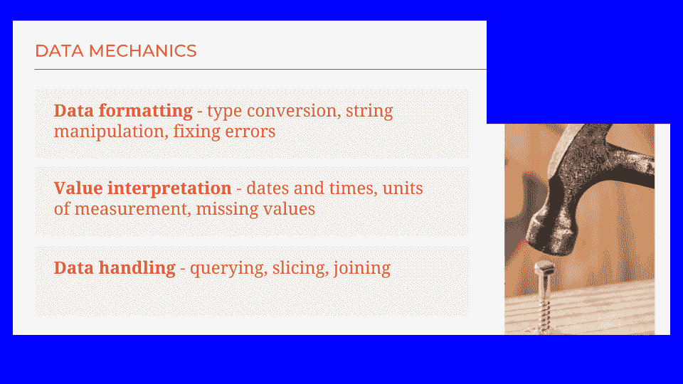

现在我们有了四个支柱：数据分析、数据建模、数据工程和数据机制。这对你作为数据科学家意味着什么？这些领域都是非常不同的。我认为一个数据科学家至少应当接触到所有这些技能领域。这意味着你不一定是专家，甚至不一定擅长这些领域，但你知道它们是什么，知道该问哪些问题以及进行哪些 Google 搜索。

初级数据科学家可能在这些支柱中都有一点经验。

以此为基础，我们可以讨论一些数据科学家的原型。我希望这些能对你规划培训和职业发展有所帮助。

### 原型

一种前进的路径是成为数据科学**通才**——在分析、建模、工程和机制方面发展扎实的混合能力。各方面的良好平衡能让你广泛了解各种范围的问题。这可能意味着你需要为一些项目与专业人士合作。但这将很好地为你成为技术领袖或数据高管奠定基础。

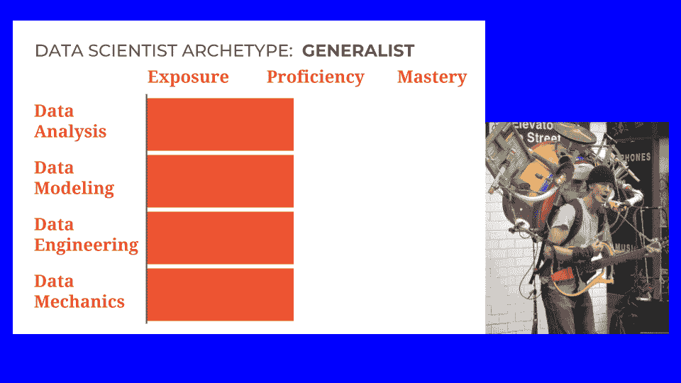

提个警告：可能会倾向于忽视数据机制或假设某个更初级的人员会处理这些问题。这样的人是数据科学家**明星**。这是一个反模式。这是你不想成为的，也不想雇用的。机制工作可能会很琐碎。有些日子它会占用你大部分时间。但你永远无法摆脱对它的需求。拥抱机制任务，学习完成它们所需的技能，并继续前行。

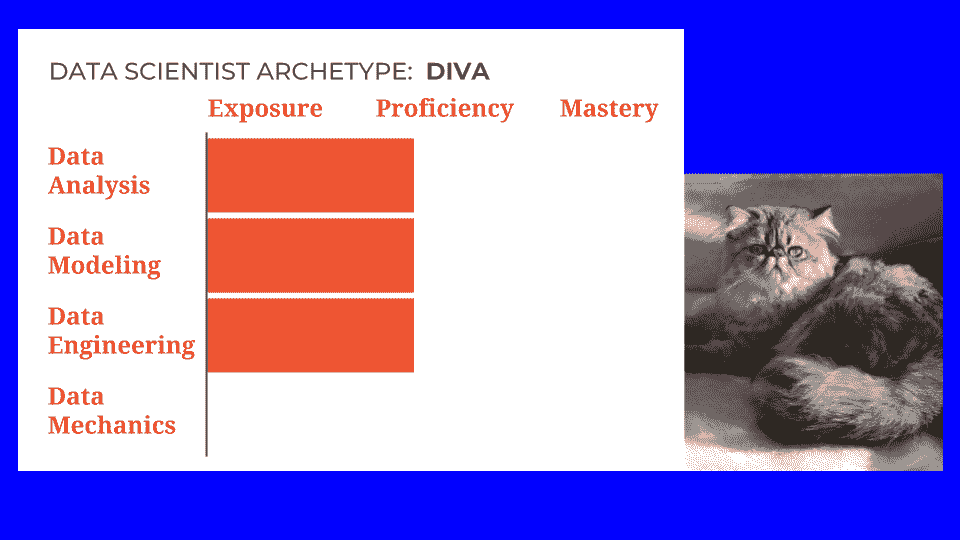

也有一些专业原型，强调三个主要领域中的每一个。

如果你选择强调数据分析，你可以成为**侦探**，一个善于发现正确数据并利用这些数据得出结论的高手。侦探对建模和工程方法非常熟悉，并以轻量级的方式使用它们。分析是他们的重点。

另一个数据科学家的原型是**预言家**，他掌握了建模的技能和机器学习的工具。他们可能接触过分析和工程，但他们的重点是建模——无论是通用的机器学习模型还是定制的领域特定模型。

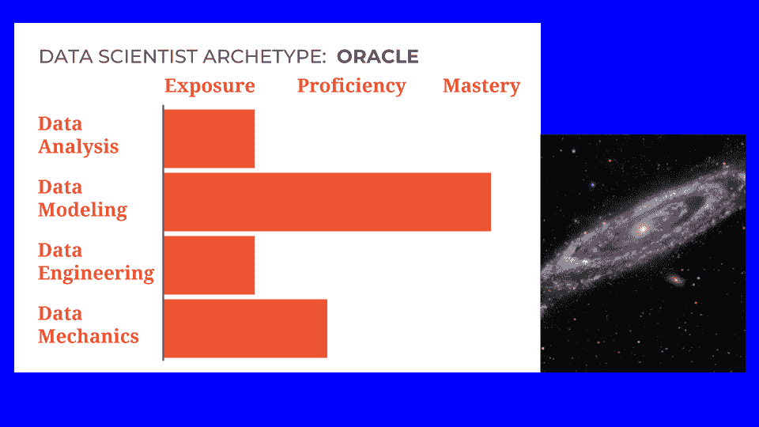

最后，你可以选择强调数据工程，成为**制造者**。这个人帮助一切运转得更快、更可靠。他们的工作仍然需要一些分析和建模，以及绝对需要一些机制工作，但他们将专注于工程任务。制造者是那些将好想法转化为具体机械的人。

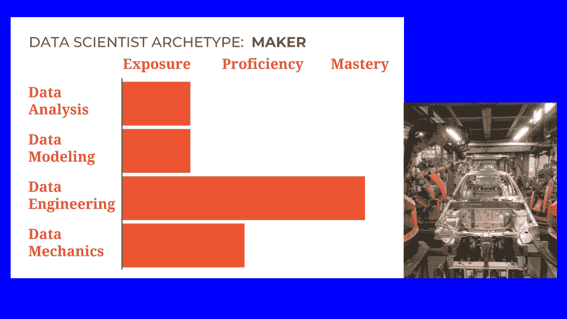

最后是**独角兽**。这个人是每个领域的高手。这是数据科学的理想状态。除了它并不存在之外。成为某一领域的高手需要很长时间。成为三者中的每一个领域的高手本质上是将三种职业叠加在一起。这并非不可能，但这是条漫长的道路，而这条路的途中会经过其他原型作为中转站。

因此，最有用的职业规划原型是

+   通才，精通一切，

+   侦探，一个分析的高手，

+   预言家，建模的高手，

+   制造者，一个工程的高手。

另一种表示这些角色的方式是使用一个三维图，其中有分析、建模和工程的坐标轴。你可以看到侦探、预言者和创作者分别接近各个坐标轴。全才则是三者的平衡，坐落在空间的中间。我想要完全明确的是，我并不是在暗示这些角色之间存在任何等级或价值判断。它们各自都是宝贵的，并且具有不同的功能。让你的偏好和兴趣引导你在选择它们时。

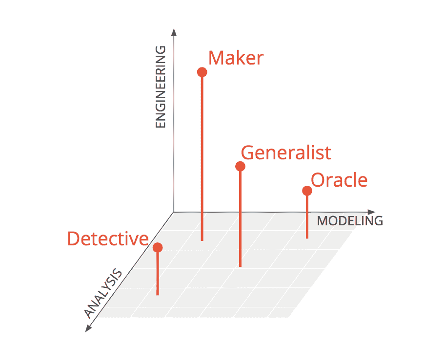

### 职位发布

数据科学专业没有被普遍接受的分类法。在找工作时，我建议忽略职位名称。没有可靠的方法可以在职位名称和角色之间进行转换。我还建议不要过于关注列出的具体工具。相反，要关注所暗示的技能。通过阅读暗示，发现他们想要的是哪种角色。职位描述听起来更像是创作者吗？全才？侦探？基于此，你可以决定这个特定的职位是否适合你。

同样，当发布职位时，请要求具体的技能。不要要求所有技能。也不要要求一个独角兽。你不会找到的。

我希望你从中得到的，比其他任何事情都要多的是，你不需要在所有领域都是专家才能成为一个伟大且成功的数据科学家。选择一个方向并深入即可。

祝好运！如果你还没有选择好自己的路径，希望这些信息能帮助你规划，并祝你在过程中取得巨大成功。

[原文](https://brohrer.github.io/data_science_archetypes.html)。已获许可转载。

**相关：**

+   数据科学家最需求的技术技能

+   数据科学面试学习指南

+   成为顶尖数据科学家的 13 项技能

### 更多相关话题

+   [数据科学职位名称导航：数据分析师 vs 数据科学家…](https://www.kdnuggets.com/navigating-data-science-job-titles-data-analyst-vs-data-scientist-vs-data-engineer)

+   [数据科学家、数据工程师及其他数据职业解析](https://www.kdnuggets.com/2021/05/data-scientist-data-engineer-data-careers-explained.html)

+   [数据科学家 vs 数据分析师 vs 数据工程师](https://www.kdnuggets.com/2022/01/data-scientist-data-analyst-data-engineer.html)

+   [数据科学家探索性数据分析的必备指南](https://www.kdnuggets.com/2023/06/data-scientist-essential-guide-exploratory-data-analysis.html)

+   [KDnuggets™ 新闻 22:n03，1 月 19 日：深入了解 13 种数据…](https://www.kdnuggets.com/2022/n03.html)

+   [KDnuggets 新闻 2022 年 3 月 16 日：学习数据科学基础 & 5…](https://www.kdnuggets.com/2022/n11.html)
