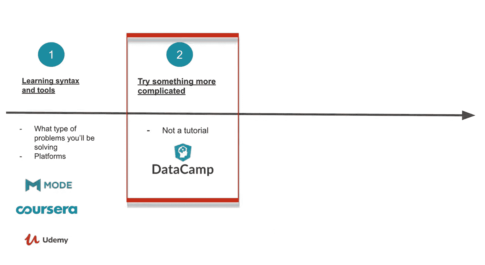
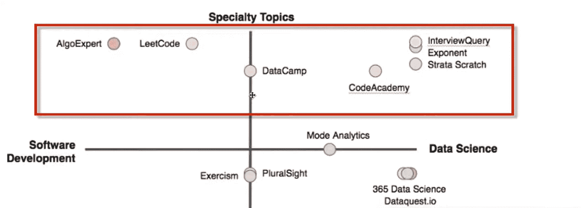
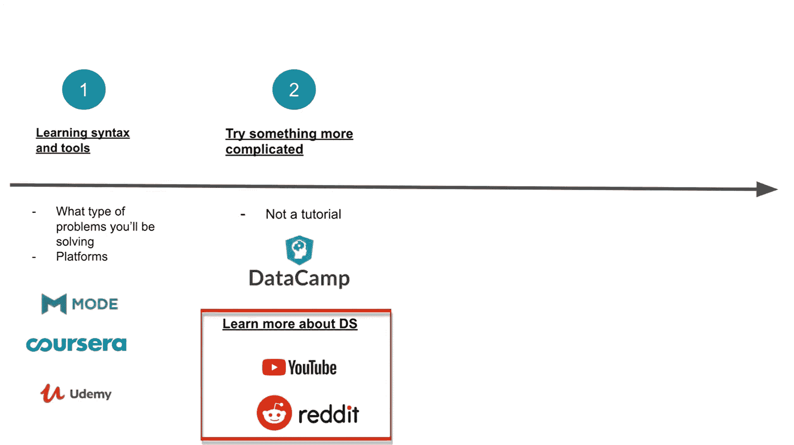
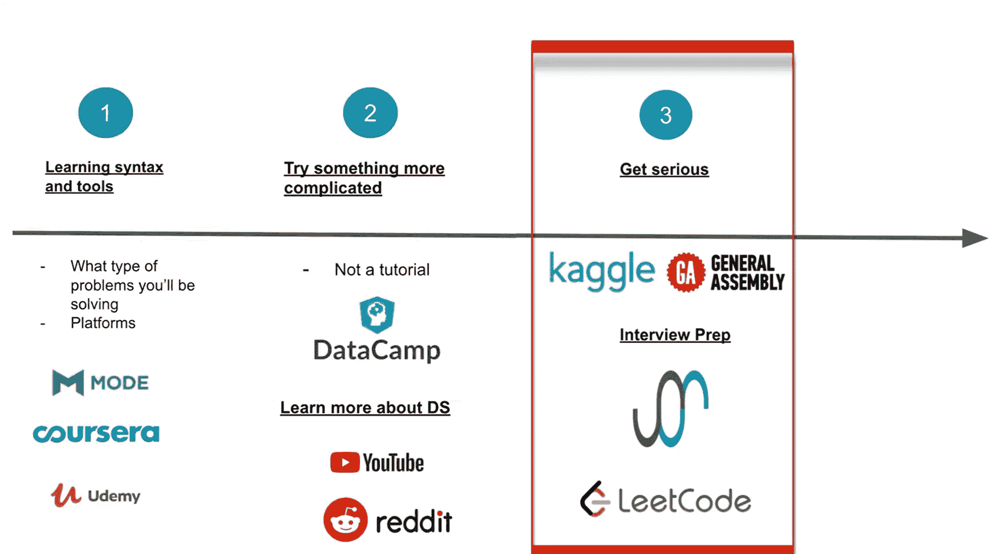
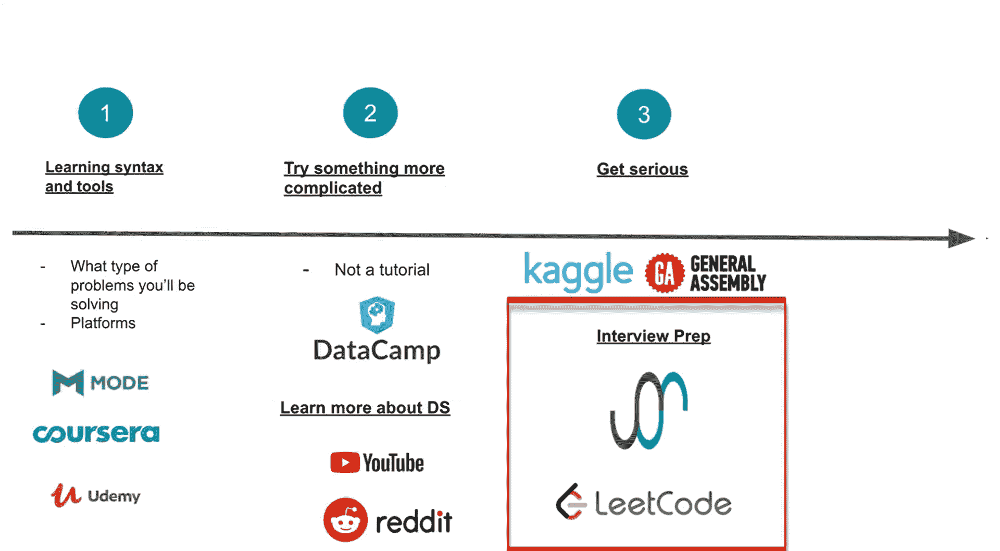
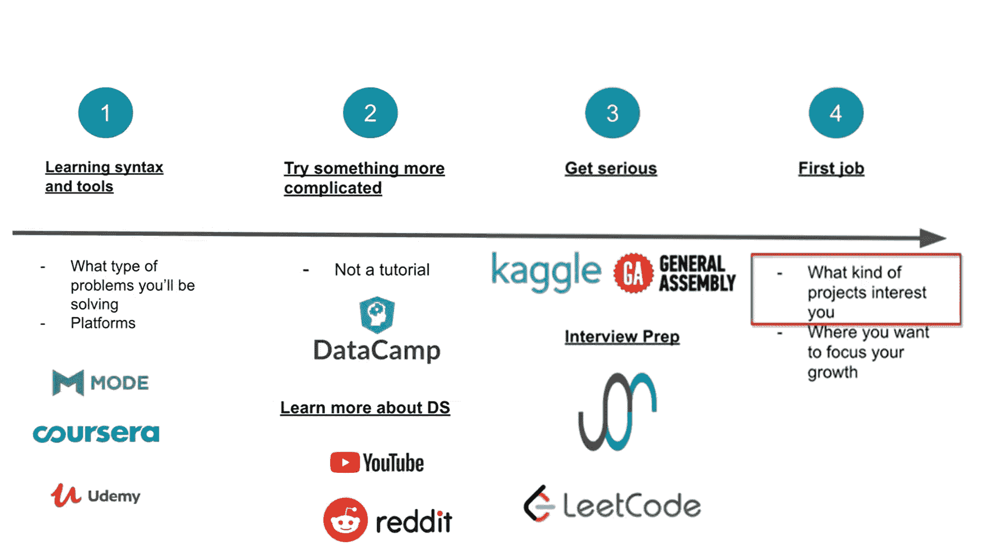

# 数据科学家职业路径从新手到首份工作

> 原文：[`www.kdnuggets.com/2021/11/data-scientist-career-path-first-job.html`](https://www.kdnuggets.com/2021/11/data-scientist-career-path-first-job.html)

comments

我们最近有一篇博客文章，我讨论了[18 种学习数据科学的在线资源](https://www.stratascratch.com/blog/18-of-the-most-recommended-data-science-platforms-to-learn-python-and-sql/)。显然，18 种资源对一个人来说太多了，并且根据你的经验水平和你在旅程中的位置，并不是所有平台对你都相关。

因此，我想做的是将你的数据科学之旅或成为数据科学家的职业路径分解成不同的阶段，依据经验和目标，推荐一些在线资源，以帮助你在成为数据科学家的职业路径中的当前阶段。

我所做的就是与社区中的一些数据科学家交流，询问他们的职业历程，并收集了一些对他们职业生涯有所帮助的在线资源推荐。然后，我将这些信息与我的数据科学家职业路径和我使用的资源进行了匹配。

我想做的是与您分享一个从完全新手到获得数据科学工作的一套四步数据科学旅程，以及每一步你可以使用的资源。

## 数据科学家职业路径的四个阶段

我从与社区交流以及反思自己旅程中收集到的信息是，你作为数据科学家的职业路径可以分为四个不同的阶段。从完全新手到[获得数据科学工作](https://www.stratascratch.com/blog/how-to-get-a-data-science-job-the-ultimate-guide/)，这四个阶段是：

### 1\. 学习语法和工具

学习语法和工具是数据科学家职业路径中的首次接触。

在这个阶段你的目标是：

+   *了解数据科学中的一些问题是什么*

+   *查看你是否喜欢这类问题*

+   *查看你是否喜欢编码*

+   *查看你是否喜欢数据科学家将使用的平台和工具*

这个阶段的重点是学习如何编码、统计和数学、建模、所有的理论，并测试你将用于工作的工具和平台。在这个阶段，每个人都是初学者。所以，你可能刚刚从大学毕业，或者还在学校，或者可能转行，但你可能只有一两门编程课程，或者根本没有编程经验，但这个阶段是为了让你了解平台、代码和数据科学类型的问题。

所以你希望利用的在线资源来学习和接触数据科学实际上位于下图中你作为初学者的底部部分：

我自己从 Mode Analytics 开始，这帮助我在一定程度上学会了 SQL 和 Python，然后我转到下一个平台以提升到更高的水平。但在第一阶段，任何一个上面图表中的平台都能帮助你获得编码和数据科学问题的初步了解。

除了 Mode Analytics，我还建议完成 Coursera 或 Udemy 提供的数据科学课程，以便你能接触到更多内容，了解自己是否对数据科学感兴趣。

现在你已经学会了工具，并对数据科学中会遇到的问题有了些了解，你想要脱离教程模式，进入更复杂的内容。这就带你进入了第二阶段。

### 2\. 尝试更复杂的内容

在第二阶段，你需要从教程模式中脱离，进入更专业的行业话题或数据科学领域。

对我来说，DataCamp 帮助我摆脱了教程模式。他们提供了许多专业话题，让我可以利用数据科学知识，如开发机器学习模型，并将其应用到我感兴趣的特定行业中。

如果你查看下面图表中的其他推荐，我们不仅有 DataCamp，还有像 CodeAcademy、StrataScratch 和 LeadCode 等在线资源。

所有这些平台都能帮助你在专业领域提升技能，这些技能可以应用到数据科学或软件开发中。

在数据科学职业路径的这一阶段，你不仅要脱离教程模式，进入更复杂的内容，同时你也在尝试了解数据科学职业的真正含义。

为了进一步了解这一点，我和一些同事在数据科学社区中从 YouTube、Reddit 和其他讨论论坛中学习。

观看 YouTube 视频或浏览 Reddit 帖子的目的是了解其他数据科学家遇到和暴露的问题。这可以帮助你理解数据科学职业可能的感受以及未来可能的经历。

总之，数据科学职业路径中的第二阶段是关于摆脱教程模式，进入更复杂和复杂的数据科学话题，这些话题你最终可以应用到你的工作中。此外，还包括去 Reddit 等讨论论坛，或观看其他数据科学家的 YouTube 视频，以了解他们的经历，这将帮助你设想自己在数据科学职业中的状态。

现在你在数据科学和编码方面有了一些进步，并且了解了一点作为数据科学家的职业前景，你也很兴奋想要成为其中的一员。让我们继续前进，进入数据科学家职业路径的第三阶段。

### 3\. 认真对待

数据科学职业路径中的第三步适用于那些已经决定将数据科学作为职业并且最终认真对待的人。现在，你需要做的是离开像 DataCamp 这样的教育平台，投入到可以全面检验你技能的项目中。

对于这个用例，你可以尝试一些非教育平台，如 Kaggle，来进行一些项目，并与其他数据科学家进行排名竞争。

如果你觉得不想做 Kaggle，而是想参加一个在线或面对面的数据科学训练营，那么 General Assembly 是一个非常受欢迎的选择，他们会教你如何进入数据科学领域。

显然，一旦你完成了 Kaggle 或结营后，你会想要准备面试以成为数据科学家。你确实应该尝试使用像 LeetCode 或 StrataScratch 这样的面试准备平台。

在这些平台上，你会找到大量来自真实公司的[data science interview questions](https://www.stratascratch.com/blog/data-science-interview-guide-questions-from-80-different-companies/)，这些问题可以为你提供成功面试所需的实践。

在这个阶段，目标是更加认真地对待成为数据科学家。你应该提高自己的技能，以便能够进行项目工作，产生有意义的影响，并且能够迅速且没有太多困难地回答和解决数据科学面试中的问题。因此，你需要在一些项目和面试问题上进行大量练习。

现在唯一缺少的就是找到一份工作，并获得薪水，成为数据科学家，这将引领我们进入数据科学家职业路径的第四步。

### 4\. 第一份工作

如果你之前没有任何行业或专业经验，或者没有作为数据科学家的工作经历，跳出第三阶段可能会很困难。所以，你需要认真对待第三阶段。尽可能多地准备和学习，以便你了解编码和回答这些技术问题。这将使你能够在获得第一份工作时运用这些技能。

在这个阶段，你需要了解自己对哪些类型的项目感兴趣。作为数据科学家，有许多不同类型的角色和数据科学家。

你可能每天都在创建推荐引擎，你可以将东西部署到生产环境中或保留在开发服务器上，你可以创建数据管道，你也可以做更多像研发类型的分析或其他事情。在最初的几年里，你可能会做所有这些工作，然后随着你专业化并在职业中成长，你可能会做得更少，只专注于某些角色。

在数据科学家职业路径的这一阶段，作为你的第一份工作，关键是了解你喜欢什么，以及你作为数据科学家喜欢做的角色和责任是什么。

### 结论

现在我们已经讨论了典型的数据科学家职业路径，我必须说，并非所有的数据科学之旅都是相同的。这实际上是我从与社区中几位数据科学家交谈以及对我自己经历的反思中总结出的常见阶段和主题的集合。

我猜测你现在可能处于第一个到第三个阶段，并且你正在尝试找到第一份数据科学工作的方法。因此，我建议你根据你所处的阶段，选择一些在线资源来帮助你在这个阶段，并帮助你达到下一个水平。第四阶段是我们希望成为专业数据科学家的地方。

希望这些信息对你有帮助，并且你能理解自己在这段旅程中的位置以及需要做些什么才能进入下一个阶段或水平。

[原文](https://www.stratascratch.com/blog/data-scientist-career-path-from-novice-to-first-job/)。经许可转载。

**相关：**

+   [Google 推荐你在参加机器学习或数据科学课程之前做的事](https://www.kdnuggets.com/2021/10/google-recommends-before-machine-learning-data-science-course.html)

+   [避免这些让你看起来像数据新手的五种行为](https://www.kdnuggets.com/2021/10/avoid-five-behaviors-data-novice.html)

+   [Google 研究总监对学习数据科学的建议](https://www.kdnuggets.com/2021/07/google-advice-learning-data-science.html)

### 相关话题

+   [成功数据科学家的 5 个特征](https://www.kdnuggets.com/2021/12/5-characteristics-successful-data-scientist.html)

+   [每个数据科学家都应该知道的三个 R 库（即使你使用 Python）](https://www.kdnuggets.com/2021/12/three-r-libraries-every-data-scientist-know-even-python.html)

+   [停止学习数据科学，找到目标再继续...](https://www.kdnuggets.com/2021/12/stop-learning-data-science-find-purpose.html)

+   [学习数据科学统计学的顶级资源](https://www.kdnuggets.com/2021/12/springboard-top-resources-learn-data-science-statistics.html)

+   [一个 $9B 的 AI 失败，深度解析](https://www.kdnuggets.com/2021/12/9b-ai-failure-examined.html)

+   [是什么让 Python 成为初创企业理想的编程语言](https://www.kdnuggets.com/2021/12/makes-python-ideal-programming-language-startups.html)
