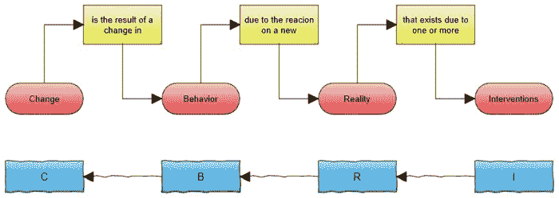

# 为什么数据科学家必须了解变革管理

> 原文：[`www.kdnuggets.com/2018/02/data-scientist-change-management.html`](https://www.kdnuggets.com/2018/02/data-scientist-change-management.html)

 评论

**[Jurjen Helmus](https://www.hva.nl/profiel/h/e/j.r.helmus/j.r.helmus.html)，阿姆斯特丹应用科学大学（HvA）。**

本周我受邀为一组变革管理人员做了一次关于数据科学的客座讲座。我们讨论了预测性维护对劳动力的社会影响，以及如何从变革管理的角度处理这一概念的实施。在讲座结束时，我意识到应该是数据科学家了解变革管理，而不是相反。这可能使数据科学家发现的改进的实施更加高效，因为这解决了行为变革问题：这是我们实施想法和实现目标的最大障碍之一。

* * *

## 我们的前三名课程推荐

 1\. [谷歌网络安全证书](https://www.kdnuggets.com/google-cybersecurity) - 快速进入网络安全职业生涯。

 2\. [谷歌数据分析专业证书](https://www.kdnuggets.com/google-data-analytics) - 提升你的数据分析技能

 3\. [谷歌 IT 支持专业证书](https://www.kdnuggets.com/google-itsupport) - 支持你的组织 IT

* * *

**变革管理模型**

变革管理可能被视为与数据科学对立的领域。数据科学是困难的，而变革是软性的。变革管理并不是解决混乱问题，而是关于变革的过程，数据科学则是关于在处理混乱数据后提供解决方案。变革管理的核心理念之一是变革作为一个过程的一部分出现，而不是在突然或预测的时间出现。变革来自人们对变革的接受。

我们在讲座中讨论的一个变革管理模型指出，“*变革是由于对新现实的反应而导致的行为变化的结果*。”变革是结果而不是起点。目标是你要朝着的方向，变革是实现这些目标所必需的。但要实现目标，必须从后向前思考，回到需要实施干预的点，以创造新的现实。

这就是我意识到的：创造新的现实通常是我们数据科学家在做的事情——基于我们对系统行为的洞察——基于数据集。

成功的变更实施并非从新的现实开始：它从与那些需要对新现实作出反应的人们合作开始。我总结出，对于我们数据科学家来说，拥抱变更管理的概念并在实施结果之前寻求这种方法的合作可能会更有效。

**案例 - 预测性维护**

让我通过具体案例来阐明我的想法。设想一个生产相对简单产品的工厂。维护和检修由技术部门进行。生产线上的同事和维护部门的员工每天都与机械设备打交道，因此他们*了解并感知*设备的状态。以詹姆斯为例，他是一位 45 岁的维护工程师，在公司工作超过 25 年。他通过旋动螺栓和手臂就能感知是否需要维护。当然，机械设备有时会故障，但这也在所难免。

现在预测性维护出现了。数据科学家们开始着手预测即将进行的维护，以便在设备故障被感知之前发现问题。请注意，组织内开始进行数据科学工作本身就是一种干预。项目结束时，确实为许多设备创建了一个预测模型，能够在故障发生前 3 周以 97%的准确率预测组件的故障。预测表明，生产故障减少 85%是可以实现的。

**挑战 - 实施**

这时变更管理就显得重要了。实施后会发生什么变化？行为可能需要改变，但还有更大的问题：预测性维护是一种现实的变化。在旧的现实中，设备会在出现故障的情况下进行维护，或者在预防性维护的情况下，设备会定期维护。在新的现实中，设备甚至在人工感知能力之前就可能由算法进行维护。在新的现实中，未出现故障的设备也会被修理。

这可能引发技术同事的问题，比如“*我的技能仍然需要吗？*”

因此，成功实施预测性维护的结果是由于对新现实的反应而行为发生的变化。挑战在于不仅仅关注核心数据科学项目，还要使新的现实被接受。这需要在数据科学启动之前或同时进行一系列干预。

**干预的最佳实践**

那么，变更管理的最佳实践是什么，它们应该如何使用？首先要认识到的是，变更在数据科学家开始分析之前就已经开始了。任何包含智能预测算法的项目都涉及到聪明且技术娴熟的员工。因此，在展示任何结果之前，与这些员工进行互动。项目经理可能认为人们希望为比自己更大的目标做出贡献。在预测性维护的情况下，追求零生产故障可能会激励员工，而不是使他们退缩。

接下来要认识到，领域知识需要成为数据科学项目的一部分。因此，让来自工作一线的员工参与项目，让他们分享他们对机器或任何分析主题的了解。这样，你员工的技能得到了认可。他们知道你知道他们很有能力。被倾听的重要性不容低估。

同时，在项目期间以及项目结束时，要与技术娴熟的员工一起测试。挑战你的员工熟悉预测算法。此外，让他们进行人机对抗：谁知道哪些机器最需要服务。

此外，关注更宏观的视角。在任何公司中实施数据科学并不是要挤掉员工，而是使我们所做的事情更有效、更高效。我期望在实施之后，仍然会对熟练的员工有需求。

**简历：** [Jurjen Helmus](https://www.hva.nl/profiel/h/e/j.r.helmus/j.r.helmus.html)（1980 年）在阿姆斯特丹应用科技大学（HvA）工作。他协调“城市技术中的大数据”这一辅修课程。此外，他正在阿姆斯特丹大学进行博士研究，建立用于电动车充电基础设施的基于代理的仿真模型。

**相关内容**

+   [**深度特征合成：自动化特征工程如何运作**](https://www.kdnuggets.com/2018/02/deep-feature-synthesis-automated-feature-engineering.html)

+   [**加速算法：设计、算法选择和实现中的考虑因素**](https://www.kdnuggets.com/2017/12/accelerating-algorithms-design-choice-implementation.html)

+   [**从创意到成功的数据科学项目的 7 个超简单步骤**](https://www.kdnuggets.com/2017/11/7-super-simple-steps-idea-successful-data-science-project.html)

### 进一步阅读

+   [你需要了解的数据管理的 6 件事及其重要性……](https://www.kdnuggets.com/2022/05/6-things-need-know-data-management-matters-computer-vision.html)

+   [KDnuggets 新闻，4 月 13 日：数据科学家应该了解的 Python 库……](https://www.kdnuggets.com/2022/n15.html)

+   [为什么数据管理对数据科学如此重要？](https://www.kdnuggets.com/2022/08/data-management-important-data-science.html)

+   [KDnuggets 新闻，5 月 4 日：9 门免费哈佛课程学习数据……](https://www.kdnuggets.com/2022/n18.html)

+   [你必须知道的 15 个 Python 编程面试问题（数据科学专用）](https://www.kdnuggets.com/2022/04/15-python-coding-interview-questions-must-know-data-science.html)

+   [你必须知道的前 10 个高级数据科学 SQL 面试问题…](https://www.kdnuggets.com/2023/01/top-10-advanced-data-science-sql-interview-questions-must-know-answer.html)
