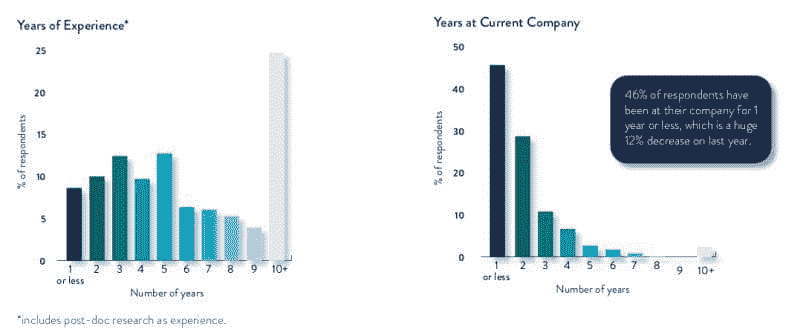
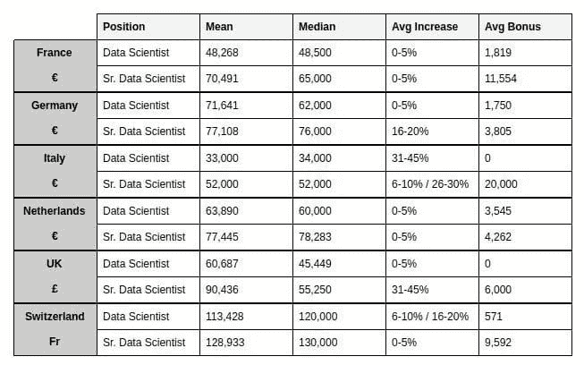
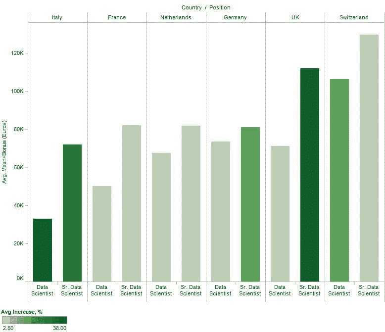

# 数据科学家在欧洲做什么，他们的价值多少？

> 原文：[`www.kdnuggets.com/2020/01/data-scientist-worth-europe.html`](https://www.kdnuggets.com/2020/01/data-scientist-worth-europe.html)

评论

在 12 月，我们分享了一些关于数据科学家价值的见解，数据主要集中在美国，同时也有一些额外的地理数据。随着[Big Cloud 年度调查报告](https://bigcloud.io/salary-reports/)的发布，我们现在有了一些高质量的数据和可视化，帮助我们更好地了解全球数据科学家的价值。

这次我们将关注欧洲，特别是数据科学专业人士报告使用的技能、这些专业人士的薪资以及报告中的有趣见解。

* * *

## 我们的前三名课程推荐

 1\. [谷歌网络安全证书](https://www.kdnuggets.com/google-cybersecurity) - 快速进入网络安全职业的快车道

 2\. [谷歌数据分析专业证书](https://www.kdnuggets.com/google-data-analytics) - 提升您的数据分析技能

 3\. [谷歌 IT 支持专业证书](https://www.kdnuggets.com/google-itsupport) - 支持您的组织的 IT

* * *

来自 Big Cloud 的报告：

> 自 2016 年以来，Big Cloud 致力于每年制作一些最大和最好的数据科学薪资报告。在超过 1300 个回应和 33 个问题后，我们自豪地宣布这是迄今为止我们为欧洲策划的最丰富的数据调查！
> 
> 本报告将深入探讨 2019/2020 年度来自各背景、年龄和地点的欧洲地区专业人士提供的见解。今年贡献最多的来自德国、法国、英国、荷兰和瑞士。由于这些国家的数据点最多，因此这些国家是我们本报告的主要关注点。

更具体地说，大多数受访者来自以下城市：

1.  巴黎

1.  柏林

1.  慕尼黑

1.  伦敦

1.  阿姆斯特丹

1.  汉堡

1.  苏黎世

1.  剑桥

1.  法兰克福

1.  马德里

谁是受访者？

> 今年参与我们调查的最大群体是 24%的男性数据科学家，年龄在 25-34 岁之间。与去年相比，角色的变化似乎更大，数据科学家的数量减少了 15%，数据工程师的数量增加了 6%，C 级参与者的数量增加了 3%。
> 
> 男性与女性参与者的比例保持不变。
> 
> 超过一半的调查参与者拥有硕士学位，其次是博士学位（+4%）和学士学位（+2%）逐年稳步增加。然而，选择继续深造的人数持续下降，今年仅占 3%（2018 年为 3.45%）。

受访者的工作年限和在当前公司工作的年限如图 1 所示。

**图 1：受访者的工作年限和在当前公司工作的年限。**

调查受访者的主要行业是：

+   技术/信息技术

+   咨询

+   电子商务

+   金融科技

+   学术/教育

+   软件

+   医疗保健

+   保险

+   汽车

+   市场营销

请注意，本报告所依据的基础数据不可用。

现在我们对调查参与者有了一定了解，让我们来看看报告，从技能开始。

### 数据科学技能

调查研究的部分数据科学技能维度包括编程语言、编程能力和使用的方法。

**图 2：最常用的数据科学工具和最常用的数据科学方法。**

在数据科学方法方面，从参与者中获得了以下信息：

> [L]ogistic 回归、神经网络和随机森林是三种最受欢迎的选择，大约 56%的受访者表示使用它们。与数据科学家工具偏好相比，他们选择的数据科学方法种类更加多样。调查中的其他选项（未进入前七名）包括 34%的集成方法、31%的贝叶斯技术和 28%的支持向量机。

具体到编码方面，受访者的数据讲述了以下故事：

> [A] 高达 70%的受访者表示他们使用 Python 作为主要建模编程语言。这比 2019 年的调查增加了 10%。9%使用 R，4%使用 SQL，4%使用 Java。此外，还有 3%的受访者表示他们不进行编码。
> 
> 66%的受访者表示，他们的主要生产编程语言也是 Python。另有 9%表示 Java，还有 7%使用 Scala 或完全不进行编码。6%使用 C++

**图 3：按职位类型划分的编程能力。**

受访者花费多少时间进行编码？

> 29%的受访者每周花费 11-20 小时进行编码，这与我们 2019 年的调查结果相同。只有 14%的受访者表示他们每周花费 31 小时以上进行编码，而 7%的人完全不进行编码。总体而言，回应非常多样，这可能反映了参与者的资历差异。

受访者还指出，目前处理的最受欢迎的数据类型，按顺序排列如下：

1.  关系数据

1.  文本数据

1.  图像数据

1.  其他

1.  视频数据

### 数据科学薪资

尽管调查包含了多个数据科学相关角色的薪资数据，但这很快就进入了比较苹果和橙子的领域。为了进行有意义的比较，我们将查看“数据科学家”和“高级数据科学家”的平均工资、中位工资、平均涨幅和平均奖金在 6 个国家（法国、德国、意大利、荷兰、瑞士、英国）的数据点（见图 4），这些国家在报告中被特别提及。

**图 4：6 个调查参与者最多的国家的平均工资、中位工资、平均涨幅、平均奖金（标注了本地货币）。**

让我们来绘制这些数据。图 5 可视化了上述图表中 6 个国家的平均工资，本地货币已转换为本文发布时的欧元价值。

**图 5：6 个调查参与者最多的国家的数据科学家的平均工资（以欧元计）。**

为了更全面地描绘欧洲数据科学家的价值，图 6 绘制了同 6 个国家的数据科学家和高级数据科学家的平均工资 + 奖金（以欧元计），并通过柱状颜色强度描绘了薪资涨幅百分比。

**图 6：6 个调查参与者最多的国家的平均工资 + 奖金（以欧元计）和涨幅百分比。**

在薪资满意度方面，结果并不令人震惊；然而，稍微多于一半的受访者似乎认为他们的薪资和福利套餐是令人满意的。

当被问到“在 1 到 10 的尺度上（10 为最容易），你认为找到新工作的难易程度如何？”时，调查参与者最常回答的是“3”。

### 结论

欧洲显然不是一个单一的整体，这在调查回应中很明显。各国之间的薪资差异确实存在，但这本身并没有讲述完整的故事，没有考虑生活成本差异。虽然这应该是显而易见的，并且超出了薪资调查的范围，但值得明确指出。

除了原始数据外，一个突出的事项是参与者认为替代的数据科学职位的可用性以及转移到这些职位的难易程度似乎相对较低。这是一种个人感知，但在决定是否寻找新角色时，感知和现实一样重要。

你可以 [在这里阅读完整报告](https://bigcloud.io/salary-reports/)。

**相关**：

+   数据科学家值多少钱？

+   人工智能：薪资飞涨

+   数据科学家：为什么雇佣他们如此昂贵？

### 更多相关主题

+   [2022 年数据科学家的薪资水平是多少？](https://www.kdnuggets.com/2022/02/much-data-scientists-make-2022.html)

+   [到 2024 年数据科学仍然值得吗？](https://www.kdnuggets.com/is-data-science-still-worth-it-in-2024)

+   [人员分析的努力是否值得结果？](https://www.kdnuggets.com/2022/09/efforts-people-analytics-worth-outcome.html)

+   [数据科学中需要多少数学知识？](https://www.kdnuggets.com/2020/06/math-data-science.html)

+   [评估机器学习模型的一个（更好）方法](https://www.kdnuggets.com/2022/01/much-better-approach-evaluate-machine-learning-model.html)

+   [大型语言模型是什么，它们是如何工作的？](https://www.kdnuggets.com/2023/05/large-language-models-work.html)
