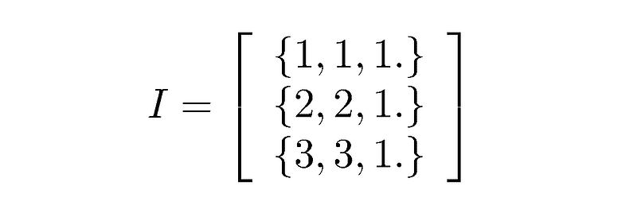

# 与机器学习算法相关的数据结构

> 原文：[`www.kdnuggets.com/2018/01/data-structures-related-machine-learning-algorithms.html/2`](https://www.kdnuggets.com/2018/01/data-structures-related-machine-learning-algorithms.html/2)

 评论

### **堆**

堆是另一种分层、有序的数据结构，类似于树，但与水平排序不同，它具有垂直排序。这种排序适用于层级结构，但不适用于跨层级：父节点总是比它的两个子节点都要大，但高等级的节点不一定比直接在其下方的低等级节点要大。

插入和检索都是通过提升来完成的。一个元素首先被插入到最高可用的位置。然后它与其父节点进行比较，并提升直到达到正确的等级。要从堆中取出一个元素，两个子节点中较大的一个被提升到缺失的位置，然后那两个子节点中较大的一个被提升，以此类推，直到所有元素都被提升到相应的等级。

通常，最高等级的值会从堆的顶部取出以对列表进行排序。与树不同，大多数堆只是存储在一个数组中，元素之间的关系只是隐含的。

### **栈**

栈的定义是“先进后出”。一个元素被*pushed*到栈的顶部，它会覆盖之前的元素。必须先*popped*顶部元素，才能访问其他元素。

> *栈主要用于解析语法和实现计算机语言。*

有许多机器学习应用场景中，特定领域语言（DSL）是完美的解决方案。例如，[libAGF 库](https://github.com/peteysoft/libmsci)使用**递归控制语言**将二分类推广到多分类。使用特殊字符来重复先前的选项，但由于语言是递归的，该选项必须取自相同的层级或更高层级。这是通过栈来实现的。

### **队列**

队列的定义是“先进先出”。想象一下银行柜台前的排队（对于那些还记得互联网银行之前的时代的人来说）。队列在**实时编程**中非常有用，这样程序可以保持一个待处理的任务列表。

设想一个记录运动员分段时间的应用。你输入号码牌并按回车，但在你做这件事的时间里，下一个运动员已经通过了。所以你输入一系列最近接近的运动员的号码牌，然后按另一个键来注册下一个队列中的运动员已通过。

### **集合**

一个集合由一个无序的、不重复的元素列表组成。如果你添加了一个已经在集合中的元素，则不会发生变化。由于机器学习中的许多数学运算涉及集合，因此它们是非常有用的数据结构。

### **关联数组**

在关联数组中，有两种类型的数据以对的形式存储：*键*和其关联的*值*。数据结构本质上是关系型的：值由其键来访问。由于训练数据也通常是关系型的，这种数据结构似乎非常适合机器学习问题。

在实践中，它的使用并不多，部分原因是大多数关联数组仅是单维的，而机器学习数据通常是多维的。

> *关联数组适合用于构建字典。*

假设你正在构建一个 DSL，想要存储一个函数和变量的列表，并需要区分它们。

> “sin” → function
> 
> “var” → variable
> 
> “exp” → function
> 
> “x” → variable
> 
> “sqrt” → function
> 
> “a” → variable

在“sqrt”上查询会返回“function”。

### **自定义数据结构**

随着你处理更多问题，你肯定会遇到那些标准食谱箱中没有最佳结构的情况。你需要设计自己的数据结构。

考虑一个多类分类器，它将二元分类器推广到处理具有多个类别的分类问题。一种明显的解决方案是二分法：递归地将类别分成两组。你可以使用类似于二叉树的结构来组织二元分类器，但层次化解决方案并不是解决多类问题的唯一方法。

> *考虑几个划分，然后用来同时解决所有类别概率。*

最一般的解决方案是将两者结合起来，因此每个层次化的划分不一定是二元的，而可以通过非层次化的多类分类器来解决。这是*libAGF*库中采用的方法。

更复杂的数据结构也可以由基本结构组成。考虑一个稀疏矩阵类。在稀疏矩阵中，大多数元素为零，仅存储非零元素。我们可以将每个元素的位置和值作为一个三元组存储，并将它们放在一个**可扩展数组**中。

考虑 3 乘 3 的单位矩阵：

### **结论**

数据结构本身有时并不那么有趣。真正让它们有趣的是你可以用它们解决的各种问题。

对于我做的大部分工作，我使用了许多基本的固定长度数组。我主要使用更复杂的数据结构使程序运行得更顺畅，与外界的接口更友好，用户体验也更佳。与过去的 Fortran 程序相比，后者在改变网格大小时需要忍受近半小时的编译周期（我实际上参与过这样的程序！）。

即使你一时无法想到应用场景，我仍然认为了解像栈和队列这样的数据结构是有益的。你永远不知道它们何时会派上用场。

真的很复杂的人工智能应用可能会使用诸如有向图和无向图的东西，这实际上只是树和链表的泛化。如果你无法处理链表，那你将如何构建前者？

### **问题**

如果你想自己实践并实现机器学习算法的数据结构，可以尝试解决下面的一些问题：

1.  将矩阵-向量乘法代码片段封装成一个名为**matrix_times_vector**的子程序。设计该子程序的调用语法。

1.  使用**struct, typedef**或**class**，将向量和矩阵封装成一对抽象类型，分别称为**vect**和**matrix**。为这些类型设计一个 API。

1.  在线找到至少三个做上述工作的库。

1.  下载并安装 LIBSVM 库。考虑“svm.cpp”中第 316 行的**Kernel::k_function**方法。用于存储向量的数据结构的优缺点是什么？

1.  你会如何重构 LIBSVM 库中的核函数计算？

1.  文本中描述的哪些数据结构是抽象类型？

1.  你可以使用什么内部表示或数据结构来实现抽象数据类型？有没有任何不在上面列表中的数据结构？

1.  使用二叉树设计一个关联数组。

1.  考虑 LIBSVM 中的向量类型。如何用它来表示稀疏矩阵？与上面描述的稀疏矩阵类相比，这有什么优缺点？查看[完整类型](https://github.com/peteysoft/libmsci/sparse/sparse.h)。每种表示方法的优缺点是什么？

1.  实现一个树排序和一个堆排序。现在使用相同的数据结构找出前*k*个元素。这对哪个常见的机器学习算法有用？

1.  在你喜欢的编程语言中实现你最喜欢的数据结构。

**简介: [Peter Mills](https://blog.statsbot.co/@peteymills)** 对科学充满热情，感兴趣于大气物理学、混沌理论和机器学习。

[原文](https://blog.statsbot.co/data-structures-related-to-machine-learning-algorithms-5edf77c8bbf4?utm_source=kdnuggets&utm_medium=post&utm_campaign=data-structs)。经授权转载。

**相关:**

+   初学者的前 10 种机器学习算法

+   IT 工程师需要学习多少数学才能进入数据科学领域？

+   数据科学家主要只做算术，这其实是好事

* * *

## 我们的前三个课程推荐

 1\. [谷歌网络安全证书](https://www.kdnuggets.com/google-cybersecurity) - 快速进入网络安全职业的捷径

 2\. [谷歌数据分析专业证书](https://www.kdnuggets.com/google-data-analytics) - 提升你的数据分析技能

 3\. [谷歌 IT 支持专业证书](https://www.kdnuggets.com/google-itsupport) - 支持你的组织 IT 工作

* * *

### 更多相关内容

+   [停止学习数据科学以找到目标，然后找到目标再学习数据科学](https://www.kdnuggets.com/2021/12/stop-learning-data-science-find-purpose.html)

+   [学习数据科学统计学的最佳资源](https://www.kdnuggets.com/2021/12/springboard-top-resources-learn-data-science-statistics.html)

+   [成功数据科学家的 5 个特征](https://www.kdnuggets.com/2021/12/5-characteristics-successful-data-scientist.html)

+   [每位数据科学家都应该知道的三个 R 语言库（即使你使用 Python）](https://www.kdnuggets.com/2021/12/three-r-libraries-every-data-scientist-know-even-python.html)

+   [一个 90 亿美元的 AI 失败，经过分析](https://www.kdnuggets.com/2021/12/9b-ai-failure-examined.html)

+   [是什么让 Python 成为初创企业的理想编程语言](https://www.kdnuggets.com/2021/12/makes-python-ideal-programming-language-startups.html)
