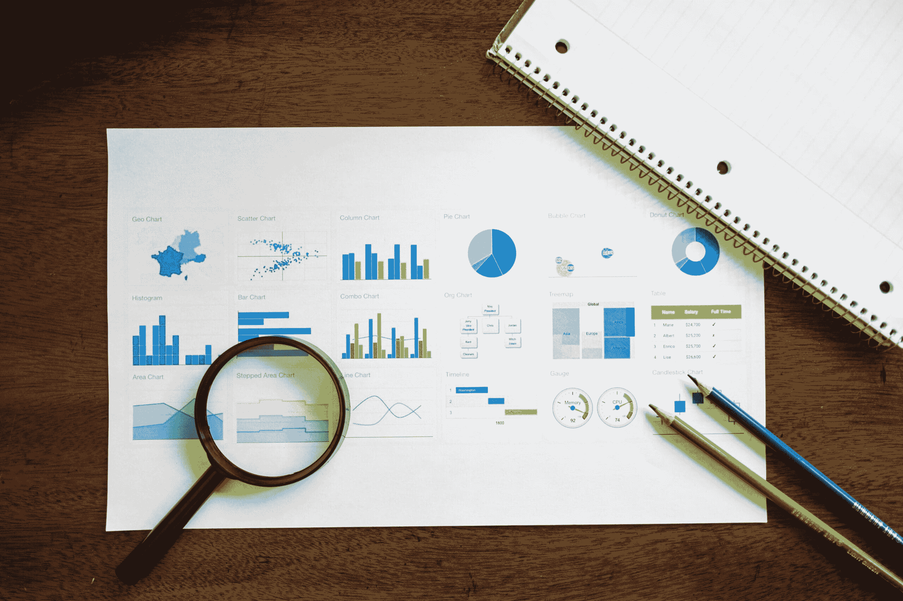

# 如何使用数据可视化为你的工作报告和演示文稿增添影响力

> 原文：[`www.kdnuggets.com/2022/08/data-visualization-add-impact-work-reports-presentations.html`](https://www.kdnuggets.com/2022/08/data-visualization-add-impact-work-reports-presentations.html)

图片由 [RODNAE Productions](https://www.pexels.com/photo/overhead-shot-of-a-paper-with-graphs-and-charts-7947663/) 提供

当新手被引入数据科学领域时，解释通常会集中在通过利用数据中的洞察来为各个行业的组织增加巨大价值，从而推动更为明智的决策制定、预测等。

* * *

## 我们的三大课程推荐

 1\. [谷歌网络安全证书](https://www.kdnuggets.com/google-cybersecurity) - 快速开启网络安全职业生涯。

 2\. [谷歌数据分析专业证书](https://www.kdnuggets.com/google-data-analytics) - 提升你的数据分析技能

 3\. [谷歌 IT 支持专业证书](https://www.kdnuggets.com/google-itsupport) - 支持你的组织的 IT 工作

* * *

这就是为什么典型的数据科学家或数据分析师职位描述中通常会包括类似的软技能条目: *能够将复杂的想法传达给非技术利益相关者。*

然而，广泛需要与决策者沟通数据洞察的需求也联系到一个关键的硬技能。当然，我们说的就是数据可视化。

# 什么是数据可视化？

数据可视化仅仅是从数据中提取的洞察的图形表示。有效的数据可视化以对其相应受众易于接受的方式传达这些数据驱动的洞察。它被广泛认为是数据科学和数据分析中最重要的技能之一。

大局观: 数据可视化 “通过将大量无形数据转化为易于理解的图像和图形，帮助为利益相关者和其他团队成员提供高质量的信息。”

凭借生成有价值的商业洞察和解决实际问题的能力，数据科学现在正在推动几乎所有行业和领域的创新和变革——包括医疗保健、电子商务、执法、市场营销/广告、交通、体育、娱乐、非营利事业等。

数据可视化是关键能力之一，因为可视化的数据在大脑中处理速度比书面文字更快，这意味着它更易于理解，并能够从数据驱动的信息中更好地把握全局。

# 数据讲故事的重要性

不需要花哨的图表或图形来传达数据可视化的重要性。但虽然数据可视化的本质涉及更容易地向相关观众传达关键信息，它也严重依赖于 [数据讲故事](https://onlinedegrees.sandiego.edu/storytelling-with-data-part-1/) 的概念，这将你的叙述与可视化连接起来。

当你利用数据，或者更正式地说，是利用数据可视化技术来制作工作相关的报告或演示时，记住你实际上是在使用这些数据讲述一个故事，并将其作为决策的起点，会有所帮助。

根据视觉传播公司 [Column Five Media](https://www.columnfivemedia.com/data-storytelling-brands-data-visualization/#:~:text=What%20Is%20Data%20Storytelling%3F) 的说法，“数据讲故事是我们用来描述完整的数据收集、提取见解和将这些见解转化为故事的行为的通用术语。它是围绕引人入胜的数据精心编织的叙事，用于指导决策、揭示有趣的趋势或向你的观众提供有价值的信息。”

从本质上讲：“数据讲故事是两个世界的融合：硬数据和人际沟通。” 因此，数据可视化和讲故事是使数据科学对许多从业者如此有趣的核心所在。

# 数据可视化类型

在实践数据可视化的艺术与科学时，有多种具体的技术、策略和格式。

Tableau，这家开发了广泛使用的数据可视化工具的软件公司，提供了以下 [最常见的通用数据可视化类型列表](https://www.tableau.com/learn/articles/data-visualization#:~:text=Common%20general%20types%20of%20data%20visualization)：

+   图表

+   表格

+   图表

+   地图

+   信息图

+   仪表盘

更深入地说，Tableau 列出了这些更具体的 [数据可视化方法示例](https://www.tableau.com/learn/articles/data-visualization#:~:text=More%20specific%20examples%20of%20methods%20to%20visualize%20data%3A)：

+   面积图

+   条形图

+   箱线图

+   气泡云

+   子弹图

+   地图图

+   圆形视图

+   点分布图

+   甘特图

+   热力图

+   高亮表格

+   直方图

+   矩阵格式

+   网络图

+   极区图

+   径向树

+   散点图（2D 或 3D）

+   流图

+   文本表格

+   时间轴

+   树图

+   扇形堆积图

+   词云

除了分享一些出色的 [数据可视化实例](https://www.tableau.com/learn/articles/data-visualization#:~:text=Examples%20of%20data%20visualization%20in%20action) 外，Tableau 还提供了 [“历史与今日的 10 个最佳数据可视化示例”](https://www.tableau.com/learn/articles/best-beautiful-data-visualization-examples) 的展示——从拿破仑 1812 年的行军到伦敦 1854 年的霍乱爆发，再到 1950-2060 年的美国按年龄组划分的人口趋势。

# 如何将数据可视化融入你的工作和生活

关于数据密集型演示的提示——以及任何希望以视觉格式创建和分享数据的实用建议——Column Five Media 建议密切关注 [三个非常重要的基本原则](https://www.columnfivemedia.com/how-to-data-visualization-report-design/)：

1.  **从数据中找到故事。** 你想讲述的独特故事是什么？是新的机会？新的效率？还是关于潜在风险的警示？

1.  **围绕这些数据构建一个叙事。** 重要的是通过提供数据的背景，创造逻辑流畅的故事，并通过有趣的标题和副标题使其易于理解，从而引导观众了解故事。了解你的观众是很重要的，这样你才能在叙事中创建一个能引起观众某种程度上共鸣的联系。一个情感投入的观众就是一个会回应你“行动呼吁”的观众。

1.  **选择最有效的数据可视化。** 这涉及选择格式和视觉设计，以最大化对数据驱动故事的理解。再一次，理解你的观众在你制作可视化之前是至关重要的。你需要确保这些可视化对你的观众是可访问和易于解读的。那些需要观众大量脑力去解读的可视化将很快被忽视或遗忘。

在另一篇专注于如何有效使用数据可视化格式和技术的文章中，以及上述数据叙事原则，Column Five Media 还提供了关于 [创造性展示数据可视化的建议](https://www.columnfivemedia.com/10-creative-ways-to-repurpose-your-data-visualization/)。该列表包括每种方法的引人注目的示例：

+   信息图表

+   电子书和白皮书

+   增强版传统报告和演示

+   互动图形

+   GIFs 和动画视觉效果

+   动态图形和视频

就选择合适的格式用于数据可视化应用而言，商业智能软件公司 Sisense 深入探讨了 [13 种不同的数据可视化选项](https://www.sisense.com/blog/10-useful-ways-visualize-data-examples/)，从基本的到更高级的，解释了每种选项的独特功能以及何时使用它们以获得最大效果。他们的列表还包括以下格式的视觉示例：

1.  指标清晰地展示一个关键绩效指标（KPI）

1.  线图展示趋势

1.  条形图简单地分解信息

1.  列图表将数值进行并排比较

1.  饼图清晰显示比例

1.  区域图比较比例

1.  数据透视表轻松展示关键数字

1.  散点图：分布和关系

1.  气泡图：理解多个变量

1.  树形图展示层级结构，比较数值

1.  极坐标图显示多个变量之间的关系

1.  区域/散点图展示地理数据

1.  漏斗图展示一个管道，通常用于销售数据

最后，在一篇面向对该主题不太熟悉的读者的文章中，[哈佛商业评论](https://hbr.org/2020/02/present-your-data-like-a-pro)探讨了掌握数据可视化关键原则和实践的重要性。简而言之：“你展示数据的方式可能会使其影响力翻倍，或者彻底削弱。”

**[Erin Cooke](https://onlinedegrees.sandiego.edu/faculty/erin-cooke/)** 目前是“数据科学公益课程”的讲师，该课程由[圣地亚哥大学应用数据科学硕士项目](https://onlinedegrees.sandiego.edu/masters-applied-data-science/)与圣地亚哥科技中心合作制作。她感到非常荣幸能够在这个项目中介绍数据科学领域，并涉及数据伦理和数据讲故事等重要主题。

### 更多相关内容

+   [IMPACT: 数据可观察性峰会将于 11 月 8 日回归，详细信息请查看…](https://www.kdnuggets.com/2023/10/monte-carlo-impact-the-data-observability-summit-is-back)

+   [基准率谬误及其对数据科学的影响](https://www.kdnuggets.com/2023/04/base-rate-fallacy-impact-data-science.html)

+   [从数据分析师到数据战略师：创造影响的职业道路](https://www.kdnuggets.com/2023/05/data-analyst-data-strategist-career-path-making-impact.html)

+   [IMPACT 2022：数据可观察性峰会，10 月 25-26 日](https://www.kdnuggets.com/2022/09/monte-carlo-impact-2022-data-observability-summit.html)

+   [Monte Carlo 正在启动 IMPACT 2023，来自数据与 AI 开创者的主题演讲](https://www.kdnuggets.com/2023/11/monte-carlo-is-kicking-off-impact-2023-keynotes-from-data-ai-pioneers)

+   [人工智能对科技行业的影响](https://www.kdnuggets.com/the-impact-of-ai-on-the-tech-industry)
