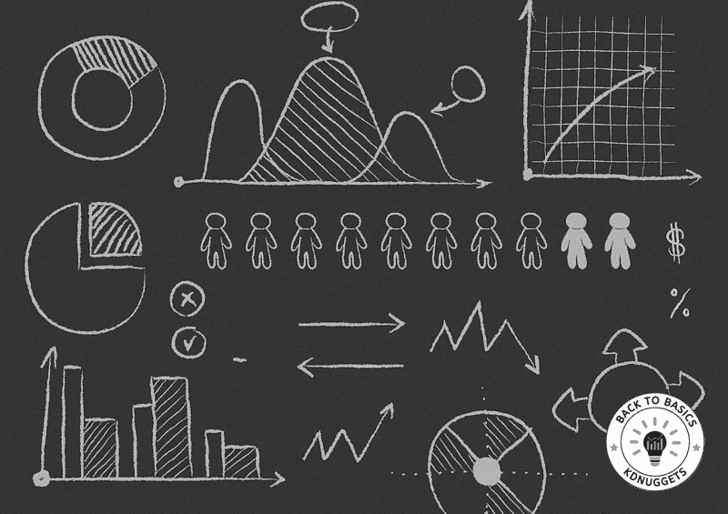
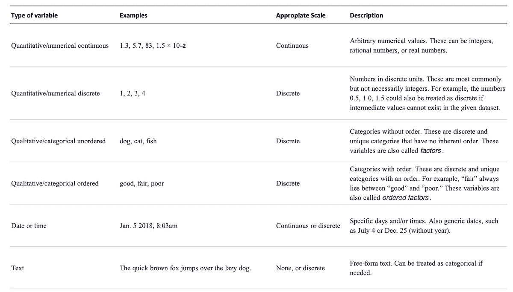
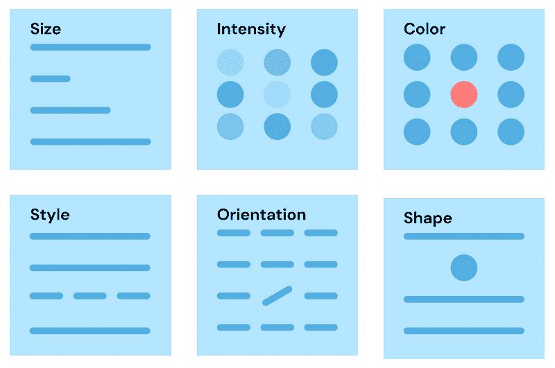
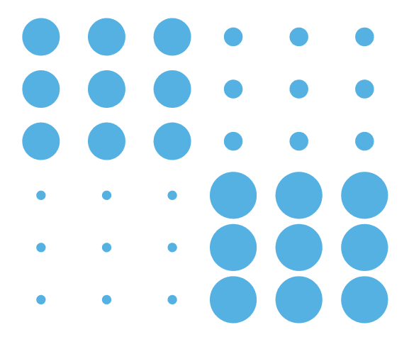
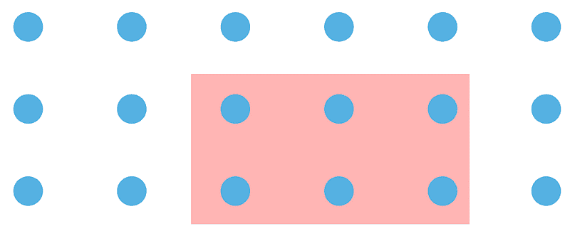
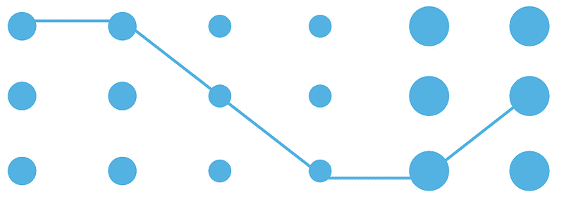

# 数据可视化：理论与技巧

> 原文：[`www.kdnuggets.com/data-visualization-theory-and-techniques`](https://www.kdnuggets.com/data-visualization-theory-and-techniques)

图片由 [freepik](https://www.freepik.com/author/freepik) 提供

在一个被大数据和复杂算法主导的数字世界中，人们会认为普通人迷失在海量的数字和数据中。

* * *

## 我们的三大课程推荐

 1\. [Google 网络安全证书](https://www.kdnuggets.com/google-cybersecurity) - 快速进入网络安全职业生涯。

 2\. [Google 数据分析专业证书](https://www.kdnuggets.com/google-data-analytics) - 提升你的数据分析能力

 3\. [Google IT 支持专业证书](https://www.kdnuggets.com/google-itsupport) - 支持你的组织的 IT

* * *

*不是吗？*

然而，原始数据与可理解见解之间的桥梁就在于数据可视化的艺术。

它是指引我们的指南针，是指引我们的地图，也是解码我们每天遇到的大量数据的翻译器。

*但一个好的可视化背后的魔力是什么？*

*为什么一种可视化让人豁然开朗，而另一种则令人困惑？*

今天，我们将回到基础，尝试理解数据可视化的基本原理。

让我们一起探索吧！👇🏻

# 拆解数据可视化的基础

高效讲述故事是数据科学家掌握的最难技能之一。如果我们在字典中查找“数据可视化”这个词，我们会找到以下定义：

*“将信息以图像、图表或图示的形式呈现，或以这种方式表示信息的图像”*

这基本上意味着数据可视化旨在从数据集中构建一个故事，以易于理解、引人入胜且有影响力的形式展示见解。

数据可视化，或者说将数据以图表的形式展现，可能不像机器学习那样酷炫。

但这确实是数据科学家工作中的关键部分。

在当今数据驱动的世界中，数据可视化就像帮助我们清晰看见的眼镜。对于那些不擅长数字和算法语言的人，它提供了一种有效的方式来理解复杂的数据叙事。

任何图表通常由两个主要组件组成：

## 1\. 数据类型

我敢打赌你正在考虑数据作为数字，但数值只是我们可能遇到的几种数据类型中的两种。每当我们可视化数据时，我们总是需要考虑我们处理的数据类型。

除了连续和离散的数值外，数据还可以以离散类别、日期或时间以及文本的形式存在。

当数据是数字时，我们也称之为*定量*，而当数据是类别时，我们称之为*定性*。

因此，任何显示的数据总是可以描述为以下几类之一。

图片作者提供。分类摘自《数据可视化基础》，O’Reilly 出版社。

一旦我们清楚了数据的类型，我们需要理解如何将这些数据编码成最终的图表。

## 2\. 编码信息：视觉词汇

视觉编码是数据可视化的核心。它将抽象的数字转换为图形表示，这是我们都能流利使用的语言。

尽管有许多不同类型的数据可视化，乍一看，散点图、饼图和热图似乎没有太多共同之处，但所有这些可视化都可以用一种通用的语言来描述，这种语言捕捉了数据值如何转化为纸上的墨滴或屏幕上的彩色像素。

*但……你已经应该意识到……*

编码数字的方法有成千上万种！

有两个主要组别：

1.  **视网膜编码：** 从形状、大小、颜色和强度来看，这些都是我们眼睛瞬间捕捉到的元素。*它们是元素固有的。*

图片作者提供

1.  **空间编码：** 它们利用我们大脑皮层的空间意识来编码信息。这种编码可以通过在尺度中的位置、定义的顺序或使用相对大小来实现。

图片作者提供

使用之前解释的所有编码方法，我们可以在一张图表中使用它们，但这样读者很难快速掌握所有信息。图表中过度使用多种编码可能会让人困惑，因此每张图表中使用 1 到 2 种视网膜编码是最佳的。

记住，少即是多，所以总是尽量创建简约且易于理解的图表。

*想象一下调味—撒一点盐和胡椒可能会增强味道，但把整瓶盐都倒进去可能会破坏味道。*

*那么，现在……应该选择哪种编码呢？*

这，朋友们，取决于你想要编织的故事。

所以你可以更好地问……

# 什么有效，什么无效？

尽管我们手头的视觉工具广泛，但并非所有工具都适合每一场战斗。

思考哪种编码最适合哪种变量。

+   **连续数据变量**，如体重和身高，在共同尺度上的位置是最好的表现形式。

+   **离散的**，如性别或国籍，在通过颜色或空间区域表现时最为出色。

有一些原因解释了某些图表的直观性。背后有两个主要理论。

## 1\. 格式塔理论

从事技术工作的人有时会忽视事物的人性化方面。格式塔原理是心理学中的规则，解释了我们的大脑如何识别模式**。**

这些规则中的一些帮助我们理解为什么我们将相似的事物归为一组或注意到突出的事物。

1.  **相似性：** 格式塔相似性意味着我们的脑袋会将看起来相似的事物归为一组。这可能是由于它们的位置、形状、颜色或大小。*这在热图或散点图中被广泛使用。*

图片由作者提供

1.  **封闭性：** 边框内的物体，如线条或共享颜色，看起来像是属于同一组。这使它们从我们看到的其他事物中突出。*我们常常在表格和图表中使用边框或颜色来分组数据。*

图片由作者提供

1.  **连续性：** 当个体元素相连时，我们的眼睛会认为它们属于同一组。即使它们看起来不同，线条也会让我们将它们视为一组。*这在折线图中被广泛使用。*

图片由作者提供

1.  **邻近性：** 如果事物彼此靠近，我们会认为它们在同一组中。为了显示事物属于同一组，将它们放在一起。使用少量空间可以帮助分隔不同的组。*这在散点图或节点链接图中很常见。*

图片由作者提供

*因此，格式塔原理及其相互作用在制作可视化时非常重要。*

## 2\. **墨水比例原理**

在许多不同的可视化场景中，我们通过图形元素的范围来表示数据值。

通常，**墨水**一词用来指代视觉化中任何与背景色不同的部分。*这包括线条、条形图、点、共享区域和文本。*

例如，在条形图中，我们绘制的条形从 0 开始，到表示的数据值结束。在这种情况下，数据值不仅通过条形的终点进行编码，还通过条形的高度或长度进行编码。

如果我们绘制一个从非零值开始的条形图，那么条形图的长度和条形图的终点将传达矛盾的信息。

图片由作者提供

在所有这些情况下，我们需要确保没有不一致。这一概念被[Bergstrom 和 West](https://learning.oreilly.com/library/view/fundamentals-of-data/9781492031079/afterword03.html#bergstrom)称为*墨水比例原理*。

“当使用阴影区域来表示数值时，该阴影区域的面积应与相应的数值成正比。”

*当试图操控数据时，违反这一原则的情况相当普遍，尤其是在大众媒体和金融领域。*

每当我们使用图形元素，如矩形、任意形状的阴影区域或任何具有定义视觉范围的元素时，都可能出现类似的问题，这些元素的视觉范围可能与所显示的数据值一致或不一致。

# 好的可视化的本质

在美学与功能性之间找到平衡至关重要。严格遵守如 Bergstrom 的比例墨水原则，但不能以牺牲可读性为代价。

尽管某些编码方式可能看起来效果较差，但它们可以被故意选择以表达某种声明或唤起某种情感。

在数据流量不断增加的时代，打造有意义的视觉叙事的重要性不容低估，特别是在向非数据专业人士传达我们的洞察时。

优秀的数据可视化不仅仅是展示数字，而是围绕故事来表达我们的数据。让数据在讲述故事的过程中变得生动，同时在原始信息和现实世界的影响及洞察之间建立联系。

作为技术专家和数据爱好者，这不仅是我们的艺术、语言，也是我们与整个世界的桥梁。

**[Josep Ferrer](https://www.linkedin.com/in/josep-ferrer-sanchez)** 是一位来自巴塞罗那的分析工程师。他毕业于物理工程专业，目前在应用于人类流动性的 数据科学领域工作。他还是一名兼职内容创作者，专注于数据科学和技术。你可以通过 [LinkedIn](https://www.linkedin.com/in/josep-ferrer-sanchez/)、[Twitter](https://twitter.com/rfeers) 或 [Medium](https://medium.com/@rfeers) 联系他。

### 更多相关话题

+   [数据科学中的统计学：理论与概述](https://www.kdnuggets.com/statistics-in-data-science-theory-and-overview)

+   [理解监督学习：理论与概述](https://www.kdnuggets.com/understanding-supervised-learning-theory-and-overview)

+   [机器学习评估指标：理论与概述](https://www.kdnuggets.com/machine-learning-evaluation-metrics-theory-and-overview)

+   [从理论到实践：构建 k-近邻分类器](https://www.kdnuggets.com/2023/06/theory-practice-building-knearest-neighbors-classifier.html)

+   [如何利用图论来侦察足球](https://www.kdnuggets.com/2022/11/graph-theory-scout-soccer.html)

+   [2022 年及以后顶尖 AI 和数据科学工具与技术](https://www.kdnuggets.com/2022/03/nvidia-0317-top-ai-data-science-tools-techniques-2022-beyond.html)
