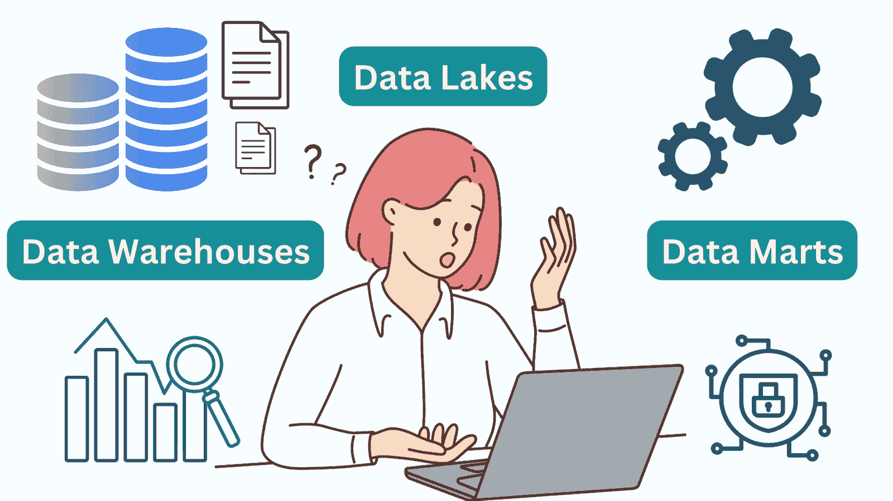
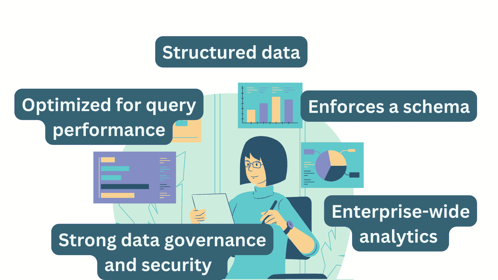
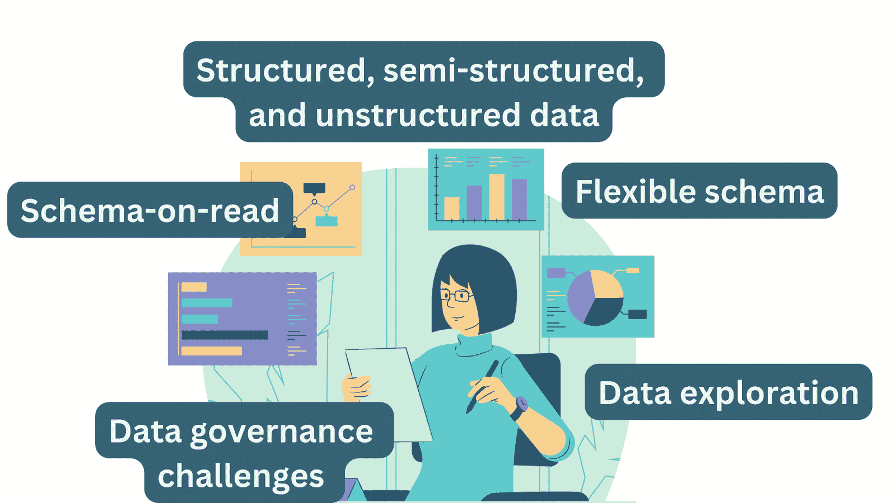
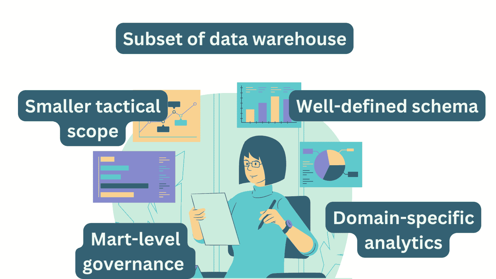

# 数据仓库与数据湖与数据集市：需要帮助决定吗？

> 原文：[`www.kdnuggets.com/data-warehouses-vs-data-lakes-vs-data-marts-need-help-deciding`](https://www.kdnuggets.com/data-warehouses-vs-data-lakes-vs-data-marts-need-help-deciding)

图片来源：作者

为了充分利用数据，组织需要高效且可扩展的解决方案，这些解决方案能够有效地存储、处理和分析数据。从从多个来源获取数据、通过转换和服务，**数据存储**支撑着数据架构。

* * *

## 我们的前三大课程推荐

 1\. [谷歌网络安全证书](https://www.kdnuggets.com/google-cybersecurity) - 快速进入网络安全职业的快车道。

 2\. [谷歌数据分析专业证书](https://www.kdnuggets.com/google-data-analytics) - 提升你的数据分析能力

 3\. [谷歌 IT 支持专业证书](https://www.kdnuggets.com/google-itsupport) - 支持你在 IT 方面的组织

* * *

因此，在选择合适的数据存储解决方案时，需要考虑如何访问数据以及具体的使用场景。本文将探讨三种流行的数据存储抽象：数据仓库、数据湖和数据集市。

我们将介绍基础知识，并比较这些数据存储抽象在访问模式、模式、数据治理、用例等特征上的差异。

让我们开始吧！

# 数据仓库

数据仓库是现代数据管理系统的基础组件，旨在促进结构化数据的高效存储、组织和检索，以用于分析目的。

图片来源：作者

## 什么是数据仓库？

数据仓库是一个专门的数据库，集中、存储和管理来自不同来源的结构化和处理过的数据，主要目的是支持复杂的分析和报告。

因此，数据仓库是**一个用于结构化数据的集中式存储库**，允许组织：

+   执行复杂的数据分析

+   生成报告和仪表盘

+   支持商业智能（BI）和决策过程

+   深入了解历史和当前的数据趋势

## 数据类型、访问模式和好处

数据仓库主要存储**结构化数据**，这些数据被组织成明确的表格，包含行和列。这种结构化的格式简化了数据检索和分析，使其适用于报告和查询。

数据仓库**针对查询性能和报告进行优化**。它们通常使用索引和缓存机制来加速数据检索，确保分析师和业务用户可以迅速获取所需信息。

## 数据集成

数据仓库集中整合来自各种源系统的数据。这包括从源系统中提取数据，将其转换为一致的格式，然后加载到仓库中。

**ETL 过程**通常用于数据仓库中的数据集成。这些流程从源系统中提取数据，对数据进行清理和结构化转换，然后将其加载到仓库的数据库表中。ETL 过程确保数据仓库中的数据质量和一致性。

## 模式

数据仓库**执行模式**以确保数据一致性。模式定义了数据的结构，包括表、列、数据类型和关系。这种强制执行的模式确保数据保持一致，并且可以依赖于分析。

数据仓库通常使用星型或雪花型模式来组织数据。在一个[星型模式](https://en.wikipedia.org/wiki/Star_schema)中，一个中央事实表包含事务数据，周围是提供背景和属性的维度表。在一个[雪花型模式](https://en.wikipedia.org/wiki/Snowflake_schema)中，维度表经过规范化以减少冗余。选择这些模式取决于具体的数据仓库需求。

## 数据治理和安全

数据仓库以其强大的治理和安全控制而著称。它们设计用于结构化数据，并提供数据验证、数据质量检查、访问控制和审计功能等特性。

## 使用案例和业务单位

数据仓库主要用于**企业范围的分析和报告**。它们将来自不同来源的数据整合到一个单一的存储库中，使整个组织可以进行分析和报告。它们支持标准化报告和临时查询，供决策者使用。

# 数据湖

数据湖代表了一种灵活且可扩展的数据存储和管理方法，满足现代组织的多样化需求。

作者提供的图片

## 什么是数据湖？

数据湖是一个集中式存储库，存储大量**原始、结构化、半结构化和非结构化的数据**，允许组织在没有预定义模式限制的情况下存储和管理大量信息。

数据湖的主要目的是提供一个灵活且具有成本效益的解决方案，用于存储和管理多样化的数据类型：

+   数据湖保留数据的原始和本地形式。

+   数据湖支持广泛的使用案例，从传统的分析到高级机器学习和 AI 应用。

+   用户可以在不预定义数据结构或模式的情况下探索和分析数据。

数据湖旨在应对组织今天所面临的日益增长的数据量、速度和种类带来的挑战。

## 数据类型、访问模式和优势

数据湖能够存储多种数据类型，包括来自关系数据库的结构化数据、如 JSON、XML 的半结构化数据以及文本文件、图像和视频等非结构化数据。这使得数据湖适合处理原始和本地形式的数据。

## 数据集成

将数据摄取到数据湖中可以通过批处理或实时数据摄取来完成。批处理过程涉及定期加载大量数据，而实时摄取则允许从各种来源持续流入数据。这种灵活性确保数据湖能够处理不同的数据流速需求。

数据湖采用**读取时模式**。与数据仓库不同，数据湖中的数据没有预定义模式。相反，模式在分析时定义，允许用户根据具体需求解读和结构化数据。这种模式灵活性是数据湖的一个标志性特征。

## 模式

数据湖提供**模式灵活性**，允许在没有预定义模式的情况下摄取数据。这种灵活性适应了数据结构随时间变化的需求，使用户能够根据分析需要定义模式。

数据湖中的数据在分析时被赋予结构和意义。这种方法意味着用户可以根据他们的分析需求解读和结构化数据。

## 数据治理和安全

数据湖经常面临治理挑战，因为它们以原始形式存储结构化和非结构化数据。管理元数据、强制数据质量和维护统一的数据目录可能很困难，这可能导致数据发现和合规性问题。

## 用例和业务单元

数据湖非常适合数据探索和实验。它们可以存储大量原始的非结构化数据，使数据专业人员能够在没有预定义模式的情况下进行探索和实验。

# 数据集市

数据集市是企业数据仓库的子集，专门服务于组织内的特定业务单元或职能。

作者提供的图片

## 什么是数据集市？

数据集市是**数据仓库或数据湖的专门子集**，用于存储**量身定制的针对特定业务单元、部门或职能区域**的结构化数据。

数据集市的主要目的是为特定的分析和报告需求提供集中的高效数据访问。关键目标包括：

+   **支持特定业务单元**：数据集市旨在满足个别业务单元的需求，例如销售、营销、财务或运营。

+   **简化数据访问**：通过提供更容易访问相关数据的数据集市，使得特定领域的用户更容易获取和分析他们所需的信息。

+   **更快的洞察时间**：数据集市通过减少需要处理的数据量来提高查询和报告性能。

因此，数据集市在确保组织内各部分的决策者能够随时获得相关数据方面发挥了重要作用。

## 数据类型、访问模式和优点

数据集市主要存储与其服务的特定业务单元或职能相关的结构化数据。这种结构化格式确保了数据的一致性，并符合领域的分析需求。

数据集市提供了比企业数据仓库或数据湖更为专注和便捷的数据访问。这种专注的方法使用户能够快速访问和分析与其领域直接*相关*的数据。

## 数据整合

数据集市通常从中央存储库（如数据仓库）中提取数据。这个提取过程涉及识别和选择与特定业务单元或职能相关的数据。

一旦提取，数据会根据数据集市的需求进行特定的转换。这可能包括数据清洗、聚合或定制，以确保数据与其服务的领域的分析要求一致。

## 架构

数据集市可能遵循中央数据仓库中定义的架构，或者采用为特定数据集市的分析需求量身定制的自定义架构。选择取决于数据一致性和数据集市的自主性等因素。

## 数据治理和安全

数据集市通常是数据仓库的子集，关注于特定业务领域或单元。治理工作集中在数据集市层面，确保特定业务单元使用的数据符合数据仓库设定的企业级治理标准。

## 用例和业务单元

数据集市根据组织内各业务单元或领域的具体需求量身定制。它们提供来自数据仓库的相关数据子集，针对特定业务领域。这使得业务单元能够进行专门的分析和报告，而无需处理整个企业数据集的复杂性。

# 数据仓库与数据湖与数据集市的全面比较

总结数据仓库、数据湖和数据集市之间的主要区别：

| **特性** | **数据仓库** | **数据湖** | **数据集市** |
| --- | --- | --- | --- |
| **数据类型和灵活性** | 结构化数据，固定架构 | 各种数据类型，架构灵活性 | 结构化数据，明确定义的架构 |
| **数据集成** | ETL 管道 | 灵活的数据摄取、按需模式 | 针对领域的提取和转换 |
| **查询性能** | 针对查询进行优化 | 性能有所不同 | 最佳性能 |
| **数据治理** | 强大的数据治理和安全控制 | 数据治理挑战 | 数据集市级别的治理 |
| **使用场景** | 企业分析 | 大规模数据探索 | 领域特定分析 |

# 结论

我希望你对数据仓库、数据湖和数据集市有了一个概述。架构的选择取决于组织的具体需求以及其数据和业务需求所需的治理与灵活性之间的平衡：

+   数据仓库——具备强大的治理和安全控制——适用于企业范围的分析和报告。

+   数据湖适用于数据探索和大数据分析，但可能会带来治理和安全方面的挑战。

+   数据集市提供与业务部门需求对齐的领域特定分析，同时符合数据仓库的治理标准。

你还可以探索 [数据湖仓](https://www.databricks.com/glossary/data-lakehouse)，这是一种相对较新且不断发展的架构。数据湖仓旨在弥合数据仓库和数据湖之间的差距，提供统一的数据存储和分析方法。

****[Bala Priya C](https://www.kdnuggets.com/wp-content/uploads/bala-priya-author-image-update-230821.jpg)** 是一位来自印度的开发者和技术作家。她喜欢在数学、编程、数据科学和内容创作的交汇处工作。她的兴趣和专长领域包括 DevOps、数据科学和自然语言处理。她喜欢阅读、写作、编码和喝咖啡！目前，她正在通过编写教程、使用指南、观点文章等，与开发者社区分享她的知识。Bala 还创建了引人入胜的资源概述和编码教程。**

### 更多相关信息

+   [为什么组织需要数据仓库](https://www.kdnuggets.com/2022/09/organizations-need-data-warehouses.html)

+   [数据湖与 SQL：数据天堂中的绝配](https://www.kdnuggets.com/2023/01/data-lakes-sql-match-made-data-heaven.html)

+   [我们不需要数据科学家，我们需要数据工程师](https://www.kdnuggets.com/2021/02/dont-need-data-scientists-need-data-engineers.html)

+   [大多数公司在数据访问方面严重不足，71%的人认为……](https://www.kdnuggets.com/2023/07/mostly-data-access-severely-lacking-synthetic-data-help.html)

+   [数据科学项目可以帮助你解决实际问题](https://www.kdnuggets.com/2022/11/data-science-projects-help-solve-real-world-problems.html)

+   [使用 ChatGPT 帮助获得数据科学职位](https://www.kdnuggets.com/using-chatgpt-to-help-land-a-data-science-job)
