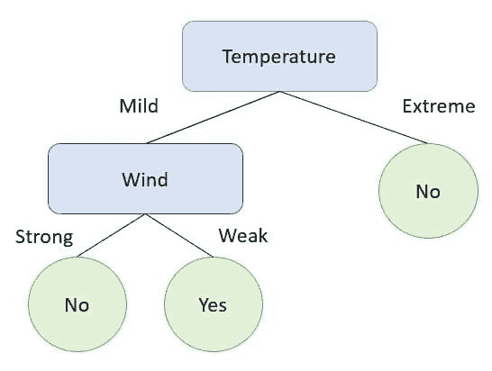
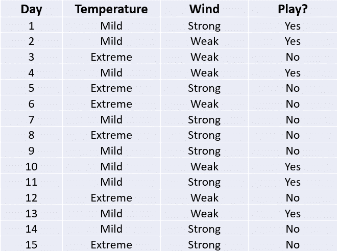
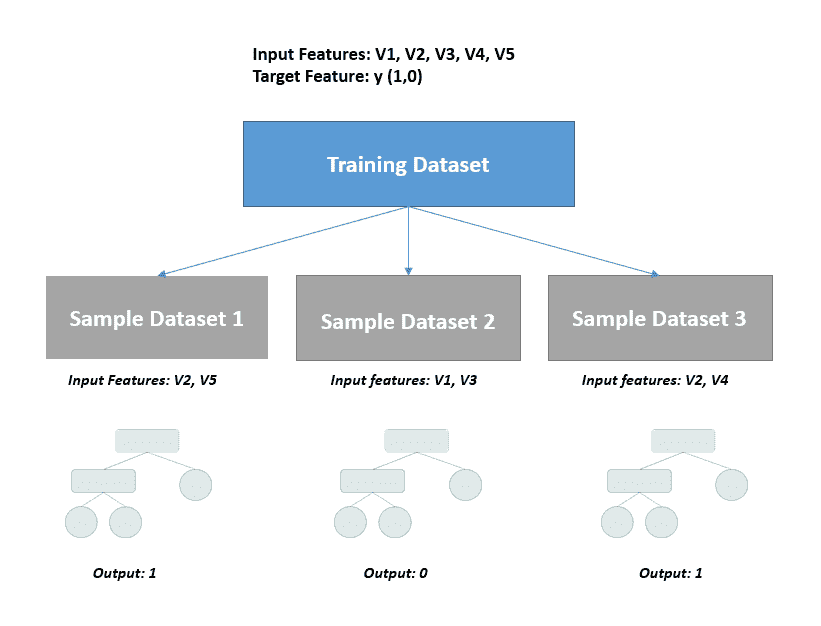
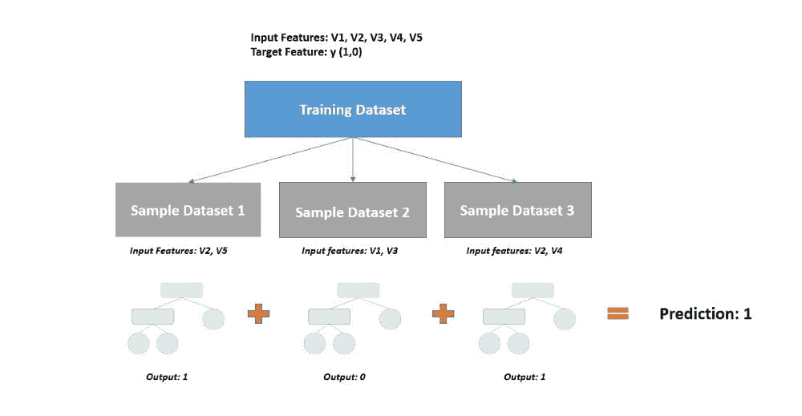

# 决策树与随机森林的解释

> 原文：[`www.kdnuggets.com/2022/08/decision-trees-random-forests-explained.html`](https://www.kdnuggets.com/2022/08/decision-trees-random-forests-explained.html)

# 介绍

* * *

## 我们的前三个课程推荐

 1\. [谷歌网络安全证书](https://www.kdnuggets.com/google-cybersecurity) - 快速进入网络安全职业。

 2\. [谷歌数据分析专业证书](https://www.kdnuggets.com/google-data-analytics) - 提升你的数据分析技能

 3\. [谷歌 IT 支持专业证书](https://www.kdnuggets.com/google-itsupport) - 支持你的组织进行 IT 支持

* * *

决策树和随机森林是两种最受欢迎的监督学习预测模型。这些模型可用于分类和回归问题。

在这篇文章中，我将解释决策树和随机森林之间的区别。到文章结束时，你应该熟悉以下概念：

+   决策树算法是如何工作的？

+   决策树的组成部分

+   决策树算法的优缺点是什么？

+   什么是袋装（bagging），随机森林算法是如何工作的？

+   哪种算法在速度和性能方面更好？

# 决策树

决策树是高度可解释的机器学习模型，允许我们对数据进行分层或分段。它们允许我们根据特定参数不断拆分数据，直到做出最终决策。

## 决策树算法是如何工作的？

看一下下面的表格：

这个数据集仅包含四个变量——“Day”、“Temperature”、“Wind”和“Play？”。根据任意一天的温度和风速，结果是二元的——要么出去玩，要么待在家里。

让我们使用这些数据来构建一个决策树：

上面的示例虽然简单，但准确地概括了决策树如何在不同的数据点上拆分，直到获得结果。

从上面的可视化中可以看出，决策树首先在“Temperature”变量上进行拆分。当温度极端时，它也会停止拆分，并表示我们不应该出去玩。

只有当温度适中时，它才会开始对第二个变量进行拆分。

这些观察结果引出了以下问题：

1.  决策树如何决定第一个要拆分的变量？

1.  如何决定何时停止拆分？

1.  构建决策树时使用的顺序是什么？

### 熵

熵是一个衡量决策树中分裂不纯度的指标。它决定了决策树如何选择划分数据。熵值范围从 0 到 1。0 的值表示纯净的分裂，1 的值表示不纯的分裂。

在上面的决策树中，回顾一下树在温度极端时已经停止分裂：

这是因为当温度极端时，“是否玩？”的结果总是“否”。这意味着我们有一个纯净的分裂，100%的数据点属于一个单一类别。这个分裂的熵值为 0，决策树将在这个节点停止分裂。

决策树总是选择**最低熵**的特征作为第一个节点。

在这种情况下，由于“温度”变量的熵值低于“风速”，因此这是树的第一个分裂。

观看[这个](https://www.youtube.com/watch?v=1IQOtJ4NI_0)YouTube 视频，了解更多关于如何计算熵及其在决策树中使用的内容。

### 信息增益

信息增益测量构建决策树时熵的减少量。

决策树可以通过多种不同的方式构建。树需要首先找到一个特征进行分裂，然后是第二个、第三个等。信息增益是一个指标，它告诉我们构建能够最小化熵的最佳决策树。

最佳的树是信息增益最高的树。

如果你想了解更多关于如何计算信息增益并利用它来构建最佳决策树的内容，你可以观看[这个](https://www.youtube.com/watch?v=FuTRucXB9rA)YouTube 视频。

## 决策树的组成部分：

1.  根节点：根节点位于决策树的顶部，是数据集开始划分的变量。根节点是为我们提供最佳数据分裂的特征。

1.  内部节点：这些是根节点之后分裂数据的节点。

1.  叶节点：这些是决策树底部的节点，之后没有进一步的分裂可能。

1.  分支：分支连接一个节点到另一个节点，并用于表示测试的结果。

## 决策树算法的优缺点：

现在你了解了决策树的工作原理，让我们来看看该算法的一些优缺点。

### 优点

+   决策树简单且易于解释。

+   它们可以用于分类和回归问题。

+   它们可以对非线性可分的数据进行划分。

### 缺点

+   决策树容易出现过拟合。

+   即使训练数据集的一个小变化也会对决策树的逻辑产生巨大影响。

# 随机森林

决策树算法的一个最大缺点是容易过拟合。这意味着模型过于复杂，并且具有**高方差**。这样的模型会有很高的训练准确率，但对其他数据集的泛化能力较差。

## 随机森林算法如何工作？

随机森林算法通过结合多个决策树的预测结果并返回一个单一的输出，解决了上述挑战。这是通过扩展一种称为**bagging**或**自助聚合**的技术来实现的。

Bagging 是一种用于减少机器学习模型方差的过程。它通过对一组观察结果取平均来减少方差。

下面是 bagging 的工作原理：

### 自助法

如果我们有多个训练数据集，我们可以在每个数据集上训练多棵决策树，并对结果取平均。

然而，由于在大多数实际场景中我们通常只有一个训练数据集，因此使用了一种称为**自助法**的统计技术来对数据集进行有放回的抽样。

然后，创建多棵决策树，每棵树在不同的数据样本上进行训练：

请注意，以上的训练数据集创建了三个 bootstrap 样本。随机森林算法在 bagging 的基础上进一步随机抽取特征，因此每棵树只使用部分变量进行构建。

每棵决策树根据其训练的数据样本会产生不同的预测结果。

### 聚合

在这一步骤中，将结合每棵决策树的预测结果，得出一个单一的输出。

在分类问题中，会做出一个多数类预测：

在回归问题中，所有决策树的预测结果会被平均，得出一个单一值。

### 为什么在随机森林算法中我们要随机抽取变量？

在随机森林算法中，不仅行会被随机抽样，变量也会被随机抽样。

这是因为如果我们用相同的特征构建多棵决策树，每棵树都会相似并高度相关，可能会产生相同的结果。这会导致高方差的问题。

# 决策树与随机森林 - 哪个更好，为什么？

随机森林通常比决策树表现更好，原因如下：

+   随机森林解决了过拟合问题，因为它们将多个决策树的输出结合起来，以得出最终预测结果。

+   当你构建一棵决策树时，数据的微小变化会导致模型预测的巨大差异。使用随机森林，这个问题不会出现，因为数据在生成预测之前会被多次抽样。

然而，就速度而言，随机森林较慢，因为需要更多时间来构建多个决策树。将更多树添加到随机森林模型中会在一定程度上提高其准确性，但也会增加计算时间。

最后，决策树相比于随机森林更易于解释，因为它们结构简单。可以轻松地可视化决策树并理解算法如何得出结果。随机森林更难以拆解，因为它更加复杂，并结合了多个决策树的输出进行预测。

**[Natassha Selvaraj](https://www.natasshaselvaraj.com/)** 是一位自学成才的数据科学家，对写作充满热情。你可以通过[LinkedIn](https://www.linkedin.com/in/natassha-selvaraj-33430717a/)与她联系。

### 了解更多此主题

+   [集成学习技术：Python 中随机森林的操作指南](https://www.kdnuggets.com/ensemble-learning-techniques-a-walkthrough-with-random-forests-in-python)

+   [从零开始的机器学习：决策树](https://www.kdnuggets.com/2022/11/machine-learning-scratch-decision-trees.html)

+   [通用且可扩展的最优稀疏决策树(GOSDT)](https://www.kdnuggets.com/2023/02/generalized-scalable-optimal-sparse-decision-treesgosdt.html)

+   [揭开决策树在现实世界中的神秘面纱](https://www.kdnuggets.com/demystifying-decision-trees-for-the-real-world)

+   [随机森林与决策树：关键区别](https://www.kdnuggets.com/2022/02/random-forest-decision-tree-key-differences.html)

+   [决策树算法详解](https://www.kdnuggets.com/2020/01/decision-tree-algorithm-explained.html)
