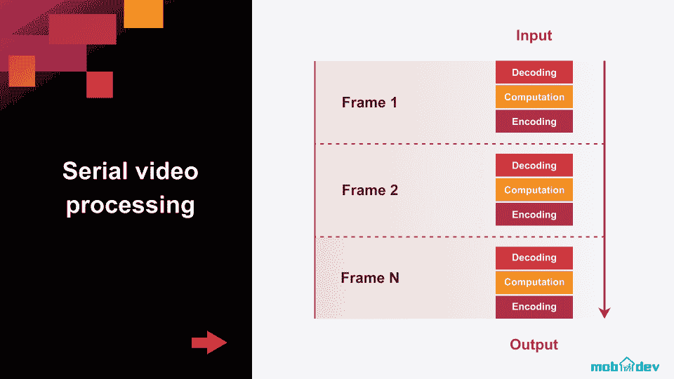
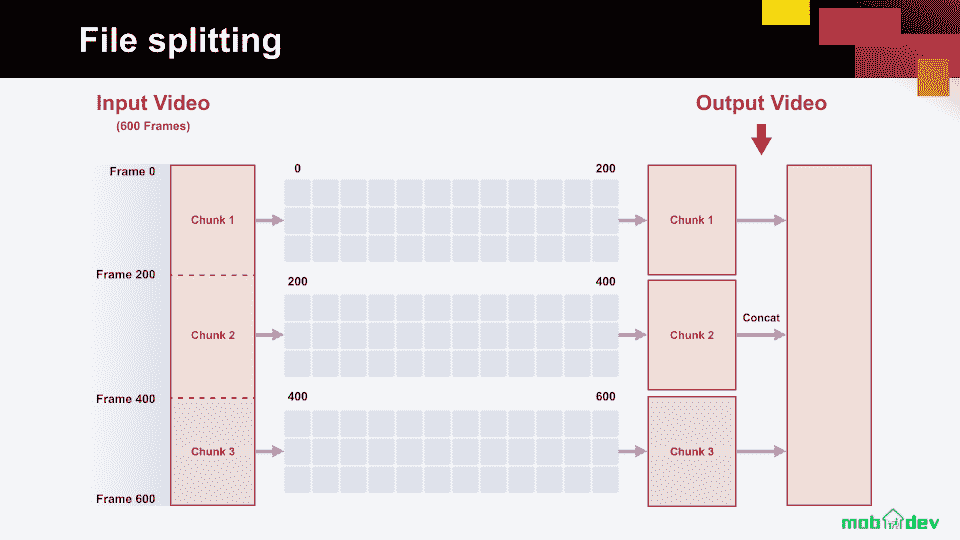
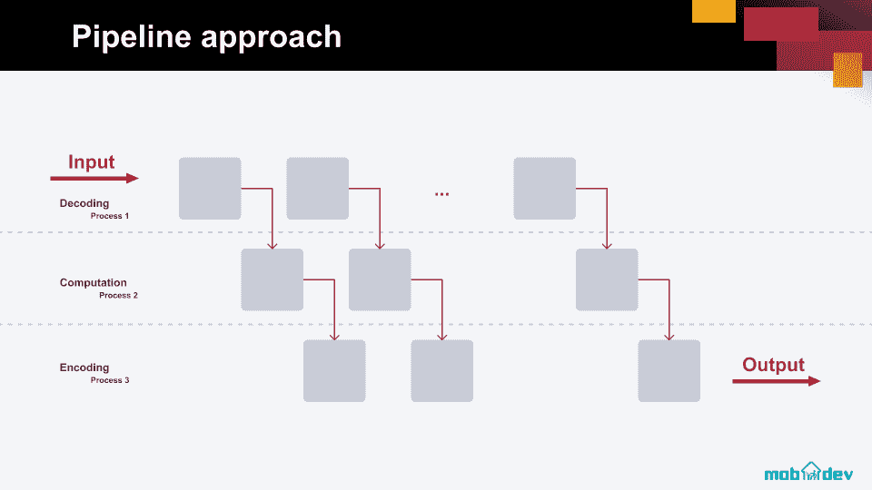
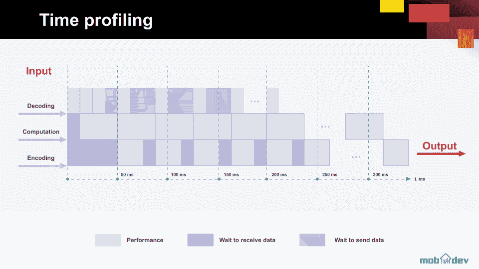
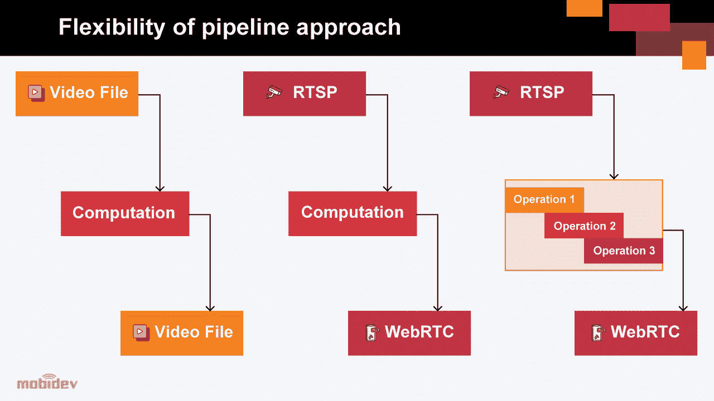
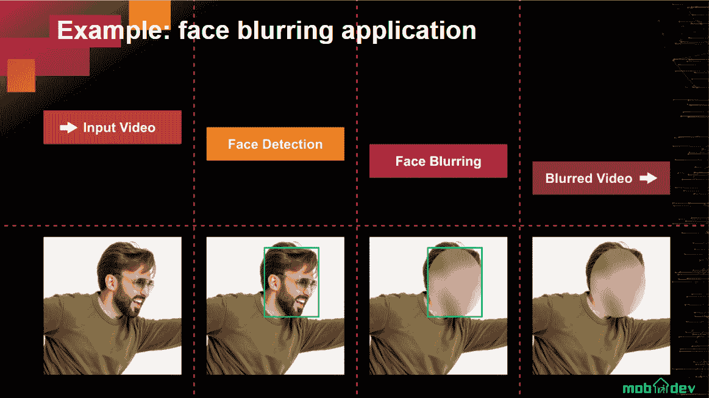
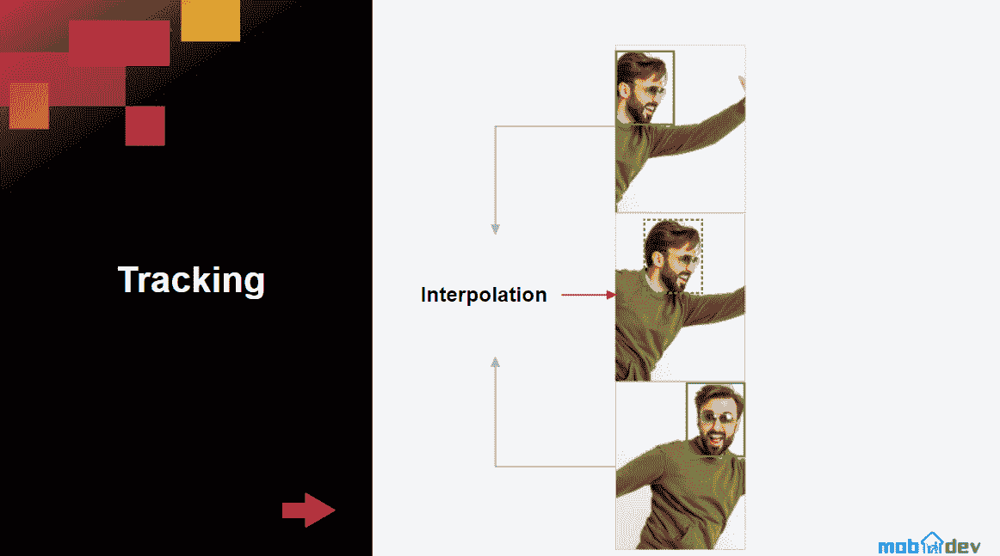

# 基于深度学习的实时视频处理

> 原文：[`www.kdnuggets.com/2021/02/deep-learning-based-real-time-video-processing.html`](https://www.kdnuggets.com/2021/02/deep-learning-based-real-time-video-processing.html)

评论

**作者 [Serhii Maksymenko](https://www.linkedin.com/in/sergey-maximenko/)，AI/ML 解决方案架构师，来自 [MobiDev](https://mobidev.biz/services/machine-learning-consulting)**

### **什么是串行视频处理**

视频数据是日常使用的常见资产，无论是个人博客中的直播流，还是制造建筑中的安全摄像头。机器学习应用正成为处理各种视频任务的常用工具。

* * *

## 我们的前三个课程推荐

 1\. [Google 网络安全证书](https://www.kdnuggets.com/google-cybersecurity) - 快速进入网络安全职业

 2\. [Google 数据分析专业证书](https://www.kdnuggets.com/google-data-analytics) - 提升你的数据分析技能

 3\. [Google IT 支持专业证书](https://www.kdnuggets.com/google-itsupport) - 支持你的组织 IT 需求

* * *

本文中讨论的视频处理方法是基于 MobiDev 团队开发的个人数据安全应用的背景下的。

简而言之，视频处理可以视为对每一帧进行的一系列操作。每帧包括解码、计算和编码过程。解码是将视频帧从压缩格式转换为原始格式。计算是对帧进行的某种操作。编码是将处理后的帧转换回压缩状态。这是一个串行过程。尽管这种方法看起来简单易行，但在大多数情况下并不实用。

来源 [`mobidev.biz/wp-content/uploads/2021/01/serial-video-processing.png`](https://mobidev.biz/wp-content/uploads/2021/01/serial-video-processing.png)

为了使上述方法可行，需要设定如速度、准确性和灵活性等测量标准。然而，在一个系统中兼顾所有这些可能是不可能的。通常，在这种情况下，速度和准确性之间存在权衡。如果我们选择不关注速度，那么我们会有一个很好的算法，但它会极其缓慢，结果也就毫无用处。如果我们过度简化算法，那么结果可能不会如预期那样好。因此，快速且准确的“白象”是不可能集成的。解决方案应在输入、输出和配置方面具有灵活性。

那么，如何在保持较高准确性的同时加快处理速度呢？有两种可能的解决方法。第一种是使算法并行运行，这样可能可以继续使用较慢但准确的模型。第二种是对算法本身或其部分进行加速，同时尽可能减少准确性的损失。

### **并行处理方法**

### **文件拆分**

第一个方法是显而易见的。视频被拆分成多个部分并进行并行处理。这是一种简单直接的方法。它可以借助视频时间指针来实现。在这种方法中，拆分是虚拟的，并不是实际生成子文件。然而，在输出中，我们依然会有多个视频文件，这些文件需要合并成一个。这使得这种方法在涉及任务时有些受限，尤其是在计算时使用相邻帧。为了处理这种情况，我们不得不在视频拆分时添加重叠，以确保在接缝处不会丢失信息。

来源 [`mobidev.biz/wp-content/uploads/2021/01/file-splitting-video-processing.png`](https://mobidev.biz/wp-content/uploads/2021/01/file-splitting-video-processing.png)

因此，例如处理来自网络摄像头的流是不可能的。文件拆分方法仅能处理视频文件。此外，这种方法可能难以暂停、恢复或甚至在时间轴上移动处理。尽管文件拆分方法简单，但它不符合灵活性的要求。

### **管道架构**

相比于拆分视频，管道方法旨在拆分并行化处理过程中执行的操作。通常视频管道的基本操作包括解码、计算和编码。至少这三项操作可以并发进行。

为什么管道方法更灵活？管道方法的一个好处是可以根据需求轻松操作组件。解码可以使用视频文件，并将帧编码到另一个文件中。这是一种常见的情况。

来源 [`mobidev.biz/wp-content/uploads/2021/01/pipeline-approach-video-processing.png`](https://mobidev.biz/wp-content/uploads/2021/01/pipeline-approach-video-processing.png)

另外，输入可以通过 IP 摄像头进行 RTSP 流传输。输出可以通过浏览器或移动应用程序中的 WebRTC 连接。所有输入和输出格式的组合都基于视频流的统一架构。

过程的计算部分不一定是原子操作。它可以逻辑上拆分成子操作，从而创建更多的管道阶段。然而，创建过多的组件并不总是合理的，因为多线程处理的延迟可能会削弱性能的提升。

基本上，管道在灵活性方面正是我们所需要的。这不仅仅是因为可以更改输入和输出格式，还因为我们可以随时暂停和继续处理。

### **优化管道组件**

### **时间分析**

来源 [`mobidev.biz/wp-content/uploads/2021/01/time-profiling-video-processing.png`](https://mobidev.biz/wp-content/uploads/2021/01/time-profiling-video-processing.png)

为了了解需要优化的部分，必须观察管道中每个阶段所需的时间。这样可以更容易找出瓶颈所在。最慢的管道阶段决定了输出的 FPS。尽管进行测量可能很乏味，但可以很容易地进行自动化。管道使用队列进行数据交换。因此，组件中会有一定的等待时间。通常，我们需要记录每个操作的耗时，每个操作等待从前一个组件获取数据的时间，以及每个操作等待其结果传递给下一个组件的时间。拥有这些信息可以大大简化性能分析。

### **解码与编码**

解码和编码可以通过两种方式完成：软件和硬件。硬件加速得益于 NVIDIA 卡中的解码器和编码器以及 CUDA 核心。以下是可以用于实现解码和编码硬件加速的选项列表。

+   使用 CUDA 支持编译 OpenCV

+   编译支持 NVDEC/NVENC 编解码器的 FFmpeg

+   使用支持 NVDEC/NVENC 编解码器的 GStreamer

+   使用 NVIDIA 视频处理框架

### **解码与编码**

从源代码编译可能比较复杂，但如果你仔细遵循说明，它应该是直接的。这可以在隔离的环境中进行，例如 Docker 容器中，这样在其他机器或云实例上部署就容易了，你也不需要每次都重复编译过程。

使用 CUDA 编译 OpenCV 不仅可以优化解码，还可以优化管道中使用 OpenCV 执行的其他计算。然而，我认为它们需要用 C++ 编写，因为 Python 包装器对此没有良好的支持。但在你希望在 GPU 上同时执行解码和数值计算而不从 CPU 内存中复制数据的情况下，这将是值得的。

自定义安装 FFmpeg 和 GStreamer 可以使用内置的 NVIDIA 解码器和编码器。建议先使用 FFmpeg，因为从维护角度来看，这应该更容易。此外，许多库在底层使用 FFmpeg，因此替换它将自动提高这些库的性能。

Python 封装器提供了将帧直接解码为 GPU 上的 PyTorch 张量的可能性，从而可以在不额外从 CPU 到 GPU 的复制的情况下开始推断。

### **计算（CPU）**

+   使用混合精度技术

+   TensorRT

+   推断前调整大小

+   批量推断

客户的硬件列表中并不总是有 GPU。使用神经网络进行处理在 CPU 上很少见，但在某些限制下仍然可能。为了这个目的，不适合制作大型模型，但更轻量级的模型会有效。例如，在我们的工作中，我们能够在 CPU 上使用 SSD 对象检测模型获得 30 FPS。Tensorflow 和 PyTorch 的最新版本已针对在多个核心上运行某些操作进行了优化，并可以通过参数进行控制。因此，缺少 GPU 并不意味着任务不可能完成。例如，这可能是在资源有限的云计算环境中遇到的情况。

但当然，如果你想让一个好的模型以你期望的速度运行，GPU 是必不可少的。我们还应用了一些技术，以进一步加快 GPU 推断速度。在这些情况下，如果你的 GPU 支持 fp16，应用混合精度将非常简单，它是 PyTorch 和 TensorFlow 最新版本的一部分。它允许对某些层使用 fp16 精度，对其余层使用 fp32，从而保持网络的数值稳定性并保持准确性。一个替代且更高效的模型加速方法是 TensorRT 转换。这是一种更具挑战性的方法，但它可以使推断速度提高 5 倍。此外，还有其他明显的优化选项，如调整大小和批量推断。

来源 [`mobidev.biz/wp-content/uploads/2021/01/flexibility-of-pipeline-approach.png`](https://mobidev.biz/wp-content/uploads/2021/01/flexibility-of-pipeline-approach.png)

### **管道方法如何在应用中实现**

来源 [`mobidev.biz/wp-content/uploads/2021/01/face-blurring-video-processing.png`](https://mobidev.biz/wp-content/uploads/2021/01/face-blurring-video-processing.png)

系统的灵活性在这种情况下至关重要，因为我们旨在处理不仅是视频文件，还包括不同格式的视频直播。它在 30-60 的范围内显示了良好的 FPS，具体取决于所使用的配置。

此外，我们还应用了一些其他改进：带有跟踪的插值、进程之间共享内存，以及为管道组件添加多个工作线程。

### **带有跟踪的插值**

来源 [`mobidev.biz/wp-content/uploads/2021/01/interpolation-tracking-video-processing.png`](https://mobidev.biz/wp-content/uploads/2021/01/interpolation-tracking-video-processing.png)

你可能会想，我们真的需要对每一帧进行计算吗？不，实际上可以跳过某些间隔的帧，假设绑定框将通过跟踪算法进行插值。算法可以很简单。例如，通过质心之间的距离进行匹配。这将足以获得相当好的插值，从而实现更高的 FPS。

在跟踪阶段，使用更复杂的跟踪算法或相关跟踪器是至关重要的。但如果视频中面孔过多，它们确实会影响速度。例如，如果是拥挤的街道视频，我们不能承担过于复杂的跟踪算法。

由于我们跳过了一些帧，我们希望了解插值帧的质量。因此，我们计算了 F1 指标，并确保插值不会导致过多的假阳性和假阴性。大多数视频示例的 F1 值约为 0.95。

### **共享内存**

下一点是进程间的内存共享。一个应用可以不断通过队列发送数据，但这真的很慢。Python 中进程间内存共享的替代方法很棘手。以下是一些方法：

+   torch.multiprocessing

+   Linux/dev/shm

+   Python 3.8 中的 SharedMemory

PyTorch 的多进程版本能够通过队列传递张量句柄，以便另一个进程可以直接获取指向现有 GPU 内存的指针。然而，我们决定使用另一种方法：系统级别的共享内存。这种方法使用一个特殊文件夹作为 RAM 内存空间的链接。有一些库提供了用于使用此内存的 Python 接口。它极大地提高了进程间通信的速度。Python 3.8 的共享内存 API 是另一种可能的方法。

### **多个工作线程**

+   比较延迟

+   考虑 CUDA 流

+   更正帧的顺序

最后，我们需要为管道组件添加几个工作线程。这是一个值得考虑的好方法，但并不总是能正确工作。我们在面部检测阶段做了这件事。然而，同样的方法也可以应用于任何计算密集型操作，只要不需要有序的输入。关键在于，实际效果取决于内部执行的操作。在面部检测相对较快的情况下，添加更多检测工作线程后，FPS 反而降低了。管理一个额外进程所需的时间可能会大于从中获得的时间。然后，多个工作线程中使用的神经网络将以串行 CUDA 流计算张量，除非为每个网络创建一个单独的流，这可能会很棘手。

来源 [`mobidev.biz/wp-content/uploads/2021/01/pipeline-architecture-video-processing.png`](https://mobidev.biz/wp-content/uploads/2021/01/pipeline-architecture-video-processing.png)

另一个技术问题来自多个工作者，由于其并发性质，它们不能保证顺序与输入序列相同。因此，在重要的管道阶段（例如编码）中需要额外的努力来修正顺序。跳帧的情况实际上也会出现同样的问题。无论如何，经过特定配置，多个工作者也能带来改进。

**相关：**

+   OpenAI 发布两款神奇的 Transformer 模型，链接语言与计算机视觉

+   深度学习、自然语言处理与计算机视觉的顶级 Python 库

+   2020 年十大计算机视觉论文

### 更多相关主题

+   [边界框深度学习：视频注释的未来](https://www.kdnuggets.com/2022/07/bounding-box-deep-learning-future-video-annotation.html)

+   [文本到视频生成：逐步指南](https://www.kdnuggets.com/2023/08/text2video-generation-stepbystep-guide.html)

+   [自然语言处理关键术语解析](https://www.kdnuggets.com/2017/02/natural-language-processing-key-terms-explained.html)

+   [自然语言处理任务的数据表示](https://www.kdnuggets.com/2018/11/data-representation-natural-language-processing.html)

+   [Python 字符串处理速查表](https://www.kdnuggets.com/2020/01/python-string-processing-primer.html)

+   [图像识别与自然语言处理的迁移学习](https://www.kdnuggets.com/2022/01/transfer-learning-image-recognition-natural-language-processing.html)
