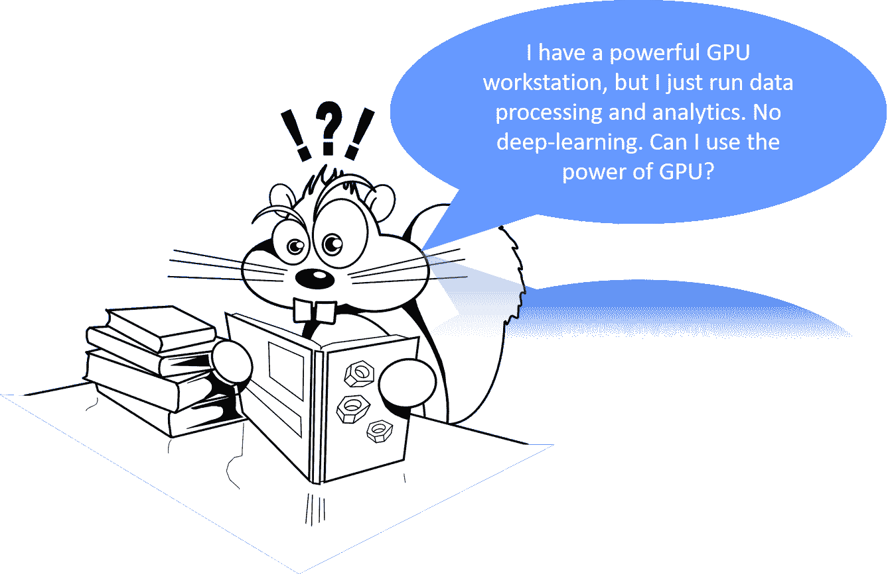
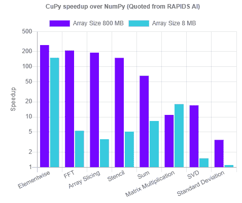
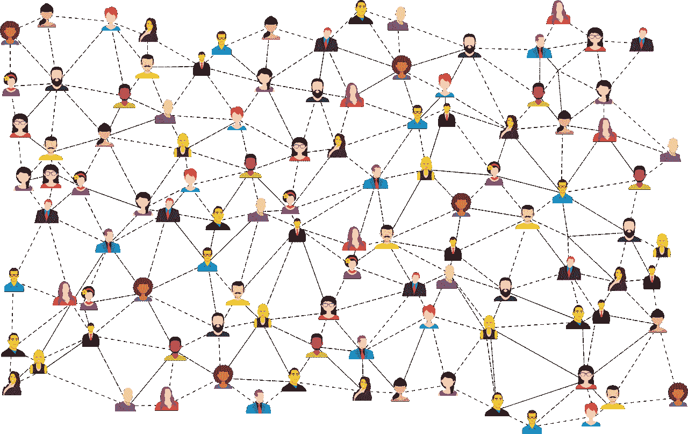
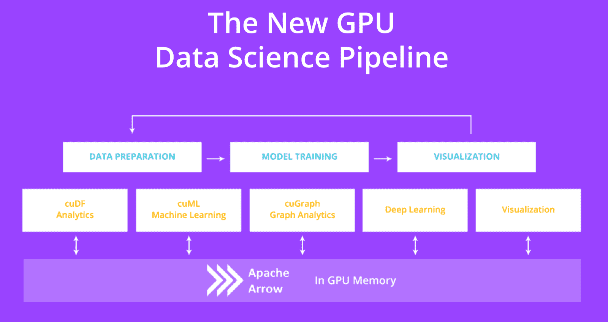
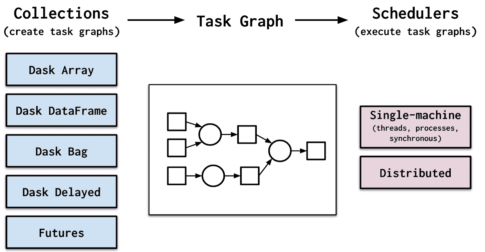
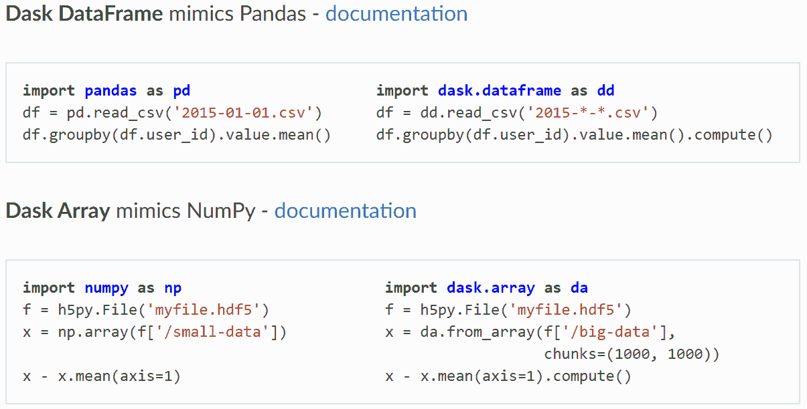
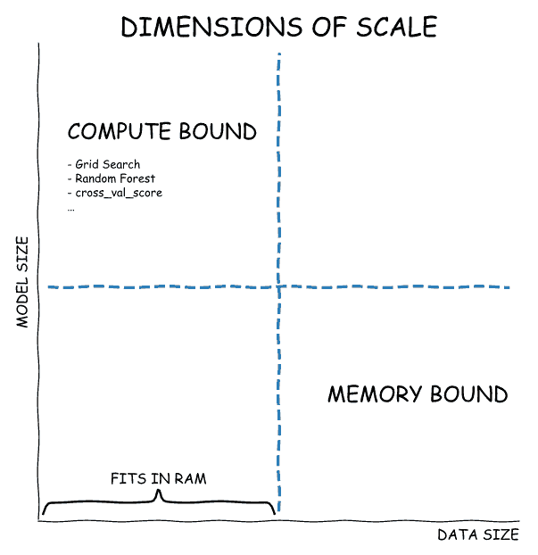

# 不仅仅是深度学习：GPU 如何加速数据科学与数据分析

> 原文：[`www.kdnuggets.com/2021/07/deep-learning-gpu-accelerate-data-science-data-analytics.html`](https://www.kdnuggets.com/2021/07/deep-learning-gpu-accelerate-data-science-data-analytics.html)

comments

### GPU 如何加速数据科学与数据分析

* * *

## 我们的三大课程推荐

 1\. [Google 网络安全证书](https://www.kdnuggets.com/google-cybersecurity) - 快速进入网络安全职业生涯。

 2\. [Google 数据分析专业证书](https://www.kdnuggets.com/google-data-analytics) - 提升您的数据分析技能

 3\. [Google IT 支持专业证书](https://www.kdnuggets.com/google-itsupport) - 支持您的组织的 IT 工作

* * *

[人工智能 (AI)](https://www.exxactcorp.com/Deep-Learning-AI-Workstations) 将彻底改变全球生产力、工作模式和生活方式，并创造巨额财富。研究公司 Gartner 预计全球 AI 经济将从去年的约 1.2 万亿美元增长到 2022 年的约 [$3.9 万亿美元](https://www.forbes.com/sites/alexknapp/2018/04/25/gartner-estimates-ai-business-value-to-reach-nearly-4-trillion-by-2022/#3eb979af33f9)，而麦肯锡则预测到 2030 年全球经济活动将达到约 [$13 万亿美元](https://www.mckinsey.com/featured-insights/artificial-intelligence/notes-from-the-ai-frontier-modeling-the-impact-of-ai-on-the-world-economy)。在许多方面，这种转型的核心是由强大的机器学习 (ML) 工具和技术推动的。

现代 AI/ML 系统的成功已经明确依赖于其**利用任务优化硬件以并行处理大量原始数据的能力**。因此，像图形处理单元 (GPU) 这样的专用硬件在早期成功中发挥了重要作用。从那时起，已经非常重视构建高度优化的软件工具和定制的数学处理引擎（包括硬件和软件）来利用 GPU 和并行计算的能力与架构。

尽管在学术界和商业圈中，GPU 和分布式计算在核心 AI/ML 任务（例如运行 100 层深度神经网络进行图像分类或亿参数 BERT 语音合成模型）中的应用被广泛讨论，但它们在常规数据科学和数据工程任务中的实用性却较少被涉及。这些**数据相关任务是任何 AI 流水线中 ML 工作负载的基本前提**，通常占据了数据科学家甚至 ML 工程师的大部分时间和智力精力。

事实上，最近，著名的 AI 先锋 Andrew Ng 讨论了**从以模型为中心转向以数据为中心的 AI 工具开发方法**。这意味着在实际的 AI 工作负载在你的管道中执行之前，需要花费更多时间处理原始数据并进行预处理。

你可以在这里观看 Andrew 的采访：[`www.youtube.com/watch?v=06-AZXmwHjo`](https://www.youtube.com/watch?v=06-AZXmwHjo)

这引出了一个重要问题...

### ***我们能否将 GPU 和分布式计算的力量也用于常规数据处理任务***？

答案并不简单，需要一些特殊的考虑和知识共享。在本文中，我们将尝试展示一些可以用于此目的的工具和平台。

[***图片来源***](https://pixabay.com/)

### RAPIDS：利用 GPU 进行数据科学

[**RAPIDS**](https://www.nvidia.com/en-us/deep-learning-ai/software/rapids/) 开源软件库和 API 套件使你能够完全在 GPU 上执行端到端的数据科学和分析管道。NVIDIA 孵化了这个项目并构建了利用 CUDA 原语进行低级计算优化的工具。它特别专注于**通过广受数据科学家和分析专业人士喜爱的 Python 语言暴露 GPU 并行性和高带宽内存速度特性**。

**常见的数据准备和整理任务**在 RAPIDS 生态系统中受到高度重视，因为它们在典型的数据科学管道中占据了大量时间。一个熟悉的**类似数据框 API**已经开发出来，并内置了许多优化和稳健性。它还被定制以与各种 ML 算法集成，实现端到端管道加速，并且减少了序列化成本。

RAPIDS 还包括大量**对多节点、多 GPU 部署和分布式处理的内部支持**。它与其他库集成，使**内存不足**（即数据集大小超过单个计算机的 RAM）数据处理变得简单且易于数据科学家使用。

这里是 RAPIDS 生态系统中包含的最显著的库。

### CuPy

一个由 CUDA 支持的数组库，外观和感觉类似于 Numpy，这是所有数值计算和 Python ML 的基础。它使用包括 cuBLAS、cuDNN、cuRand、cuSolver、cuSPARSE、cuFFT 和 NCCL 在内的 CUDA 相关库，充分利用 GPU 架构，目标是提供 Python 下的 GPU 加速计算。

CuPy 的接口与 NumPy 非常相似，可以作为大多数用例的简单替代品。这里是 CuPy 和 NumPy 之间 API 兼容性的模块级详细列表。

**查看**[**CuPy 比较表**](https://docs.cupy.dev/en/stable/reference/comparison.html)。

相对于 NumPy 的加速可能会令人惊叹，具体取决于数据类型和使用情况。以下是 CuPy 和 NumPy 在两种不同数组大小以及各种常见数值操作（如 FFT、切片、求和和标准差、矩阵乘法、SVD）上的速度比较，这些操作被几乎所有机器学习算法广泛使用。

*CuPy 与 NumPy 的速度比较，[**图片来源**](https://cupy.dev/)*

### CuDF

基于 Apache Arrow 列式内存格式构建，cuDF 是一个 GPU DataFrame 库，用于加载、连接、聚合、过滤和其他数据操作。它提供了一个**类似 pandas 的 API**，几乎所有数据工程师和数据科学家都很熟悉，因此他们可以利用强大的 GPU 加速工作流程，而无需深入了解 CUDA 编程。

目前，cuDF 仅支持 Linux 系统，以及 Python 版本 3.7 及以上。其他要求包括，

+   CUDA 11.0+

+   NVIDIA 驱动程序 450.80.02+

+   Pascal 架构或更高（计算能力 >=6.0）

**有关这个强大库的更多信息，请查看**[**CuDF 的 API 文档**](https://docs.rapids.ai/api/cudf/stable/10min.html)。

最后，**数据科学家和分析师（即那些不一定在日常任务中使用**[**深度学习**](https://www.exxactcorp.com/Deep-Learning-Solutions)**的人）可以高兴地使用像以下这样的强大 AI 工作站**，以提升他们的生产力。

*来自 Exxact Corporation 的数据科学工作站，[**图片来源**](https://www.exxactcorp.com/NVIDIA-Data-Science-Workstations)*

### CuML

cuML 使数据科学家、分析师和研究人员能够在 GPU 上运行传统/经典的机器学习算法任务（主要是）表格数据集，而无需深入了解 CUDA 编程。大多数情况下，cuML 的 Python API 与流行的 Python 库 Scikit-learn 匹配，使过渡到 GPU 硬件既快捷又无痛。

**查看**[**CuML 的 GitHub 仓库**](https://github.com/rapidsai/cuml)**文档以了解更多信息**。

CuML 还与[**Dask**](https://docs.dask.org/en/latest/)集成，无论何时可能，提供**多 GPU 和多节点 GPU 支持**，以便为不断增加的利用分布式处理的算法集合提供支持。

### CuGraph

CuGraph 是一组 GPU 加速的图算法，处理在[GPU DataFrames](https://github.com/rapidsai/cudf)中找到的数据。cuGraph 的愿景是使图分析变得无处不在，以至于用户只需考虑分析，而不必考虑技术或框架。

熟悉 Python 的数据科学家将迅速掌握 cuGraph 如何与 cuDF 的 Pandas 类 API 集成。同样，熟悉 NetworkX 的用户将很快识别 cuGraph 提供的类似 NetworkX 的 API，目标是使现有代码能够以最小的努力迁移到 RAPIDS 中。

目前，它支持各种图分析算法，

+   中心性

+   社区

+   链接分析

+   链接预测

+   遍历

许多科学和业务分析任务涉及对大数据集进行广泛的图算法处理。像 cuGraph 这样的库**在工程师投资于 GPU 驱动的工作站时提供了更高的生产力保证**。

*利用 GPU 加速计算来增强社交图分析，[图片来源](https://pixabay.com/vectors/social-media-connections-networking-3846597/)*

### GPU 数据科学的整体流程

RAPIDS 设想了一个 GPU 驱动的数据科学任务流程的完整管道。请注意，**深度学习，传统上是 GPU 计算的主要关注点，只是该系统的一个子组件**。

*GPU 数据科学管道，[**图片来源**](https://github.com/rapidsai/cuml/blob/branch-21.06/img/rapids_arrow.png)*

### Dask：使用 Python 进行分布式分析

正如我们所观察到的，现代数据处理管道通常可以从大数据块的分布式处理中受益。**这与单个 GPU 中数千个核心提供的并行性略有不同**。这更多的是关于如何将普通的数据处理（这可能发生在数据集准备好进行 ML 算法之前很久）拆分成块，并在多个计算节点上处理。

这些计算节点可以是 GPU 核心，甚至可以是 CPU 的简单逻辑/虚拟核心。

从设计上看，**大多数流行的数据科学库如 Pandas、Numpy 和 Scikit-learn 难以充分利用真正的分布式处理**。Dask 试图通过将智能任务调度和大数据处理功能带入常规 Python 代码中来解决这个问题。自然，它由两个部分组成：

+   **动态任务调度**优化了计算。这类似于 Airflow、Luigi、Celery 或 Make，但针对交互式计算负载进行了优化。

+   **“大数据”集合**如并行数组、数据帧和扩展了常见接口的列表（如 NumPy、Pandas 或 Python 迭代器），用于大于内存或分布式环境。这些并行集合在上述动态任务调度器之上运行。

这是一个典型 Dask 任务流程的示意图。

*官方 Dask 流程文档，[**图片来源**](https://docs.dask.org/en/latest/)*

### 易于转换现有代码库

熟悉性是 Dask 设计的核心，因此典型的数据科学家可以**仅需将现有的 Pandas/Numpy 基础代码转换为 Dask 代码**，而学习曲线非常平缓。以下是来自官方文档的一些经典示例。

*Dask 文档中比较 Pandas 和 NumPy，[**图片来源**](https://docs.dask.org/en/latest/)*

### Dask-ML 解决可扩展性挑战

对于机器学习工程师来说，有不同种类的可扩展性挑战。下图说明了这些挑战。机器学习库 Dask-ML 为每种场景提供了解决方案。因此，可以根据独特的业务或研究需求，专注于模型中心的探索或数据中心的发展。

最重要的是，再次强调熟悉性在这里发挥作用，DASK-ML API 旨在模仿广受欢迎的 Scikit-learn API。

*Dask 文档中的 XGBRegressor，[**图片来源**](https://docs.dask.org/en/latest/)*

### Dask 在多核 CPU 系统中的好处

需要注意的是，Dask 的主要吸引力在于它作为一个高层次的高效任务调度器，可以与任何 Python 代码或数据结构一起工作。因此，它不依赖于 GPU 来通过分布式处理来提升现有的数据科学工作负载。

即便是多核 CPU 系统，只要代码编写时考虑到这一点，Dask 也能充分发挥作用。代码不需要进行重大更改。

你可以使用 Dask 在笔记本电脑的多个核心之间分配你的凸优化例程或超参数搜索。或者，你可以根据某些过滤条件，利用完整的多核并行处理不同部分的简单 DataFrame。这为所有数据科学家和分析师提供了提升生产力的可能性，他们无需购买昂贵的显卡，而只需投资于具有 16 或 24 个 CPU 核心的[工作站](https://www.exxactcorp.com/NVIDIA-Data-Science-Workstations)。

### GPU 驱动的分布式数据科学总结

在本文中，我们讨论了一些 Python 数据科学生态系统中的新进展，使得普通数据科学家、分析师、科学研究人员和学术人员可以使用 GPU 驱动的硬件系统来处理比图像分类和自然语言处理更广泛的数据相关任务。这无疑会扩大这些硬件系统对广大用户群体的吸引力，并进一步民主化数据科学用户基础。

我们还探讨了使用 Dask 库进行分布式分析的可能性，这可以利用多核 CPU 工作站。

希望这种强大硬件与现代软件栈的融合能够为高效的数据科学工作流开辟无尽的可能性。

[原文](https://www.exxactcorp.com/blog/Deep-Learning/using-gpus-for-data-science)。经许可转载。

**相关：**

+   如何使用 NVIDIA GPU 加速库

+   告别大数据，迎接海量数据！

+   抽象与数据科学：不太理想的组合

### 更多相关话题

+   [成为优秀数据科学家所需的 5 项关键技能](https://www.kdnuggets.com/2021/12/5-key-skills-needed-become-great-data-scientist.html)

+   [每个初学者数据科学家都应该掌握的 6 种预测模型](https://www.kdnuggets.com/2021/12/6-predictive-models-every-beginner-data-scientist-master.html)

+   [2021 年最佳 ETL 工具](https://www.kdnuggets.com/2021/12/mozart-best-etl-tools-2021.html)

+   [停止学习数据科学以寻找目标，并为目标而…](https://www.kdnuggets.com/2021/12/stop-learning-data-science-find-purpose.html)

+   [数据科学统计学习的最佳资源](https://www.kdnuggets.com/2021/12/springboard-top-resources-learn-data-science-statistics.html)

+   [建立一个稳固的数据团队](https://www.kdnuggets.com/2021/12/build-solid-data-team.html)
