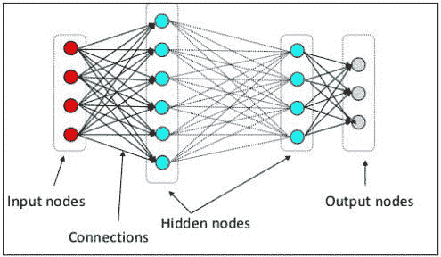
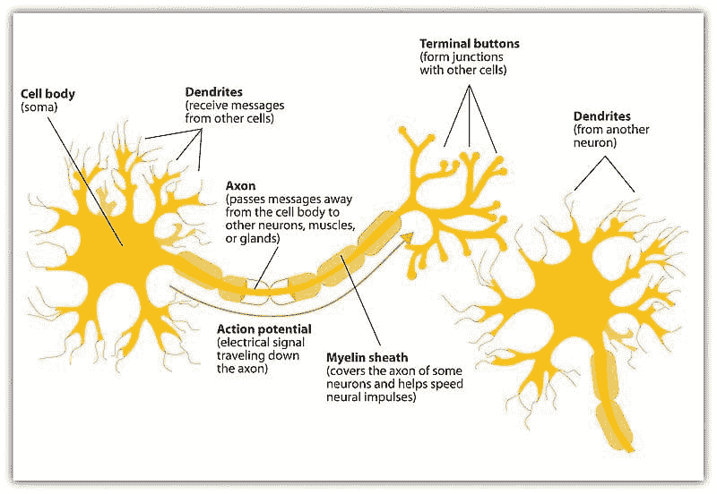
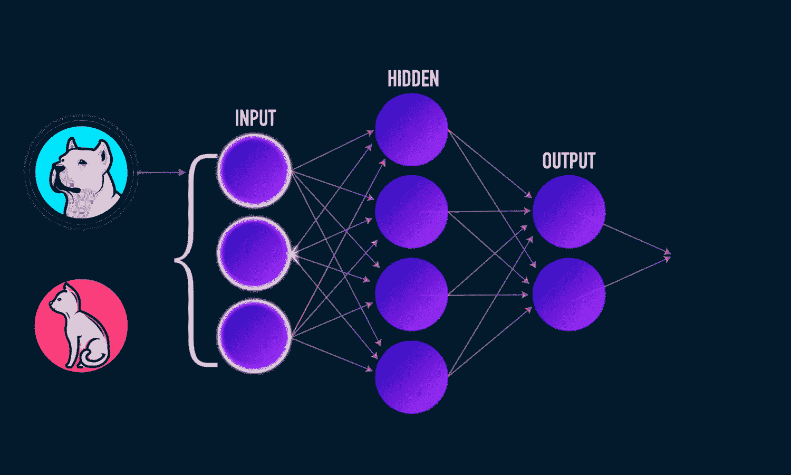

# 深度学习关键术语解释

> 原文：[`www.kdnuggets.com/2016/10/deep-learning-key-terms-explained.html`](https://www.kdnuggets.com/2016/10/deep-learning-key-terms-explained.html)

深度学习因其在多个领域取得了令人瞩目的成功而研究和产业上都在快速发展。深度学习是应用深度神经网络技术——即具有多个隐藏层的神经网络架构——来解决问题的过程。深度学习是一个过程，类似于数据挖掘，它使用深度神经网络架构，这些架构是特定类型的机器学习算法。

* * *

## 我们的前三大课程推荐

 1\. [谷歌网络安全证书](https://www.kdnuggets.com/google-cybersecurity) - 快速进入网络安全职业生涯。

 2\. [谷歌数据分析专业证书](https://www.kdnuggets.com/google-data-analytics) - 提升你的数据分析技能

 3\. [谷歌 IT 支持专业证书](https://www.kdnuggets.com/google-itsupport) - 支持你的组织的 IT 需求

* * *

深度学习在过去几年中取得了令人印象深刻的成就。鉴于此，至少在我看来，重要的是要记住以下几点：

+   **深度学习不是灵丹妙药** - 它不是一个适用于所有问题的简单解决方案。

+   **它不是传说中的万能算法** - 深度学习不会取代所有其他机器学习算法和数据科学技术，或者至少，它尚未证明如此。

+   **适度的期望是必要的** - 尽管在所有类型的分类问题中，特别是计算机视觉和自然语言处理以及强化学习和其他领域，最近取得了巨大进展，但当代深度学习并不能解决诸如“解决世界和平”等非常复杂的问题。

+   **深度学习和人工智能不是同义词**

+   深度学习可以为数据科学提供大量的额外过程和工具来帮助解决问题，从这个角度看，**深度学习是数据科学领域的一个非常有价值的补充**。

那么，让我们看看一些与深度学习相关的术语，专注于简明扼要的定义。

# 1\. 深度学习

如上所定义，深度学习是应用深度神经网络技术来解决问题的过程。**深度**神经网络是具有至少一个隐藏层的神经网络（见下文）。类似于数据挖掘，深度学习指的是一种**过程**，它采用深度神经网络架构，这些架构是特定类型的机器学习算法。

# 2\. 人工神经网络

机器学习架构最初是受生物大脑（特别是神经元）的启发，从而实现深度学习。实际上，人工神经网络（ANNs）本身（非深度类型）已经存在很长时间，并且历史上能够解决某些类型的问题。然而，相对较近的时间内，神经网络架构被设计出来，包含了隐藏神经元层（不仅仅是输入层和输出层），这种附加的复杂性使得深度学习成为可能，并提供了一套更强大的问题解决工具。

ANNs 的架构实际上变化很大，因此没有明确的神经网络定义。所有 ANNs 通常引用的两个特征是具有适应性权重集和近似神经元输入的非线性函数的能力。

# 3. 生物神经元

通常会强调生物神经网络与人工神经网络之间的明确联系。流行的出版物传播的观点是，人工神经网络在某种程度上是对人类（或其他生物）大脑发生的情况的精确复制。这显然是不准确的；充其量，早期的人工神经网络受到生物学的启发。这两者之间的抽象关系不比原子组成与太阳系功能之间的抽象比较更为明确。

话虽如此，了解生物神经元在很高层次上的工作方式对我们还是有益的，至少可以帮助我们理解人工神经网络的灵感来源。

图片来源：[维基百科](https://en.wikipedia.org/wiki/Neuron)

对我们感兴趣的生物神经元的主要组件有：

+   **细胞核**储存遗传信息（即 DNA）

+   **细胞体**处理输入激活并将其转换为输出激活

+   **树突**接收来自其他神经元的激活

+   **轴突**将激活传输到其他神经元

+   **轴突末端**与相邻的树突一起形成神经元之间的突触

化学物质称为神经递质，然后扩散穿过**突触间隙**，在轴突末端和相邻的树突之间形成神经递质传输。神经元的基本操作是，激活通过树突流入神经元，经过处理后，通过轴突及其轴突末端重新传输，在这里穿过突触间隙，达到许多接收神经元的树突，过程重复进行。

# 4. 感知器

感知器是一种简单的线性二分类器。感知器接收输入和相关的权重（表示相对输入的重要性），并将它们组合生成输出，然后用于分类。感知器存在了很长时间，早期的实现可以追溯到 1950 年代，其中的第一个实现涉及早期的 ANN 实现。

# 5\. 多层感知机

多层感知机（MLP）是几个完全相邻连接的感知机层的实现，形成一个简单的前馈神经网络（见下文）。这个多层感知机具有非线性激活函数的额外优点，这是单层感知机所不具备的。

# 6\. 前馈神经网络

前馈神经网络是最简单的神经网络架构形式，其中连接是非周期性的。原始的人工神经网络中，信息在前馈网络中单向从输入节点流向输出节点，经过任何隐藏层；没有循环。前馈网络与后来的循环网络架构不同（见下文），后者中的连接形成一个有向循环。

# 7\. 循环神经网络

与上述前馈神经网络相对的是，循环神经网络的连接形成一个有向循环。这种双向流动允许内部时间状态的表示，这反过来允许序列处理，并且，值得注意的是，提供了识别语音和手写的必要能力。

# 8\. 激活函数

在神经网络中，激活函数通过结合网络的加权输入来生成输出决策边界。激活函数的范围从恒等函数（线性）到 sigmoid 函数（逻辑函数或软阶跃）再到双曲正切函数及其他。为了使用反向传播（见下文），网络必须使用可微的激活函数。

# 9\. 反向传播

我见过的最简明的**基本**反向传播定义来自数据科学家[Mikio L. Braun](https://www.quora.com/profile/Mikio-L-Braun)，他在[Quora](https://www.quora.com/How-do-you-explain-back-propagation-algorithm-to-a-beginner-in-neural-network/answer/Mikio-L-Braun)上给出了如下回答，我将其逐字转述，以保持其简单的完美：

> 反向传播只是对个别错误的梯度下降。你将神经网络的预测与期望输出进行比较，然后计算错误相对于神经网络权重的梯度。这为你提供了在参数权重空间中使错误变小的方向。

# 10\. 成本函数

训练神经网络时，必须评估网络输出的正确性。由于我们知道训练数据的期望正确输出，可以对比训练输出。成本函数衡量实际输出与期望输出之间的差异。如果实际输出与期望输出之间的成本为零，则表示网络已经以可能的最佳方式进行训练；这显然是理想的。

那么，成本函数是通过什么机制进行调整的，以实现最小化的目标呢？

# 11\. 梯度下降

梯度下降是一种优化算法，用于寻找函数的局部极小值。虽然它不能保证全局最小值，但梯度下降对于那些难以通过解析方法精确求解的函数尤其有用，比如设置导数为零并求解。

如上所述，在神经网络的背景下，**随机梯度下降**用于对网络的参数进行有信息的调整，目标是最小化成本函数，从而使网络的实际输出逐步接近预期输出。这种迭代的最小化使用了微积分，特别是微分。在每次训练步骤后，网络权重根据成本函数的梯度和网络当前的权重进行更新，以便下一次训练步骤的结果可能更接近正确（通过较小的成本函数来衡量）。反向传播（误差的反向传播）是用于将这些更新分配到网络的方法。

# 12. 消失梯度问题

反向传播使用[链式法则](https://en.wikipedia.org/wiki/Chain_rule)来计算梯度（通过微分），即在* n* 层神经网络的“前面”（输入）层，其小数量的更新梯度值会被乘以*n*次，然后将这一稳定值用作更新。这意味着梯度会呈指数级减少，这是较大值的*n*的一个问题，前面层需要更长时间才能有效训练。

# 13. 卷积神经网络

通常与计算机视觉和图像识别相关，卷积神经网络（CNNs）运用卷积的数学概念来模拟生物视觉皮层的神经连接网。

首先，卷积如 Denny Britz 详尽描述的那样，可以被视为在图像的矩阵表示上滑动的窗口（见下文）。这允许松散地模拟生物视觉场的重叠铺排。

图片来源：[Analytics Vidhya](https://www.analyticsvidhya.com/blog/2021/07/convolution-neural-network-the-base-for-many-deep-learning-algorithms-cnn-illustrated-by-1-d-ecg-signal-physionet/)

在神经网络架构中实施这一概念会导致专门处理图像部分的神经元集合，至少在计算机视觉中是这样。当在其他领域使用时，如自然语言处理，同样的方法可以应用，因为输入（单词、句子等）可以被排列成矩阵，并以类似的方式处理。

# 14. 长短期记忆网络

长短期记忆网络（LSTM）是一种递归神经网络，优化用于学习和处理时间相关的数据，这些数据可能在相关事件之间有不确定或未知的时间间隔。它们特有的架构允许持久性，为人工神经网络提供了“记忆”。最近在手写识别和自动语音识别领域的突破受益于 LSTM 网络。

图片来源: [克里斯托弗·奥拉赫](http://colah.github.io/posts/2015-08-Understanding-LSTMs/)

这显然只是深度学习术语的一个小子集，许多额外的概念，从基础到高级，等待着你在深入了解当前领先的机器学习研究领域时去探索。

**[马修·梅约](https://www.linkedin.com/in/mattmayo13/)** （[**@mattmayo13**](https://twitter.com/mattmayo13)）是一名数据科学家，同时也是 KDnuggets 的总编辑，KDnuggets 是一个开创性的在线数据科学和机器学习资源。他的兴趣领域包括自然语言处理、算法设计与优化、无监督学习、神经网络以及机器学习的自动化方法。马修拥有计算机科学硕士学位和数据挖掘研究生文凭。他可以通过 editor1 at kdnuggets[dot]com 联系到。

### 更多相关内容

+   [机器学习关键术语详解](https://www.kdnuggets.com/2016/05/machine-learning-key-terms-explained.html)

+   [数据库关键术语详解](https://www.kdnuggets.com/2016/07/database-key-terms-explained.html)

+   [描述性统计关键术语详解](https://www.kdnuggets.com/2017/05/descriptive-statistics-key-terms-explained.html)

+   [自然语言处理关键术语详解](https://www.kdnuggets.com/2017/02/natural-language-processing-key-terms-explained.html)

+   [生成式 AI 关键术语详解](https://www.kdnuggets.com/generative-ai-key-terms-explained)

+   [遗传算法关键术语详解](https://www.kdnuggets.com/2018/04/genetic-algorithm-key-terms-explained.html)
