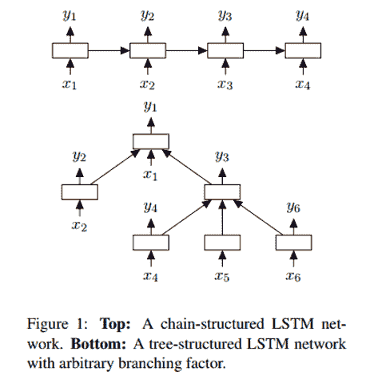
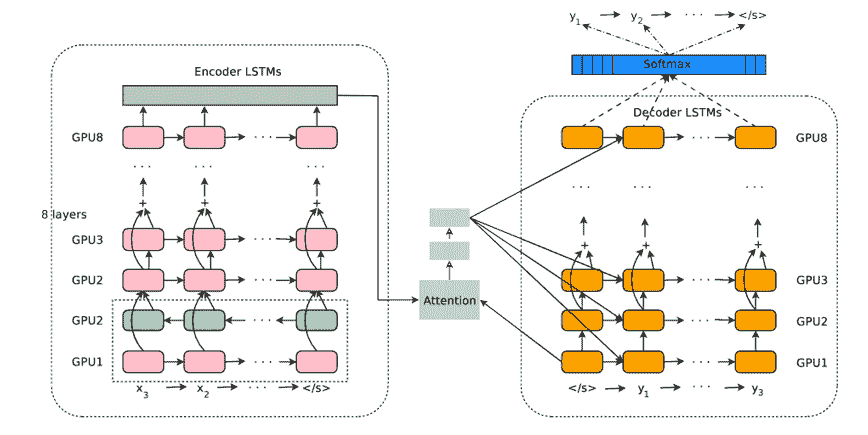

# 深度学习研究回顾：自然语言处理

> 原文：[`www.kdnuggets.com/2017/01/deep-learning-review-natural-language-processing.html/3`](https://www.kdnuggets.com/2017/01/deep-learning-review-natural-language-processing.html/3)

### [记忆网络](https://arxiv.org/pdf/1410.3916v11.pdf)

**简介**

我们将讨论的第一篇论文是问答子领域中非常有影响力的出版物。由 Jason Weston、Sumit Chopra 和 Antoine Bordes 撰写，这篇论文介绍了一类称为记忆网络的模型。

直观的想法是，为了准确回答关于一段文本的问题，你需要以某种方式存储给定的信息。如果我问你“RNN 代表什么”，（假设你已经完全阅读了这篇文章 J）你会能够给出答案，因为你通过阅读这篇文章的第一部分吸收的信息被存储在你的记忆中。你只需花几秒钟找到这些信息并用语言表达出来。现在，我不知道大脑是如何做到这一点的，但拥有一个存储这些信息的地方的想法依然存在。

论文中描述的记忆网络是独特的，因为它具有一个可以读写的关联记忆。值得注意的是，我们在 CNNs 或 Q-Networks（用于强化学习）或传统神经网络中没有这种类型的记忆。这部分是因为问答任务非常依赖于能够建模或跟踪长期依赖关系，例如跟踪故事中的角色或事件的时间线。在 CNNs 和 Q-Networks 中，“记忆”在网络的权重中内建，因为它们学习不同的滤波器或从状态到动作的映射。乍一看，RNNs 和 LSTMs 可能会被使用，但它们通常不能记住或记忆过去的输入（在问答中这一点是相当关键的）。

**网络架构**

好的，现在让我们看看这个网络是如何处理它收到的初始文本的。像大多数机器学习算法一样，第一步是将输入转换为特征表示。这可能涉及使用词向量、词性标注、解析等。具体如何做完全取决于程序员。

下一步是将特征表示 I(x) 与我们的记忆 m 更新，以反映我们收到的新输入 x。

你可以将记忆 m 视为由单个记忆 m[i]组成的数组。每个单独的记忆 m[i]可以是记忆 m 整体、特征表示 I(x)和/或自身的函数。这个函数 G 可以简单地是将整个表示 I(x)存储在单个记忆单元 m[i]中。你可以修改这个函数 G，以基于新输入更新过去的记忆。第 3^(rd)和第 4^(th)步涉及根据问题从记忆中读取以获取特征表示 o，然后解码以输出最终答案 r。

函数 R 可以是一个 RNN，用于将来自记忆的特征表示转换为对问题的可读且准确的回答。

现在，让我们更详细地看一下第 3 步。我们希望这个 O 模块输出一个最能匹配给定问题 x 的可能答案的特征表示。现在这个问题将与每个单独的记忆单元进行比较，并根据记忆单元对问题的支持程度进行“评分”。

我们取评分函数的最大值以找到最能支持问题的输出表示（你也可以选择多个最高评分单元，不必限制为 1）。评分函数计算问题和所选记忆单元之间不同嵌入的矩阵积（详细信息请查阅论文）。你可以将其视为在计算两个词向量的相似度时的乘法。这个输出表示 o 随后会被送入 RNN、LSTM 或其他评分函数，以输出可读答案。

这个网络以监督方式进行训练，其中训练数据包括原始文本、问题、支持句子和真实答案。这里是目标函数。

对于感兴趣的人，这里有一些基于这种记忆网络方法的论文

+   [端到端记忆网络](https://arxiv.org/pdf/1503.08895v5.pdf)（仅需对输出进行监督，无需支持句子）

+   [动态记忆网络](https://arxiv.org/pdf/1506.07285v5.pdf)

+   [动态共注意网络](https://arxiv.org/pdf/1611.01604v2.pdf)（刚刚发布两个月，曾在斯坦福问答数据集上获得最高测试分数）

### [树形 LSTM 用于情感分析](https://arxiv.org/pdf/1503.00075v3.pdf)

**简介**

下一篇论文研究了情感分析的进展，即确定短语是否具有积极或消极的含义/意义。更正式地说，情感可以定义为“对某个情况或事件的看法或态度”。当时，LSTM 是情感分析网络中最常用的单元。由**凯·盛·泰**、**理查德·索彻**和**克里斯托弗·曼宁**撰写，这篇论文介绍了一种在非线性结构中将 LSTM 串联在一起的新方法。

这种非线性排列的动机在于自然语言的特性，即词语序列成为短语。这些短语根据词语的顺序，可以具有不同于其原始词汇组件的含义。为了表示这一特性，LSTM 单元的网络必须被安排成树形结构，其中不同的单元受到其子节点的影响。

**网络架构**

Tree-LSTM 和标准 LSTM 之间的一个区别在于，后者的隐藏状态是当前输入和前一个时间步的隐藏状态的函数。然而，Tree-LSTM 的隐藏状态是当前输入和其子单元的隐藏状态的函数。

使用这种新的树形结构，一些数学变化包括子单元具有遗忘门。对于那些对细节感兴趣的人，可以查看论文以获取更多信息。然而，我想关注的是理解为什么这些模型比线性 LSTM 表现更好。

使用 Tree-LSTM，一个单元能够整合其所有子节点的隐藏状态。这很有趣，因为一个单元能够对每个子节点赋予不同的权重。在训练过程中，网络可以意识到某个特定词（可能是“not”或“very”在情感分析中）对句子的整体情感非常重要。提高该节点的权重为网络提供了很大的灵活性，并可能提高性能。

### [神经机器翻译](https://arxiv.org/pdf/1609.08144v2.pdf)

**介绍**

今天我们要看的最后一篇论文描述了一种机器翻译任务的方法。由 Google ML 的远见者**杰夫·迪恩**、**格雷格·科拉多**、**奥里尔·维尼亚尔斯**等人撰写，这篇论文介绍了一个机器翻译系统，这个系统成为了 Google 流行翻译服务的核心。与 Google 之前使用的生产系统相比，该系统将翻译错误减少了平均 60%。

传统的自动翻译方法包括短语匹配的变体。这种方法需要大量的语言领域知识，最终其设计证明过于脆弱，缺乏泛化能力。传统方法的问题之一是它试图逐块翻译输入句子。事实证明，更有效的方法（NMT 使用的方法）是一次翻译整个句子，从而允许更广泛的上下文和更自然的词语重排。

**网络架构**

论文中的作者介绍了一种深度 LSTM 网络，该网络可以通过 8 个编码器和解码器层进行端到端训练。我们可以将系统分为三个组件：编码器 RNN、解码器 RNN 和注意力模块。从高层次来看，编码器负责将输入句子转换为向量表示，解码器生成输出表示，然后注意力模块告诉解码器在解码任务中应关注什么（这就是利用整个句子上下文的想法所在）。

论文的其余部分主要集中在大规模部署此类服务所面临的挑战上。讨论了计算资源的数量、延迟以及高量级部署等主题。

### 结论

有了这些，我们结束了关于深度学习如何促进自然语言处理任务的讨论。在我看来，未来该领域的一些目标可能包括改善客户服务聊天机器人，完善机器翻译，并希望使问答系统能够更深入地理解非结构化或冗长的文本（例如维基百科页面）。

特别感谢 Richard Socher 和[斯坦福 CS 224D](http://cs224d.stanford.edu/index.html)的工作人员。精彩的幻灯片（大部分图片归功于他们的幻灯片）和精彩的讲座。

**简介：[Adit Deshpande](https://twitter.com/aditdeshpande3)** 目前是加州大学洛杉矶分校计算机科学专业的二年级本科生，同时辅修生物信息学。他对将机器学习和计算机视觉的知识应用于医疗保健领域充满热情，以便为医生和患者工程出更好的解决方案。

[原文](https://adeshpande3.github.io/adeshpande3.github.io/Deep-Learning-Research-Review-Week-3-Natural-Language-Processing)。经许可转载。

**相关：**

+   深度学习研究回顾：强化学习

+   深度学习研究回顾：生成对抗网络

+   KDnuggets 顶级博主：与深度学习爱好者 Adit Deshpande 的访谈

* * *

## 我们的前三个课程推荐

 1\. [Google 网络安全证书](https://www.kdnuggets.com/google-cybersecurity) - 快速进入网络安全职业轨道

 2\. [Google 数据分析专业证书](https://www.kdnuggets.com/google-data-analytics) - 提升你的数据分析技能

 3\. [Google IT 支持专业证书](https://www.kdnuggets.com/google-itsupport) - 支持你所在组织的 IT 需求

* * *

### 更多相关主题

+   [建立一个坚实的数据团队](https://www.kdnuggets.com/2021/12/build-solid-data-team.html)

+   [使用管道编写干净的 Python 代码](https://www.kdnuggets.com/2021/12/write-clean-python-code-pipes.html)

+   [是什么让 Python 成为初创公司的理想编程语言](https://www.kdnuggets.com/2021/12/makes-python-ideal-programming-language-startups.html)

+   [N-gram 语言模型在自然语言处理中的应用](https://www.kdnuggets.com/2022/06/ngram-language-modeling-natural-language-processing.html)

+   [停止学习数据科学，找到目标，找到目标去…](https://www.kdnuggets.com/2021/12/stop-learning-data-science-find-purpose.html)

+   [学习数据科学统计的顶级资源](https://www.kdnuggets.com/2021/12/springboard-top-resources-learn-data-science-statistics.html)
