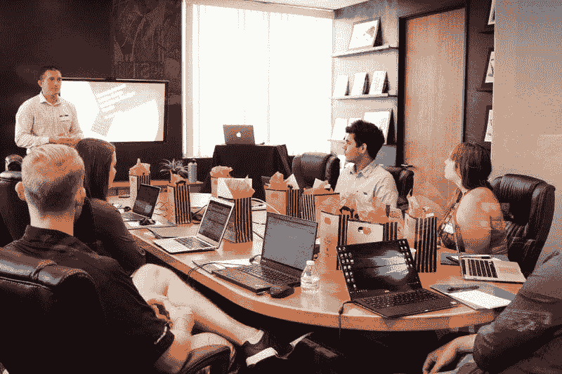

# 在数据科学面试中进行精彩演示

> 原文：[`www.kdnuggets.com/2022/01/deliver-killer-presentation-data-science-interviews.html`](https://www.kdnuggets.com/2022/01/deliver-killer-presentation-data-science-interviews.html)

图片来源：[Campaign Creators](https://unsplash.com/@campaign_creators?utm_source=medium&utm_medium=referral) 在 [Unsplash](https://unsplash.com/?utm_source=medium&utm_medium=referral)

很少有人喜欢公共演讲。然而，这几乎是任何工作中必不可少的技能。数据科学也不例外。作为数据科学家，你将需要向利益相关者展示你的想法和发现，这也是你在面试数据科学家职位时经常需要做演示的原因。

* * *

## 我们的前三个课程推荐

 1\. [Google 网络安全证书](https://www.kdnuggets.com/google-cybersecurity) - 快速进入网络安全职业。

 2\. [Google 数据分析专业证书](https://www.kdnuggets.com/google-data-analytics) - 提升你的数据分析能力

 3\. [Google IT 支持专业证书](https://www.kdnuggets.com/google-itsupport) - 支持你组织的 IT

* * *

演示可能会让人紧张，但它们是证明你是一个有能力的数据科学家至关重要的一部分。数据科学家必须是能够推动对话、说服利益相关者接受他们建议和故事的销售者。面试中的演示环节是你展示自己能成为推动者而不仅仅是支持者的地方。

在这个博客中，我们将探讨面试中做演示的 5 个技巧。我们将讨论演示中应该包含哪些信息，以及如何以引人入胜的方式呈现这些内容。如果你更喜欢观看而非阅读，可以前往[我的 YouTube 频道](https://www.youtube.com/channel/UCAWsBMQY4KSuOuGODki-l7A)6，观看有关这个主题的[视频](https://youtu.be/yypjNbugVKM)。

让我们开始吧！

## 关注你的影响力

第一个技巧是**关注*你的*影响力**。项目通常是团队合作的结果，涉及的不仅仅是数据科学家。成功完成一个项目需要大量的协作和团队合作。

尽管如此，面试官在你展示一个项目时，往往不会关心这些细节。他们关注的是*你，而不是*团队的其他成员。因此，你需要专注于你的角色和影响力。

为了清晰地传达你的影响力，你应该**用可衡量的术语进行描述**。使用指标和数字来解释你在项目中的成就。

最佳的指标是那些**显示你对业务的影响**的指标。这包括例如增加收入、客户获取、客户留存等。如果你知道你的工作对业务指标的影响，这是一种理想的方式来在演示中说明你的影响。

然而，有时将你的工作与对业务的直接影响联系起来非常困难。可能是项目的范围不够大，或者项目只是间接影响业务指标。

如果是这种情况，你仍然要用面试官容易理解的度量标准来描述你的影响。你可以谈论例如通过构建数据管道来提高团队效率和生产力，或者谈论你构建的工具或开发的方法论如何被多个团队采纳。

虽然这些东西并没有准确说明你对业务的影响，但可以清楚地看到你对整个公司的积极影响。提高团队生产力必定会带来业务指标的改善。

在描述你的影响时，**避免不清楚说明你如何帮助业务的细节**。例如，仅仅说你提高了模型性能对面试官没有帮助。并不清楚这对公司有何好处。坚持使用那些即使没有技术背景的人也能清楚理解的指标，如果有的话，业务指标最好。

这个关于关注你影响力的提示不仅适用于演讲。在面试中描述过去的项目时，影响力也非常重要。你可以[查看这篇博客文章](https://towardsdatascience.com/why-the-s-t-a-r-method-does-not-work-in-data-science-interviews-and-what-to-do-instead-f82982d55ce8)以了解更多。

## 使用你的最佳内容

我们的下一个提示是**使用你的最佳内容**。这个提示一开始可能看起来非常明显。你当然想展示你最好的项目！然而，我们说的最佳内容到底是什么意思呢？可能会想展示一个你觉得最成功的项目，但你最成功的项目往往也是一个简单的项目。

当我说展示你的最佳内容时，我更指的是关于你自己的最佳内容，而不是最成功的项目。谈论一个有**挑战**的项目能给你更多展示技能、细致和独特性的机会。具有挑战性的项目往往更有趣，因此更容易引起面试官的注意。

挑战并不是使项目成为最佳的唯一因素。你还需要选择一个你**深度参与**的项目。选择一个你在项目过程中各个步骤中都可以舒适地突出自己行动的项目。解释项目设计和实施的可行性，以证明你理解自己的工作及其影响。这表明你可以**推动项目**，因为你理解整个工作的运作方式。

当你选择一个项目进行展示时，选择一个能展现你最佳状态的项目。这通常意味着选择一个曾经遇到一些**问题和障碍**的项目。这个想法引出了我们的第三个提示：列出项目的局限性。

## 列出局限性

跳过或略过项目中出现的问题和局限性可能是很有诱惑力的。然而，你在特定项目中遇到的局限性是你在演示中不想绕过的，尤其是在讨论建模方法时。

事实上，仅仅知道如何使用建模方法是不够的。任何人都可以学习做到这一点。为了给面试官留下深刻印象，你需要展示你对方法的优点和局限性的了解。展示对你情况中**不理想**部分的认识。

例如，你可能遇到了数据的局限性。也许数据收集存在问题，团队没有足够的数据进行分析或建模。为了克服这个局限性，你可能不得不进行一些研究，以寻找外部数据源。

这个例子说明了列出局限性给你一个机会去讨论你如何改进或计划改进。因此，对局限性的意识表明了成长的能力，并展示了你的**解决问题能力**。这表明你能够识别计划中的薄弱环节并致力于缓解这些问题。

## 思考技术细节

前三个提示应该帮助你决定讲述哪个项目，但现在你已经选择了一个项目，如何准备展示它？每个人的方法各不相同，但有一件事我建议每个人都做。第四个提示是仔细**考虑项目的技术细节**。

你可能没有时间解释项目的每一个技术方面，但你要确保你对你选择讨论的所有内容有透彻的理解。你通常会被问到**后续问题**，这需要对项目的技术细节有深入了解。

例如，面试官可能会问你以下问题：

+   将连续变量转换为分类变量是否有意义？如果分布是长尾的呢？

+   对于基于树的模型，如果是随机森林模型，你是否需要进行修剪？

确保你对所有计划展示的技术细节足够熟悉，以便回答后续问题。

## 行为确实重要

在准备演示时，内容当然很重要，这也是我们提示的重点：选择什么类型的项目以及在演示中关注该项目的哪些方面。

然而，拥有出色的内容并不是成功演示的唯一因素。面试官还会评估**你处理自己方式**的表现。

尽管你希望展现出自己能够推销思想并推动对话的能力，但你不想给人以傲慢或自大的印象。成为一个优秀的演讲者的一部分就是展示你是一个好的倾听者。没有人愿意和一个拒绝倾听他人意见和考虑不同观点的同事合作。

因此，在进行演讲时，展示**对问题和建议的开放性**是非常重要的。聆听不同的意见，甚至是那些与你的观点不一致的意见，并花时间分析它们。你可以随后说服听众接受你的观点，或者承认你在这方面的局限性。

许多时候，这仅仅意味着承认某人提出了一个好问题并考虑解决方案。不要忽视他人的意见和关切，因为这意味着你可能会是一个不合适的同事。在演讲过程中，你应该以一种展示自信和能力的方式表现自己，同时也展示你重视不同观点的态度。

## 结论

所有这些技巧表明，在面试中的演讲更多的是关于展示你作为数据科学家的能力，而不是单纯地展示一个项目。

为了展示你是一位称职的数据科学家，你的演讲应该超越仅仅解释项目的基本事实。你需要展示你的影响力、解决问题的能力、技术技能和知识，以及你的职业素养和推动对话的能力。

## 感谢阅读！

如果你喜欢这篇文章并想支持我...

+   订阅我的[YouTube 频道](https://www.youtube.com/channel/UCAWsBMQY4KSuOuGODki-l7A)!

+   在[LinkedIn](https://www.linkedin.com/in/wzding/)上联系我！

+   在求职开始时，尝试一下[我的清单](https://www.datainterviewpro.com/#resume)来优化你的数据科学简历。

**[艾玛·丁](https://www.kdnuggets.com/author/emma-ding)** 是[Data Interview Pro](https://www.datainterviewpro.com/)的创始人兼职业教练。

### 更多相关内容

+   [赢得房间：创建和传递有效的数据驱动演示…](https://www.kdnuggets.com/2022/04/franks-winning-room-creating-delivering-effective-data-driven-presentation.html)

+   [如何使用 ChatGPT 将文本转换为 PowerPoint 演示文稿](https://www.kdnuggets.com/2023/08/chatgpt-convert-text-powerpoint-presentation.html)

+   [KDnuggets 新闻，6 月 8 日：21 个数据科学备忘单…](https://www.kdnuggets.com/2022/n23.html)

+   [KDnuggets™ 新闻 22:n03，1 月 19 日：深入了解 13 个数据…](https://www.kdnuggets.com/2022/n03.html)

+   [成功应对初级数据科学职位面试的更多技巧](https://www.kdnuggets.com/more-tips-for-successfully-navigating-beginner-data-science-job-interviews)

+   [21 个数据科学面试必备备忘单：解锁…](https://www.kdnuggets.com/2022/06/21-cheat-sheets-data-science-interviews.html)
