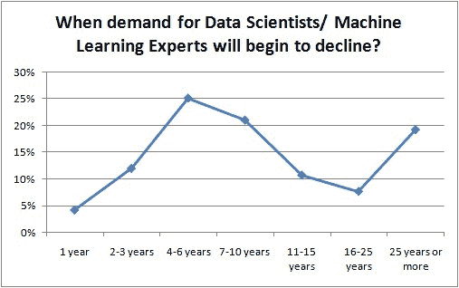
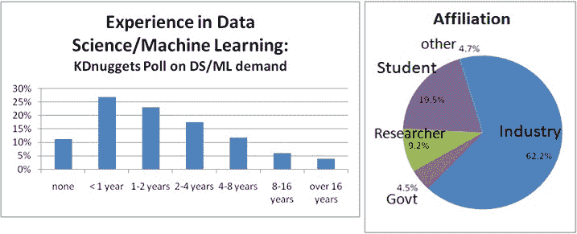
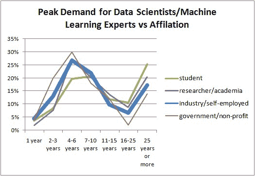
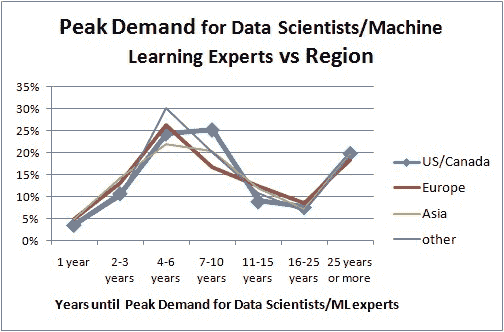

# 数据科学家/机器学习专家的需求何时达到顶峰？

> 原文：[`www.kdnuggets.com/2017/11/demand-data-scientists-machine-learning-decline.html`](https://www.kdnuggets.com/2017/11/demand-data-scientists-machine-learning-decline.html)

 评论 最新的 KDnuggets 调查 [询问了](https://www.kdnuggets.com/2017/10/new-poll-demand-data-scientists-machine-learning-decline.html)

> **数据科学家/机器学习专家的需求何时开始下降？**

基于近 1,200 名选民的结果，KDnuggets 读者预计这将在 4 到 10 年之间发生。最常见的答案是 4-6 年，中位数答案在 8-9 年之间——见图 1。

 **图 1：KDnuggets 调查：数据科学家/机器学习专家的需求何时开始下降？**

这是一个非常有趣且重要的图表，以下是我的观察。

*注意：下降的开始时间紧接在需求峰值之后，因此我们将这两个术语互换使用。*

数据科学家的需求在 2012 年被宣布为 [21 世纪最性感的工作](https://hbr.org/2012/10/data-scientist-the-sexiest-job-of-the-21st-century) 后开始迅速增长。这种需求有两种方式得到满足：

+   教育：许多大学和其他教育平台，如 Coursera、edX 和 Udemy，正在提供 [数据科学和机器学习教育](https://www.kdnuggets.com/education/index.html)

+   自动化：像 DataRobot 等公司提供 [自动化数据科学/机器学习平台](https://www.kdnuggets.com/software/automated-data-science.html)，这些平台要么让业务用户进行建模，要么通过嵌入业务流程（例如自动竞标广告）完全自动化数据科学。

> *关于自动化的一个不那么严肃的视角，请参见 KDnuggets 漫画 [数据科学家——21 世纪最性感的工作，直到……](https://www.kdnuggets.com/2016/08/cartoon-data-scientist-sexiest-job-21st-century.html)*

当前的需求感觉像一个泡沫，在某个时点泡沫会破裂，需求将开始下降，但正如许多泡沫一样，很难预测具体时间。需求峰值（下降的开始）在 4 到 9 年之间对我来说是合理的。当然，这并不意味着数据科学家会失业，但这份工作将变成一种常规工作，薪资将会稳定，正如例子中网页开发者的情况——在互联网初期这是一个非常热门的工作，但现在它已成为一份常规工作。

调查还询问了选民在数据科学和机器学习中的经验以及他们的所属（行业 / 学生 / 研究 / 政府 / 其他）——见图 2。

 **图 2：民意调查受访者的数据科学/机器学习经验与职务**

我们注意到大约 60%的受访者有 2 年或更少的经验，这显示了这个领域现在的年轻。62%的受访者来自工业界，19.5%是学生，9.2%是研究人员，4.5%是政府/非营利组织。

当我考察需求高峰与经验和职务的关系时，令人惊讶的是，我得到了类似的曲线，一个高峰出现在 4-6 年或 7-10 年，另一个较小的高峰出现在 25 年或更长时间。为了简化图表，我将“无经验”和“<1 年”经验的线条归为一组，以及“1-2 年”和“2-4 年”经验的线条归为一组，这两种情况看起来非常相似。

**图 3：数据科学家/机器学习专家的需求高峰与数据科学/机器学习经验**

我将期望数据科学家的需求仅在 25 年或更长时间后才开始下降的人称为“乐观主义者”，另一组称为“悲观主义者”。

我们注意到，经验最多的组（超过 16 年）的乐观主义者比例最高——超过 35%的人认为需求在未来 25 年内不会下降。

接下来，我们检查了需求高峰曲线与职务的关系——图 4。

**图 4：数据科学家/机器学习专家的需求高峰与职务对比**

再次，最令人惊讶的发现是曲线再次相似。

学生是最乐观的，而政府人员是最悲观的，工业界则介于两者之间。

最后，我们考察了按地区分布的情况。地区参与情况是：

+   美国/加拿大，40%

+   欧洲，33%

+   亚洲，16%

+   其他，11%

**图 5：数据科学家/机器学习专家的需求高峰与地区对比**

再次，最令人惊讶的发现是曲线再次相似。一个显著的不同之处是，美国/加拿大的受访者更乐观——他们最常选择的高峰需求是在 7-10 年，而其他地区则是在 4-6 年。所有地区中，认为 25 年或更长时间的比例惊人地相似（18.3%到 19.8%）。

什么可以解释这种类似的分布？

一个假设是，人们天生倾向于乐观或悲观，这会影响他们的预测。也许在询问关于社会趋势等无法从物理学中确定但依赖于人们的感觉和直觉的预测时，民意调查应该以某种方式衡量乐观与悲观的特质。

如果这是真的，我们注意到不同职务和地区的乐观主义者比例相对相似，并且随经验变化不大。

**相关：**

+   [**对 AI 改善社会的乐观态度很高，但在开发 AI 系统的经验增加后会下降**](https://www.kdnuggets.com/2017/07/optimism-ai-impact-experience.html)

+   [**如何面试数据科学家**](https://www.kdnuggets.com/2017/11/how-job-interview-data-scientist.html)

+   [**一个小时内开始机器学习！**](https://www.kdnuggets.com/2017/11/getting-started-machine-learning-one-hour.html)

### 了解更多相关话题

+   [停止学习数据科学以寻找目标，并以寻找目标来……](https://www.kdnuggets.com/2021/12/stop-learning-data-science-find-purpose.html)

+   [数据科学学习统计学的顶级资源](https://www.kdnuggets.com/2021/12/springboard-top-resources-learn-data-science-statistics.html)

+   [成功数据科学家的 5 个特征](https://www.kdnuggets.com/2021/12/5-characteristics-successful-data-scientist.html)

+   [每个数据科学家都应该知道的三个 R 库（即使你使用 Python）](https://www.kdnuggets.com/2021/12/three-r-libraries-every-data-scientist-know-even-python.html)

+   [一个 90 亿美元的 AI 失败案例分析](https://www.kdnuggets.com/2021/12/9b-ai-failure-examined.html)

+   [是什么让 Python 成为创业公司的理想编程语言](https://www.kdnuggets.com/2021/12/makes-python-ideal-programming-language-startups.html)
