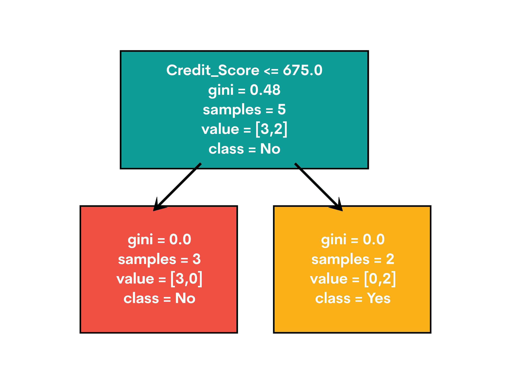
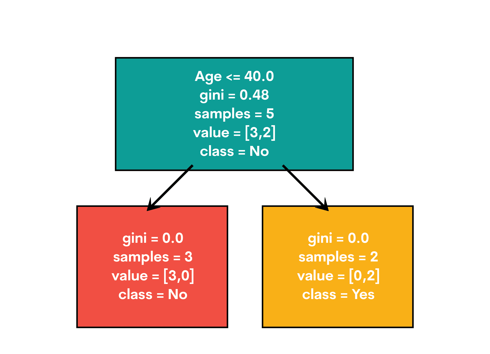

# 让决策树在现实世界中变得清晰

> 原文：[`www.kdnuggets.com/demystifying-decision-trees-for-the-real-world`](https://www.kdnuggets.com/demystifying-decision-trees-for-the-real-world)


作者提供的图片

* * *

## 我们的前三个课程推荐

 1\. [Google 网络安全证书](https://www.kdnuggets.com/google-cybersecurity) - 快速进入网络安全职业生涯。

 2\. [Google 数据分析专业证书](https://www.kdnuggets.com/google-data-analytics) - 提升你的数据分析能力

 3\. [Google IT 支持专业证书](https://www.kdnuggets.com/google-itsupport) - 支持你的组织的 IT 工作

* * *

决策树将复杂的决策分解为简单、易于遵循的阶段，因此类似于人类大脑的功能。

在数据科学中，这些强大的工具被广泛应用于数据分析和决策指导。

在这篇文章中，我将介绍决策树的运作方式，提供现实世界的例子，并给出一些提升决策树效果的建议。

## **决策树的结构**

从根本上说，决策树是简单明了的工具。它们将复杂的选项分解为更简单的顺序选择，从而反映了人类的决策过程。现在让我们深入探讨构成决策树的主要元素。

#### **节点、分支和叶子**

三个基本组件定义了一个决策树：叶子、分支和节点。每一个都是决策过程中的绝对关键。

+   节点：它们是决策点，通过这些点，树根据输入数据做出决定。在表示所有数据时，根节点是起始点。

+   分支：它们关联决策的结果并连接节点。每个分支对应一个潜在的结果或决策节点的值。

+   叶子：决策树的终点是叶子，有时称为叶节点。每个叶节点提供一个特定的结果或标签；它们反映最后的选择或分类。

#### **概念示例**

假设你在根据温度决定是否外出。“下雨吗？”根节点会问。如果是的话，你可能会找到一条指向“带伞”的分支。但这种情况不应该发生；另一条分支可以说“戴太阳镜”。

这些结构使得决策树易于解读和可视化，因此在各个领域都很受欢迎。

#### **现实世界示例：贷款审批冒险**

想象一下：你是格林戈茨银行的一名巫师，决定谁能获得贷款购买他们的新扫帚。

+   根节点：“他们的信用评分是否很神奇？”

+   如果是 → 分支到“批准，快得比你说魁地奇还快！”

+   如果否 → 分支到“检查他们的精灵金币储备。”

    +   如果高 →，“批准，但要留意他们。”

    +   如果低 → “拒绝，速度比 Nimbus 2000 还快。”

```py
import pandas as pd
from sklearn.tree import DecisionTreeClassifier
from sklearn import tree
import matplotlib.pyplot as plt

data = {
    'Credit_Score': [700, 650, 600, 580, 720],
    'Income': [50000, 45000, 40000, 38000, 52000],
    'Approved': ['Yes', 'No', 'No', 'No', 'Yes']
}

df = pd.DataFrame(data)

X = df[['Credit_Score', 'Income']]
y = df['Approved']

clf = DecisionTreeClassifier()
clf = clf.fit(X, y)

plt.figure(figsize=(10, 8))
tree.plot_tree(clf, feature_names=['Credit_Score', 'Income'], class_names=['No', 'Yes'], filled=True)
plt.show()
```

这是输出结果。

 当你运行这个魔法时，你会看到一棵树出现！它就像贷款批准的掠夺者地图：

+   根节点在 Credit_Score 上进行划分

+   如果小于等于 675，我们向左前进

+   如果大于 675，我们向右行进

+   叶子节点显示我们的最终决定：“是”表示批准，“否”表示拒绝

太棒了！你刚刚创建了一个决策制定的水晶球！

思维挑战：如果你的生活是一个决策树，根节点问题会是什么？“今天早上喝咖啡了吗？”可能会引出一些有趣的分支！

## **决策树：在分支背后**

决策树的功能类似于流程图或树状结构，通过一系列的决策点来工作。它们从将数据集划分为更小的部分开始，然后建立一个决策树来配合它。我们应该关注这些树如何处理数据划分和不同变量的方式。

#### **划分标准：基尼不纯度和信息增益**

选择最佳质量来划分数据是构建决策树的主要目标。可以通过信息增益和基尼不纯度提供的标准来确定这个过程。

+   基尼不纯度：想象一下你在玩猜测游戏。如果你随机选择一个标签，你会经常出错吗？这就是基尼不纯度所衡量的。基尼系数越低，我们的猜测越准确，树也就越快乐。

+   信息增益：你可以将其比作神秘故事中的“啊哈！”时刻。信息增益衡量提示（属性）在解决案件中所起的帮助程度。更大的“啊哈！”意味着更多的增益，这意味着树更加兴奋！

要预测客户是否会从你的数据集中购买某个产品，你可以从基本的人口统计信息开始，比如年龄、收入和购买历史。这个方法考虑了所有这些因素，并找出能够将买家和其他人区分开的因素。

#### **处理连续数据和分类数据**

我们的树探员可以调查所有类型的信息。

对于容易改变的特征，如年龄或收入，树设置了一个测速点。“30 岁以上的人，请走这边！”

对于分类数据，如性别或产品类型，这更像是一种排列。“智能手机在左边；笔记本电脑在右边！”

#### **现实世界的冷案：客户购买预测器**

为了更好地理解决策树的工作原理，我们来看看一个实际的例子：使用客户的年龄和收入来预测他们是否会购买产品。

为了预测人们会买什么，我们将创建一个简单的集合和决策树。

代码的描述

+   我们导入像 pandas 这样的库来处理数据，从 scikit-learn 导入 DecisionTreeClassifier 来构建树，使用 matplotlib 来展示结果。

+   创建数据集：使用年龄、收入和购买状态来制作一个样本数据集。

+   准备特征和目标：目标变量（购买）和特征（年龄、收入）已经设置好。

+   训练模型：利用这些信息设置和训练决策树分类器。

+   查看决策树：最后，我们绘制决策树，以便观察决策过程。

这是代码。

```py
import pandas as pd
from sklearn.tree import DecisionTreeClassifier
from sklearn import tree
import matplotlib.pyplot as plt

data = {
    'Age': [25, 45, 35, 50, 23],
    'Income': [50000, 100000, 75000, 120000, 60000],
    'Purchased': ['No', 'Yes', 'No', 'Yes', 'No']
}

df = pd.DataFrame(data)

X = df[['Age', 'Income']]
y = df['Purchased']

clf = DecisionTreeClassifier()
clf = clf.fit(X, y)

plt.figure(figsize=(10, 8))
tree.plot_tree(clf, feature_names=['Age', 'Income'], class_names=['No', 'Yes'], filled=True)
plt.show()
```

这是输出结果。



最终决策树将展示如何根据年龄和收入来划分树，以确定客户是否可能购买某个产品。每个节点是一个决策点，分支显示不同的结果。最终决策由叶节点展示。

现在，让我们来看看面试在现实世界中的应用吧！

## **现实世界应用**


该项目被设计为 Meta（Facebook）数据科学职位的家庭作业，目标是构建一个分类算法，预测 Rotten Tomatoes 上的电影是否标记为“烂片”、“新鲜”或“认证新鲜”。

这是该项目的链接：[`platform.stratascratch.com/data-projects/rotten-tomatoes-movies-rating-prediction`](https://platform.stratascratch.com/data-projects/rotten-tomatoes-movies-rating-prediction?utm_source=blog&utm_medium=click&utm_campaign=kdn+decision+trees+for+real+world)

现在，让我们将解决方案拆解为可编码的步骤。

#### **逐步解决方案**

1.  数据准备：我们将根据 rotten_tomatoes_link 列合并两个数据集。这将为我们提供一个包含电影信息和评论的综合数据集。

1.  特征选择与工程：我们将选择相关特征并执行必要的转换，包括将类别变量转换为数值变量、处理缺失值和标准化特征值。

1.  模型训练：我们将对处理后的数据集训练决策树分类器，并使用交叉验证评估模型的稳定性。

1.  评估：最后，我们将使用准确率、精确率、召回率和 F1 分数等指标来评估模型的性能。

这是代码。

```py
import pandas as pd
from sklearn.model_selection import train_test_split, cross_val_score
from sklearn.tree import DecisionTreeClassifier
from sklearn.metrics import classification_report
from sklearn.preprocessing import StandardScaler

movies_df = pd.read_csv('rotten_tomatoes_movies.csv')
reviews_df = pd.read_csv('rotten_tomatoes_critic_reviews_50k.csv')

merged_df = pd.merge(movies_df, reviews_df, on='rotten_tomatoes_link')

features = ['content_rating', 'genres', 'directors', 'runtime', 'tomatometer_rating', 'audience_rating']
target = 'tomatometer_status'

merged_df['content_rating'] = merged_df['content_rating'].astype('category').cat.codes
merged_df['genres'] = merged_df['genres'].astype('category').cat.codes
merged_df['directors'] = merged_df['directors'].astype('category').cat.codes

merged_df = merged_df.dropna(subset=features + [target])

X = merged_df[features]
y = merged_df[target].astype('category').cat.codes

scaler = StandardScaler()
X_scaled = scaler.fit_transform(X)

X_train, X_test, y_train, y_test = train_test_split(X_scaled, y, test_size=0.3, random_state=42)

clf = DecisionTreeClassifier(max_depth=10, min_samples_split=10, min_samples_leaf=5)
scores = cross_val_score(clf, X_train, y_train, cv=5)
print("Cross-validation scores:", scores)
print("Average cross-validation score:", scores.mean())

clf.fit(X_train, y_train)

y_pred = clf.predict(X_test)

classification_report_output = classification_report(y_test, y_pred, target_names=['Rotten', 'Fresh', 'Certified-Fresh'])
print(classification_report_output)
```

这是输出结果。


该模型在各类中显示出高准确率和 F1 分数，表明性能良好。让我们来看一下关键要点。

关键要点

1.  特征选择对模型性能至关重要。内容评分、类型、导演、时长和评分被证明是有价值的预测因子。

1.  决策树分类器有效捕捉了电影数据中的复杂关系。

1.  交叉验证确保模型在不同数据子集上的可靠性。

1.  在“认证新鲜”类别中表现出色的情况下，值得进一步调查可能的类别不平衡。

1.  该模型在预测电影评分和提升如 Rotten Tomatoes 平台的用户体验方面显示出良好的前景。

## **提升决策树：将你的幼苗成长为参天大树**

现在，你已经成长了第一棵决策树。令人印象深刻！但为何止步于此？让我们将这棵幼苗变成一棵森林巨人，让 Groot 也感到嫉妒。准备好增强你的树了吗？让我们深入了解吧！

#### **剪枝技术**

剪枝是一种通过去除对目标变量预测能力较小的部分来缩减决策树大小的方法。这有助于特别减少过拟合。

+   前剪枝：通常称为早期停止，这涉及立即停止树的生长。在训练之前，模型会被指定参数，包括最大深度（max_depth）、分裂节点所需的最小样本数（min_samples_split）和叶节点所需的最小样本数（min_samples_leaf）。这防止了树的过度复杂化。

+   后剪枝：这种方法将树生长到最大深度，然后移除那些贡献不大的节点。虽然计算成本比前剪枝更高，但后剪枝可能更有效。

#### **集成方法**

集成技术将多个模型结合以产生超过单一模型的性能。应用于决策树的两种主要集成技术是装袋法和提升法。

+   装袋法（Bootstrap Aggregating）：该方法在数据的多个子集（通过有放回抽样生成）上训练多个决策树，然后对它们的预测结果取平均。一个常用的装袋技术是随机森林。它减少了方差并有助于防止过拟合。查看 "[决策树与随机森林算法](https://www.stratascratch.com/blog/decision-tree-and-random-forest-algorithm-explained/?utm_source=blog&utm_medium=click&utm_campaign=kdn+decision+trees+for+real+world)" 深入了解决策树算法及其扩展“随机森林算法”相关的一切。

+   提升：提升方法依次创建树，每棵树都试图修正下一棵树的错误。提升技术在算法中包括 AdaBoost 和梯度提升。这些算法通过强调难以预测的示例，有时能提供更精确的模型。

#### **超参数调优**

超参数调优是确定决策树模型的最佳超参数集合以提升其性能的过程。可以通过使用如网格搜索或随机搜索等方法，评估多个超参数组合以找出最佳配置。

## **结论**

在本文中，我们讨论了决策树的结构、工作机制、实际应用以及提升决策树性能的方法。

练习决策树对于掌握其使用和理解其细微差别至关重要。处理实际数据项目也可以提供宝贵的经验，提升解决问题的技能。

[](https://twitter.com/StrataScratch)****[内特·罗西迪](https://twitter.com/StrataScratch)**** 是一名数据科学家，专注于产品策略。他还是一位兼职教授，教授分析学，并且是 StrataScratch 的创始人，该平台帮助数据科学家通过来自顶级公司的真实面试问题准备面试。内特撰写关于职业市场的最新趋势，提供面试建议，分享数据科学项目，并涵盖所有 SQL 相关内容。

### 更多相关主题

+   [从零开始的机器学习：决策树](https://www.kdnuggets.com/2022/11/machine-learning-scratch-decision-trees.html)

+   [决策树与随机森林，解释说明](https://www.kdnuggets.com/2022/08/decision-trees-random-forests-explained.html)

+   [通用可扩展的最优稀疏决策树(GOSDT)](https://www.kdnuggets.com/2023/02/generalized-scalable-optimal-sparse-decision-treesgosdt.html)

+   [可解释的人工智能：10 个 Python 库帮助解密模型决策](https://www.kdnuggets.com/2023/01/explainable-ai-10-python-libraries-demystifying-decisions.html)

+   [解密糟糕的科学](https://www.kdnuggets.com/2022/01/demystifying-bad-science.html)

+   [解密机器学习](https://www.kdnuggets.com/demystifying-machine-learning)
