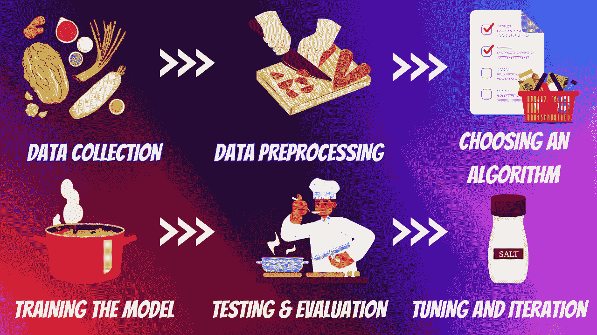

# 揭示机器学习

> 原文：[`www.kdnuggets.com/demystifying-machine-learning`](https://www.kdnuggets.com/demystifying-machine-learning)

作者提供的图片

# 传统与变革：回顾与展望

* * *

## 我们的前三个课程推荐

 1\. [谷歌网络安全证书](https://www.kdnuggets.com/google-cybersecurity) - 快速进入网络安全职业生涯

 2\. [谷歌数据分析专业证书](https://www.kdnuggets.com/google-data-analytics) - 提升您的数据分析技能

 3\. [谷歌 IT 支持专业证书](https://www.kdnuggets.com/google-itsupport) - 支持您的组织 IT

* * *

传统上，计算机需要遵循一套明确的指令。例如，如果你想让计算机执行两个数字的加法，你必须逐步详细说明每一个步骤。然而，随着数据的复杂性增加，这种手动逐步指令的方法变得不够用了。

这就是机器学习作为游戏改变者出现的地方。我们希望计算机通过示例学习，就像我们通过经验学习一样。想象一下教一个孩子骑自行车，通过几次示范，然后让他摔倒、自己摸索和学习。这就是机器学习的理念。这项创新不仅改变了行业，还成为了现代世界中不可或缺的必要性。

# 学习基础知识

现在我们对**“机器学习”**这一术语有了基本了解，让我们熟悉一些基本术语：

## 数据

数据是机器学习的命脉。它指的是计算机用于学习的信息。这些信息可以是数字、图片或计算机可以理解的其他任何内容。进一步分为两个类别：

+   **训练数据：** 这些数据指的是我们用来教计算机的示例。

+   **测试数据：** 在学习后，我们使用一些新的、未见过的数据来测试计算机的表现，这些数据被称为测试数据。

## 标签和特征

想象一下，你在教一个孩子如何区分不同的动物。动物的名称（如狗、猫等）将是标签，而这些动物的特征（如腿的数量、毛发等）则是帮助你识别它们的特征。

## 模型

这是机器学习过程的结果。它是数据中模式和关系的数学表示。就像在探索新地方后绘制一张地图一样。

# 机器学习的类型

机器学习有四种主要类型：

## 监督式机器学习

它也被称为指导学习。我们向机器学习算法提供标签数据集，其中正确的输出已知。基于这些示例，它学习数据中的隐藏模式，并可以预测或正确分类新数据。监督学习中的常见类别包括：

+   **分类：** 将事物分类到不同的类别中，例如将图片分类为猫或狗，将电子邮件分类为垃圾邮件或非垃圾邮件等。

+   **回归：** 它涉及预测数值，例如房价、你的 GPA 或基于某些特征的销售数量。

## 无监督机器学习

这里计算机接收没有标签的数据，没有事先的提示，它会自行探索隐藏的模式。想象一下，你被交给了一盒拼图，没有图案，你的任务是将相似的拼图块分组，以形成完整的图片。聚类是最常见的无监督学习类型，其中相似的数据点被分组到一个组中。例如，我们可以使用聚类将相似的社交媒体帖子分组，用户可以关注他们感兴趣的子主题。

## 半监督机器学习

半监督学习包含标签数据集和未标签数据集的混合，其中标签数据集作为识别数据模式的指导点。例如，你给厨师提供了一份主要食材的清单，但没有提供完整的食谱。所以虽然他们没有食谱，但有一些可能帮助他们入门的提示。

## 强化学习

强化学习也称为通过实践学习。它与环境互动，并根据其行为获得奖励或惩罚。随着时间的推移，它学会了最大化奖励并表现良好。想象一下你在训练一只小狗，当它表现良好时你给予积极反馈（奖励），当它表现不佳时你不给予奖励。随着时间的推移，小狗学会了哪些行为会带来奖励，哪些不会。

# 高级机器学习过程

机器学习，就像烹饪艺术一样，拥有将原始、不同的元素转化为深刻见解的神奇能力。就像一位熟练的厨师巧妙地结合各种食材来制作美味的菜肴一样。以下是执行机器学习任务的 6 个基本步骤：

作者提供的图片

## 1\. 数据收集

数据是一个重要的资源，其质量非常重要。多样化、更相关的数据会带来更好的结果。你可以把它想象成厨师从不同的市场收集各种食材。

## 2\. 数据预处理

我们的大多数数据并不是以期望的形式存在的。就像在烹饪前洗净、切割和准备食材一样，数据预处理涉及清理和组织数据以供学习过程使用。一些常见的问题包括缺失数据、异常值、格式不正确等。

## 3\. 选择算法

就像选择特定菜肴的食谱一样，你需要根据你要解决的问题选择算法。这一选择也可能会受到你拥有的数据类型的影响。

## 4\. 训练模型

想象一下烹饪过程，我们等待味道融合。同样地，我们让模型从训练数据中学习。学习率是一个重要概念，它决定了模型在每次训练迭代中的步伐大小。如果一次加了太多盐或香料，菜肴可能会变得过于浓烈。相反，如果加得太少，味道可能无法完全发展。学习率找到逐渐增强味道的完美平衡。

## 5\. 测试与评估

一旦学习过程结束，我们使用特殊的测试数据对其进行测试，就像在与他人分享之前品尝菜肴并检查其外观一样。常见的评估指标包括准确性、精确度、召回率和 F1 分数，具体取决于当前的问题。

## 6\. 调优和迭代

就如同调整调料或配料来完善菜肴一样，你通过引入更多变量、选择不同的学习算法和调整参数或学习率来微调模型。

# 总结

在我们结束对机器学习基础的探索时，请记住这全在于赋予计算机在最小的人为干预下学习和做出决策。保持好奇，并留意我们的下一篇文章，我们将深入探讨各种机器学习算法。以下是一些适合初学者进一步探索的资源：

+   [Python 机器学习入门](https://www.oreilly.com/library/view/introduction-to-machine/9781449369880/)

+   [绝对初学者的机器学习](https://www.amazon.ca/Machine-Learning-Absolute-Beginners-Introduction-ebook/dp/B07335JNW1)

+   [机器学习 — Coursera](https://www.coursera.org/specializations/machine-learning-introduction)

+   [动手实践机器学习：Scikit-Learn、Keras 和 TensorFlow](https://www.oreilly.com/library/view/hands-on-machine-learning/9781492032632/)

**[Kanwal Mehreen](https://www.linkedin.com/in/kanwal-mehreen1)** 是一位有志的软件开发者，对数据科学和人工智能在医学中的应用充满兴趣。Kanwal 被选为 2022 年 Google Generation Scholar APAC 区域奖学金获得者。Kanwal 喜欢通过撰写有关趋势话题的文章来分享技术知识，并热衷于改善女性在科技行业中的代表性。

### 主题相关

+   [揭示错误科学](https://www.kdnuggets.com/2022/01/demystifying-bad-science.html)

+   [可解释的人工智能：解密模型决策的 10 个 Python 库](https://www.kdnuggets.com/2023/01/explainable-ai-10-python-libraries-demystifying-decisions.html)

+   [揭开现实世界决策树的神秘面纱](https://www.kdnuggets.com/demystifying-decision-trees-for-the-real-world)

+   [每个机器学习工程师应具备的 5 项机器学习技能…](https://www.kdnuggets.com/2023/03/5-machine-learning-skills-every-machine-learning-engineer-know-2023.html)

+   [KDnuggets 新闻，12 月 14 日：3 门免费机器学习课程…](https://www.kdnuggets.com/2022/n48.html)

+   [学习数据科学、机器学习和深度学习的完整计划](https://www.kdnuggets.com/2023/01/mwiti-solid-plan-learning-data-science-machine-learning-deep-learning.html)
