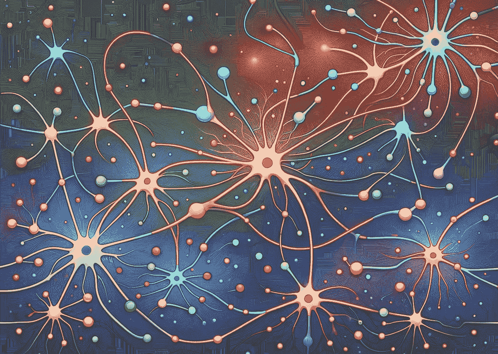

# 功能数据中的密度核深度异常检测

> 原文：[`www.kdnuggets.com/density-kernel-depth-for-outlier-detection-in-functional-data`](https://www.kdnuggets.com/density-kernel-depth-for-outlier-detection-in-functional-data)

图像由 DALLE-3 生成

# 介绍

* * *

## 我们的前三大课程推荐

 1\. [谷歌网络安全证书](https://www.kdnuggets.com/google-cybersecurity) - 快速进入网络安全职业生涯。

 2\. [谷歌数据分析专业证书](https://www.kdnuggets.com/google-data-analytics) - 提升你的数据分析能力

 3\. [谷歌 IT 支持专业证书](https://www.kdnuggets.com/google-itsupport) - 支持你的组织进行 IT 工作

* * *

在当今大数据集和复杂数据模式的时代，检测异常值或离群点的艺术与科学变得更加细致。尽管传统的异常检测技术能够有效处理标量或多变量数据，但功能数据——即由曲线、表面或任何连续体组成的数据——带来了独特的挑战。为了解决这一问题，已经开发出一种开创性的技术，即“密度核深度”（DKD）方法。

在这篇文章中，我们将深入探讨 DKD 的概念及其在功能数据异常检测中的影响，站在数据科学家的角度来看。

# 1\. 理解功能数据

在深入探讨 DKD 的复杂性之前，了解功能数据的定义是至关重要的。与传统的标量数据点不同，功能数据由曲线或函数组成。可以把它想象成将整个曲线作为一个数据观察值。这类数据通常出现在时间上连续测量的情况，比如一天中的温度曲线或股市轨迹。

给定一个在域*D*上观察到的*n*条曲线的数据集，每条曲线可以表示为：

# 2\. 功能数据中异常检测的挑战

对于标量数据，我们可能会计算均值和标准差，然后基于数据点距离均值的标准差数量来确定异常值。

对于功能数据，这种方法更为复杂，因为每个观察值都是一条曲线。

一种测量曲线中心性的办法是计算其相对于其他曲线的“深度”。例如，使用一种简单的深度度量：

其中 n 是曲线的总数。

虽然上述内容是简化表示，但实际上，功能数据集可能包含数千条曲线，这使得视觉离群点检测具有挑战性。像深度度量这样的数学公式提供了一种更结构化的方法来评估每条曲线的中心性，并可能检测到离群点。

在实际场景中，需要更高级的方法，如密度核深度，以有效确定功能数据中的离群点。

# 3\. DKD 的工作原理

DKD 通过将每条曲线在每个点的密度与该点上整个数据集的总体密度进行比较来工作。密度通过核方法进行估计，这些方法是非参数技术，允许在复杂的数据结构中估计密度。

对于每条曲线，DKD 在每个点上评估其“异常性”，并将这些值在整个领域上积分。结果是一个代表曲线深度的单一数字。较低的值表示潜在的离群点。

给定曲线 *Xi*?(*t*) 在点 *t* 的核密度估计定义为：

其中：

+   K (.) 是核函数，通常是高斯核。

+   *h* 是带宽参数。

核函数 *K* (.) 和带宽 *h* 的选择可以显著影响 DKD 值：

+   **核函数**：由于其平滑特性，高斯核常被使用。

+   **带宽** **?**：它决定了密度估计的平滑度。通常使用交叉验证方法来选择最佳的 *h*。

# 3\. 密度核深度计算

曲线 *Xi*?(*t*) 在点 t 相对于整个数据集的深度计算为：

其中：

每条曲线得到的 DKD 值提供了其中心性的度量：

+   DKD 值较高的曲线更接近数据集的中心。

+   DKD 值较低的曲线是潜在的离群点。

# 4\. 使用 DKD 进行功能数据分析的优势

**灵活性**：DKD 对数据的基础分布没有强假设，使其对各种功能数据结构都很通用。

**可解释性**：通过为每条曲线提供一个深度值，DKD 使理解哪些曲线是中心的，哪些是潜在的离群点变得直观。

**效率**：尽管复杂，DKD 在计算上是高效的，使其适用于大型功能数据集。

# 5\. 实际应用

想象一个场景，其中数据科学家正在分析患者 24 小时内的心率曲线。传统的异常值检测可能会将偶尔的高心率读数标记为异常。然而，使用功能数据分析和 DKD，整个异常的心率曲线——可能指示心律失常——可以被检测到，提供对患者健康的更全面视角。

# 结论

随着数据复杂性的不断增长，用于分析这些数据的工具和技术必须同步演变。密度核深度提供了一种有前景的方法来应对功能数据的复杂格局，确保数据科学家能够自信地检测异常值并从中得出有意义的见解。虽然 DKD 只是数据科学家工具箱中的众多工具之一，但它在功能数据分析中的潜力是不可否认的，并且有望为未来更复杂的分析技术铺平道路。

****[Kulbir Singh](https://www.linkedin.com/in/kulbirsingh8)**** 是分析和数据科学领域的杰出领袖，拥有超过二十年的信息技术经验。他的专业知识广泛，包括领导力、数据分析、机器学习、人工智能（AI）、创新解决方案设计和问题解决。目前，Kulbir 担任 Elevance Health 的健康信息经理。Kulbir 对人工智能（AI）的进步充满热情，创办了 AIboard.io，这是一个致力于创建以 AI 和医疗保健为中心的教育内容和课程的创新平台。

### 更多相关内容

+   [Pythia：16 个 LLM 的研究套件](https://www.kdnuggets.com/2023/08/pythia-suite-16-llms-indepth-research.html)

+   [理解机器学习算法：深入概述](https://www.kdnuggets.com/understanding-machine-learning-algorithms-an-indepth-overview)

+   [利用密度链提示解锁 GPT-4 总结](https://www.kdnuggets.com/unlocking-gpt-4-summarization-with-chain-of-density-prompting)

+   [数据科学中异常检测技术的初学者指南](https://www.kdnuggets.com/2023/05/beginner-guide-anomaly-detection-techniques-data-science.html)

+   [KDnuggets 新闻，8 月 17 日：如何使用…进行运动检测](https://www.kdnuggets.com/2022/n33.html)

+   [如何使用 Python 进行运动检测](https://www.kdnuggets.com/2022/08/perform-motion-detection-python.html)
