# 在 AWS Fargate 上部署机器学习管道

> 原文：[`www.kdnuggets.com/2020/07/deploy-machine-learning-pipeline-aws-fargate.html`](https://www.kdnuggets.com/2020/07/deploy-machine-learning-pipeline-aws-fargate.html)

评论

**由 [Moez Ali](https://www.linkedin.com/in/profile-moez/)，PyCaret 创始人兼作者**

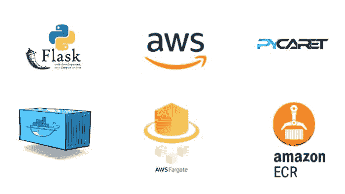

### 总结

在我们 [上一篇文章](https://towardsdatascience.com/deploy-machine-learning-model-on-google-kubernetes-engine-94daac85108b) 中，我们展示了如何在云中开发机器学习管道，使用 PyCaret 容器化，并通过 Google Kubernetes Engine 作为 Web 应用进行服务。如果你以前没有听说过 PyCaret，请阅读这个 [公告](https://towardsdatascience.com/announcing-pycaret-an-open-source-low-code-machine-learning-library-in-python-4a1f1aad8d46) 以了解更多。

在本教程中，我们将使用之前构建和部署的相同机器学习管道和 Flask 应用。这一次，我们将演示如何使用 AWS Fargate 将机器学习管道容器化并进行无服务器部署。

### ???? 本教程的学习目标

+   什么是容器？什么是 Docker？什么是 Kubernetes？

+   什么是 Amazon Elastic Container Service (ECS)？

+   什么是 AWS Fargate 和无服务器部署？

+   构建并推送 Docker 镜像到 Amazon Elastic Container Registry。

+   使用 AWS 管理的基础设施（即 AWS Fargate）创建并执行任务定义。

+   看到一个实际运行的 Web 应用，它使用训练好的机器学习管道实时预测新数据点。

本教程将涵盖从本地构建 Docker 镜像、将其上传到 Amazon Elastic Container Registry、创建集群，然后使用 AWS 管理的基础设施（即 AWS Fargate）定义和执行任务的整个工作流程。

在过去，我们已经涵盖了在其他云平台如 Azure 和 Google 上的部署。如果你对了解这些感兴趣，可以阅读以下故事：

+   [在 Google Kubernetes Engine 上部署机器学习管道](https://towardsdatascience.com/deploy-machine-learning-model-on-google-kubernetes-engine-94daac85108b)

+   [在 AWS Web 服务上部署机器学习管道](https://towardsdatascience.com/deploy-machine-learning-pipeline-on-cloud-using-docker-container-bec64458dc01)

+   [在 Heroku PaaS 上构建并部署你的第一个机器学习 Web 应用](https://towardsdatascience.com/build-and-deploy-your-first-machine-learning-web-app-e020db344a99)

### ???? 本教程所需工具箱

### PyCaret

[PyCaret](https://www.pycaret.org/) 是一个开源的、低代码的 Python 机器学习库，用于训练和部署机器学习管道和模型到生产环境中。PyCaret 可以通过 pip 轻松安装。

```py
pip install pycaret
```

### Flask

[Flask](https://flask.palletsprojects.com/en/1.1.x/) 是一个允许你构建 web 应用程序的框架。web 应用程序可以是商业网站、博客、电子商务系统，或是利用训练模型从实时提供的数据中生成预测的应用程序。如果你还没有安装 Flask，你可以使用 pip 来安装它。

### Docker Toolbox for Windows 10 Home

[Docker](https://www.docker.com/) 是一个旨在通过使用容器简化应用程序创建、部署和运行的工具。容器用于将应用程序与其所有必要组件（如库和其他依赖项）打包，并作为一个整体进行分发。如果你以前没有使用过 Docker，本教程还涵盖了在**Windows 10 Home**上安装 Docker Toolbox（遗留版）。在[前一教程](https://towardsdatascience.com/deploy-machine-learning-pipeline-on-cloud-using-docker-container-bec64458dc01)中，我们讲解了如何在**Windows 10 Pro 版**上安装 Docker Desktop。

### 亚马逊网络服务（AWS）

亚马逊网络服务（AWS）是一个全面且广泛采用的云平台，由亚马逊提供。它在全球数据中心提供超过 175 种功能齐全的服务。如果你以前没有使用过 AWS，你可以[注册](https://aws.amazon.com/)一个免费账户。

### ✔️让我们开始吧……

### 什么是容器？

在我们开始使用 AWS Fargate 进行实现之前，先来了解一下什么是容器，以及我们为什么需要它？


[`www.freepik.com/free-photos-vectors/cargo-ship`](https://www.freepik.com/free-photos-vectors/cargo-ship)

你是否曾遇到过这样的情况：你的代码在你的电脑上运行良好，但当朋友尝试运行完全相同的代码时，它却无法运行？如果你的朋友重复完全相同的步骤，他或她应该会得到相同的结果，对吧？这个一词答案就是***环境***。你朋友的环境与你的不同。

环境包括什么？→ 包括编程语言（如 Python）以及构建和测试应用程序时使用的所有库和依赖项的确切版本。

如果我们能创建一个可以转移到其他机器的环境（例如：你朋友的电脑或像 Google Cloud Platform 这样的云服务提供商），我们就可以在任何地方重现结果。因此，***容器*** 是一种软件类型，它打包了应用程序及其所有依赖项，使得应用程序能够在一个计算环境到另一个计算环境之间可靠运行。

### 什么是 Docker？

Docker 是一家公司，提供名为**Docker**的软件，允许用户构建、运行和管理容器。虽然 Docker 的容器是最常见的，但也有其他不那么知名的*替代品*，如[LXD](https://linuxcontainers.org/lxd/introduction/)和[LXC](https://linuxcontainers.org/)。


现在你在理论上理解了容器是什么以及 Docker 如何用于容器化应用程序，让我们设想一个场景，你需要在一组机器上运行多个容器，以支持一个企业级的机器学习应用程序，在白天和夜晚处理不同的工作负载。这在现实生活中相当常见，虽然听起来简单，但手动完成是非常繁重的工作。

你需要在正确的时间启动正确的容器，搞清楚它们如何互相通信，处理存储问题，应对失败的容器或硬件以及其他各种问题！

管理数百个甚至数千个容器以保持应用程序正常运行的整个过程被称为 **容器编排**。现在不要被技术细节困住。

此时，你必须认识到管理实际应用程序需要多个容器，并且管理所有基础设施以保持容器运行是繁琐、手动且具有管理负担的。

这将我们引向 **Kubernetes**。

### 什么是 Kubernetes？

Kubernetes 是一个由 Google 于 2014 年开发的开源系统，用于管理容器化应用程序。简单来说，Kubernetes 是一个用于在一群机器上运行和协调容器化应用程序的系统。


由 [chuttersnap](https://unsplash.com/@chuttersnap?utm_source=medium&utm_medium=referral) 在 [Unsplash](https://unsplash.com/?utm_source=medium&utm_medium=referral) 拍摄的照片

虽然 Kubernetes 是由 Google 开发的开源系统，但几乎所有主要的云服务提供商都将 Kubernetes 作为托管服务提供。例如：**亚马逊弹性 Kubernetes 服务 (EKS) 由亚马逊提供**，**Google Kubernetes 引擎 (GKE) 由 Google 提供**，**和** Azure Kubernetes 服务 (AKS) **由微软提供**。

到目前为止，我们已经讨论和理解了：

✔️ 一个 ***容器***

✔️ Docker

✔️ Kubernetes

在介绍 AWS Fargate 之前，还剩下一件事要讨论，那就是亚马逊自家的容器编排服务 **Amazon Elastic Container Service (ECS)**。

### AWS 弹性容器服务 (ECS)

亚马逊弹性容器服务 (Amazon ECS) 是亚马逊自家研发的容器编排平台。ECS 的理念类似于 Kubernetes *(它们都是编排服务)*。

ECS 是 AWS 原生服务，这意味着它只能在 AWS 基础设施上使用。另一方面，**EKS** 基于 Kubernetes，这是一个开源项目，适用于运行在多云（AWS、GCP、Azure）甚至本地环境中的用户。

亚马逊还提供了一种基于 Kubernetes 的容器编排服务，称为 **Amazon Elastic Kubernetes Service (Amazon EKS)。** 尽管 ECS 和 EKS 的目的非常相似，即 *编排容器化应用程序*，但在定价、兼容性和安全性方面存在一些差异。没有最佳答案，解决方案的选择取决于使用案例。

无论你使用的是哪种容器编排服务（ECS 或 EKS），你可以通过两种方式来实现底层基础设施：

1.  手动管理集群和底层基础设施，如虚拟机/服务器（也称为 AWS 中的 EC2 实例）。

1.  无服务器 — 完全不需要管理任何东西。只需上传容器即可。← **这就是 AWS Fargate。**

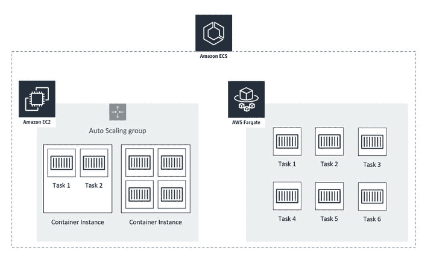

Amazon ECS 底层基础设施

### AWS Fargate — 为容器提供无服务器计算

AWS Fargate 是一种无服务器计算引擎，支持与 Amazon Elastic Container Service (ECS) 和 Amazon Elastic Kubernetes Service (EKS) 一起使用。Fargate 使你能够专注于构建应用程序。Fargate 消除了配置和管理服务器的需要，允许你按应用程序指定和支付资源，并通过设计上的应用隔离来提高安全性。

Fargate 分配合适的计算资源，消除了选择实例和扩展集群容量的需要。你只为运行容器所需的资源付费，因此无需担心资源过度配置或额外服务器的费用。


AWS Fargate 的工作原理 — [`aws.amazon.com/fargate/`](https://aws.amazon.com/fargate/)

哪种方法更好没有最优答案。选择无服务器还是手动管理 EC2 集群取决于具体的使用案例。一些可以帮助你做出选择的指针包括：

**ECS EC2（手动方法）**

+   你完全依赖于 AWS。

+   你有一个专门的运维团队来管理 AWS 资源。

+   你在 AWS 上已有现有的足迹，即你已经在管理 EC2 实例

**AWS Fargate**

+   你没有一个庞大的运维团队来管理 AWS 资源。

+   你不想承担操作责任或希望减少操作责任。

+   你的应用程序是无状态的 *（无状态应用程序是指在一个会话中生成的客户端数据不会保存到下一次会话中使用的应用程序）*。

### 设置业务背景

一家保险公司希望通过更好地预测住院时的患者费用来改善其现金流预测，使用的是人口统计数据和基本的患者健康风险指标。


*(*[*数据源*](https://www.kaggle.com/mirichoi0218/insurance#insurance.csv)*)*

### 目标

构建和部署一个 Web 应用程序，其中患者的群体和健康信息输入到一个基于 Web 的表单中，然后输出预测的费用金额。

### 任务

+   训练和开发用于部署的机器学习管道。

+   使用 Flask 框架构建 Web 应用程序。它将使用训练好的 ML 管道实时生成新数据点的预测。

+   将 Docker 镜像构建并推送到 Amazon Elastic Container Registry。

+   创建并执行一个任务，使用 AWS Fargate 无服务器基础设施部署应用程序。

由于我们已经在初始教程中涵盖了前两个任务，我们将快速回顾它们，然后关注上面列表中的剩余项目。如果你有兴趣了解更多关于使用 PyCaret 开发机器学习管道和使用 Flask 框架构建 Web 应用程序的内容，请阅读 [本教程](https://towardsdatascience.com/build-and-deploy-your-first-machine-learning-web-app-e020db344a99)。

### ???? 开发机器学习管道

我们在 Python 中使用 PyCaret 训练和开发机器学习管道，该管道将作为我们 Web 应用程序的一部分。机器学习管道可以在集成开发环境（IDE）或 Notebook 中开发。我们使用了 Notebook 来运行以下代码：

当你在 PyCaret 中保存模型时，基于 **setup() **函数中定义的配置创建了整个转换管道。所有相互依赖关系都自动协调。查看存储在‘deployment_28042020’变量中的管道和模型：


使用 PyCaret 创建的机器学习管道

### ???? 构建 Web 应用程序

本教程不专注于构建 Flask 应用程序。这里只是为了完整性进行讨论。现在我们的机器学习管道已准备好，我们需要一个 Web 应用程序来连接到我们训练好的管道，以实时生成新数据点的预测。我们使用 Python 中的 Flask 框架创建了 Web 应用程序。此应用程序分为两个部分：

+   前端（使用 HTML 设计）

+   后端（使用 Flask 开发）

这就是我们的 Web 应用程序的样子：

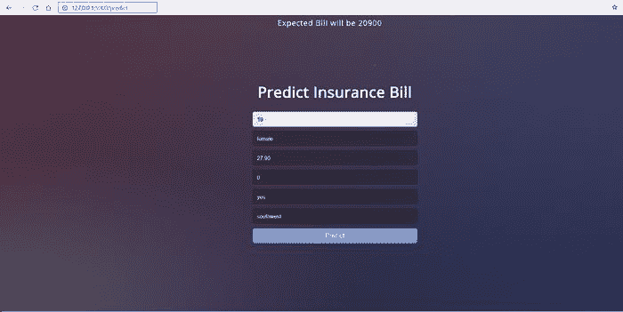

本地机器上的 Web 应用程序

如果你到目前为止没有跟上进度，没关系。你可以从 GitHub 上简单地 fork 这个 [仓库](https://www.github.com/pycaret/pycaret-deployment-aws)。这就是此时你的项目文件夹的样子：

### 使用 AWS Fargate 部署 ML 管道的 10 个步骤：

### ???? 步骤 1 — 安装 Docker Toolbox（适用于 Windows 10 家庭版）

为了在本地构建 Docker 镜像，你需要在计算机上安装 Docker。如果你使用的是 Windows 10 64 位：专业版、企业版或教育版（构建版本 15063 或更高），你可以从 [DockerHub](https://hub.docker.com/editions/community/docker-ce-desktop-windows/) 下载 Docker Desktop。

然而，如果你使用的是 Windows 10 家庭版，你需要从 [Docker 的 GitHub 页面](https://github.com/docker/toolbox/releases) 安装最后一版的旧版 Docker Toolbox（v19.03.1）。

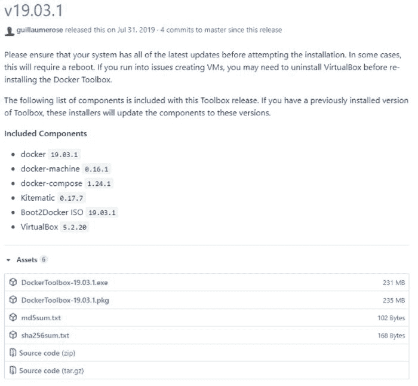

[`github.com/docker/toolbox/releases`](https://github.com/docker/toolbox/releases)

下载并运行 **DockerToolbox-19.03.1.exe** 文件。

检查安装是否成功的最简单方法是打开命令提示符并输入‘docker’。它应该打印出帮助菜单。


使用 Anaconda Prompt 检查 Docker

### ???? 步骤 2— 创建 Dockerfile

创建 Docker 镜像的第一步是在项目目录中创建一个 Dockerfile。Dockerfile 只是一个包含一组指令的文件。这个项目的 Dockerfile 如下：

Dockerfile 是区分大小写的，必须与其他项目文件一起放在项目文件夹中。Dockerfile 没有扩展名，可以使用任何文本编辑器创建。你可以从这个 [GitHub 存储库](https://www.github.com/pycaret/pycaret-deployment-aws) 下载本项目中使用的 Dockerfile。

### ???? 步骤 3— 在 Elastic Container Registry (ECR) 中创建一个存储库

**(a) 登录到你的 AWS 控制台并搜索 Elastic Container Registry：**

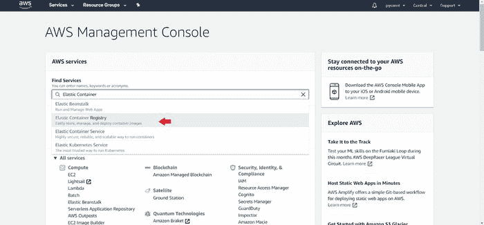

AWS 控制台

**(b) 创建一个新的存储库：**

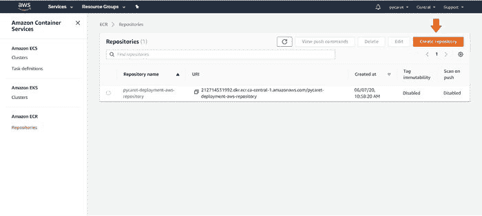

在 Amazon Elastic Container Registry 上创建新存储库

*为了这个演示，我们创建了‘pycaret-deployment-aws-repository’。*

**(c) 点击“查看推送命令”：**

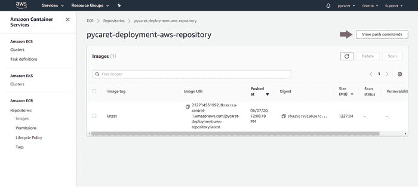

pycaret-deployment-aws-repository

**(d) 复制推送命令：**


pycaret-deployment-aws-repository 的推送命令

### ???? 步骤 4— 执行推送命令

使用 Anaconda Prompt 导航到你的项目文件夹，并执行你在上一步中复制的命令。下面的代码仅用于演示，可能无法直接使用。要获得正确的执行代码，你必须从存储库中的“查看推送命令”获取一份代码。

在执行这些命令之前，你必须位于包含 Dockerfile 和其他代码的文件夹中。

```py
**Command 1**
aws ecr get-login-password --region ca-central-1 | docker login --username AWS --password-stdin 212714531992.dkr.ecr.ca-central-1.amazonaws.com**Command 2**
docker build -t pycaret-deployment-aws-repository .**Command 3**
docker tag pycaret-deployment-aws-repository:latest 212714531992.dkr.ecr.ca-central-1.amazonaws.com/pycaret-deployment-aws-repository:latest**Command 4**
docker push 212714531992.dkr.ecr.ca-central-1.amazonaws.com/pycaret-deployment-aws-repository:latest
```

### ???? 步骤 5— 检查你上传的镜像

点击你创建的存储库，你将看到在上述步骤中上传的镜像的 URI。复制镜像 URI（在下面的步骤 7 中会用到）。


### ???? 步骤 6 — 创建和配置集群

**(a) 点击左侧菜单中的“集群”：**

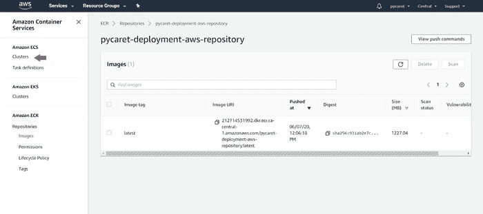

创建集群 — 步骤 1

**(b) 选择“仅网络”并点击下一步：**

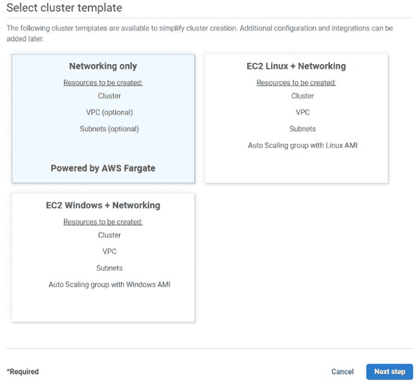

选择仅网络模板

**(c) 配置集群（输入集群名称）并点击创建：**

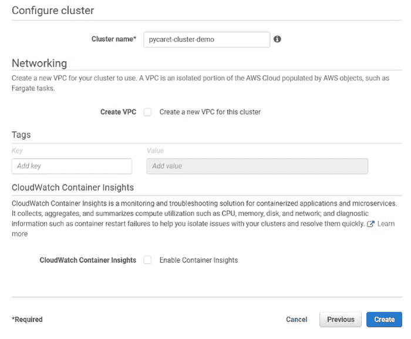

配置集群

**(d) 集群创建完成：**


集群已创建

### ???? 步骤 7— 创建一个新的任务定义

一个**任务**定义是运行 Amazon ECS 中的 Docker 容器所必需的。您可以在**任务**定义中指定的一些参数包括：每个容器使用的 Docker 镜像。每个**任务**或**任务**中每个容器使用的 CPU 和内存量。

**(a) 点击“创建新任务定义”：**


创建新任务定义

**(b) 选择“FARGATE”作为启动类型：**

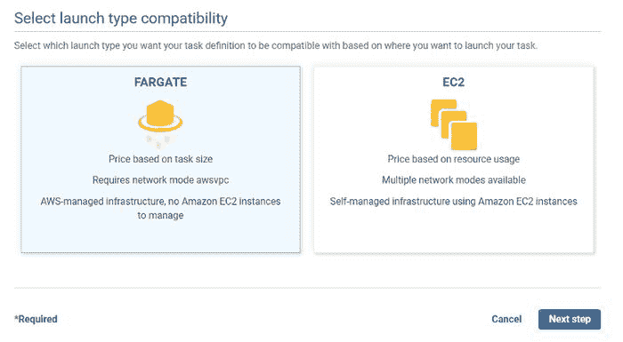

选择启动类型兼容性

**(c) 填写详细信息：**


配置任务和容器定义（第一部分）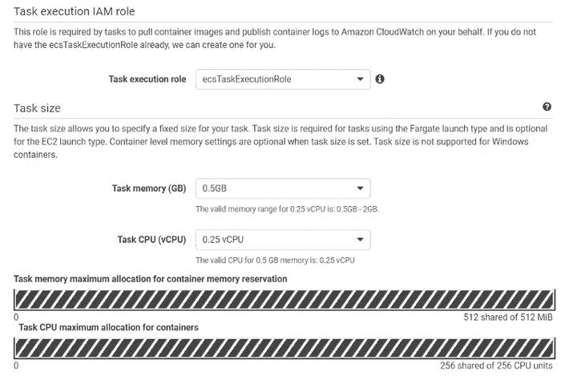

配置任务和容器定义（第二部分）

**(d) 点击“添加容器”并填写详细信息：**

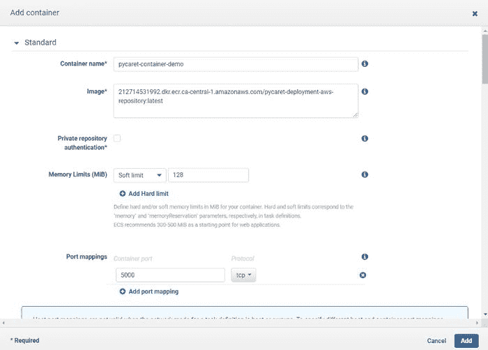

在任务定义中添加容器

**(e) 点击右下角的“创建任务”。**


### ???? 第 8 步 — 执行任务定义

在第 7 步中，我们创建了一个将启动容器的任务。现在我们将通过点击**“运行任务”**在操作下执行任务。


执行任务定义

**(a) 点击“切换启动类型”将类型更改为 Fargate：**

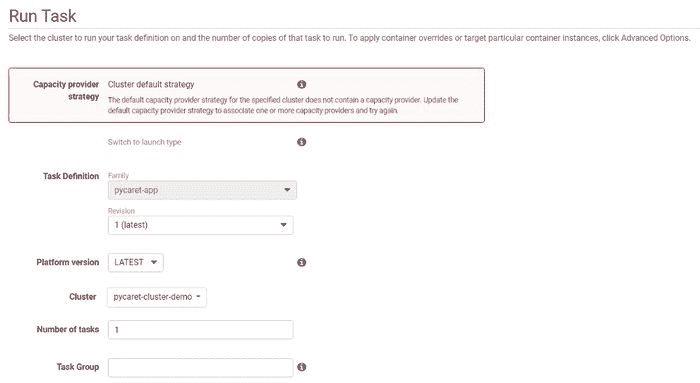

运行任务 — 第一部分

**(b) 从下拉菜单中选择 VPC 和子网：**


运行任务 — 第二部分

**(c) 点击右下角的“运行任务”：**

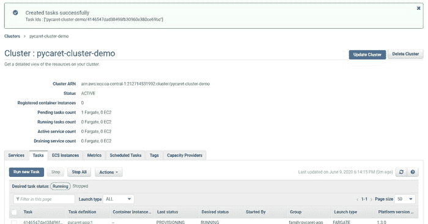

任务创建成功

### ???? 第 9 步— 从网络设置中允许入站端口 5000

在我们可以在公共 IP 地址上查看应用运行之前的最后一步是通过创建新规则来允许端口 5000。为此，请按以下步骤操作：

**(a) 点击任务**

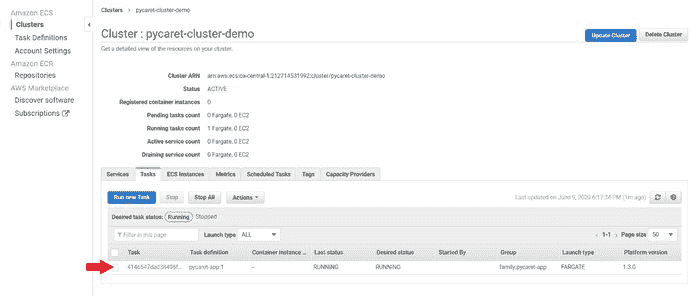

**(b) 点击 ENI Id：**

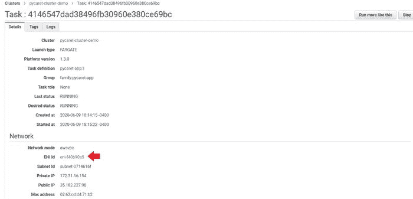

**(c) 点击安全组**


**(d) 点击“编辑入站规则”**

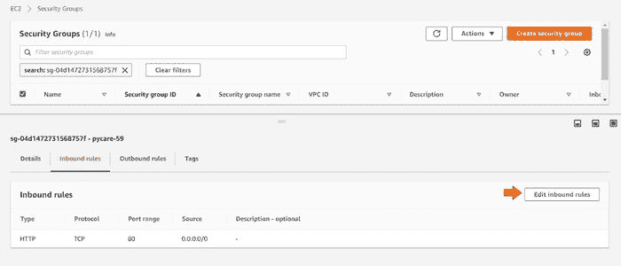

**(e) 添加端口 5000 的自定义 TCP 规则**

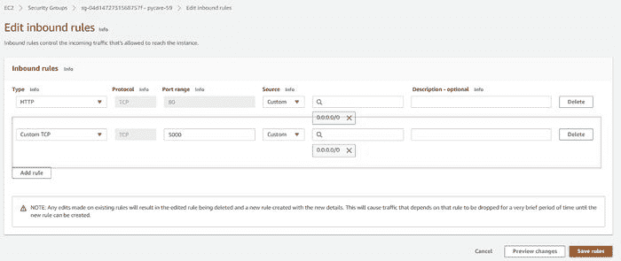

### ???? 第 10 步 — 查看应用运行情况

使用公共 IP 地址和端口 5000 访问应用程序。


任务定义日志

最终应用上传至[`35.182.227.98:5000`](http://35.182.227.98:5000/)

**注意：**  在这篇文章发布时，该应用将从公共地址中移除，以限制资源消耗。

### PyCaret 2.0.0 即将来临！

我们收到了来自社区的热烈支持和反馈。我们正在积极改进 PyCaret，并为下一个版本做准备。**PyCaret 2.0.0 将更大更好**。如果你想分享你的反馈并帮助我们进一步改进，你可以在网站上 [填写此表单](https://www.pycaret.org/feedback) 或在我们的 [GitHub](https://www.github.com/pycaret/) 或 [LinkedIn](https://www.linkedin.com/company/pycaret/) 页面留言。

关注我们的 [LinkedIn](https://www.linkedin.com/company/pycaret/) 和订阅我们的 [YouTube](https://www.youtube.com/channel/UCxA1YTYJ9BEeo50lxyI_B3g) 频道，以了解更多关于 PyCaret 的信息。

### 想了解特定模块吗？

从 1.0.0 版本首次发布开始，PyCaret 提供了以下模块供使用。点击下面的链接查看 Python 中的文档和工作示例。

+   [分类](https://www.pycaret.org/classification)

+   [回归](https://www.pycaret.org/regression)

+   [聚类](https://www.pycaret.org/clustering)

+   [异常检测](https://www.pycaret.org/anomaly-detection)

+   [自然语言处理](https://www.pycaret.org/nlp)

+   [关联规则挖掘](https://www.pycaret.org/association-rules)

### 另见:

PyCaret 入门教程在 Notebook 中：

+   [聚类](https://www.pycaret.org/clu101)

+   [异常检测](https://www.pycaret.org/anom101)

+   [自然语言处理](https://www.pycaret.org/nlp101)

+   [关联规则挖掘](https://www.pycaret.org/arul101)

+   [回归](https://www.pycaret.org/reg101)

+   [分类](https://www.pycaret.org/clf101)

### 你想要贡献吗？

PyCaret 是一个开源项目。欢迎大家贡献。如果你想贡献，请随时处理 [开放问题](https://github.com/pycaret/pycaret/issues)。拉取请求将接受 dev-1.0.1 分支上的单元测试。

如果你喜欢 PyCaret，请在我们的 [GitHub 仓库](https://www.github.com/pycaret/pycaret) 上给我们 ⭐️。

Medium: [`medium.com/@moez_62905/`](https://medium.com/@moez_62905/machine-learning-in-power-bi-using-pycaret-34307f09394a)

LinkedIn: [`www.linkedin.com/in/profile-moez/`](https://www.linkedin.com/in/profile-moez/)

推特: [`twitter.com/moezpycaretorg1`](https://twitter.com/moezpycaretorg1)

**简介: [Moez Ali](https://www.linkedin.com/in/profile-moez/)** 是一位数据科学家，也是 PyCaret 的创始人兼作者。

[原文](https://towardsdatascience.com/deploy-machine-learning-pipeline-on-aws-fargate-eb6e1c50507)。已获许可转载。

**相关:**

+   使用 Docker 容器将机器学习管道部署到云

+   构建并部署你的第一个机器学习 web 应用

+   宣布 PyCaret 1.0.0

* * *

## 我们的前 3 个课程推荐

 1\. [Google 网络安全证书](https://www.kdnuggets.com/google-cybersecurity) - 快速进入网络安全职业轨道。

 2\. [Google 数据分析专业证书](https://www.kdnuggets.com/google-data-analytics) - 提升你的数据分析技能

 3\. [Google IT 支持专业证书](https://www.kdnuggets.com/google-itsupport) - 支持你的组织进行 IT 工作

* * *

### 更多相关内容

+   [成为优秀数据科学家所需的 5 项关键技能](https://www.kdnuggets.com/2021/12/5-key-skills-needed-become-great-data-scientist.html)

+   [每个初学者数据科学家应掌握的 6 种预测模型](https://www.kdnuggets.com/2021/12/6-predictive-models-every-beginner-data-scientist-master.html)

+   [2021 年最佳 ETL 工具](https://www.kdnuggets.com/2021/12/mozart-best-etl-tools-2021.html)

+   [停止学习数据科学以寻找目标，并通过寻找目标来…](https://www.kdnuggets.com/2021/12/stop-learning-data-science-find-purpose.html)

+   [学习数据科学统计学的顶级资源](https://www.kdnuggets.com/2021/12/springboard-top-resources-learn-data-science-statistics.html)

+   [成功数据科学家的 5 个特征](https://www.kdnuggets.com/2021/12/5-characteristics-successful-data-scientist.html)
