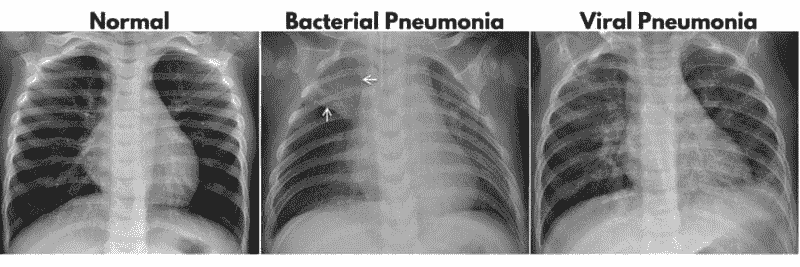
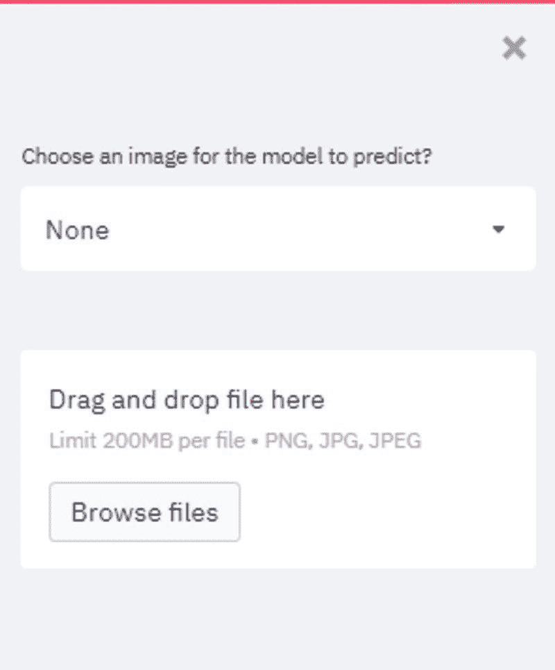
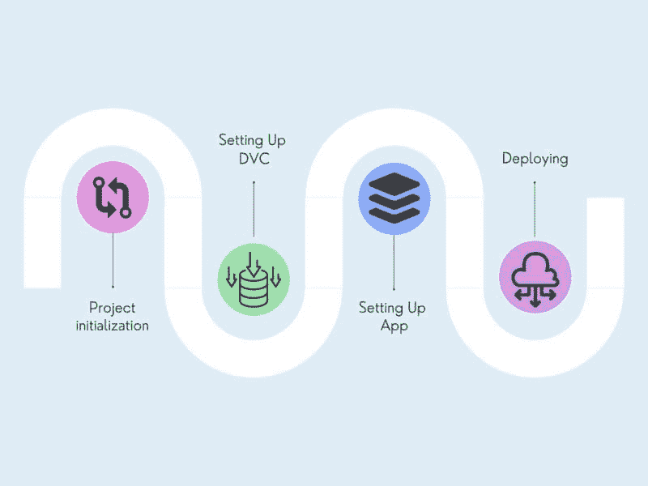
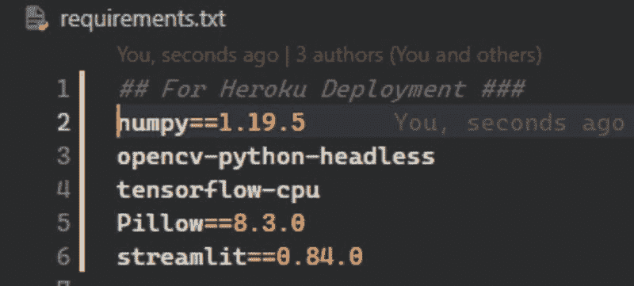
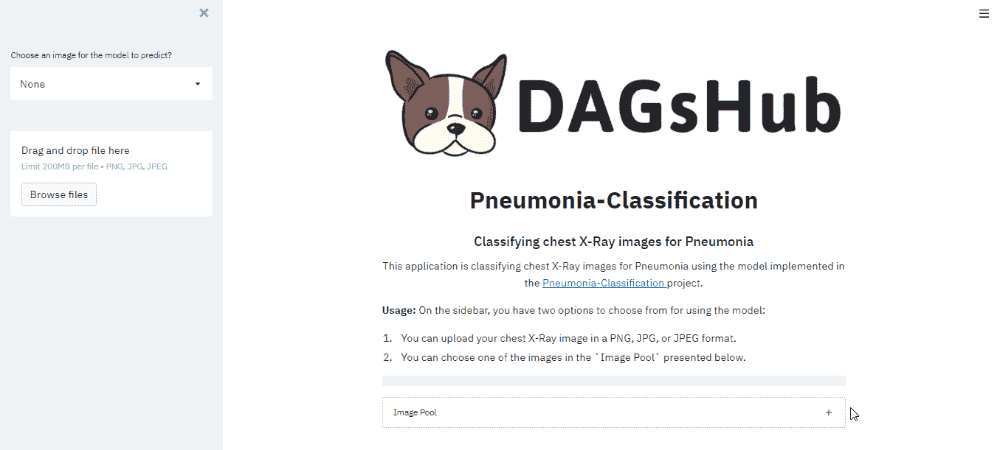

# 使用 DAGsHub 将 Streamlit Web 应用程序部署到 Heroku

> 原文：[`www.kdnuggets.com/2022/02/deploying-streamlit-webapp-heroku-dagshub.html`](https://www.kdnuggets.com/2022/02/deploying-streamlit-webapp-heroku-dagshub.html)


作者封面

作为初学者，很难意识到项目的最终产品应该是什么样的。你从一个基础的机器学习流程开始，随着项目的演进，你调整和增强组件以满足你的最终标准。但旅程并未止步于此。为了与世界分享你的工作，你希望有一种方式让人们与模型互动并评估其性能。在这篇博客中，我们将学习如何仅使用 Python 构建一个 Streamlit 应用程序，并将其部署到远程 Heroku 服务器上。

* * *

## 我们的前三个课程推荐

 1\. [Google 网络安全证书](https://www.kdnuggets.com/google-cybersecurity) - 快速进入网络安全职业的快车道

 2\. [Google 数据分析专业证书](https://www.kdnuggets.com/google-data-analytics) - 提升你的数据分析技能

 3\. [Google IT 支持专业证书](https://www.kdnuggets.com/google-itsupport) - 支持你的组织的 IT 需求

* * *

### 示例项目 - 肺炎分类

我们将使用[Pneumonia-Classification](https://dagshub.com/nirbarazida/pneumonia-Classification/)项目，并展示如何将其 Streamlit 应用程序部署到云端。该项目分为五个任务：数据标注、数据处理、建模、评估和 Streamlit。我们将使用在[Kaggle](https://www.kaggle.com/paultimothymooney/chest-xray-pneumonia)上可获得的胸部 X 光数据集。数据集包含 5,863 张正面胸部 X 光图像。它被分为三个文件夹：**train**、**test**、**val**，每个文件夹包含子文件夹**Pneumonia**和**Normal**。我们的数据集使用[CC BY 4.0](https://creativecommons.org/licenses/by/4.0/)许可，可以用于商业用途。我们将重点关注创建 Web 应用程序并将其部署到云端，但如果你想了解更多数据预处理和模型构建的内容，可以查看[项目](https://dagshub.com/kingabzpro/Pneumonia-Classification/src/DVC)。



图片由[Cell](http://www.cell.com/cell/fulltext/S0092-8674(18)30154-5)提供

### 什么是 Streamlit？

[Streamlit](https://streamlit.io/) 是一个开源库，允许你仅使用 Python 构建网页应用程序。它提供了自定义选项，可以根据你的需求设计应用程序，而无需任何网页开发的先验知识。使用 Streamlit，数据科学从业者可以通过构建一个 *用于他们模型* 的网页应用程序，轻松地与技术同事或非技术利益相关者沟通他们的工作。

### 如何创建一个 Streamlit 应用程序

在本节中，我们将重点学习 Streamlit 的核心组件，并简要了解其他组件如何帮助我们创建互动的 Streamlit 应用程序。核心组件包括选择或上传图像、加载 Tensorflow 模型和运行预测以显示结果。

**我们在应用程序中使用的其他组件：**

+   [**页面设置**](https://docs.streamlit.io/library/api-reference/utilities/st.set_page_config)**:** 用于设置头部、图标和应用程序的初始配置。

+   [**Markdown**](https://docs.streamlit.io/library/api-reference/text/st.markdown)**:** 用于编写标题、副标题和描述。

+   [**图像**](https://docs.streamlit.io/library/api-reference/media/st.image)**:** 用于显示封面图像。

+   [**展开器**](https://docs.streamlit.io/library/api-reference/layout/st.expander)**:** 多元素容器，可以展开/折叠，用于图像池。

+   [**列**](https://docs.streamlit.io/library/api-reference/layout/st.columns)**:** 用于创建图像池表格。

+   [**进度条**](https://docs.streamlit.io/library/api-reference/status/st.progress)**:** 显示运行模型推断的进度条。

### 选择与上传

streamlit 的 [侧边栏](https://docs.streamlit.io/library/api-reference/layout/st.sidebar) 功能非常方便，因为它允许我们在应用程序中添加额外的功能。侧边栏选项增加了 **selectbox** 和 **file**_**uploader** 的额外交互性。选择框是一个下拉选项框，允许我们从健康或生病的 X 光图像中进行选择。file_uploader 允许我们上传新的 X 光图像进行肺炎预测。

+   selectbox**:** 下拉选项用于选择单一选项。

+   file_uploader**:** 将 X 光图像上传到应用程序。

```py
selectbox = st.sidebar.selectbox(SELECT_BOX_TEXT,
                       [None] + healthy_sidebar_list + sick_sidebar_list)

file_buffer = st.sidebar.file_uploader("", type=SUPPORTED_IMG_TYPE)
```



侧边栏的选择框和文件上传器图像

### 模型预测

模型预测使用 tensorflow 加载模型并预测分类。下面的函数在选择了选项或上传了图像后激活。

```py
if selectbox:
        predict_for_selectbox(selectbox, my_bar, latest_iteration)
        dict_of_img_lists = load_image_pool()

if file_buffer:
        predict_for_file_buffer(file_buffer, my_bar, latest_iteration)
```

`get_prediction` 函数加载 Tensorflow 模型，对图像（已选择/上传）进行预测并显示结果。

```py
@st.cache(suppress_st_warning=True)
def get_prediction(img):
    with open(CLASS_NAME_PATH, "r") as textfile:
        class_names = textfile.read().split(',')

    img_expand = np.expand_dims(img, 0)

    model = tf.keras.models.load_model(PROD_MODEL_PATH)
    predictions = model.predict(img_expand)
    display_prediction(class_names[np.rint(predictions[0][0]).astype(int)])
```

我还使用了 streamlit [进度条](https://docs.streamlit.io/library/api-reference/status/st.progress)函数来显示进度条。我们还使用了 streamlit 的 **成功** 和 **警告** 函数来显示预测结果。

```py
latest_iteration = st.empty()
my_bar = st.progress(0)

def display_prediction(pred):
    if pred == 'sick':
        st.warning(WARNING_MSG)
    else:
        st.success(SUCCESS_MSG)
```

下面的代码从选择框中读取选项并对图像进行预测。

```py
def predict_for_selectbox(selectbox, my_bar, latest_iteration):
    img_class = selectbox.split()[0]
    img_position = int(selectbox.split()[-1]) - 1
    img = dict_of_img_lists[img_class][img_position]
    my_bar.progress(50)

    latest_iteration.text('Processing image')
    get_prediction(img)
    my_bar.progress(100)
```


正在运行带有进度条的预测，进度为 50%

以下函数读取上传的文件并对图像进行预测。

```py
def predict_for_file_buffer(file_buffer, my_bar, latest_iteration):
    latest_iteration.text('Loading image')
    img = load_n_resize_image(file_buffer)
    markdown_format(MID_FONT, "Your chest X-ray")
    st.image(img, use_column_width=True)
    my_bar.progress(50)

    latest_iteration.text('Processing image')
    get_prediction(img)
    my_bar.progress(100)
```


成功的肺炎预测图像

### 下一步..

在为你的项目创建并本地运行 Streamlit 应用程序之后，是时候将其部署并与世界分享了。对于不熟悉这个过程的人来说，将应用程序部署到云端可能非常具有挑战性。在下一部分中，我们将讨论你可能遇到的主要问题，探讨解决这些问题的选项，并选择适合该任务的最佳方案。

### 为 Streamlit 应用程序选择部署服务器

选择云提供商来托管应用程序可能会让人感到[沮丧和不知所措](https://en.wikipedia.org/wiki/Overchoice#:~:text=Overchoice%20or%20choice%20overload%20is,his%201970%20book%2C%20Future%20Shock.)，因为平台的膨胀和其优势的不明确。为了帮助你，我比较了三种云服务：AWS、Heroku 和 Huggingface，它们在使用 Streamlit 设计的机器学习应用程序方面表现良好。


云服务器比较

### AWS EC2

[亚马逊云服务](https://aws.amazon.com/ec2/)提供安全且可调整大小的计算能力。EC2 允许你部署整个机器学习工作流，也可以为更好的机器进行配置。它不够用户友好，学习曲线相当陡峭。然而，EC2 通过使用 GPU 支持提供了更快的推理速度。如果你有兴趣学习和部署你的 Streamlit 应用程序使用 AWS，我建议你阅读由[Nishtha Goswami](https://medium.com/@goswaminishtha?source=post_page-----db603c69aa28-----------------------------------)撰写的精彩[博客](https://medium.com/swlh/showcase-you-streamlit-web-app-to-the-world-with-aws-ec2-db603c69aa28)。

### Hugging Face

[HuggingFace Spaces](https://huggingface.co/spaces)提供了简单的部署和快速推理解决方案，但它有一个缺点，就是你只能使用 Streamlit 或[Gradiao](https://www.gradio.app/)框架。Spaces 服务器在 DVC 集成和开发 MLOps 解决方案方面不提供灵活性，但它们提供了一种名为[Infinity](https://huggingface.co/infinity)的付费企业解决方案，具有很大的灵活性和更快的推理速度。

### Heroku

[Salesforce Heroku](https://www.heroku.com/home) 提供用户友好的体验、自动化和使用多个 [第三方集成](https://devcenter.heroku.com/categories/add-ons) 的灵活性。**偏见提示**：我第一次云端体验是使用 Heroku，因为过程极其简单，我一直在使用他们的服务。Heroku 有两个缺点：存储限制（500MB）和相较于其他云服务，模型推断速度较慢。这些缺点可以通过使用 Docker 部署和采纳优化技术来轻松解决。

### 如何在 Heroku 上部署 Streamlit 应用。

将 streamlit 应用部署分为五个步骤：项目初始化、创建 web 应用（streamlit）、设置 DVC、设置 web 应用，以及最后将其部署到服务器。在本节中，我们将学习如何使用 [Heroku GUI](https://id.heroku.com/) 和 [Heroku CLI](https://devcenter.heroku.com/articles/heroku-cli) 来初始化应用程序、设置项目以进行部署以及将代码推送到云服务器。



部署 web 应用到 Heroku 服务器的步骤。

### 项目初始化。

初始化项目有两种方法：使用 Heroku 网站和 Heroku CLI。如果你是初学者，可以使用网站完成从创建应用到部署应用的所有任务。

### 使用 GUI 初始化一个 Heroku 项目。

1.  [注册](https://id.heroku.com/signup/login)一个免费的 Heroku 账户。

1.  下载 [Heroku CLI](https://devcenter.heroku.com/articles/heroku-cli) 并安装它。

1.  [登录](https://id.heroku.com/login)你的账户。

1.  前往仪表盘并 [创建一个新应用](https://dashboard.heroku.com/apps)。

1.  输入应用名称并选择服务器的区域。

1.  从命令终端输入 git clone https://git.heroku.com/<your-app-name>.git


使用 GUI 初始化 Heroku 应用。

### 使用 Heroku CLI 初始化一个 Heroku 项目。

1.  [注册](https://id.heroku.com/signup/login)一个免费的 Heroku 账户。

1.  从命令终端，切换到项目目录并输入：git init。

1.  安装 Heroku CLI：sudo snap install --classic heroku

1.  登录：heroku login。这将引导你到浏览器中的登录部分。

1.  创建应用：heroku create <your-app-name>。

### 设置 DVC。

对于数据和模型版本控制，我使用了 [DVC](https://dvc.org/) 和 [DAGsHub](https://dagshub.com/) 进行远程存储。在本节中，我们将自动化 DVC 从远程服务器拉取数据，使用 Heroku [buildpack](https://elements.heroku.com/buildpacks/heroku/heroku-buildpack-apt)。为什么使用 buildpack？为什么不能直接拉取数据？如果我们没有使用 buildpack 拉取数据，webapp 将无法注册新的 DVC 文件。简而言之，如果你希望 DVC 为你工作，就必须使用 buildpack。它为编译和运行时的 apt-based 依赖项提供支持。感谢 [GuilhermeBrejeiro](https://github.com/GuilhermeBrejeiro) 和他的项目 [deploy_ML_model_Heroku_FastAPI](https://github.com/GuilhermeBrejeiro/deploy_ML_model_Heroku_FastAPI)，它帮助我自动化了 DVC。

1\. 使用 shell 安装 buildpack：heroku buildpacks:add --index 1 heroku-community/apt，或者前往应用程序设置并添加 buildpack，如下所示。


添加 build pack

2\. 创建一个 Aptfile，并添加一个指向 DVC 最新版本的链接：[`github.com/iterative/dvc/releases/download/2.8.3/dvc_2.8.3_amd64.deb`](https://github.com/iterative/dvc/releases/download/2.8.3/dvc_2.8.3_amd64.deb)。确保这是一个 `.deb` 文件。


3\. 在 **streamlit_app.py** 中添加这些代码行，以拉取 4 张图片和一个模型。此方法用于优化存储并促进更快的构建。我使用了 **dvc config** 使其与 Heroku 服务器环境兼容。你可以在 [这里](https://dvc.org/doc/command-reference/config) 阅读更多关于配置的内容。

```py
import os
if "DYNO" in os.environ and os.path.isdir(".dvc"):
    print("Running DVC")
    os.system("dvc config cache.type copy")
    os.system("dvc config core.no_scm true")
    if os.system(f"dvc pull {PROD_MODEL_PATH} {HEALTHY_IMAGE_ONE_PATH} {HEALTHY_IMAGE_TWO_PATH} {SICK_IMAGE_ONE_PATH} {SICK_IMAGE_TWO_PATH}") != 0:
        exit("dvc pull failed")
    os.system("rm -r .dvc .apt/usr/lib/dvc")
```

该代码检查 [**dyno**](https://www.heroku.com/dynos) 和目录中的 **.dvc** 文件夹，然后执行 dvc 配置，这将使 Heroku 服务器能够拉取 dvc 文件。最后，它只拉取模型文件夹、来自 DVC 服务器的样本图片，并删除不必要的文件。

### 设置应用程序

我们需要做一些更改，以便 Heroku 能够顺利构建和运行应用程序而不会崩溃。我们将设置 **PORT** 配置变量，创建 **Profile**，并替换 **requirement.txt** 中的 Python 包。在大多数情况下，Heroku 仅需要 requirement.txt 来构建应用程序和 Procfile 来运行应用程序。

### 设置端口

我们可以使用 Heroku CLI 设置 PORT：heroku config:set PORT=8080，或者我们可以前往仪表板设置并手动添加，如下所示。这部分是可选的，但建议设置端口号以避免 [H10](https://devcenter.heroku.com/articles/error-codes#h10-app-crashed) 错误。


配置变量

### Procfile

Procfile 包含一个 web 初始化命令：web: streamlit run --server.port $PORT streamlit_app.py。没有它，应用程序将无法运行。

### 要求

最后，修改 requirements.txt 文件以避免存储和依赖问题。例如，我们将项目中的依赖项更改如下：

1.  将 **tensorflow** 替换为 **tensorflow-cpu** 以将 slug 大小从 765MB 减少到 400MB。

1.  将 **opencv-python** 替换为 **opencv-python-headless** 以避免安装额外的 C++ 依赖项。

1.  除了 **Numpy**、**Pillow** 和 **Streamlit** 外，移除其他软件包。



Heroku 部署包

### 提示

我们只需要几个文件夹和文件，将其他文件夹添加到 `**.slugignore**` 文件中以优化存储。`[.slugignore](https://devcenter.heroku.com/articles/slug-compiler#ignoring-files-with-slugignore)` 文件的功能类似于 `.gitignore`，但它在构建过程中忽略文件。

### 部署

部署是本指南中最简单的部分，因为我们只需提交所有更改并将代码推送到 Heroku 远程服务器。

```py
git add .
git commit -m "first deployment" 
git push heroku master
```

Streamlit 图像分类 web 应用程序已部署在 ([dagshub-pc-app.herokuapp.com](https://dagshub-pc-app.herokuapp.com/))。



部署应用程序到 Heroku 服务器只需不到五分钟。如果你在部署过程中仍然遇到问题，可以查看我的 [DAGsHub 仓库](https://dagshub.com/kingabzpro/Pneumonia-Classification/src/DVC) 作为参考。

### 结论

在本博客中，我们学习了如何将 DVC 和 DAGsHub 与 Heroku 服务器集成。我们还学习了多种优化存储和避免依赖问题的方法。构建你的 web 应用程序并将其部署到服务器上是令人满意的，因为你现在可以与同事和朋友分享它。我们使用 DVC、streamlit、tensorflow、pillow 和 Heroku 构建了一个肺炎分类 web 应用程序。如果你想减少 slug 大小，尝试使用 **joblib** 加载模型并进行预测。你也可以使用 [docker](https://devcenter.heroku.com/articles/build-docker-images-heroku-yml) 文件来部署你的 web 应用程序，因为它们不受大小限制。

**[Abid Ali Awan](https://www.polywork.com/kingabzpro)** ([@1abidaliawan](https://twitter.com/1abidaliawan)) 是一位认证的数据科学专业人士，热衷于构建机器学习模型。目前，他专注于内容创作和撰写有关机器学习和数据科学技术的技术博客。Abid 拥有技术管理硕士学位和电信工程学士学位。他的愿景是利用图神经网络为患有心理疾病的学生开发一个人工智能产品。

### 更多相关主题

+   [在 Heroku 云上部署深度学习 web 应用的技巧与窍门](https://www.kdnuggets.com/2021/12/tips-tricks-deploying-dl-webapps-heroku.html)

+   [使用 Heroku 部署机器学习 Web 应用](https://www.kdnuggets.com/2022/04/deploy-machine-learning-web-app-heroku.html)

+   [使用 HuggingFace Pipelines 和 Streamlit 回答问题](https://www.kdnuggets.com/2021/10/simple-question-answering-web-app-hugging-face-pipelines.html)

+   [使用 Streamlit DIY 自动化机器学习](https://www.kdnuggets.com/2021/11/diy-automated-machine-learning-app.html)

+   [LangChain + Streamlit + Llama：将对话式 AI 带到本地机器](https://www.kdnuggets.com/2023/08/langchain-streamlit-llama-bringing-conversational-ai-local-machine.html)

+   [Streamlit 的 12 个必备命令](https://www.kdnuggets.com/2023/01/12-essential-commands-streamlit.html)
