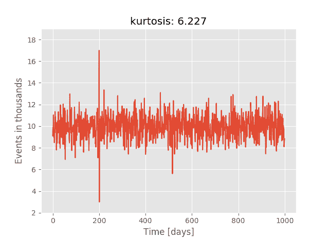
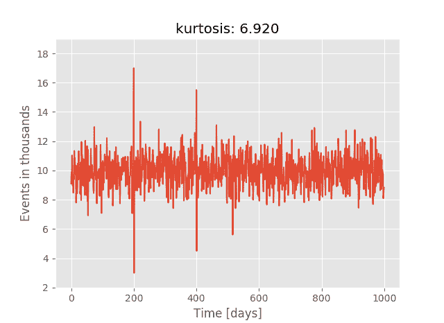
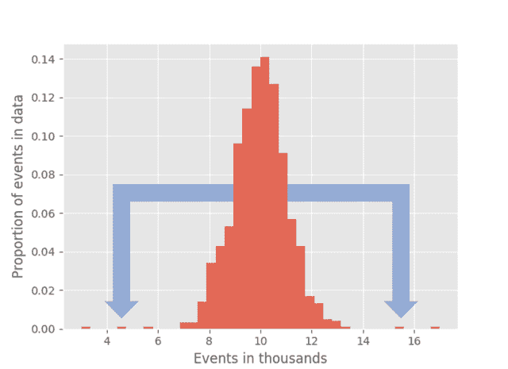

# 描述性统计：数据科学中的强大小工具——波峰因子

> 原文：[`www.kdnuggets.com/2018/04/descriptive-statistics-mighty-dwarf-data-science-crest-factor.html`](https://www.kdnuggets.com/2018/04/descriptive-statistics-mighty-dwarf-data-science-crest-factor.html)

 评论

**作者：[Pawel Rzeszucinski](https://www.linkedin.com/in/pawelrzeszucinski/)，[Codewise.com](http://www.codewise.com/)**


* * *

## 我们的三大课程推荐

 1\. [Google 网络安全证书](https://www.kdnuggets.com/google-cybersecurity) - 快速进入网络安全职业轨道。

 2\. [Google 数据分析专业证书](https://www.kdnuggets.com/google-data-analytics) - 提升你的数据分析技能

 3\. [Google IT 支持专业证书](https://www.kdnuggets.com/google-itsupport) - 支持你组织的 IT 需求

* * *

现如今，社区的相当一部分（通常受商业压力影响）似乎倾向于在应用中使用一些复杂且计算成本较高的算法，而这些应用过去本可以由更简单（因此更快）和更具可解释性（因此更具商业价值）的方法来处理。在这一系列文本中，我将介绍描述性统计的力量和美丽，作为一种定量描述数据性质的方法，并为任何后续的数据研究打下坚实的基础。在这篇文章中，我将介绍另一个强大的小工具，它与我上一篇文章中介绍的技术类似——峰度，但在统计破坏力上略有不同——“波峰因子”。你还将遇到令人恐惧的需求之龙。

### 引言

在上一篇文章中，我们使用了峰度来检测数据中的冲动内容，这些冲动内容是由假想商店商品需求的季节性变化引起的。我们说过，峰度通常被认为是信号幅度分布的“峰态”度量，并解释了这一点，尽管这对一些同行来说是有争议的。通过一些实际的模拟，我们得出结论，峰度对于检测单一冲动非常有效。今天，我想花一些时间考虑一下如果我们遇到多个冲动时会发生什么，峰度的表现是否仍然令人满意。

### 案例研究

让我们回顾一下案例研究的内容：一个商店记录了随时间变化的销售商品数量，并试图自动检测任何异常需求的存在。

在去年（之前的帖子），峰度被成功用于检测冲击。图 1 显示了数据和相应的峰度值。该指标为 6.227——明显高于 3，这在高斯噪声中是默认值。检测到了冲击内容，成功了！因此，今年受到鼓励的管理层使用了相同的指标。经过分析，峰度值甚至更高：6.920。 “肯定是今年有更大的峰值。太棒了！”。但进一步调查揭示了一些不同的情况，如图 2 所示。结果显示，除了去年第 200 天的确切相同的冲击之外，今年第 400 天还发生了另一个幅度较小的冲击。两个信号之间的差异在直方图上由两支箭头指示（图 3）。



*图 1*

*图 2*

*图 3*

根据上述结果，对峰度行为的直觉应该是双重的：是的，它会在冲击存在时增加，而且，它会按比例对冲击的幅度作出反应，但它也会在存在额外冲击（即使是较小的幅度）的情况下增加其值。因此，需要注意的是，峰度总结了数据中各种峰值的效应，指标值的增加并不总是意味着峰值更大。

这是商业需求的龙向强大的矮人请求替代方案的时候：“嘿，我不想让我的参数在数据中的最大值不变时上升。如果我只对以归一化的方式跟踪最大峰值的行为感兴趣，那我无论数据的绝对规模如何，都能得到大致相同的结果怎么办？”矮人可能会这样回答：“我不能完全解决你的问题，但我有些东西可能会有帮助。试试“波峰因子”的力量。”


那么什么是波峰因子？从理论上讲，它是数据中峰值的绝对值与同一数据的均方根（RMS）值的比率 [1]：


其中 |xpeak| 是数据中峰值（正值或负值）的绝对值，xRMS 是数据的均方根（RMS），进一步定义为 [2]：


其中 n 是数据中的总样本数，xi 是数据中的第 i 个样本。

好的，但这究竟意味着什么？让我们稍微分解一下。峰值是数据中所有样本绝对值的最大值，而 RMS 是数据总“重量”或数据中包含的能量量的测量。我们可以看到，与峰度不同，峰值因子（CF）的分子不包括对数据中所有点的求和，它只关注最大峰值。同时，分母是数据中所有样本的平方均值。如此轻量的分子（仅一个样本）和重量级的分母（所有样本）可能意味着信号中出现额外冲击的效果（除了已经存在的最大峰值）将被数据中的所有其他样本大大抵消——它可能几乎不被察觉。效果？与峰度相比，对新冲击的存在的敏感性远低。

让我们定义 CF 并进行一些测试来验证我们的假设。

```py
import numpy
def crest_factor(x):
    return np.max(np.abs(x))/np.sqrt(np.mean(np.square(x)))
```

注意：分母中的 RMS 是数据的均方根——可以使用 numpy 库显式编码为 Root(Mean(Square))——非常容易记住。

定义了指标之后，让我们将其应用于我们关注的两个数据集：

```py
crest_factor(sales_spike)

1.6949964209239023

crest_factor(sales_two_spikes)

1.693766572123957
```

确实，这些变化似乎几乎不可察觉。下表比较了应用于两个数据集的峰度和峰值因子的值。此外，为了便于比较，还包括了百分比变化和基线、无冲击信号（*销售*来自我的 上一篇文章）。


看起来“小矮人”是对的，CF 似乎更稳定地保持了其优势。

如果你是一个细心的分析师，你一定注意到 CF 的值出现了一个非常轻微但有趣的下降。为什么呢？实际上，分子没有变化——绝对峰值保持不变——但额外的冲击使信号的 RMS 增加了一点。因此，比例下降了。

### 总结

峰值因子可以被认为是峰度的替代指标，具有更大的关注数据中最大冲击的影响，因此在某种程度上忽略了其他较低振幅峰值的重要性。

**参考文献**

[1] Clarence W. de Silva, Vibration and Shock Handbook, CRC Press, 2005

[2] Stan Tempelaars, Signal Processing, Speech and Music, Routledge, 2014

**Bio: [Pawel Rzeszucinski](https://www.linkedin.com/in/pawelrzeszucinski/)** 获得了克兰菲尔德大学的计算机科学硕士学位和弗罗茨瓦夫理工大学的电子学硕士学位。随后，他转到曼彻斯特大学，在 QinetiQ 赞助的项目中获得了博士学位，该项目涉及直升机齿轮箱诊断的数据分析。回到波兰后，他在 ABB 企业研究中心担任高级科学家，并在汇丰银行战略分析部担任高级风险建模师。目前，他是 Codewise 的数据科学家。

**相关：**

+   描述性统计：数据科学中的强大侏儒

+   描述性统计的关键术语，解释

+   使用 Python 中的标准差移除异常值

### 更多相关话题

+   [可解释的预测与最新技术的现在预测](https://www.kdnuggets.com/2021/12/sota-explainable-forecasting-and-nowcasting.html)

+   [R 与 Python（再一次）：人因视角](https://www.kdnuggets.com/2022/01/r-python-human-factor-perspective.html)

+   [描述性统计的关键术语，解释](https://www.kdnuggets.com/2017/05/descriptive-statistics-key-terms-explained.html)

+   [在 Python 中应用描述性和推断性统计]（https://www.kdnuggets.com/applying-descriptive-and-inferential-statistics-in-python）

+   [KDnuggets 新闻，7 月 6 日：12 个必备的数据科学 VSCode 插件…](https://www.kdnuggets.com/2022/n27.html)

+   [数据科学的 8 个基本统计概念](https://www.kdnuggets.com/2020/06/8-basic-statistics-concepts.html)
