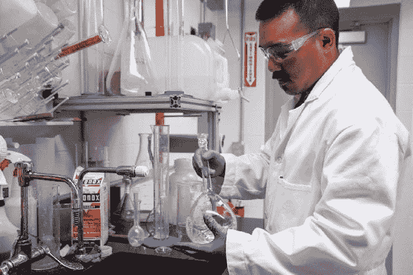

# 如何设计数据收集实验

> 原文：[`www.kdnuggets.com/2022/04/design-experiments-data-collection.html`](https://www.kdnuggets.com/2022/04/design-experiments-data-collection.html)

图片由[Science in HD](https://unsplash.com/@scienceinhd?utm_source=medium&utm_medium=referral)提供，来源于[Unsplash](https://unsplash.com/?utm_source=medium&utm_medium=referral)

## **关键要点**

+   当用于分析的数据不可用时，设计数据收集实验是重要的。

+   关键目标是快速有效地设计一种方法，以收集最佳的数据子集。

数据在数据科学和机器学习中扮演着核心角色。我们通常假设用于分析或模型构建的数据是现成的并且免费的。有时我们可能没有数据，并且获取完整的数据集要么是不可能的，要么需要很长时间才能收集。在这种情况下，我们需要设计一种方法来尝试快速有效地收集我们能获得的最佳数据子集。设计数据收集实验的过程称为**实验设计**。实验设计的一些例子包括调查和临床试验。

我们现在讨论设计和执行数据收集实验时需要记住的 4 个主要因素。

# **实验设计因素**

## 时间

我们需要确保实验可以在合理的时间内设计和实施。例如，假设某组织的客户服务部门正经历电话数量的指数级增长和呼叫中心的长时间等待。该组织可以设计调查，供员工和客户参与。必须迅速及时地完成，以便收集的数据可以被分析并用于数据驱动的决策，从而帮助改善客户服务体验。如果实验设计和数据分析未能及时完成，可能会对销售和利润产生负面影响。

## **数据量**

在设计实验时，我们需要确保从实验中收集的数据足以回答我们需要的问题。收集的数据量（样本数据）相对于预期的总数据量（总体数据）必须较小，否则将需要过长时间来收集。样本数据必须具有总体的代表性。例如，旨在研究药物疗效的实验应具有人口统计学代表性（应包括不同年龄组、性别、种族等）。

## 确定重要特征

在设计数据收集实验时，你需要决定哪些是你的因变量或预测变量。例如，如果实验的目标是收集数据以估计某个特定社区的房价，你可能会决定根据如卧室数量、浴室数量、面积、邮政编码、学区、建造年份、业主协会费用 (HOA) 等预测因素来预测房价。理解重要特征和控制特征非常重要。

## 成本

设计数据收集实验可能会非常昂贵。执行实验也可能涉及成本。例如，参与调查的人员可能会获得补偿作为激励以鼓励参与。此外，数据科学家和数据分析师也需要为分析从调查中收集的数据而获得报酬。在设计实验之前，估算执行实验的成本以及实验的收益是否超过风险是非常重要的。例如，如果调查结果可以改善客户体验并增加利润，那么这项投资就是值得的。

总结来说，我们讨论了设计数据收集实验时必须考虑的几个因素。关键目标是设计一种快速而高效地收集最佳数据子集的方法。

**[本杰明·O·泰约](https://www.linkedin.com/in/benjamin-o-tayo-ph-d-a2717511/)** 是一位物理学家、数据科学教育者和作家，同时也是 DataScienceHub 的所有者。之前，本杰明曾在中央俄克拉荷马大学、大峡谷大学和匹兹堡州立大学教授工程学和物理学。

### 了解更多相关话题

+   [机器学习实验的版本控制与跟踪](https://www.kdnuggets.com/2021/12/versioning-machine-learning-experiments-tracking.html)

+   [深度学习实验中的 Hydra 配置](https://www.kdnuggets.com/2023/03/hydra-configs-deep-learning-experiments.html)

+   [掌握 SQL、Python、数据清理、数据处理和探索性数据分析的指南集合](https://www.kdnuggets.com/collection-of-guides-on-mastering-sql-python-data-cleaning-data-wrangling-and-exploratory-data-analysis)

+   [KDnuggets™ 新闻 22:n06, 2 月 9 日：数据科学编程…](https://www.kdnuggets.com/2022/n06.html)

+   [数据科学定义幽默：一系列古怪的引用…](https://www.kdnuggets.com/2022/02/data-science-definition-humor.html)

+   [从数据收集到模型部署：数据科学项目的 6 个阶段…](https://www.kdnuggets.com/2023/01/data-collection-model-deployment-6-stages-data-science-project.html)
