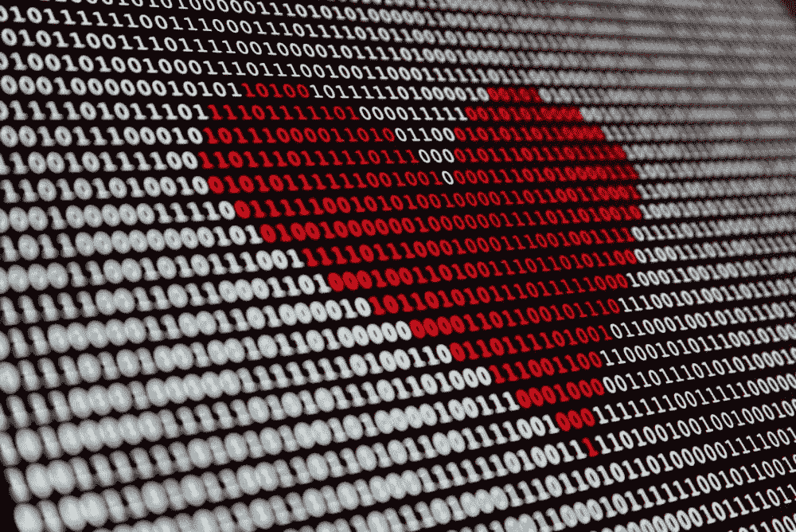

# 数据分析师与数据科学家的区别

> 原文：[`www.kdnuggets.com/2022/03/difference-data-analysts-data-scientists.html`](https://www.kdnuggets.com/2022/03/difference-data-analysts-data-scientists.html)

图片来源：[Alexander Sinn](https://unsplash.com/@swimstaralex?utm_source=unsplash&utm_medium=referral&utm_content=creditCopyText)于[Unsplash](https://unsplash.com/?utm_source=unsplash&utm_medium=referral&utm_content=creditCopyText)

数据科学家和数据分析师是 2022 年最受欢迎且薪资最高的职业之一。随着数据的不断增加，数据驱动的洞察也在不断增长。能够筛选、分析和解释大量信息的数据专业人员在今天至关重要。虽然数据分析师和数据科学家都处理数据，但有时不清楚二者之间的区别。主要的区别之一在于他们对处理的数据的不同用途。

* * *

## 我们的前三个课程推荐

 1\. [谷歌网络安全证书](https://www.kdnuggets.com/google-cybersecurity) - 快速进入网络安全职业道路。

 2\. [谷歌数据分析专业证书](https://www.kdnuggets.com/google-data-analytics) - 提升你的数据分析技能

 3\. [谷歌 IT 支持专业证书](https://www.kdnuggets.com/google-itsupport) - 支持你的组织 IT

* * *

数据分析师通常使用结构化数据来解决特定的业务问题。数据分析师最常使用 SQL、R、Python 等工具。他们还使用数据可视化软件和统计分析。

相比之下，数据科学家处理的是未知的数据，并使用更先进的数据分析技术来预测未来。数据科学家构建自动化机器学习算法，开发能够处理结构化和非结构化数据的预测建模技术。通常，这个角色被认为是数据分析师的更高级版本。不过，这还不是全部。

本文将帮助你详细了解数据分析师和数据科学家如何处理数据。

# 什么是数据科学？

在深入了解数据分析师和数据科学家之前，了解一些关键术语是很重要的。虽然“数据科学”的定义没有统一标准，但谷歌决策智能负责人 Cassie Kozyrkov 表示：“数据科学是使数据变得有用的学科。”

另一个重要的术语是[数据挖掘](https://www.ibm.com/cloud/learn/data-mining)和描述性分析。数据挖掘是识别数据中的模式并提出关于这些模式成因的假设的过程。这一步骤专注于通过数据寻找趋势。

数据科学与许多区块链相关技术的交集越来越多。区块链本质上是一个不断增长的记录列表，通常作为一个使用加密技术链接的分布式账本。

# 数据的使用方式：数据分析师与数据科学家

数据科学家通常是处理原始数据和数据集的[第一接触点](https://www.forbes.com/advisor/business/data-scientist-job-description/)。数据科学家将数据拆解并帮助理顺数据。他们处理的数据集通常很大，结构松散，并需要抽象分析来发现数据中的洞察。

另一方面，数据分析师接收由数据科学家处理过的数据并加以利用。他们获得带有洞察的已知数据集，然后寻找数据中的新趋势。由于数据更为结构化，数据分析师可以创建报告来回答特定的业务问题，并向非技术观众传达他们的发现。

越来越多的数据专业人士将区块链技术作为他们工作的一部分。区块链最为人知的是其作为比特币核心技术的角色。许多企业使用区块链来管理数据。其他企业甚至可能[买卖比特币](https://cryptowallet.com/academy/how-to-sell-crypto-online/)作为其财务计划的一部分。

可以把数据科学家视为数据的原始处理者，而数据分析师则是利用数据为业务带来利益的专家。

# 行业工具

一旦数据专业人士获取了数据，他们需要将其投入使用。然而，选择正确的工具进行数据分析很重要。由于工作的性质，数据分析师和数据科学家往往会使用相同的工具，但使用方式不同。

通常工具可以分为五类：

+   数据库

    +   比如 DuckDB 和 PostgreSQL

+   网络爬取

    +   Beautiful Soup，一个用于从 HTML 和 XML 中提取数据的 Python 库。

    +   Zyte 是一个用于运行网络爬虫的云平台。

+   数据分析

    +   编程语言是数据分析的核心。

    +   Python 是数据科学家中最常用的语言。

    +   R，是数据分析和统计学家中流行的程序。

    +   Julia，一种用于解决科学问题的新兴编程语言。

    +   Tableau，一个无需编码的工具，能让你可视化各种数据。

+   机器学习

    +   FastAI 是一个适合初学者的编程库，用于构建机器学习性能。

    +   Scikit-learn 用于数据处理和机器学习任务。

    +   TensorFlow 是一个完整的机器学习生态系统，是构建机器学习模型的端到端解决方案。

+   报告

    +   Jupyter notebook 允许你在本地或云端构建科学报告

    +   Deepnote，一个云笔记本平台

    +   Dash 允许你构建和部署具有交互式用户界面的数据应用程序。

这些只是数据分析师和数据科学家可用的部分工具。具体使用哪些工具取决于他们对数据如何利用的**终极目标**。

# 教育和技能

现在你了解了这两类专业人士如何使用数据以及他们使用的工具类型，那么这两组人需要哪些技能和教育背景呢？

## 教育

数据分析师通常比数据科学家专业性低，他们通常需要至少拥有统计学、数学、计算机科学或金融学的学士学位。

相对而言，数据科学家（以及更高级的分析师）至少拥有信息技术、数据科学、统计学或数学领域的硕士学位（甚至博士学位）。

然而，[证书和专业培训](https://www.datacamp.com/blog/is-getting-a-data-science-certification-worth-it)的作用越来越大。Google 和 IBM 都提供数据分析的专业证书，让你获得成为入门级数据分析师所需的技能。最终，可以将数据分析师视为入门点，数据科学家则是更高级的数据管理者。

## 数据技能

由于这两组人都处理数据，他们在所需技能上往往有重叠，但也有一些差异。最重要的是，数据科学家往往经验更丰富。

+   数学

    +   数据分析师：统计学、基础数学

    +   数据科学家：高级统计学、预测分析

+   编程

    +   数据分析师：Python、R、SQL 基础流利

    +   数据科学家：高级面向对象编程语言培训

+   工具

    +   数据分析师：Excel、SAS、商业智能软件

    +   数据科学家：Hadoop、MySQL、TensorFlow、Spark

+   其他技能

    +   数据分析师：数据可视化、分析思维

    +   数据科学家：数据建模、机器学习

这些只是基础，但一般来说，数据分析师是成为数据科学家的入门点，通常需要经过广泛的培训和教育。许多在线平台提供数据科学免费课程和数据分析课程，如果你想深入了解。

# 数据专业人员在商业中的角色

数据科学家和数据分析师在商业团队中都至关重要。数据分析师和数据科学家在商业中扮演的角色以及技能的运用是不同的。

数据科学家通常向首席数据官汇报工作。他们通常在一个团队中工作，不同的业务部门将利用他们的工作来建立数据集，以便各自的数据分析师进行提取。数据科学家可能一天查看供应链数据，第二天则分析收益信息。

数据分析师通常会被限制在一个业务领域内。数据分析师最常在一个部门内工作，如财务或会计。然后他们会 [专注于与其业务领域最相关的指标和报告](https://fortune.com/education/business/articles/2022/02/07/key-traits-of-successful-data-analysts/)。

数据科学家的主要商业价值在于他们能够深入挖掘数据，找到非结构化数据中的洞察。然后，数据分析师将这些洞察转化为可操作的见解。

# 数据科学职业的核心要点

数据科学家和数据分析师在组织中扮演着重要但不同的角色。然而，两者都是从商业数据中获取最大收益所必需的。数据科学家凭借其专业培训，可以从原始数据中识别出洞察。然后，数据分析师利用筛选后的数据来回答具体的商业问题。两者共同利用数据，帮助公司获得利益。

**[Nahla Davies](http://nahlawrites.com/)** 是一位软件开发者和技术作家。在全职从事技术写作之前，她还曾担任过包括三星、时代华纳、Netflix 和索尼在内的 Inc. 5,000 体验品牌组织的首席程序员，负责许多引人入胜的项目。

### 更多相关话题

+   [机器学习中训练数据和测试数据的区别](https://www.kdnuggets.com/2022/08/difference-training-testing-data-machine-learning.html)

+   [效率决定了生物神经元与…之间的区别](https://www.kdnuggets.com/2022/11/efficiency-spells-difference-biological-neurons-artificial-counterparts.html)

+   [SQL 和对象关系映射（ORM）有什么区别？](https://www.kdnuggets.com/2022/02/difference-sql-object-relational-mapping-orm.html)

+   [L1 和 L2 正则化的区别](https://www.kdnuggets.com/2022/08/difference-l1-l2-regularization.html)

+   [GBM 和 XGBoost 之间的区别是什么？](https://www.kdnuggets.com/wtf-is-the-difference-between-gbm-and-xgboost)

+   [数据科学家和分析师的统计学基础](https://www.kdnuggets.com/2023/08/fundamentals-statistics-data-scientists-analysts.html)
