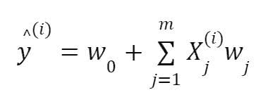
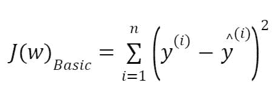
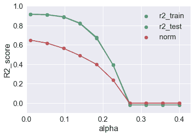

# L1 和 L2 正则化的区别

> 原文：[`www.kdnuggets.com/2022/08/difference-l1-l2-regularization.html`](https://www.kdnuggets.com/2022/08/difference-l1-l2-regularization.html)

## 主要要点

+   正则化回归可以用于特征选择和降维

+   这里讨论了两种类型的正则化回归模型：岭回归（L2 正则化）和套索回归（L1 正则化）

* * *

## 我们的前 3 个课程推荐

 1\. [Google 网络安全证书](https://www.kdnuggets.com/google-cybersecurity) - 快速进入网络安全职业生涯。

 2\. [Google 数据分析专业证书](https://www.kdnuggets.com/google-data-analytics) - 提升你的数据分析能力

 3\. [Google IT 支持专业证书](https://www.kdnuggets.com/google-itsupport) - 支持你所在组织的 IT

* * *

# 基本线性回归

假设我们有一个数据集，其中包含  特征和  观测，如下所示：


一个基本的回归模型可以表示为：



其中  是  特征矩阵，而  是权重系数或回归系数。在基本线性回归中，通过最小化下面给出的损失函数来获得回归系数：



# 岭回归：L2 正则化

在 L2 正则化中，通过最小化 L2 损失函数来获得回归系数，如下所示：


其中


这里，α ∈[0, 1] 是正则化参数。L2 正则化在 Python 中实现为：

```py
from sklearn.linear_model import Ridge
lasso = Ridge(alpha=0.7)
Ridge.fit(X_train_std,y_train_std)
y_train_std=Ridge.predict(X_train_std)
y_test_std=Ridge.predict(X_test_std)
Ridge.coef_
```

# 套索回归：L1 正则化

在 L1 正则化中，通过最小化 L1 损失函数来获得回归系数，如下所示：


其中


L1 正则化在 Python 中实现为：

```py
from sklearn.linear_model import Lasso
lasso = Lasso(alpha=0.7)
lasso.fit(X_train_std,y_train_std)
y_train_std=lasso.predict(X_train_std)
y_test_std=lasso.predict(X_test_std)
lasso.coef_
```

在 L1 和 L2 正则化中，当正则化参数（α ∈[0, 1]）增加时，这会导致 L1 范数或 L2 范数减小，从而将一些回归系数压缩为零。因此，L1 和 L2 正则化模型用于特征选择和降维。L2 正则化相较于 L1 正则化的一个优点是 L2 损失函数容易求导。

# 案例研究：L1 回归实现

使用游轮数据集实现 L1 正则化的实现可以在这里找到：[Lasso 回归的实现](https://github.com/bot13956/ML_Model_for_Predicting_Ships_Crew_Size)。

下图展示了 R2 分数和 L1 范数作为正则化参数的函数关系。



从上图中可以观察到，随着正则化参数α的增加，回归系数的范数变得越来越小。这意味着更多的回归系数被压缩为零，从而增加了偏差误差（过于简化）。在α保持较低值时，例如α=0.1 或更低，偏差-方差权衡的最佳值。

**[本杰明·O·泰约](https://www.linkedin.com/in/benjamin-o-tayo-ph-d-a2717511/)**是一位物理学家、数据科学教育者和作家，同时也是 DataScienceHub 的所有者。之前，本杰明曾在中欧大学、大峡谷大学和匹兹堡州立大学教授工程学和物理学。

### 更多相关话题

+   [SQL 和对象关系映射（ORM）之间的区别是什么？](https://www.kdnuggets.com/2022/02/difference-sql-object-relational-mapping-orm.html)

+   [数据分析师和数据科学家之间的区别是什么？](https://www.kdnuggets.com/2022/03/difference-data-analysts-data-scientists.html)

+   [机器学习中训练数据和测试数据的区别](https://www.kdnuggets.com/2022/08/difference-training-testing-data-machine-learning.html)

+   [效率决定生物神经元与人工神经元的区别](https://www.kdnuggets.com/2022/11/efficiency-spells-difference-biological-neurons-artificial-counterparts.html)

+   [GBM 和 XGBoost 之间的区别是什么？](https://www.kdnuggets.com/wtf-is-the-difference-between-gbm-and-xgboost)

+   [正则化到底是什么？它有什么作用？](https://www.kdnuggets.com/wtf-is-regularization-and-what-is-it-for)
