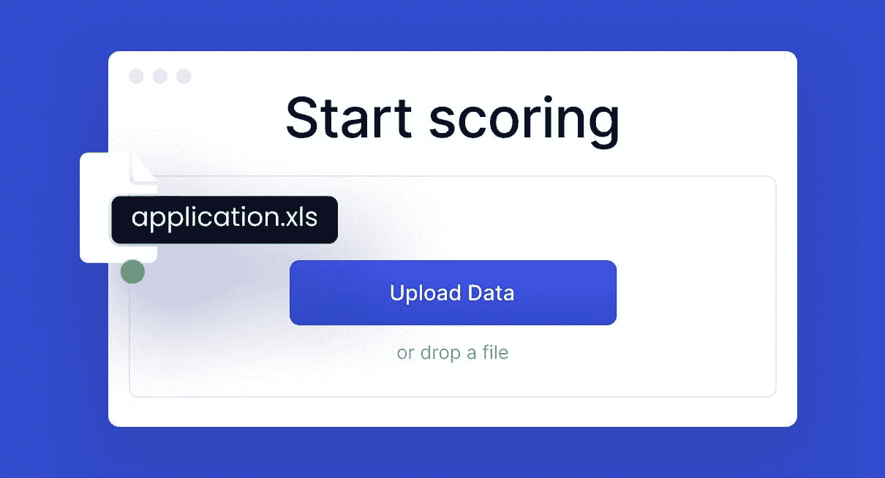

# 机器学习中训练数据与测试数据的区别

> 原文：[`www.kdnuggets.com/2022/08/difference-training-testing-data-machine-learning.html`](https://www.kdnuggets.com/2022/08/difference-training-testing-data-machine-learning.html)

在构建预测模型时，结果的质量取决于你使用的数据。如果你使用的数据不足或错误，你的模型将无法做出现实的预测，并会引导你走向错误的方向。为避免这种情况，你需要了解机器学习中训练数据与测试数据的区别。

* * *

## 我们的前三个课程推荐

 1\. [Google 网络安全证书](https://www.kdnuggets.com/google-cybersecurity) - 快速进入网络安全职业生涯。

 2\. [Google 数据分析专业证书](https://www.kdnuggets.com/google-data-analytics) - 提升你的数据分析能力

 3\. [Google IT 支持专业证书](https://www.kdnuggets.com/google-itsupport) - 支持你的组织 IT

* * *

不再废话，让我们深入探讨。

# 培训数据

假设你想基于某些数据库创建一个模型。在机器学习中，这些数据被分为两个部分：训练数据和测试数据。

训练数据是你输入到机器学习模型中的数据，以便它可以分析并发现一些模式和依赖关系。这个训练集有三个主要特征：

+   **大小**。训练集通常比测试数据更多。你输入给机器的数据越多，模型的质量就越好。一旦机器学习算法获得了你的记录中的数据，它就会从中学习模式，并为决策制定创建一个模型。

+   **标签**。标签是我们试图预测的值（响应变量）。例如，如果我们想预测患者是否会被诊断为癌症，基于他们的症状，响应变量将是癌症诊断的“是/否”。训练数据可以是标记的或未标记的。这两种类型的数据在机器学习中都可以用于不同的情况。

+   **案例细节**。算法基于你提供的信息做出决策。你需要确保数据是相关的，并且具有各种不同结果的案例。例如，如果你需要一个可以评估潜在借款人的模型，你需要在训练集中包含在申请过程中你通常了解的关于潜在客户的信息：

    +   名称和联系方式、地点；

    +   人口统计、社会和行为特征；

    +   来源（Meta 广告、网站登陆页面、第三方等）

    +   与网站上的行为/活动、转化、在网站上花费的时间、点击次数等相关的因素。

# 测试数据

在机器学习模型建立之后，你需要检查它的工作情况。AI 平台使用测试数据来评估模型的性能，并进行调整或优化，以获得更好的预测结果。测试集应具备以下特点：

+   **未见过**。你不能重复使用在训练集中出现过的信息。

+   **大**。数据集应该足够大，以便机器能够进行预测。

+   **代表性**。数据应能代表实际的数据集。

幸运的是，你无需手动收集新的数据并与实际数据进行比较。AI 可以将现有数据分成两部分，在训练时将测试集放在一边，然后自动进行测试，比较预测结果和实际结果。数据科学有不同的数据拆分选项，但最常见的比例是 70/30、80/20 和 90/10。

因此，手头有了大量的数据集，我们可以检查是否可以基于该模型进行预测。

## 训练和测试数据如何运作的示例

现在，让我们看看这两个数据集在实际中是如何运作的。作为示例，我们将使用 [GiniMachine](https://ginimachine.com/) —— 一个无代码的 AI 决策平台。

在这种系统中，评估过程称为盲测。当建立模型时，AI 会将数据按约 70% 对 30% 的比例进行拆分，其中第一个比例是训练数据，第二个比例是测试数据。在训练过程中，机器会分析不同的指标及其对结果的影响。而在盲测期间，它会尝试为测试记录计算分数并预测结果。它可以处理自定义的比例和多目标以及双因素的分层。

在模型建立并测试之后，机器会计算一个特殊指标来代表模型的质量。这样，用户可以决定是否使用这个模型进行评分或创建另一个模型。

# 机器学习需要多少数据才够

训练集和测试集都应该足够大，以便机器能够学习。但究竟需要多少数据才算够呢？

这取决于你使用的平台。一些机器至少需要 1,000 条记录来建立模型。但是数据的质量也很重要。行业中有一条不成文的规则：使用 1,000 条不良记录加上 X 条好的记录来创建一个可靠的模型。例如，1,000 条不良贷款记录加上 X 条已成功偿还债务的记录。

然而，这只是一个大致的数字。所需记录的确切数量只能通过测试不同选项来确定。根据我们的经验，只用 100 条记录也可以建立一个不错的模型，而有些情况下需要超过 30,000 条记录。

使用我们之前提到的 GiniMachine，你可以无限制地实验不同的数据，构建尽可能多的模型。但是，如果你使用其他平台，如 Visier People 或 underwrite.ai，他们对数据的要求可能会有所不同。在选择决策平台时，请注意这些特性。

# 预测误差

讨论预测模型时，重要的是提到影响预测质量的两个现象：偏差-方差权衡和[维度灾难](https://en.wikipedia.org/wiki/Curse_of_dimensionality)。

简而言之，偏差-方差权衡是创建过于通用或过于具体模型之间的平衡。具有高偏差的模型通常过于简化，在训练数据和测试数据中都会犯很多错误。这发生在我们拥有的数据过少且过于通用时。例如，如果你试图用仅仅十个关于毛发长度和颜色的例子来教模型区分猫和狗。要解决这个问题，你需要使用更多的数据和变量。

而具有高方差的模型完全无法概括数据。因此，它在训练数据上表现良好，但在测试数据上有很多错误。如果你用具有许多特征的过于具体的数据喂养模型，就可能出现这种情况。因此，它无法理解哪些特征最重要，也无法对未见数据做出正确的预测。此外，特征数量的增加会增加模型的复杂性，并可能导致维度灾难。在这种情况下，你需要将单独的特征组合成簇，并从数据集中清理掉不必要的信息。

# 如何在业务中使用数据

机器学习和基于 AI 的预测软件的可能性是无限的。它们可以帮助你预测产品需求、评估新线索和选择最有前途的项目、评分信用申请和债务催收、自动化招聘流程，或分析医疗保健和农业数据。使用这样的平台没有限制。只要有合适的数据集，你就可以构建所需的模型，开始评分并获得更大的业务成果。

**[Mark Rudak](https://www.linkedin.com/in/mark-rudak/)** 是 [Ginimachine](https://ginimachine.com/) 的机器学习产品负责人

### 更多相关信息

+   [数据分析师和数据科学家之间有什么区别？](https://www.kdnuggets.com/2022/03/difference-data-analysts-data-scientists.html)

+   [效率决定了生物神经元与……之间的区别](https://www.kdnuggets.com/2022/11/efficiency-spells-difference-biological-neurons-artificial-counterparts.html)

+   [SQL 和对象关系映射（ORM）之间有什么区别？](https://www.kdnuggets.com/2022/02/difference-sql-object-relational-mapping-orm.html)

+   [L1 和 L2 正则化的区别](https://www.kdnuggets.com/2022/08/difference-l1-l2-regularization.html)

+   [GBM 与 XGBoost 之间的区别是什么？](https://www.kdnuggets.com/wtf-is-the-difference-between-gbm-and-xgboost)

+   [假设检验与 A/B 测试](https://www.kdnuggets.com/hypothesis-testing-and-ab-testing)
