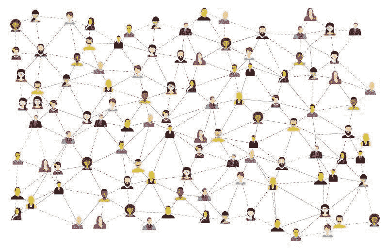
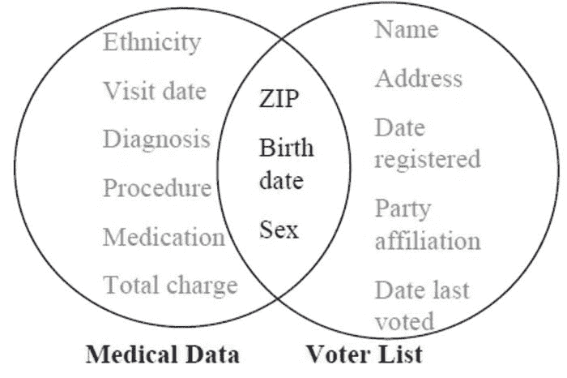
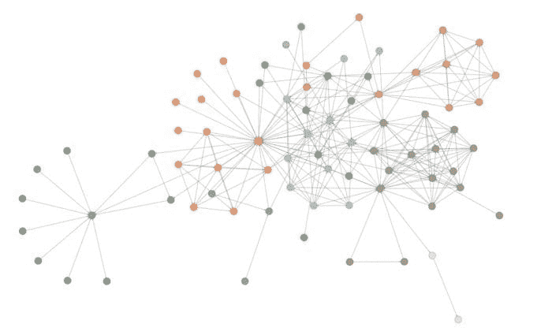
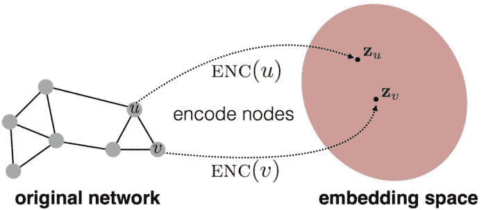

# 图形匿名化的难度

> 原文：[`www.kdnuggets.com/2021/02/difficulty-graph-anonymisation.html`](https://www.kdnuggets.com/2021/02/difficulty-graph-anonymisation.html)

评论

**由 [Timothy Lin](https://www.timlrx.com/)，数据科学家、开发者、经济学家及 [Cylynx](https://www.cylynx.io/) 的联合创始人**

* * *

## 我们的前 3 个课程推荐

 1\. [Google 网络安全证书](https://www.kdnuggets.com/google-cybersecurity) - 快速进入网络安全职业轨道。

 2\. [Google 数据分析专业证书](https://www.kdnuggets.com/google-data-analytics) - 提升你的数据分析技能

 3\. [Google IT 支持专业证书](https://www.kdnuggets.com/google-itsupport) - 支持你的组织的 IT 工作

* * *

这篇文章是对近期 TraceTogether 隐私事件的回应。对于非新加坡人，[TraceTogether](https://www.tracetogether.gov.sg/) 是新加坡应对 COVID-19 大流行的接触追踪计划。该计划的目标是迅速识别可能与任何测试呈阳性的人有过密切接触的人。它包括一个应用程序或物理代币，利用蓝牙信号来存储接触记录。截至 2020 年 12 月底，[70% 的新加坡居民据说已经参与了该计划。](https://www.channelnewsasia.com/news/singapore/covid-19-tracetogether-adoption-singapore-crosses-70-percent-13829042)

2021 年 1 月 4 日，曝光了 [TraceTogether 数据可能被警方用于刑事调查](https://www.channelnewsasia.com/news/singapore/singapore-police-force-can-obtain-tracetogether-data-covid-19-13889914)。这引发了负责部长们的一些澄清，以及围绕该项目隐私问题的更大辩论。内政部长澄清，根据《刑事诉讼法典》（CPC），警方可以并且已经使用 TraceTogether 数据调查“严重犯罪，如谋杀或恐怖事件”。[TraceTogether 网站上的隐私声明](https://www.tracetogether.gov.sg/common/privacystatement/index.html) 随后被修改以澄清这一点。

随后，通过了一项法案，以限制对 TraceTogether 数据在严重犯罪中的使用。它阐明了疫情后的数据使用情况，并提到为了“加强我们的公共卫生响应”，可能会保留匿名数据用于流行病学研究：¹

维维安·巴拉克里希南部长也在早前的议会声明中提到过这种可能性：

> 但我相信，一旦疫情过去，这些数据——特别是具体的、个性化的数据——这些字段应被删除。为了研究目的，我相信 MOH 可能仍希望拥有流行病学数据，但它应该被匿名化。它不应个性化，也不应个体化。
> 
> *来源: [`sprs.parl.gov.sg/search/sprs3topic?reportid=clarification-1547`](https://sprs.parl.gov.sg/search/sprs3topic?reportid=clarification-1547)*

尽管匿名化的流行病学数据可能对未来研究非常有用，但有两个原因说明应该重新考虑这种决定。

1.  这是一种目的范围扩展，将 TraceTogether 从接触追踪操作扩展到警察执法和研究。

1.  鉴于 TraceTogether 计划的性质，即使是“匿名化”的数据，也很难在匿名性和实用性之间取得适当的平衡。这是因为接近数据本质上是一个连接网络，从这些连接中获得的洞察力也使对手能够进行去匿名化。

匿名化数据用于研究要么被忽视，要么对去匿名化的风险认识不足，特别是网络数据。术语“匿名化数据”似乎传达了用户信息无法被还原的某种确定性。作为在网络科学领域工作的数据科学家，这远非事实，我希望借此机会解释网络匿名化的困难。

### 为什么要匿名化？

[数据匿名化](https://en.wikipedia.org/wiki/Data_anonymization) 是通过擦除或加密标识符来保护私人或敏感信息的过程，同时保持数据的研究用途。

匿名化是一种权衡。我们可以通过用随机值替代数据集中的每一个字段来实现 100% 隐私，但这会使数据完全无用。因此，统计学家研究了不同的数据匿名化技术，包括掩盖、置换、扰动或合成数据创建，旨在平衡隐私和实用性。

### 一个简单的重新识别技术

让我们从一个简单的表格数据集开始，以说明为什么删除或掩盖个人可识别信息（PII）字段无法实现隐私。我们从一个样本原始数据集开始，数据如下：

| id | name | address | sex |
| --- | --- | --- | --- |
| 1 | A | 123 | M |
| 2 | B | 123 | F |
| 3 | C | 456 | F |

这是一个数据集，id 和 name 被掩盖，行已打乱：

| id | name | address | sex |
| --- | --- | --- | --- |
| xx | xx | 456 | F |
| xx | xx | 123 | F |
| xx | xx | 123 | M |

我们如何找出每条记录的身份？假设我们有一个包含地址、性别和姓名信息的外部普查数据集，并且每个地址、性别和姓名的组合都是唯一的。这样，我们可以使用`address`和`sex`字段在我们的“掩码”数据集上进行连接，以解密`name`字段。在这里，我们依赖于`address`和`sex`与`name`字段之间的 1 对 1 映射关系。

*来源： [Garrick Aden-Buie 的 Tidy Explain](https://github.com/gadenbuie/tidyexplain)*

数据集的稀疏性影响了对手进行“连接攻击”的难易程度和准确性。如果我们数据集中只有一个字段，例如`address`，我们将无法唯一识别每个人，因为有两个人的`address`都是 123。现实世界数据集的“问题”在于，找到可以唯一标识个人的变量组合相对容易。

### 解密身份 - 2 个示例

### GIC

在 1990 年代，马萨诸塞州的一个政府机构，即集团保险委员会（GIC），决定向任何请求的研究人员公开总结每位州员工的医院就诊记录。虽然诸如姓名、地址和社会保障号码等显性标识符被删除，但诸如邮政编码、出生日期和性别等医院就诊信息仍被保留。

Sweeney [1997](https://www.timlrx.com/blog/tracetogether-and-the-difficulty-of-graph-anonymisation#ref-Sweeney) 证明了 GIC 数据可以与选民名册结合，以揭示隐藏的个人身份信息。故事的一个有趣转折是，Sweeney 博士将其发现告知了当时的马萨诸塞州州长 William Weld，后者向公众保证 GIC 通过删除标识符来保护患者隐私。根据 1990 年代的普查数据，他发现 87%的美国公民可以通过邮政编码、出生日期和性别唯一识别。更多近期研究表明，虽然比例较低，但仍为 63%（Golle [2006](https://www.timlrx.com/blog/tracetogether-and-the-difficulty-of-graph-anonymisation#ref-Golle)）。

### Netflix 数据

最近，Netflix 作为一个[公开竞赛](https://en.wikipedia.org/wiki/Netflix_Prize)的一部分发布的电影评分数据被 Narayanan 和 Shmatikov [2008](https://www.timlrx.com/blog/tracetogether-and-the-difficulty-of-graph-anonymisation#ref-Narayanan-Shmatikov-1) 证明没有最初想象的那样匿名。一个对手需要知道多少关于 Netflix 订阅者的信息才能识别她的记录（如果它在数据集中存在），从而得知她的完整电影观看历史？事实证明，不需要太多。

数据集中 84%的订阅者可以被唯一识别，如果知道 6 个不太受欢迎的电影评分（不在前 500 名之内）。通过使用从 IMDb 抓取的个人电影评分的辅助数据集，他们表明可以高概率地对一些用户进行去匿名化处理。

### 绑定的联系

假设没有计划保留任何个人信息。相反，仅保留接近度信息进行分析。² 这部分信息是否构成重新识别的威胁？

是的，关于社交媒体数据的研究和实验表明，连接信息可以揭示隐藏的用户联系。为了说明这一点，我们将接近度数据转换为图形形式。图（也称为网络）是一种数据结构，由节点/顶点通过边/链接连接在一起。图结构在日常生活中随处可见，从道路连接到社交网络到...接近度数据。

接近度数据可以被视为边列表。对于个体 A，如果 A 和 B 在同一接近窗口中被记录，则我们构建一个与个体 B 的链接。

我们忽略问题的时间因素，并假设我们掌握了以下连接数据集，该数据集表示两个个体之间的联系，掩盖了一个索引号。³

| 从 | 到 |
| --- | --- |
| 2 | 1 |
| 3 | 1 |
| 4 | 1 |
| 5 | 1 |
| 6 | 1 |
| 7 | 1 |
| 8 | 1 |
| 9 | 1 |
| 10 | 1 |
| 11 | 1 |
| 9 | 10 |
| 11 | 9 |
| 11 | 10 |

例如，在我们的表格中，个体 2 和 1 是连接的。数据可以通过以下图形进行可视化表示：

我们可以从图中推断出哪些特征或属性？我们可以计算每个个体的连接数量（也称为度）。例如，个体 1 有 10 个邻居，而个体 10 有 3 个邻居。假设我们有一个完整连接数据集的泄露，这可以绘制如下：

去匿名化的挑战在于尝试找到一个与我们的子图“匹配”的完整图的片段（更正式地称为子图匹配或子图同构问题）。你能找到它吗？

让我通过为聚类上色来帮助你，这应该很明显。点击脚注以揭示答案。⁴

上述网络是经常使用的[悲惨世界网络数据集](http://networkrepository.com/lesmis.php)的图形表示。我们的子图是 Myriel 的自我网络（Myriel 及其所有连接）。事实证明，图中只有 5 个个体有 10 个连接。这有助于显著缩小候选匹配的范围。列出连接最多的个体按降序排列如下：

| 名称 | 连接数（度） |
| --- | --- |
| Valjean | 36 |
| Gavroche | 22 |
| Marius | 19 |
| Javert | 17 |
| Thenardier | 16 |
| Enjolras | 15 |
| Fantine | 15 |

我们能从这个例子中学到什么？

1.  从边缘属性生成节点/实体级特征是很容易的

1.  由于社交互动的性质，这些特征往往会表现出大的变异和异常值

1.  社交网络的匿名性不足以保证隐私

在另一篇开创性的论文中，（Narayanan 和 Shmatikov [2009](https://www.timlrx.com/blog/tracetogether-and-the-difficulty-of-graph-anonymisation#ref-Narayanan-Shmatikov-2)）展示了基于网络拓扑的再识别算法在真实世界社交媒体数据集上的有效性。他们展示了即使这些成员的关系重叠不到 15%，Flickr 和 Twitter 的成员仍能在完全匿名的 Twitter 图中以仅 12% 的错误率被识别。自从他们的论文发表以来，Twitter 已经在其 API 上引入了速率限制，这使得大规模抓取和采集变得不可行。

### 通过模糊化实现匿名性

一种使这种匿名攻击更加困难的方法是模糊或隐藏关系信息。例如，可以扰动边缘信息，以引入每个连接的某种概率不确定性。或者，我们可以从高度连接的人员中移除连接，使他们与普通个体融为一体。然而，这样做会丧失我们分析超级传播者或前线工人（这些工人会见到大量的人）之间病毒传播风险的能力。如前所述，数据匿名性是一种权衡，在这里我们更倾向于隐私而非研究。

### 去匿名化的多种途径

令人惊讶的是，这些匿名化方法并不能完全消除再识别的风险。到目前为止，我们只考虑了在数据中模糊度分布，但还可以从图数据集中构造其他度量指标。我们可以计算两跳远的连接数（邻居的邻居），或通过图中每个节点的三角形数量，或类似 PageRank 分数的中心性度量。有很多度量可以捕捉网络的不同方面以及节点在网络中的位置。模糊一个度量并不意味着其他度量也同样被匿名化。

*来源： [朱尔·莱斯科维奇的 cs224w 讲义](https://snap-stanford.github.io/cs224w-notes/machine-learning-with-networks/node-representation-learning)*

我们如何总结一个节点的“本质”，考虑到它所有的邻近关系和在整个网络空间中的位置？节点嵌入（Grover 和 Leskovec [2016](https://www.timlrx.com/blog/tracetogether-and-the-difficulty-of-graph-anonymisation#ref-Grover-Leskovec)），是神经网络在图数据结构上的一种相对较新的应用，旨在通过将节点关系映射到更低维的向量空间中实现这一点。

在嵌入空间中距离更近的节点在原始网络中更相似。⁵ 给定一个匿名化的网络数据集，我们可以计算每个节点的嵌入，并推导每个节点实际上与给定节点在真实数据集中连接的可能性。我们遮蔽和混淆的特征越多，去匿名化率的准确性就越低。

*来源：张等，2017*

重要的是，我们可以使用节点嵌入来量化边的可能性，并利用这些信息恢复原始数据集。张等人 [2017](https://www.timlrx.com/blog/tracetogether-and-the-difficulty-of-graph-anonymisation#ref-zhang) 利用这一漏洞恢复了三个测试数据集的原始图，这些数据集通过使用不同的图匿名化技术进行了匿名化。他们提出了通过添加与原始图中的边更相似的虚假边来改进现有技术的方法。虽然这使得恢复原始数据集变得更加困难，但他们指出，“创建完全无法与原始边区分开的虚假边是非平凡的”。

### 连接点滴

进行这种隐私攻击所需的条件是什么？

1.  一个“匿名化”的网络数据集

1.  可能会泄露一个或多个个体身份的种子信息

1.  一个包含真实信息的子图

即使 TraceTogether 数据被泄露，找到攻击向量 2 或 3 肯定很难？其实并非如此，只需一点想象力和创造力，正如各种研究论文所示。实际上，关于子图的信息可以通过 BluePass 计划轻松获得：

> BluePass 包括用于生活或工作在宿舍的流动工人和本地工人的接触追踪令牌，以及建筑、船舶制造和过程行业中的工人。BluePass 令牌与 TraceTogether 令牌或应用兼容，这意味着它们可以相互交换信息。

一个关键的区别是雇主可以监督这些设备中的数据，以便更快地隔离 Covid-19 病例的密切接触者。⁶ 他们可以访问自己员工的 BluePass 数据，但不能访问其他 BluePass 令牌或 TraceTogether 数据。

尽管新法案涵盖了 TraceTogether 和 BluePass，并且对未经授权使用或泄露接触追踪数据有严格的处罚，但人们仍然会怀疑处理这些数据的公司的网络安全实践有多么安全。由于该法案不涵盖匿名化数据，公司也可能保留去匿名化的 BluePass 数据用于其内部研究。任何 BluePass 数据集的泄露或侵害都可能危及工人的身份，甚至可能危及匿名化的 TraceTogether 数据。

### 摘要

在本文中，我研究了图匿名化的难点。我展示了即使 PII 信息被掩盖，如何对表格数据进行重新识别，并将分析扩展到网络数据集。节点之间的连接包含大量信息，可以作为重新识别或图恢复尝试的基础。尝试扰动或掩盖边信息是困难的，平衡实用性和隐私性也很难。

我还概述了一个对手如何利用从 BluePass 项目获得的数据对匿名化的 TraceTogether 数据执行图恢复攻击的可能性。

为了保持 TraceTogether 项目在应对 Covid-19（以及可能的其他未来大流行病）中的作用，需要进行两项改动。一是仅保留汇总数据而非匿名化数据。二是公司应依法删除 BluePass 数据或在大流行结束时将其交给卫生部。

### 参考文献

Golle, P. "重新审视美国人口简单人口统计信息的唯一性。" *第 5 届 ACM 电子社会隐私研讨会论文集*，第 77-80 页。2006 年。

Grover, Aditya 和 Jure Leskovec. "node2vec：用于网络的可扩展特征学习。" *第 22 届 ACM SIGKDD 国际知识发现与数据挖掘大会论文集*，第 855-864 页。2016 年。

Narayanan, Arvind 和 Vitaly Shmatikov. "大规模稀疏数据集的强健去匿名化。" *2008 IEEE 安全与隐私研讨会 (sp 2008)*，第 111-125 页。IEEE，2008 年。

Narayanan, Arvind 和 Vitaly Shmatikov. "去匿名化社交网络。" *2009 年第 30 届 IEEE 安全与隐私研讨会*，第 173-187 页。IEEE，2009 年。

Sweeney, L. "将技术和政策结合起来以保持机密性。" *法律、医学与伦理学杂志* 25, no. 2-3 (1997): 98-110。

Zhang, Yang, Mathias Humbert, Bartlomiej Surma, Praveen Manoharan, Jilles Vreeken 和 Michael Backes. "朝着可信的图匿名化方向前进。" *arXiv 预印本 arXiv:1711.05441* (2017)。

1.  [`www.straitstimes.com/singapore/proposed-restrictions-to-safeguard-personal-contact-tracing-data-will-override-all-other`](https://www.straitstimes.com/singapore/proposed-restrictions-to-safeguard-personal-contact-tracing-data-will-override-all-other)

1.  可以说，研究人员只需要获取接近数据，而不是个体标识符，以研究传播和安全距离措施的有效性。

1.  如果时间元素未被掩码，将仅增加数据集的维度，从而使得重新识别个体变得容易。

1.  答：左侧的蓝色簇

1.  相似性可以通过各种方式定义，例如邻接或路径。

1.  [`www.straitstimes.com/tech/tech-news/special-contact-tracing-devices-for-singapore-workers-in-sectors-with-flammable-gas`](https://www.straitstimes.com/tech/tech-news/special-contact-tracing-devices-for-singapore-workers-in-sectors-with-flammable-gas)

**简介： [Timothy Lin](https://www.timlrx.com/)** ([@timlrxx](https://twitter.com/timlrxx)) 是数据科学家、开发者、经济学家及 [Cylynx](https://www.cylynx.io/) 的联合创始人。Timothy 目前的兴趣领域包括网络分析、全栈开发、技术和劳动经济学，未来将会有更多相关内容出现！

[原文](https://www.timlrx.com/blog/tracetogether-and-the-difficulty-of-graph-anonymisation)。已获授权转载。

**相关：**

+   使用 NumPy 和 Pandas 在更大的图谱上进行更快的机器学习

+   图机器学习在基因组预测中的应用

+   机器学习的数据结构 - 第二部分：构建知识图谱

### 更多相关内容

+   [估算机器学习碳足迹的难度](https://www.kdnuggets.com/2022/07/difficulty-estimating-carbon-footprint-machine-learning.html)

+   [三种难度级别解释的大型语言模型](https://www.kdnuggets.com/large-language-models-explained-in-3-levels-of-difficulty)

+   [关于可信赖图神经网络的综合调查：…](https://www.kdnuggets.com/2022/05/comprehensive-survey-trustworthy-graph-neural-networks-privacy-robustness-fairness-explainability.html)

+   用 Python 图形画廊制作惊人的可视化

+   [如何使用图论来考察足球运动员](https://www.kdnuggets.com/2022/11/graph-theory-scout-soccer.html)

+   [如何使用图形数据库构建实时推荐引擎](https://www.kdnuggets.com/2023/08/build-realtime-recommendation-engine-graph-databases.html)
