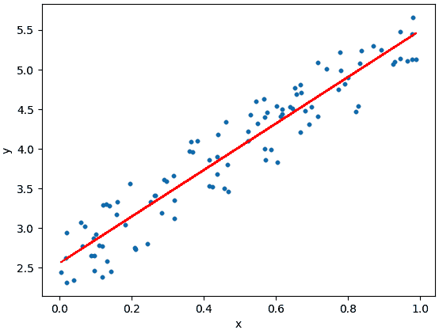
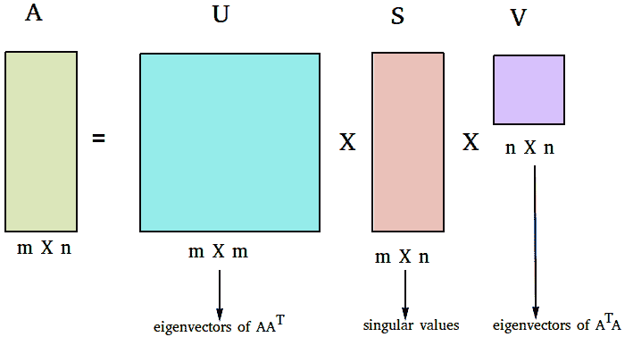

# 使用主成分分析（PCA）进行降维

> 原文：[`www.kdnuggets.com/2020/05/dimensionality-reduction-principal-component-analysis.html`](https://www.kdnuggets.com/2020/05/dimensionality-reduction-principal-component-analysis.html)

评论

[致谢](https://medium.com/datadriveninvestor/principal-components-analysis-pca-71cc9d43d9fb)

### 介绍

随着高性能 CPU 和 GPU 的普及，几乎可以使用机器学习和深度学习模型解决每一个回归、分类、聚类及其他相关问题。然而，在开发这些模型时，仍然存在各种性能瓶颈。数据集中大量的特征是影响机器学习模型训练时间和准确性的主要因素之一。

### 维度诅咒

在机器学习中，“维度”简单指数据集中特征（即输入变量）的数量。

虽然添加额外特征/维度会提高任何机器学习模型的性能，但到某个点时，进一步的添加会导致性能下降，这就是当特征数量与数据集中的观察数非常大时，许多线性算法努力训练有效模型的情况。这被称为“**维度诅咒**”。

**降维**是一组技术，研究如何在保留最重要信息的同时缩小数据的大小，并进一步消除维度诅咒。它在分类和聚类问题的性能中发挥了重要作用。


[该图示例展示了一个 3-D 特征空间被分割成两个 1-D 特征空间，之后如果发现相关性，特征数量可以进一步减少。](https://www.geeksforgeeks.org/dimensionality-reduction/)

用于降维的各种技术包括：

+   主成分分析（PCA）

+   线性判别分析（LDA）

+   广义判别分析（GDA）

+   [多维缩放 (MDS)](https://blog.paperspace.com/dimension-reduction-with-multi-dimension-scaling/)

+   LLE

+   IsoMap

+   自编码器

本文集中于 PCA 的设计原则及其在 Python 中的实现。

### 主成分分析（PCA）

主成分分析（PCA）是最受欢迎的线性降维算法之一。它是一种基于投影的方法，通过将数据投影到一组正交（垂直）轴上来转换数据。

> “PCA 的工作条件是：当数据从高维空间映射到低维空间时，低维空间中数据的方差或扩散应尽可能大。”

在下图中，数据在二维空间中沿红色线的方差最大。



### 直观理解

让我们对 PCA 有一个直观的理解。假设你希望根据食品的营养成分区分不同的食物项目。哪个变量将是区分食物项目的好选择？如果你选择一个在不同食物项目之间变化很大的变量，你将能够很好地区分它们。如果所选变量在食物项目中几乎相同，你的工作将会更加困难。如果数据中没有可以很好区分食物项目的变量怎么办？我们可以通过原始变量的线性组合创建一个人工变量，如

`New_Var = 4*Var1 - 4*Var2 + 5*Var3`。

这就是 PCA 的本质，它找到原始变量的最佳线性组合，使得新变量的方差或扩展最大。

假设我们要将二维数据点的表示转换为一维表示。那么我们将尝试找一条直线，并将数据点投影到这条直线上（直线是一维的）。选择直线有许多可能性。


[数据集](https://stats.stackexchange.com/questions/2691/making-sense-of-principal-component-analysis-eigenvectors-eigenvalues)

[PCA 的实际应用](https://stats.stackexchange.com/questions/2691/making-sense-of-principal-component-analysis-eigenvectors-eigenvalues)

假设品红色的线将是我们的新维度。

如果你看到红线（连接蓝点在品红线上的投影），即每个数据点到直线的垂直距离就是投影误差。所有数据点的误差之和就是总投影误差。

我们的新数据点将是那些原始蓝色数据点的投影（红色点）。正如我们所见，我们通过将数据点投影到一维空间（即一条直线）上，将二维数据点转换为一维数据点。那条品红色的直线被称为**主轴**。*由于我们投影到单一维度，我们只有一个主轴。我们使用相同的过程从残差方差中找出下一个主轴。除了具有最大方差的方向，下一个主轴必须与其他主轴正交（垂直或彼此不相关）。*

一旦得到所有主轴，数据集将投影到这些轴上。投影或转换后的数据集中的列被称为**主成分**。

> 主成分本质上是原始变量的线性组合，这些组合中的权重向量实际上是找到的特征向量，而这些特征向量又满足最小二乘原则。

幸运的是，得益于线性代数，我们不必为主成分分析（PCA）付出太多汗水。线性代数中的特征值分解和奇异值分解（SVD）是 PCA 中用于降维的两个主要过程。

### 特征值分解

**矩阵分解** 是将矩阵简化为其组成部分的过程，以简化一系列更复杂的操作。**特征值分解** 是最常用的矩阵分解方法，它涉及将一个方阵（**n*n**）分解为一组特征向量和特征值。

**特征向量** 是单位向量，这意味着它们的长度或幅度等于 1.0。它们通常被称为右向量，这仅仅意味着列向量（相对于行向量或左向量）。

**特征值** 是施加在特征向量上的系数，赋予向量其长度或幅度。例如，负特征值可能会在缩放特征向量时反转其方向。

从数学上讲，一个向量是矩阵的特征向量，如果它满足以下方程：

`**A . v = **???? **. v**`

这被称为特征值方程，其中 `**A**` 是我们要分解的 n*n 方阵，`**v**` 是矩阵的特征向量，`????` 表示特征值标量。

简而言之，矩阵 `**A**` 对向量 `**v**` 的线性变换具有相同的效果，即按因子 `????` 缩放向量。请注意，对于 `**m*n**` 非方阵 **A**（m ≠ n），`**A.v**` 是一个 m 维向量，但 `????.v` 是一个 n 维向量，即没有定义特征值和特征向量。如果你想深入了解数学，[请查看这个](http://fourier.eng.hmc.edu/e176/lectures/algebra/node9.html)。


[特征值分解](https://guzintamath.com/textsavvy/2019/02/02/eigenvalue-decomposition/)

将这些组成矩阵相乘，或者组合这些矩阵所代表的变换将会得到原始矩阵。

分解操作不会导致矩阵的压缩；相反，它将矩阵分解为组成部分，使得在矩阵上执行某些操作变得更容易。像其他矩阵分解方法一样，特征分解作为元素用于简化其他更复杂矩阵操作的计算。

### 奇异值分解（SVD）

奇异值分解是一种将矩阵分解为三个其他矩阵的方法。



[SVD](https://blog.paperspace.com/dimension-reduction-with-principal-component-analysis/)

从数学上讲，奇异值分解表示为：


其中：

+   *A* 是一个 *m* × *n* 矩阵

+   *U* 是一个 *m* × *n* *正交* 矩阵

+   *S* 是一个 *n* × *n* *对角矩阵*

+   *V* 是一个 *n* × *n* 正交矩阵

如图所示，SVD 产生了三个矩阵 U、S 和 V。U 和 V 是正交矩阵，其列分别表示 AAT 和 ATA 的特征向量。矩阵 S 是对角矩阵，对角线上的值称为奇异值。每个奇异值是对应特征值的平方根。

**降维如何适应这些数学方程？**

一旦你计算了特征值和特征向量，就选择重要的特征向量来形成一组主轴。

### 特征向量的选择

特征向量的重要性由其对应特征值解释的总方差百分比来衡量。假设`V1`和`V2`是两个特征向量，分别对应`40%`和`10%`的总方差。如果要求从这两个特征向量中选择一个，我们会选择`V1`，因为它能提供更多的数据相关信息。

所有特征向量根据其特征值以降序排列。现在，我们必须决定保留多少个特征向量，为此我们需要讨论两种方法**总方差解释**和**碎石图**。

### 总解释方差

**总解释方差**用于衡量模型与实际数据之间的差异。它是模型总方差的一部分，由存在的因子解释。

假设我们有一个按降序排列的`n`个特征值（e0,..., en）的向量。在每个索引处取特征值的累计和，直到和大于`95%`的总方差。之后拒绝所有该索引之后的特征值和特征向量。

### 碎石图

从碎石图中，我们可以读取添加主成分时数据中方差的解释百分比。

它在 y 轴上显示特征值，在 x 轴上显示因子数量。它总是显示一个向下的曲线。曲线斜率趋于平缓的点（“肘部”）表示因子的数量。


[碎石图](https://www.stata.com/features/overview/principal-components/)

例如，在上图中的碎石图中，急剧弯曲（肘部）出现在 4 处。因此，主轴的数量应该是 4。

### Python 中从零开始的主成分分析（PCA）

下面的例子定义了一个小的 3×2 矩阵，对矩阵中的数据进行中心化，计算中心化数据的协方差矩阵，然后对协方差矩阵进行特征值分解。特征向量和特征值被作为主成分和奇异值，最终用来将原始数据投影到新的轴上。

```py
Output:original Matrix:  [[ 5  6]  [ 8 10]  [12 18]]Covariance Matrix:  [[12.33333333 21.33333333]  [21.33333333 37.33333333]]Eigen vectors:  [[-0.86762506 -0.49721902]  [ 0.49721902 -0.86762506]]Eigen values:  [ 0.10761573 49.55905094]Projected data: [[ 0.24024879  6.28473039]  [-0.37375033  1.32257309]  [ 0.13350154 -7.60730348]]
```

### 结论

尽管 PCA 提供了很高的有效性，但如果变量的数量很大，就很难解释主成分。PCA 最适用于变量之间具有线性关系的情况。此外，PCA 对大离群值比较敏感。

主成分分析（PCA）是一种古老的方法，并且已经得到了充分的研究。基础 PCA 有许多扩展版本，例如鲁棒 PCA、核 PCA、增量 PCA 等，这些扩展版本解决了其不足之处。通过这篇文章，我们对 PCA 进行了基本且直观的理解。我们讨论了与 PCA 实施相关的一些重要概念。

好了，这篇文章就到此为止，希望大家喜欢阅读，如果有所帮助我会很高兴。欢迎在评论区分享你的意见/想法/反馈。

### 感谢阅读！！！????

**简介：[Nagesh Singh Chauhan](https://www.linkedin.com/in/nagesh-singh-chauhan-6936bb13b/)** 是一位数据科学爱好者。对大数据、Python、机器学习感兴趣。

[原文](https://levelup.gitconnected.com/dimensionality-reduction-principal-component-analysis-pca-d59bc1fed3dd)。转载自许可。

**相关内容：**

+   Python 中的稀疏矩阵表示

+   机器学习模型的超参数优化

+   掌握中级机器学习的 7 个步骤：2019 版

* * *

## 我们的三大课程推荐

 1\. [Google 网络安全证书](https://www.kdnuggets.com/google-cybersecurity) - 快速进入网络安全职业生涯。

 2\. [Google 数据分析专业证书](https://www.kdnuggets.com/google-data-analytics) - 提升你的数据分析技能

 3\. [Google IT 支持专业证书](https://www.kdnuggets.com/google-itsupport) - 支持你的组织的 IT 工作

* * *

### 更多相关话题

+   [Scikit-Learn 中的主成分分析（PCA）](https://www.kdnuggets.com/2023/05/principal-component-analysis-pca-scikitlearn.html)

+   [数据科学中的降维技术](https://www.kdnuggets.com/2022/09/dimensionality-reduction-techniques-data-science.html)

+   [数据科学中的基础数学：特征值及其在主成分分析中的应用](https://www.kdnuggets.com/2022/06/essential-math-data-science-eigenvectors-application-pca.html)

+   [市场数据与新闻：时间序列分析](https://www.kdnuggets.com/2022/06/market-data-news-time-series-analysis.html)

+   [最佳 Python 课程：分析总结](https://www.kdnuggets.com/2022/01/best-python-courses-analysis-summary.html)

+   [机器学习的甜蜜点：NLP 和文档分析中的纯粹方法](https://www.kdnuggets.com/2022/05/machine-learning-sweet-spot-pure-approaches-nlp-document-analysis.html)
