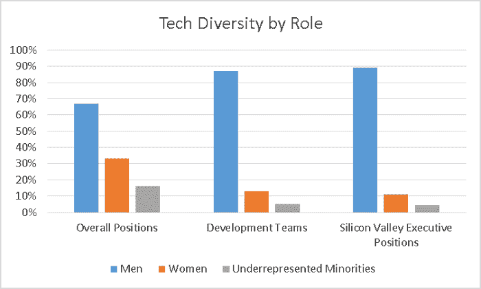

# 数据科学中的多样性：概述与策略

> 原文：[`www.kdnuggets.com/2018/09/diversity-data-science.html`](https://www.kdnuggets.com/2018/09/diversity-data-science.html)

 评论

许多近期的文章强调了科技行业中女性和代表性不足的少数族裔的短缺，以及硅谷“兄弟文化”相关的问题。然而，除了招聘实践之外，少有文章提供增加多样性的建议。这个问题到底有多严重，除了建议由背景基本相同的团队发起的文化变革，还有什么可行的解决方案？

大约三分之一的科技行业员工是女性，约六分之一是代表性不足的少数族裔（西班牙裔或非洲裔美国人）。管理层中约五分之六是白人。像谷歌或苹果这样的科技大公司报告称其员工的多样性更低，在技术相关职位中，行业中女性占 24%，代表性不足的少数族裔占 5%。在开发团队中，女性的比例低至 13%，且女性在技术职位上的离职率是男性的两倍。这些统计数据表明，女性和代表性不足的少数族裔在技术公司中担任的职务与技术开发或领导无关。

* * *

## 我们的三大课程推荐

 1\. [Google 网络安全证书](https://www.kdnuggets.com/google-cybersecurity) - 快速进入网络安全职业的捷径。

 2\. [Google 数据分析专业证书](https://www.kdnuggets.com/google-data-analytics) - 提升你的数据分析技能

 3\. [Google IT 支持专业证书](https://www.kdnuggets.com/google-itsupport) - 支持你的组织 IT 部门

* * *

公司可以通过增加多样性获得多种好处。麦肯锡的一份最新报告显示，在种族和民族多样性方面排名前四分之一的公司，其超越行业中位数回报的可能性比基准水平高出 35%。一名女性担任高管职位使标准普尔 1500 公司收入的回报率提升了 4200 万美元。这表明，通过招聘多样化的技术团队和多样化的高管团队有可能增加收入。此外，女性和少数族裔带给技术团队的经验可以帮助设计并弥补用户体验和产品开发中的潜在盲点。

然而，解决这个问题比单纯改变招聘实践要复杂得多。女性和少数族裔在与科技职位相关的教育管道中占比过小；获得计算机科学学位的女性人数继续下降（从 1984 年的 37%下降到 2014 年的 18%）。考虑到如今在线培训程序和 MOOCs 的普及和便利，很容易假设这些机会能弥合差距。然而，数据科学项目/训练营的女性参与度（35%的参与者是女性）和少数族裔参与度（4%的非洲裔美国人和 8%的西班牙裔）仍然滞后。由于学术项目和行业训练营中的多样性较低，科技职位的数字趋势在短期内不太可能改变。即使减少歧视，如果年轻学生在课堂上看不到与自己相似的人或来自相同社会经济背景的人，也可能不会有所帮助。

教育工作者、训练营负责人以及科技行业本身可以解决这些差距，并且一些倡议有望在未来几年提升相关数字。许多奖学金存在于科技训练营中（[`www.switchup.org/blog/women-in-tech-a-comprehensive-scholarship-guide`](https://www.switchup.org/blog/women-in-tech-a-comprehensive-scholarship-guide)）和学术项目中（[`www.scholarshipsforwomen.net/engineering/`](https://www.scholarshipsforwomen.net/engineering/)），还包括非洲裔美国人和西班牙裔学生（[`www.nacme.org/`](http://www.nacme.org/)）。美国还承诺在未来几年提供 2 亿美元的 STEM 教育资金用于女性和少数族裔。这可以帮助解决负担问题，并作为女性和少数族裔尝试科技相关专业或训练营的激励措施。

此外，针对创始人或领导职位中有女性或代表性不足少数群体的公司，提供了小企业资助 ([`startupnation.com/start-your-business/small-business-grants-women-minorities/`](https://startupnation.com/start-your-business/small-business-grants-women-minorities/), [`www.fundera.com/blog/where-to-find-small-business-grants-for-women`](https://www.fundera.com/blog/where-to-find-small-business-grants-for-women), [`www.nerdwallet.com/blog/small-business/small-business-grants-minorities/`](https://www.nerdwallet.com/blog/small-business/small-business-grants-minorities/), [`www.federalgrantswire.com/minority-federal-government-grants.html#.W47QKYeouK8`](https://www.federalgrantswire.com/minority-federal-government-grants.html#.W47QKYeouK8), [`www.allamericangrantguide.com/minority-business-grants.php`](https://www.allamericangrantguide.com/minority-business-grants.php))，帮助增加初创公司高层的多样性。在我开始自己的咨询有限公司之前，我并不了解启动小企业所需的资助类型，女性和代表性不足的少数群体可能也未必知道有这些资助。

行业会议提供了另一个鼓励女性和少数群体追求技术职位和职业发展的机会。斯坦福大学的女性数据科学（WiDS）会议在今年三月吸引了超过 10 万人参与，分布在数百个城市，这让女性能够向其他女性和参加会议的男性展示她们的工作。创建一个类似于 WiDS 的会议，突出非裔美国人和西班牙裔或来自低收入家庭的技术成就和工作，可能会在更大社区中创造类似的可见性，表现出技术是一个可行的职业选择。

我进入科技行业的道路涉及了三位教授——一位在基础微积分课程中，另两位在研究生阶段——他们都是在数学领域取得成功的女性，而我在行业中的第一次职位也是在有女性领导者的公司里。如果没有机会向这些女性学习，我不确定我是否会把领导或技术职位视为适合自己的选择。提高女性和少数群体在技术教育/项目中的可见性，特别是在早期，并通过奖学金和资助项目使这些机会经济上可行，可以在技术职业的各个阶段增加多样性。

角色榜样和资源的可见性可能比招聘指南和其他平等措施更能有效地提高科技领域（以及一般的 STEM 领域）多样性。像英国 WISE 倡议这样的活动专注于帮助和鼓励 16 岁以上的年轻女性追求 STEM 职业，迈阿密的女性生物医学科学倡议可能是实现这一目标的一种途径。更多像 WiDS 这样的会议也有助于提升可见性。通过女性和少数群体在该领域的可见领导、对机会和资金的广泛了解，以及将新一代潜在科技工作者与那些在职业生涯中走得更远的人连接的项目。

**参考资料及其他文章：**

[`www.techrepublic.com/article/5-eye-opening-statistics-about-minorities-in-tech/`](https://www.techrepublic.com/article/5-eye-opening-statistics-about-minorities-in-tech/)

[`www.eeoc.gov/eeoc/statistics/reports/hightech/`](https://www.eeoc.gov/eeoc/statistics/reports/hightech/)

[`www.forbes.com/sites/mnewlands/2016/08/29/why-diversity-matters-in-tech/#7080726c8614`](https://www.forbes.com/sites/mnewlands/2016/08/29/why-diversity-matters-in-tech/#7080726c8614)

[`www.mckinsey.com/business-functions/organization/our-insights/why-diversity-matters`](https://www.mckinsey.com/business-functions/organization/our-insights/why-diversity-matters)

[`papers.ssrn.com/sol3/papers.cfm?abstract_id=1088182`](https://papers.ssrn.com/sol3/papers.cfm?abstract_id=1088182)

[`www.forbes.com/sites/lisawinning/2018/03/13/its-time-to-prioritize-diversity-across-tech/#6155ac5616f8`](https://www.forbes.com/sites/lisawinning/2018/03/13/its-time-to-prioritize-diversity-across-tech/#6155ac5616f8)

[`rethinkimpact.com/`](http://rethinkimpact.com/)

[`www.betterbuys.com/bi/women-in-data-science/`](https://www.betterbuys.com/bi/women-in-data-science/)

[`www.forbes.com/sites/priceonomics/2017/09/28/the-data-science-diversity-gap/#52f389b5f58b`](https://www.forbes.com/sites/priceonomics/2017/09/28/the-data-science-diversity-gap/#52f389b5f58b)

[`www.politico.com/story/2017/09/25/trump-stem-technology-grants-women-minorities-243115`](https://www.politico.com/story/2017/09/25/trump-stem-technology-grants-women-minorities-243115)

**相关：**

+   [女性在数据科学社区中的参与增长](https://www.kdnuggets.com/2018/09/growing-participation-women-data-science-community.html)

+   [数据科学和机器学习领域的女性资源](https://www.kdnuggets.com/2018/06/resources-women-data-science-machine-learning.html)

+   [数据科学家想要什么？](https://www.kdnuggets.com/2018/08/what-data-scientists-want.html)

### 更多相关话题

+   [用 SQL 分析多样性与包容性](https://www.kdnuggets.com/2022/11/analyzing-diversity-inclusion-sql.html)

+   [掌握数据战略的 15 本书](https://www.kdnuggets.com/2022/06/top-15-books-master-data-strategy.html)

+   [KDnuggets 新闻，6 月 22 日：主要的监督学习算法…](https://www.kdnuggets.com/2022/n25.html)

+   [GenAI 时代的人工智能转型战略](https://www.kdnuggets.com/the-ai-transformation-strategy-in-the-genai-era)

+   [如何制定有效的人工智能战略](https://www.kdnuggets.com/2022/11/create-effective-ai-strategy.html)

+   [终极人工智能战略手册](https://www.kdnuggets.com/the-ultimate-ai-strategy-playbook)
