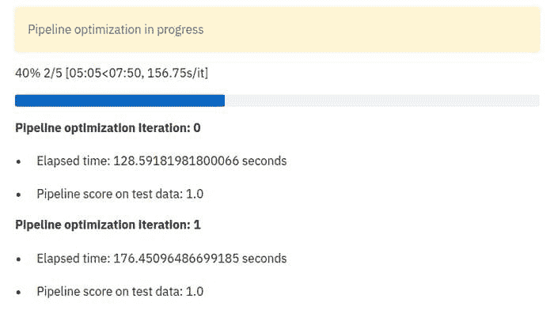
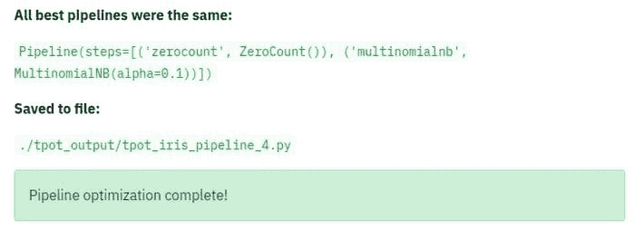
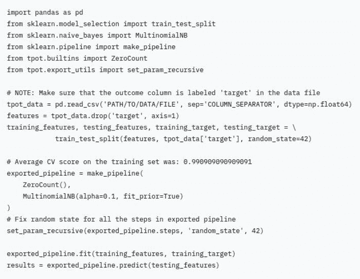

# 使用 Streamlit 的 DIY 自动化机器学习

> 原文：[`www.kdnuggets.com/2021/11/diy-automated-machine-learning-app.html`](https://www.kdnuggets.com/2021/11/diy-automated-machine-learning-app.html)


图片由 Soroush Zargar 拍摄，来源于 Unsplash

你可能知道自动化机器学习（AutoML）。你很有可能听说过开源 AutoML 工具[TPOT](https://github.com/EpistasisLab/tpot)，也就是你的*数据科学助手*。你甚至可能看过我最近的文章，介绍了如何使用 TPOT 优化机器学习管道（你可能没看过，所以这是你的机会去看看... 我等着你）。 

无论如何，当这些优化按钮可见且易于调整时，探索 AutoML 和机器学习优化的调整旋钮会更有意义。在这篇文章中，我们将实现一个 TPOT 示例版本，如在我之前的文章中所述，作为一个 Streamlit 应用。

如果你不了解[Streamlit](https://streamlit.io/)，这是一个 30,000 英尺的概览：

> Streamlit 将数据脚本在几分钟内转化为可分享的网页应用。
> 
> 全部用 Python 编写。完全免费。不需要前端经验。

# 概述

我不会进一步详细说明 Streamlit 的使用，除了本文中的内容，你可以在这里找到一个很好的介绍，以及 Streamlit 速查表，基本涵盖了在了解其工作原理后所需知道的所有内容，[在此](https://share.streamlit.io/daniellewisdl/streamlit-cheat-sheet/app.py)。

除了快速了解如何实现 Streamlit 项目外，你还将获得一个沙盒网页应用，允许使用 TPOT 进行管道优化实验，并使用一对知名数据集。通过一些修改，你还应该能够使用其他数据集运行沙盒，并扩展功能以包括更多的调整旋钮。


我们用 Streamlit 和 TPOT 构建的“AutoML Pipeline Optimization Sandbox”网页应用

我不会重述原始博客文章（再次，随时阅读它），但简而言之，我们正在创建一个脚本，以自动化分类任务的预处理和建模优化——包括有限数量的预处理转换以及算法选择——在鸢尾花和数字数据集上。确实，数据集很枯燥，但使用知名数据来设置应用程序并不是一个坏主意，就像我上面说的，通过几行代码的修改，你可以尝试其他任何数据集。

关于这个优化过程的几点注意事项，超出了上述内容，还包括：

+   模型评估的交叉验证

+   对建模进行多次迭代（由于 TPOT 内部使用遗传算法）——在如此小的数据集上可能不太有用，但随着进展可能会有帮助

+   比较这些多次迭代后的结果管道——它们都一样吗？

+   你知道 TPOT 现在在幕后使用 PyTorch 来构建预测用的神经网络吗？

最后这一点不会影响我们今天的工作，但请记住它以备将来使用。

让我们看看创建这个简单 Streamlit 应用程序所需的代码。

# 代码

首先，导入：

```py
import streamlit as st

import timeit
import pandas as pd
import matplotlib.pyplot as plt

from tpot import TPOTClassifier
from sklearn.model_selection import StratifiedKFold
from sklearn.model_selection import train_test_split
from sklearn.datasets import load_digits, load_iris
from sklearn import metrics
from stqdm import stqdm
```

一切都应该非常简单。最后的导入 `stqdm` 是一个专门为 Streamlit 编写的 [tqdm](https://github.com/tqdm/tqdm) 风格的进度条。

接下来，这是数据加载函数：

```py
@st.cache
def load_data(dataset, train_size, test_size, random_state):
	"""Load data"""
	ds = ''
	if dataset == 'digits':
		ds = load_digits()
		df = load_digits(as_frame=True)
	if dataset == 'iris':
		ds = load_iris()
		df = load_iris(as_frame=True)
	X_train, X_test, y_train, y_test = train_test_split(ds.data, ds.target, train_size=train_size, test_size=test_size, random_state=random_state)
	return X_train, X_test, y_train, y_test, df['frame']
```

我们使用 Scikit-learn 中的 `load_iris()` 和 `load_digits()` 函数（TPOT 与其紧密集成）来获取相应的数据集。请注意，这里将数据集分为训练集和测试集，并分别返回训练/测试特征/标签，以及用于向用户展示的完整数据集数据框，因为它看起来更美观，尤其是当通过 Streamlit 展示时（Streamlit 能够使用其 `write()` 方法解释和正确显示各种对象）。还有其他方法可以实现这一点，但这对如此小的数据集来说简单且没有问题。请注意 `@st.cache` 装饰器，它将函数的结果缓存以供应用程序未来的运行，而不是每次都重新加载数据。

现在我们设置一些应用范围的 Streamlit 配置，设置侧边栏，分配一些变量，并使用上述函数加载数据：

```py
# Set title and description
st.title("AutoML Pipeline Optimization Sandbox")
st.write("Experiment with using open source automated machine learning tool TPOT for building fully-automated prediction pipelines")

# Create sidebar
sidebar = st.sidebar
dataset = sidebar.selectbox('Dataset', ['iris','digits'])
train_display = sidebar.checkbox('Display training data', value=True)
search_iters = sidebar.slider('Number of search iterations', min_value=1, max_value=5)
generations = sidebar.slider('Number of generations', min_value=1, max_value=10)
population_size = sidebar.select_slider('Population size', options=[10,20,30,40,50,60,70,80,90,100])

random_state = 42
train_size = 0.75
test_size = 1.0 - train_size
checkpoint_folder = './tpot_checkpoints'
output_folder = './tpot_output'
verbosity = 0
n_jobs = -1
times = []
best_pipes = []
scores = []

# Load (and display?) data
X_train, X_test, y_train, y_test, df = load_data(dataset)
if train_display:
	st.write(df)
```

比较上述代码，在相关情况下，与你之前实现的独立脚本或 Streamlit 速查表中的内容，这一切应该都相当简单。

注意设置交互式用户可配置变量的便利，这些变量在我们的代码中被使用，以及设置侧边栏的便利。我们可以使用滑块、复选框和选择框来选择和显示数据集，并设置遗传算法 TPOT 内部用于优化过程的搜索迭代次数、代数和种群规模。现在应该越来越容易看到如何在不费太多力气的情况下开放自定义数据集。

接下来，让我们定义评分方法；模型评估方法；以及实际搜索方法。之后，展示了优化循环，包括为用户利益显示一些特定迭代的输出。

```py
# Define scoring metric and model evaluation method
scoring = 'accuracy'
cv = ('stratified k-fold cross-validation',
       StratifiedKFold(n_splits=10,  
       shuffle=True,
       random_state=random_state))

# Define search
tpot = TPOTClassifier(cv=cv[1],
		      scoring=scoring,
	              verbosity=verbosity,
		      random_state=random_state,
		      n_jobs=n_jobs,
		      generations=generations,
		      population_size=population_size,
		      periodic_checkpoint_folder=checkpoint_folder)

# Pipeline optimization iterations
with st.spinner(text='Pipeline optimization in progress'):
	for i in stqdm(range(search_iters)):
		start_time = timeit.default_timer()
		tpot.fit(X_train, y_train)
		elapsed = timeit.default_timer() - start_time
		score = tpot.score(X_test, y_test)
		best_pipes.append(tpot.fitted_pipeline_)
		st.write(f'\n__Pipeline optimization iteration: {i}__\n')
		st.write(f'* Elapsed time: {elapsed} seconds')
		st.write(f'* Pipeline score on test data: {score}')
	tpot.export(f'{output_folder}/tpot_{dataset}_pipeline_{i}.py')
```

此时，你应该比较 Streamlit 速查表中的 `write()`、`spinner()`、`success()` 和其他显示功能。

一旦运行，上述优化循环将输出类似于以下内容的结果：



最后，我们需要评估我们的结果：

```py
# check if pipelines are the same
result = True
first_pipe = str(best_pipes[0])
for pipe in best_pipes:
	if first_pipe != str(pipe):
		result = False
if (result):
	st.write("\n__All best pipelines were the same:__\n")
	st.write(best_pipes[0])
else:
	st.write('\nBest pipelines:\n')
	st.write(*best_pipes, sep='\n\n')

st.write('__Saved to file:__\n')
st.write(f'```{output_folder}/tpot_{dataset}_pipeline_{i}.py```py')

st.success("Pipeline optimization complete!")
```



...并输出最佳管道的代码（也保存到文件中）：

```py
# Output contents of best pipe file
with open (f'{output_folder}/tpot_{dataset}_pipeline_{i}.py', 'r') as best_file:
	code = best_file.read()
st.write(f'```{code}```py')
```



这是 Streamlit 应用程序的完整代码（注意，只需这个简短的 Python 脚本即可完成所有任务）：

这就是如何利用 Streamlit 和 TPOT 快速构建一个 AutoML 管道优化沙箱，只需使用 Python 代码。请注意，我们成功完成这一过程并不需要任何网页编程技能。

**[Matthew Mayo](https://www.linkedin.com/in/mattmayo13/)** ([**@mattmayo13**](https://twitter.com/mattmayo13)) 是数据科学家和 KDnuggets 的主编，KDnuggets 是开创性的在线数据科学和机器学习资源。他的兴趣领域包括自然语言处理、算法设计与优化、无监督学习、神经网络以及自动化机器学习方法。Matthew 拥有计算机科学硕士学位和数据挖掘研究生文凭。他可以通过 editor1 at kdnuggets[dot]com 联系。

* * *

## 我们的前三个课程推荐

 1\. [谷歌网络安全证书](https://www.kdnuggets.com/google-cybersecurity) - 快速进入网络安全职业生涯。

 2\. [谷歌数据分析专业证书](https://www.kdnuggets.com/google-data-analytics) - 提升你的数据分析技能

 3\. [谷歌 IT 支持专业证书](https://www.kdnuggets.com/google-itsupport) - 支持你所在组织的 IT 工作

* * *

### 更多相关话题

+   [Streamlit 机器学习备忘单](https://www.kdnuggets.com/2023/01/streamlit-machine-learning-cheat-sheet.html)

+   [LangChain + Streamlit + Llama：将对话式 AI 带到你的本地机器](https://www.kdnuggets.com/2023/08/langchain-streamlit-llama-bringing-conversational-ai-local-machine.html)

+   [用 HuggingFace Pipelines 和 Streamlit 回答问题](https://www.kdnuggets.com/2021/10/simple-question-answering-web-app-hugging-face-pipelines.html)

+   [将 Streamlit WebApp 部署到 Heroku，使用 DAGsHub](https://www.kdnuggets.com/2022/02/deploying-streamlit-webapp-heroku-dagshub.html)

+   [Streamlit 的 12 个基本命令](https://www.kdnuggets.com/2023/01/12-essential-commands-streamlit.html)

+   [使用 Python 的自动化机器学习：案例研究](https://www.kdnuggets.com/2023/04/automated-machine-learning-python-case-study.html)
