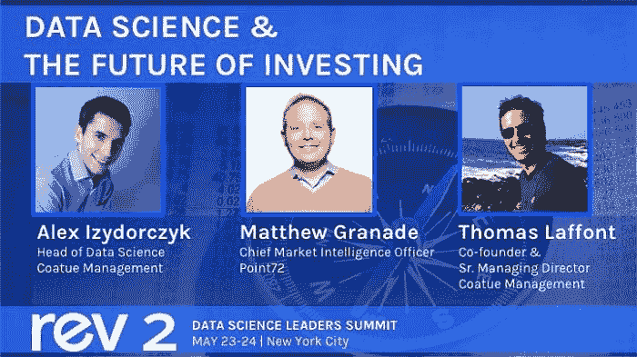

# 在 Rev 2 上向对冲基金领导者学习数据科学与投资未来

> 原文：[`www.kdnuggets.com/2019/04/domino-data-science-hedge-fund-rev-2.html`](https://www.kdnuggets.com/2019/04/domino-data-science-hedge-fund-rev-2.html)

赞助文章。

* * *

## 我们的前三个课程推荐

 1\. [谷歌网络安全证书](https://www.kdnuggets.com/google-cybersecurity) - 快速进入网络安全职业生涯。

 2\. [谷歌数据分析专业证书](https://www.kdnuggets.com/google-data-analytics) - 提升您的数据分析技能

 3\. [谷歌 IT 支持专业证书](https://www.kdnuggets.com/google-itsupport) - 支持您组织中的 IT

* * *

Coatue Management 的联合创始人兼高级董事总经理 Thomas Laffont 将与他的首席数据科学家 Alex Izydorczyk 一同登台，参加由 Point72 的首席市场情报官和董事总经理 Matthew Granade 主持的令人着迷的讨论。*（完全披露：Matthew Granade 也是 Domino 的联合创始人和董事会成员，而 Coatue Management 既是 Domino 的投资者也是客户。）*

根据[《福布斯》](https://www.forbes.com/sites/antoinegara/2018/02/28/exclusive-top-hedge-fund-manager-philippe-laffont-thinks-a-i-will-transform-intel-and-twitter/#39809d096025)的说法，Coatue 一直处于“AI 革命的前沿”，在 Nvidia、Google 和 Equinix 等创新企业中拥有大量股份。他们最近也在私人市场上引起了轰动，[被《机构投资者》](https://www.institutionalinvestor.com/article/b1c2lcwx8z6wwz/Tiger-Cub-Coatue-Rolls-Out-New-Venture-Capital-Fund)称为“最具攻击性的对冲基金投资者”之一，投资了 Instacart、Lyft、Box.com、[jet.com](http://jet.com)、Uber 和 Snapchat。2018 年，他们推出了两个风险投资基金，2 月份，创始人兼首席投资官 Philippe Laffont 宣布[Coatue 将推出其首个量化对冲基金](https://www.bloomberg.com/news/articles/2019-02-28/laffont-s-coatue-seeks-250-million-for-first-quant-hedge-fund)，该基金将完全系统化且市场中立。

Point72 还将其投资权重倾斜到由模型驱动的创新行业，将超过 22% 的资金分配给医疗保健，21% 给技术，16% 给能源。该公司在过去一年中扩大了其地理覆盖范围，并最近在悉尼开展业务，专注于宏观投资。对冲基金在 2018 年筹集了超过 40 亿美元的外部资本，使其管理的总资产达到大约 130 亿美元（截至 2018 年 11 月）。

Coatue 和 Point72 都认识到数据科学作为组织能力的重要性；他们通过将量化方法和自由裁量方法相结合而取得了成功，[根据彭博社的报道](https://www.bloomberg.com/news/articles/2019-02-28/laffont-s-coatue-seeks-250-million-for-first-quant-hedge-fund)。

但金融公司已经依赖模型几十年了。只是它被称为“量化研究”而不是“数据科学”，对吧？那么，新模型方法和数据科学行业的发展带来了什么变化呢？

在 Rev 的讨论中，三位对冲基金领导者将交换观点并解答如下问题：

+   对冲基金如何利用模型推动创新和制定新的业务策略？

+   随着数据科学和建模实践的发展，公共和私人市场的投资策略有哪些变化？

+   从金融公司的量化研究经验中，有哪些经验和概念对新数据科学体制的建立有价值？相反，对冲基金必须“忘记”哪些过去的操作方式？

+   将数据科学整合到您的基金中有哪些具体策略和技术？这些方法中哪些可以应用于金融行业以外的企业？

+   如何将数据科学家与传统分析师和投资组合经理整合？

一般会议讨论将于 5 月 24 日星期五在纽约万豪酒店举行。要了解更多关于 Rev 2 的信息或查看完整日程，请访问 [rev.dominodatalab.com](https://rev.dominodatalab.com/)。请注意，4 人以上的团队一起注册可以获得 50%的票务折扣。或者，您也可以使用专属折扣代码**KDNuggetREV**享受单张票$100 的优惠！

### 更多相关话题

+   [投资人工智能？这里是需要考虑的事项](https://www.kdnuggets.com/investing-in-ai-here-is-what-to-consider)

+   [在纽约参加 Rev 3，与数据科学社区连接，#1…](https://www.kdnuggets.com/2022/03/domino-connect-data-science-community-nyc-mlops-conference.html)

+   [解锁商业成功：数据科学领导者的日益需求](https://www.kdnuggets.com/unlocking-business-success-the-growing-demand-for-data-science-leaders)

+   [学习现代预测技术，以帮助预测未来的商业结果…](https://www.kdnuggets.com/2022/12/sphere-learn-modern-forecasting-techniques-help-predict-future-business-outcomes.html)

+   [3 个激励人心的 AI 领域领导者故事](https://www.kdnuggets.com/3-inspirational-stories-of-leaders-in-ai)

+   [未来数据游戏的保障：每个数据科学家在 2023 年需要掌握的顶级技能](https://www.kdnuggets.com/futureproof-your-data-game-top-skills-every-data-scientist-needs-in-2023)
