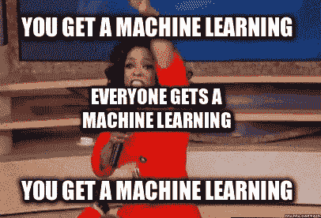

# 不要在 24 小时内学习机器学习

> 原文：[`www.kdnuggets.com/2018/04/dont-learn-machine-learning-24-hours.html`](https://www.kdnuggets.com/2018/04/dont-learn-machine-learning-24-hours.html)

 评论

**作者 [Rwiddhi Chakraborty](https://towardsdatascience.com/@dejavu.chakraborty)**。

来源 — [`medium.com/designer-hangout/machine-learning-and-ux-c28725b5f3a5`](https://medium.com/designer-hangout/machine-learning-and-ux-c28725b5f3a5)

最近，我看到了一篇由彼得·诺维格撰写的精彩文章——“在 10 年内自学编程”。

这是一个机智且稍带讽刺的标题，挖苦那些旨在让你在 24 小时、7 天、10 天， ***或插入一个荒谬短时间段***内学会编程的咖啡桌编程书籍。

诺维格博士提出了一个很强的观点。是的，你可以在 24 小时内掌握编程语言的语法、特性和风格，但这并不意味着你已经熟练掌握了编程的艺术。因为编程并不仅仅关乎语言。编程涉及智能设计、对时间和空间复杂性的严格分析、了解何时使用某种语言优于另一种语言，等等。

当然，你可以在 24 小时内用 C++编写一个 Hello World 程序，或者编写一个计算圆面积的程序，但这不是重点。你是否掌握了[面向对象编程](https://en.wikipedia.org/wiki/Object-oriented_programming)的范式？你是否理解了[namespaces](https://msdn.microsoft.com/en-IN/library/5cb46ksf.aspx)和[templates](http://www.cplusplus.com/doc/oldtutorial/templates/)的用例？你是否了解著名的[STL](https://www.topcoder.com/community/data-science/data-science-tutorials/power-up-c-with-the-standard-template-library-part-1/)? 如果你了解这些，你肯定不会在一周甚至一个月内学完所有这些内容。这需要你花费相当长的时间。而且你学得越多，就越意识到深渊比从悬崖上看到的要深得多。

我发现当前围绕机器学习、深度学习和人工智能的氛围与此类似。由于炒作的推动，成千上万的博客、文章和课程纷纷涌现。它们中的许多都带有类似的标题——“7 行代码实现机器学习”、“10 天内掌握机器学习”等。这使得 Quora 上的人们开始提问，比如 [“我怎么在 30 天内学会机器学习？”](https://www.quora.com/How-should-I-plan-my-day-to-learn-machine-learning-in-30-days)。简短的回答是，“你不能。没有人能做到。连任何专家（或即使对其内情了如指掌的人）也不能。”

看起来很熟悉？在一个非常有趣的 Facebook[页面](https://www.facebook.com/npcompleteteens/photos/a.165757437252172.1073741828.165182533976329/324222291405685/?type=3&theater)上找到了这个。

即使我们暂时忘记[10,000 小时规则](https://www.businessinsider.in/Malcolm-Gladwell-Explains-What-Everyone-Gets-Wrong-About-His-Famous-10000-Hour-Rule/articleshow/35964144.cms)，你也不能仅凭 7 行代码来做机器学习。

为什么？因为那 7 行代码没有解释你在[偏差-方差权衡](https://en.wikipedia.org/wiki/Bias%E2%80%93variance_tradeoff)中的表现，你的准确性值意味着什么，或者[准确性是否是性能的合适指标](https://stats.stackexchange.com/questions/34193/how-to-choose-an-error-metric-when-evaluating-a-classifier)，你的模型是否[过拟合](https://towardsdatascience.com/overfitting-vs-underfitting-a-complete-example-d05dd7e19765)，你的数据分布情况如何，以及你是否选择了[合适的模型来拟合你的数据](https://www.itl.nist.gov/div898/handbook/pmd/section4/pmd422.htm)等等。在回答这些问题之后，还有很多其他方面的内容需要了解。

由于你无法解释你的模型，你在 sklearn 中调整参数，得到了一点点准确性的提升，然后高高兴兴地回家了。但你真的学到了什么吗？

来源 — [机器学习与模因](http://machinelearningjourney.blogspot.in/2012/03/machine-learning-and-memes.html)

总之，不要用 7 行代码来完成。花 6 个月、一年的时间来做。你会在这段时间中间知道这是否对你有兴趣。现在忘掉那些光鲜亮丽的东西，真正深入了解这个令人惊叹的研究领域。你一定要阅读[this](https://homes.cs.washington.edu/~pedrod/papers/cacm12.pdf)。我发现它是该领域新手的最佳入门读物。你不需要知道数学或代码来阅读它。但阅读之后，你会意识到你需要理解的整个概念范围，以便在这个领域流利地思考，也就是说，思考机器学习。

确实有许多迷人的博客可以关注。以下是我个人的一些最爱：

1.  [`colah.github.io/`](http://colah.github.io/)

1.  [`mark.reid.name/blog/`](http://mark.reid.name/blog/)

1.  [`karpathy.github.io/`](http://karpathy.github.io/)

Medium 也是一个学习的好地方。我几乎完全关注[这个](https://towardsdatascience.com/)出版物。

如果你是老派的，可以去斯坦福大学上 Andrew Ng 的[CS229](https://see.stanford.edu/course/cs229)。这比他在 Coursera 上的课程更为深入，尽管 Coursera 上的课程也是一个很好的入门介绍。

不幸的是，炒作的结果是我们“淹没在信息中，却对知识感到饥渴”。如此多人这样做，以至于我们经常忽视更大的图景。机器学习是奇妙的，它是一个严肃的研究和开发领域，推动了许多 21 世纪的应用案例。

只是不要在 24 小时内完成。

[这里](http://norvig.com/21-days.html) 是彼得·诺维格的文章，来自我们时代的杰出 AI 研究者，必读之作。

说真的，为什么不呢？

[原文](https://towardsdatascience.com/dont-learn-machine-learning-in-24-hours-3ea3624f9881)。经许可转载。

**相关：**

+   [关于机器学习的 12 件有用的事](https://www.kdnuggets.com/2018/04/12-useful-things-know-about-machine-learning.html)

+   [成为数据科学家你应该知道的十种机器学习算法](https://www.kdnuggets.com/2018/04/10-machine-learning-algorithms-data-scientist.html)

+   [深度学习的 8 本必读免费书籍](https://www.kdnuggets.com/2018/04/top-free-books-deep-learning.html)

* * *

## 我们的前三课程推荐

 1\. [谷歌网络安全证书](https://www.kdnuggets.com/google-cybersecurity) - 快速进入网络安全职业生涯。

 2\. [谷歌数据分析专业证书](https://www.kdnuggets.com/google-data-analytics) - 提升你的数据分析能力

 3\. [谷歌 IT 支持专业证书](https://www.kdnuggets.com/google-itsupport) - 支持你的组织 IT 工作

* * *

### 更多相关话题

+   [我们不需要数据科学家，我们需要数据工程师](https://www.kdnuggets.com/2021/02/dont-need-data-scientists-need-data-engineers.html)

+   [深度神经网络不会引导我们走向 AGI](https://www.kdnuggets.com/2021/12/deep-neural-networks-not-toward-agi.html)

+   [如果你没有合适的学位，如何进入数据分析领域](https://www.kdnuggets.com/2021/12/how-to-get-into-data-analytics.html)

+   [不要成为商品化的数据科学家](https://www.kdnuggets.com/2022/10/commoditized-data-scientist.html)

+   [不要错过！在 2023 年结束前注册免费课程](https://www.kdnuggets.com/dont-miss-out-enroll-in-free-courses-before-2023-ends)

+   [5 个需求量大但未被充分认可的 IT 职位](https://www.kdnuggets.com/5-it-jobs-that-are-high-in-demand-but-dont-get-enough-recognition)
