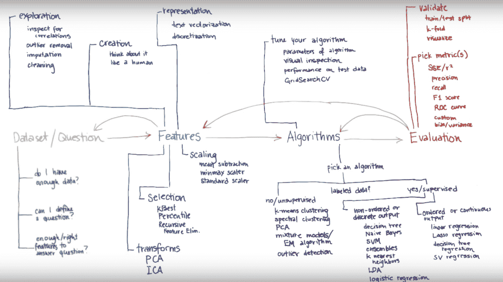

# 机器学习与敏捷的注定失败的结合

> 原文：[`www.kdnuggets.com/2019/11/doomed-marriage-machine-learning-agile.html`](https://www.kdnuggets.com/2019/11/doomed-marriage-machine-learning-agile.html)

评论

**作者 [Ian Xiao](https://www.linkedin.com/in/ianxiao/)，Dessa 的参与负责人**

图片由 [photo-nic.co.uk nic](https://unsplash.com/@chiro?utm_source=unsplash&utm_medium=referral&utm_content=creditCopyText) 提供，[Unsplash](https://unsplash.com/s/photos/falling?utm_source=unsplash&utm_medium=referral&utm_content=creditCopyText)

* * *

## 我们的前三大课程推荐

 1\. [谷歌网络安全证书](https://www.kdnuggets.com/google-cybersecurity) - 快速进入网络安全职业轨道。

 2\. [谷歌数据分析专业证书](https://www.kdnuggets.com/google-data-analytics) - 提升你的数据分析技能。

 3\. [谷歌 IT 支持专业证书](https://www.kdnuggets.com/google-itsupport) - 支持你所在组织的 IT 工作。

* * *

**总结**: 在机器学习项目中，过度采用敏捷和塞巴斯蒂安的建议的三大错误。我认为在机器学习项目中什么是可以用敏捷方法做的，什么不是。

***免责声明***: 本文未得到我所在公司或我提到的任何工具或服务的认可或赞助。我将 AI、数据科学和机器学习交替使用。

***喜欢你读到的内容吗？*** 关注我在 *[*Medium*](https://medium.com/@ianxiao)*、*[*LinkedIn*](https://www.linkedin.com/in/ianxiao/)* 或 *[*Twitter*](https://twitter.com/ian_xxiao)*。另外，你是否想作为数据科学家学习商业思维和沟通技巧？查看我的“*[*利用机器学习影响力*](https://www.bizanalyticsbootcamp.com/influence-with-ml-digital)*”指南。

### 一个忏悔

2016 年 11 月 3 日晚上 11:35。我坐在多伦多心脏地带贝街的一个会议室里。我盯着街对面空荡荡的办公室楼层。我的房间灯光渐暗。我的手机亮了，我收到了三个通知。

// 高管演示，10 小时内。

// 给杰斯打电话。发送最终的婚礼后勤细节，12 小时内。

// 前往机场。18 小时后飞往香港参加我们的婚礼。

“他妈的… 他妈的。他妈的！”

我按下键盘；笔记本电脑开机了；一个数字出现了。它还是不能工作。我该如何解释预期转化率下降了 35%？

我拿起电话，打给了我的同事西蒙，他将帮助我进行演示：“我们来计划一下应急处理吧。”

“嘿，你在想我们的婚礼吗？”我亲爱的妻子杰斯问。

我猛然回到现实。这是 2019 年 11 月 5 日。*我承认*。不，我并没有想着我们的婚礼，但祝我们周年快乐！我永远不会忘记这个日期。

### 该死的，塞巴斯蒂安

我喜欢关于机器学习的成功故事。但，让我们面对现实：大多数机器学习项目失败。许多项目失败是因为我们试图用机器学习解决错误的问题；一些失败是因为我们没有足够关注 [最后一公里问题](https://towardsdatascience.com/fixing-the-last-mile-problems-of-deploying-ai-systems-in-the-real-world-4f1aab0ea10) 和 [工程及组织问题](https://towardsdatascience.com/the-last-defense-against-another-ai-winter-c589b48c561)。少数失败是因为我们觉得 [数据科学很无聊](https://towardsdatascience.com/data-science-is-boring-1d43473e353e) 而停止关注。其余的，就像我所承认的那样，失败是由于项目管理不善。

如果我从这段经历中挑选出一个教训，那就是：**不要过度使用敏捷。** 一切始于 [塞巴斯蒂安·特伦](https://twitter.com/SebastianThrun) 的一张图。

这是我最喜欢的机器学习工作流程图，部分原因是塞巴斯蒂安写字的手写字体是用计算机写字板写的（说真的）。**但是，有一个重要的细微差别。**

塞巴斯蒂安·特伦，[Udacity](https://www.udacity.com/)——数据科学导论，最佳在线课程！

### 我的无知、细微差别以及发生了什么

**首先，我必须承认自己的无知。** 我曾经是 [敏捷方法](https://en.wikipedia.org/wiki/Agile_software_development) 的天真倡导者，因为 [瀑布模型](https://airbrake.io/blog/sdlc/waterfall-model) 太过古老和不吸引人。像我一样，你们中的许多人可能听说过关于敏捷的说法：迭代使我们能够快速学习、测试和失败。*（此外，我们通过节省编写技术规范的纸张，减少了砍伐树木的数量，这些规范没人阅读并且可能在早期项目中就是错误的）。*

**细微差别。** 不应该有箭头指回问题和评估（绿色和红色文本）阶段。敏捷的迭代原则 **不应适用于** 定义核心问题和评估指标的阶段。

核心问题必须尽早明确。然后，必须立即思考子问题（参见 [假设驱动的问题解决](http://www.consultantsmind.com/2012/09/26/hypothesis-based-consulting/) 方法）。它们有助于 1) 识别良好的功能想法并推动探索性分析，2) 规划时间表，3) 决定每个敏捷迭代应该关注什么。评估指标必须根据核心问题谨慎选择。我在我的 [指南](https://www.bizanalyticsbootcamp.com/influence-with-ml-digital) 中详细讨论了这个过程。

**那么，发生了什么？** 无法识别我自己的无知和机器学习工作流程中的细微差别导致了 3 个致命错误。

***错误 #1：***我们因为对核心业务问题的错误定义在中途改变了 [目标变量](https://www.datarobot.com/wiki/target/)。这导致了 [数据泄漏](https://machinelearningmastery.com/data-leakage-machine-learning/) ，破坏了我们的模型性能。我们不得不重新编写约 35% 的代码，并花费约 2 周的时间重新尝试不同的数据转换和模型架构。这真是一场噩梦。

***错误 #2：***我们优先考虑了低影响特性，因为我们的子问题没有经过充分考虑。好吧，这些特性中的一些是创新的，但事后看并不实用。这浪费了宝贵的开发时间，在时间限制的咨询环境中极为重要。

***错误 #3*：**我们改变了评估指标。我们不得不重新设计我们的模型架构，并重新运行 [超参数搜索](https://en.wikipedia.org/wiki/Hyperparameter_optimization)。这需要新的测试用例。我们不得不手动运行许多回归测试。

所有这些错误对客户体验、团队士气和时间表产生了不良影响。最终，它们导致了我婚礼前的一个非常紧张的晚上。

### 变得更聪明

好吧，让我们公平一点。我确实把塞巴斯蒂安的建议断章取义了。他是最好的机器学习老师（对不起，*[Andrew Ng](https://medium.com/u/592ce2a67248?source=post_page-----b91b95b37e35----------------------)*）。

塞巴斯蒂安的工作流程主要是为以实验为中心的机器学习项目设计的（例如商业智能或洞察发现）。对于以工程为中心的机器学习项目（例如我们的全栈机器学习系统），工作流程应该基于软件工程和产品管理的最佳实践进行改进。

这是我对什么可以敏捷，什么不可以敏捷的看法。这对时间限制的咨询或内部原型项目尤为重要。*没有一种完美的方法，所以不要过于执着，聪明地应用即可。*

**可敏捷：**

+   数据特征的开发

+   模型架构的开发

+   用户界面的设计和开发（例如仪表盘、Web-UI 等）

+   [CICD](https://semaphoreci.com/blog/cicd-pipeline) 测试用例的设计和开发

**不可敏捷：**

+   用户体验如果最终消费者是人；集成模式和协议如果最终消费者是系统。

+   核心定义、子问题及主要特征创意列表

+   目标变量的定义（避免任何变更。但如果业务需求发生变化，锁定 CICD 流水线对于捕捉数据或软件缺陷非常有帮助。）

+   评估指标

+   管道：数据到模型和 [CICD](https://semaphoreci.com/blog/cicd-pipeline) 与 [DVC](https://dvc.org/)

+   基础设施：集成模式、服务层、关键数据库和硬件平台

到目前为止运行得很好。欢迎任何反馈，一如既往。

根据对这篇文章的反响，我可能会跟进**如何使用瀑布模型和敏捷方法规划机器学习项目**，并附上示例工作计划图和需求。通过关注我在[Medium](https://medium.com/@ianxiao)、[LinkedIn](https://www.linkedin.com/in/ianxiao/)，或[Twitter](https://twitter.com/ian_xxiao)来保持关注。

正如你所见，能够清晰地阐述核心问题并进行分析、特征构思、模型选择对项目的成功至关重要。我整合了我在[**影响力与机器学习**](https://www.bizanalyticsbootcamp.com/influence-with-ml-digital)迷你课程中提供给学生和从业者的材料。希望你觉得这有用。

**喜欢你读到的内容吗？** 你可能也会喜欢我这些受欢迎的文章：

[**数据科学很无聊**](https://towardsdatascience.com/data-science-is-boring-1d43473e353e?source=post_page-----b91b95b37e35----------------------)

我如何应对机器学习部署中的枯燥日子

[**对抗另一个人工智能寒冬的最后防线**](https://towardsdatascience.com/the-last-defense-against-another-ai-winter-c589b48c561?source=post_page-----b91b95b37e35----------------------)

数字、五种战术解决方案和快速调查

[**人工智能的最后一公里问题**](https://towardsdatascience.com/fixing-the-last-mile-problems-of-deploying-ai-systems-in-the-real-world-4f1aab0ea10?source=post_page-----b91b95b37e35----------------------)

许多数据科学家未曾充分考虑的一件事

**简介：[Ian Xiao](https://www.linkedin.com/in/ianxiao/)** 是 Dessa 的参与负责人，负责在企业中部署机器学习。他领导业务和技术团队来部署机器学习解决方案，并改善 F100 企业的市场营销和销售。

[原文](https://towardsdatascience.com/a-doomed-marriage-of-ml-and-agile-b91b95b37e35)。已获许可转载。

**相关：**

+   对抗另一个人工智能寒冬的最后防线

+   数据科学很无聊（第一部分）

+   数据科学很无聊（第二部分）

### 更多相关主题

+   [掌握数据科学项目管理的 7 个步骤（敏捷方法）](https://www.kdnuggets.com/2023/07/7-steps-mastering-data-science-project-management-agile.html)

+   [学习数据科学、机器学习和深度学习的可靠计划](https://www.kdnuggets.com/2023/01/mwiti-solid-plan-learning-data-science-machine-learning-deep-learning.html)

+   [每个机器学习工程师应该掌握的 5 项机器学习技能…](https://www.kdnuggets.com/2023/03/5-machine-learning-skills-every-machine-learning-engineer-know-2023.html)

+   [KDnuggets 新闻，12 月 14 日：3 个免费机器学习课程…](https://www.kdnuggets.com/2022/n48.html)

+   [人工智能、分析、机器学习、数据科学、深度学习…](https://www.kdnuggets.com/2021/12/developments-predictions-ai-machine-learning-data-science-research.html)

+   [突破数据障碍：如何通过零样本、单样本和少样本学习…](https://www.kdnuggets.com/2023/08/breaking-data-barrier-zeroshot-oneshot-fewshot-learning-transforming-machine-learning.html)
