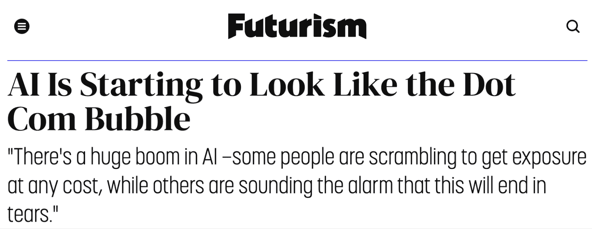
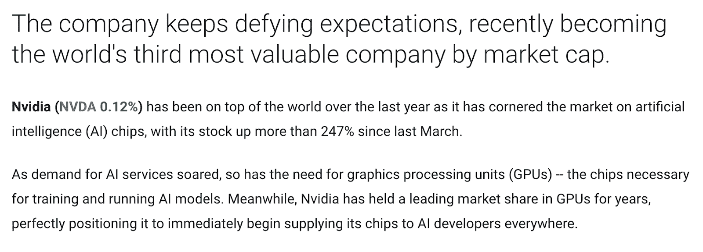

# 从点 com 到点 AI：新的技术泡沫？

> 原文：[`www.kdnuggets.com/dot-com-to-dot-ai-new-tech-bubble`](https://www.kdnuggets.com/dot-com-to-dot-ai-new-tech-bubble)

图片来源：[Futurism](https://futurism.com/ai-dot-com-bubble)

* * *

## 我们的前三大课程推荐

 1\. [谷歌网络安全证书](https://www.kdnuggets.com/google-cybersecurity) - 快速进入网络安全职业的快车道。

 2\. [谷歌数据分析专业证书](https://www.kdnuggets.com/google-data-analytics) - 提升你的数据分析能力

 3\. [谷歌 IT 支持专业证书](https://www.kdnuggets.com/google-itsupport) - 支持你的组织的 IT 需求

* * *

生成式 AI 时代的到来令所有人惊叹——无论是技术专家还是爱好者。关于如何乘上生成式 AI 浪潮的报告和手册层出不穷，被誉为行业的“iPhone 时刻”。

有趣的是，这不仅限于表面现象，而是已经成为董事会讨论中的基本议题。高管和技术专家正面临紧迫感，必须拥抱这一革命性变化并加速业务增长。

有人认为这种“哇”因素是对人工智能的过高期望，并担心重蹈点 com 泡沫的覆辙。

## 先聊聊英伟达！

在所有这些狂热中，一家公司最近成为了头条新闻，即芯片制造商英伟达。值得注意的是，英伟达是领先的 GPU（图形处理单元）提供商，由于人工智能领域的激增，这些 GPU 的需求非常高。这些 GPU 的供应对于构建需要高计算能力的 AI 模型至关重要。

英伟达股票的卓越表现证明了其成功轨迹，如下所示：

来源：[The Motley Fool](https://www.fool.com/investing/2024/03/28/2-reasons-to-buy-nvidia-stock-like-theres-no-tomor/)

其增长历程是对人工智能投资增长的响应，这为今天的点 AI（.ai）世界与本世纪初的点 com（.com）世界进行比较提供了良好的过渡。

## 比较的开始

这种“.ai”与“.com”的比较源于一系列事件，其中之一是最新新闻提到的[一年历史的 AI 初创公司](https://techcrunch.com/2024/01/26/ola-founder-ai-startup-krutrim-unicorn-in-50m-funding)，据说成为了印度获得独角兽地位的最快公司。

去年，当[米斯特拉尔人工智能](https://edition.cnn.com/2023/07/23/business/ai-vc-investment-dot-com-bubble/index.html)筹集了 1.18 亿美元，被认为是欧洲最大的种子基金时，类似的情绪也浮现出来。

值得注意的是，企业在训练大型语言模型时需要大量资金来取得重大进展，因为像 OpenAI、Anthropic 等公司也在这一过程中筹集了数十亿美元。

这样的消息在投资者社区中引起轰动，尤其是当人工智能作为一个备受关注的行业能够为投资者带来溢价回报，即所谓的世代回报时。

[HBR](https://hbr.org/1998/11/how-venture-capital-works) 也通过将投资理论与行业重点而非创意重点联系起来来强调这一点——“风险投资家必须在本质上具有风险的业务中获得持续的超额回报。误区在于，他们通过投资于好的创意和好的计划来实现这一点。实际上，他们投资于好的行业——即那些在竞争上比整个市场更具宽容度的行业。他们以一种最大限度降低风险并最大化回报的方式来结构化他们的交易。”

一件事是明确的，世界在 ChatGPT 热潮中看起来是二元的——生成型人工智能与其他世界。

## 是泡沫还是非泡沫？

现在出现了一个重大问题——这是一场泡沫吗？

参考 [FortuneBusinessInsights](https://www.fortunebusinessinsights.com/generative-ai-market-107837) 的这些统计数据，预计全球生成型人工智能市场将在 2032 年前以约 40%的年均增长率增长至 9670 亿美元。

由于这种潜力，也有报告将这一“人工智能”泡沫与“互联网泡沫”进行比较。

那么，让我们讨论一下为何市场认为人工智能（AI）可能成为另一个即将到来的泡沫。

尽管人工智能是一个备受追捧的行业，但我们需要警惕即将到来的泡沫的前兆。投机性投资、缺乏相关专业知识以及缺乏明确的差异化或创新是吸引泡沫的早期迹象。

投资者通常关注严格的尽职调查过程，包括但不限于评估商业模式、财务和法律复杂性、市场需求和分析，这些都是评估投资机会的关键步骤。

此外，强有力的治理政策、相关的产品市场契合度，以及关于可行性、可扩展性和实现更高回报的潜力的提案，这些都是驱动投资者决策的一些关键因素。此外，营收生成能力、对总可寻址市场的理解、进入壁垒、商业护城河和增长战略也都指示了一个积极信号。

像人工智能这样的新颖且尖端的产品被视为获得丰厚投资回报的黄金机会。

## 很多投资走上了歧途，但为什么呢？

然而，选择正确的投资是一项具有挑战性的任务。让我们讨论一些 [统计数据](https://www.luisazhou.com/blog/startup-failure-statistics/) 来描述这些风险：

+   ~75%的公司甚至无法实现投资的收支平衡。

+   在像人工智能这样的颠覆性技术背景下，报告建议这类初创公司由于固有的风险而具有更高的失败率。

[CNN](https://edition.cnn.com/2023/07/23/business/ai-vc-investment-dot-com-bubble/index.html) 还报道了“一些投资者和业内人士担心，资金的狂热正在转变为泡沫，资金投向那些既没有收入、也没有创新产品、也没有正确专业知识的公司。”

让我们看看投资者通常关注什么。投资者普遍认为，企业的成功在很大程度上依赖于创始人的韧性、诚信和将创新想法付诸实践的能力。一些因素考虑了商业概念本身的稳健性及其解决客户痛点的能力。

除了这些属性外，还包括各种心理因素，比如对创始人能力的信心（这可以通过他们是否是首次创始人或是否在过去有成功退出经历来评估），或者创始人是否愿意接受对立观点，也提供了一组额外的指标（尽管是非定量的）来参考。

然而，人类专家（在此情况下是投资者）只能同时考虑有限的因素以做出最有效的决策。这就是计算能力，也就是机器，发挥作用的地方，帮助投资者做出基于数据的决策。

## 风险投资世界的过去与现在

由于风险投资行业固有的高风险、高影响特性，人工智能可以用来增强风险投资者的直觉，这种直觉更多基于来自历史数据点的定量分析。这些模型评估*提案的可行性并预测投资成功的可能性*。

欢迎进入现代数据驱动的投资领域。

引用 [Gartner](https://www.gartner.com/en/newsroom/press-releases/2021-03-10-gartner-says-tech-investors-will-prioritize-data-science-and-artificial-intelligence-above-gut-feel-for-investment-decisions-by-20250)：

> “传统的推介体验将在 2025 年发生显著变化，科技首席执行官将需要面对使用人工智能驱动的模型和模拟的投资者，因为传统的推介文档和财务数据将不再足够。”

构建用于评估有吸引力的人工智能机会的工具似乎是在众多有吸引力的人工智能应用中有效地利用技术的一种方式。投资界将从这种量化工具中受益，使其能够做出明智的投资决策，避免行业陷入另一个泡沫中，这是一个合理的期望。

**[Vidhi Chugh](https://vidhi-chugh.medium.com/)** 是一位 AI 策略师和数字化转型领导者，她在产品、科学和工程的交汇点上工作，致力于构建可扩展的机器学习系统。她是一位获奖的创新领袖、作者和国际演讲者。她的使命是使机器学习大众化，打破术语，让每个人都能参与这一转型。

### 相关话题

+   [AI for Ukraine 是 AI HOUSE 推出的一个新教育项目，用于支持乌克兰科技社区的…](https://www.kdnuggets.com/2022/08/ai-house-ai-ukraine-new-educational-project-support-ukrainian-tech-community.html)

+   [刚刚上线的新技术课程](https://www.kdnuggets.com/new-tech-courses-that-have-just-landed)

+   [生成式 AI 泡沫即将破裂](https://www.kdnuggets.com/the-generative-ai-bubble-will-burst-soon)

+   [数据科学是一个即将破裂的泡沫吗？](https://www.kdnuggets.com/is-data-science-a-bubble-waiting-to-burst)

+   [2022 年技术专家薪资指南](https://www.kdnuggets.com/2022/07/simple-salary-guide-tech-experts-2022.html)

+   [科技行业的裁员潮是怎么回事？](https://www.kdnuggets.com/2023/02/layoffs-tech.html)
