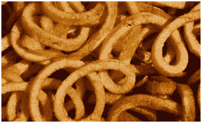

# 为什么素食者错过的航班更少——五个数据中的奇怪发现

> 原文：[`www.kdnuggets.com/2019/01/dr-data-five-bizarre-insights-from-data.html`](https://www.kdnuggets.com/2019/01/dr-data-five-bizarre-insights-from-data.html)

 评论

**“机器人科学家”——机器学习自动化了一种科学研究**

很奇怪：素食者错过的航班更少。

* * *

## 我们的三大课程推荐

 1\. [谷歌网络安全证书](https://www.kdnuggets.com/google-cybersecurity) - 快速进入网络安全职业生涯。

 2\. [谷歌数据分析专业证书](https://www.kdnuggets.com/google-data-analytics) - 提升你的数据分析技能

 3\. [谷歌 IT 支持专业证书](https://www.kdnuggets.com/google-itsupport) - 支持你组织的 IT

* * *

很疯狂：喜欢在 Facebook 上“卷曲薯条”的人更聪明。

你正在穿越一个边界是想象力的维度。嗯，这其实并不是真正的《阴阳魔界》，但我们可以称之为“大数据的‘怪诞经济学’”，或者“数据科学的‘Ripley’s Believe It or Not’”。

我们生活在一个奇怪又疯狂的世界中，充满了离奇和令人惊讶的联系，这些联系在不断收集的大量数据中得到了体现。这就是为什么数据成为世界上最强大、最蓬勃发展的“非自然资源”的原因。因此，世界热情地进入了数据发现的黄金时代。大量的数字分析正在产生丰富多彩、有时令人惊讶且常常有价值的见解。

在这篇文章中，我将解释这一过程如何运作，并探讨数据中发现的五个奇怪发现。

**机器学习自动化科学发现**

现在，计算机的全部意义在于自动完成任务——那么为什么不自动化科学发现呢？实际上，这正是机器学习所实现的，当计算机从数据中编码的经验中学习时。你可以将学习过程分为两个阶段：

**第一点：** 找到像素食者这样的个别见解。

**第二点：** 将见解结合起来，以提高预测能力——这也被称为“预测建模”，因为你将它们组合成一个单一的模型。

现在，这实际上有点简化了，因为机器学习通常交织这两个阶段，但我们可以将第一个阶段，即寻找见解，视为过程的基础部分。

让计算机做这些发现就是科学研究的自动化。这是一个颠覆传统科学方法的重大范式转变，传统方法是形成一个假设，然后进行测试。例如，一家航空公司可能会猜测请求素食餐的乘客错过航班的频率较低。然后他们会检查数据以测试这个假设。

顺便提一下，为什么素食者会这样的问题是一个单独的问题，我会在几分钟后讨论——第一个问题只是这个小理论是否成立。

不过，你知道，有很多这样的趋势可以检查。比如，乘客更喜欢靠过道的座位而不是靠窗的座位，或从某些城市出发的乘客等等？也许这些群体也更不容易错过航班。我们人类相当聪明，但与其坐在那里猜测这些问题，不如让计算机去搜索大量可能的趋势，看看哪些是真的？将你的 CPU 当作假设检验机器，一个“机器人科学家”。通过不知疲倦和机械地进行搜索，所有的石头都会被翻过。进行这种搜索的技术术语包括特征选择，或“逐一尝试每一个独立变量作为单变量模型”。但无论你称之为什么，这种搜索过程超越了源自人类直觉的有限思维范围。让它进行数字处理，机器将会吐出有价值的发现——这些发现有时会出乎意料，甚至似乎违背逻辑。

现在，在你对潜在的“机器人科学家”感到过于兴奋之前，这里有一个重要的警告。当你按下“开始”按钮，开启对科学发现的开放式大规模搜索时，它可能会适得其反，让你陷入重大麻烦，得出错误的结论。它可能会在数据中找到看似存在的趋势，但这些趋势实际上并不普遍成立。这个陷阱的技术术语是 p-hacking。实际上，你永远无法对数据中发现的联系做到绝对 100%的确定——总会有一些微小的可能性，数据可能误导了你，就像即使你掷硬币 100 次，每次都是正面，仍然有可能这是一个普通的硬币，你只是经历了一个异常长的正面序列。但是，通过适当检查从数据中得出的结论——这需要应用严格的统计标准——我们可以将被数据误导的可能性降低到一个可以接受的极小概率。

**五个奇特的洞察——加上两个额外的奖励洞察**

好了，让我们看看我们的机器人科学家发现了什么。这些是数据中发现的几个联系。每一个都有助于预测事物——例如谁会错过航班，谁更聪明，谁更具财务信用——因此这些都作为机器学习建立预测模型的基础构件。

我将首先介绍两个典型的、有趣的且在商业世界中有用的例子，然后再讲五个真正古怪的联系，总共七个。

**第一，如果你购买尿布，你更有可能也会购买啤酒。** 一家连锁药店在多个门店的晚间购物者中发现了这一趋势。有些人解释为，“爸爸需要一瓶啤酒。”虽然我听说过有人认为这个经典的尿布/啤酒数据挖掘例子是都市传说，但你实际上可以在我的书《预测分析》的注释中找到有关这一点和所有我正在讨论的例子的详细信息。注释在 PredictiveNotes.com 上可以免费获取。顺便说一下，这本书本身包括了总共 46 个奇特的发现，汇编成一个表格，其中包含了沃尔玛、壳牌、微软和维基百科等的例子。

**现在进入第二个。如果你的朋友更换了手机公司，你更有可能也会这么做。** 一家主要的北美运营商发现，如果某人的通话网络中的某人取消了服务，该客户更有可能取消服务，概率是七倍。物以类聚，人以群分。

**第三，素食者错过航班的概率更低。** 更准确地说，一家航空公司发现预订了素食餐的乘客更不容易错过航班。这是为什么呢？我也不清楚。坦白说，《数据博士秀》这一集的标题，“为什么素食者错过航班的概率更低”，有点像是点击诱饵，因为事实是，没有人确切知道原因。研究人员提出这可能是因为对个性化或特定餐点的期待会建立一种承诺感。但实际上，对于这些见解或发现的“为什么”我们无法得出明确的答案，至少在没有进一步研究的情况下是如此。这就是常听到的谚语，“相关性并不意味着因果关系”的意思。每一个发现、趋势或数据中的联系——无论你怎么称呼它们——都是相关性，任何解释其真实性的原因都需要理解因果关系。当分析企业积累的数据时——也就是典型的“大数据”，而不是专门为实验或科学研究收集的数据——我们通常只能得到“是什么”，却得不到“为什么”。然而，它仍然有助于预测——例如，航空公司可以利用这一发现来帮助计算航班的超售情况，即使不了解其真实性的原因。

**第四点，喜欢在 Facebook 上点赞“卷曲薯条”的人更聪明。** 剑桥大学和微软的研究人员发现，喜欢“卷曲薯条”可以预测在某个测量智力的测试中的高分。研究人员认为这并不一定是因为你必须足够聪明才能意识到卷曲薯条的美味——而是他们怀疑是一些聪明的人最早喜欢了“卷曲薯条” Facebook 页面，然后他们的朋友看到并喜欢了这个页面，这种传播在相对聪明的人群中扩展开来。

顺便提一下，关于“更聪明”的部分，我个人对将人类智力简化为一个数字感到相当怀疑，但所谓的智力测试可能确实测量了你在一些有价值的技能群体中的表现，这些技能覆盖了我们所说的“智力”的部分，但肯定不是全部。只是说说而已。

**第五点，跳过早餐的男性冠心病风险更大。** 哈佛大学的医学研究人员发现，45 至 82 岁的男性跳过早餐的风险提高了 27%。这并不一定是因为早餐本身的直接健康影响，而是因为吃早餐可能反映了生活方式。生活节奏快、压力大的人的确更容易跳过早餐，并且面临更高的健康风险。再说一次，这主要是一种直觉上的猜测——像往常一样，可能还有其他合理的解释。

**第六点，旧金山的某些犯罪率较高的社区也对优步的需求更高。** 这不一定是因为犯罪分子在乘坐优步，而是正如优步所推测的那样，因为犯罪率是非住宅人口的一个替代指标——这些正好是那些实际上不住在那里的人的更多的区域。

**最后，第七点，去酒吧的人信用风险更高。** 加拿大轮胎公司发放信用卡，并查看客户使用信用卡的情况与按时还款的对比。结果发现，曾在饮酒场所消费的人比平均水平更容易错过信用卡账单的重复付款。然而，如果你在牙医那里使用你的信用卡，你的信用风险较低，更不容易错过账单付款。而如果你购买那些小的毛毡垫以防止椅子腿刮伤地板……信用风险较低，你是一个更可靠的账单付款者。

相关的故事是，按照一家金融服务初创公司分析在线贷款申请填写方式的结果，打字时使用正确的大写字母与信用 worthiness 有关。

现在，这些趋势背后的推理可能看起来很直观且显而易见，尤其是在人格特征和组织能力方面，但请记住，仍然要对这种解释和直觉保持极大的保留。这种“怪异秀”虽能提供预测价值，但从科学角度来看却几乎没有自我解释。

这篇文章基于《Dr. Data Show》的文字记录。

**关于 Dr. Data Show**。这个新的网络系列打破了数据科学娱乐信息的常规，以简短的网络剧集吸引全球观众，涵盖了机器学习和预测分析的精华。**[点击这里查看更多剧集并注册未来的《Dr. Data Show》剧集](http://www.TheDoctorDataShow.com/)。**

Eric Siegel 博士，**预测分析世界**（[**Predictive Analytics World**](http://www.predictiveanalyticsworld.com/)）和**深度学习世界**（[**Deep Learning World**](http://www.deeplearningworld.com/)）会议系列的创始人，以及***预测分析时报***（[***The Predictive Analytics Times***](http://www.predictiveanalyticstimes.com/)）的执行编辑，使预测分析（即机器学习）的如何与为何变得易于理解且引人入胜。他是获奖著作***预测分析：预测谁会点击、购买、撒谎或死亡***（[***Predictive Analytics: The Power to Predict Who Will Click, Buy, Lie, or Die***](http://www.thepredictionbook.com/)）的作者，[***The Dr. Data Show***](http://www.doctordatashow.com/)网络系列的主持人，曾是哥伦比亚大学教授，也是该领域的知名[**演讲者**](http://www.predictiveanalyticsspeaker.com/)、[**教育者**](http://www.businessprediction.com/)和领袖。还可以阅读他的[**数据与社会公正的文章**](http://www.civilrightsdata.com/)，并在[**@predictanalytic**](https://twitter.com/predictanalytic)上关注他。

### 更多相关主题

+   [KDnuggets™ 新闻 22:n03，1 月 19 日：深入了解 13 个数据…](https://www.kdnuggets.com/2022/n03.html)

+   [通过五个步骤成为数据科学专家](https://www.kdnuggets.com/2022/03/become-data-science-professional-five-steps.html)

+   [数据科学面试中你应该知道的五大 SQL 窗口函数](https://www.kdnuggets.com/2022/01/top-five-sql-window-functions-know-data-science-interviews.html)

+   [有效的数据科学经理的五个迹象](https://www.kdnuggets.com/2022/06/five-signs-effective-data-science-manager.html)

+   [Pandas 中的五种条件过滤方法](https://www.kdnuggets.com/2022/12/five-ways-conditional-filtering-pandas.html)

+   [不要错过！在 2023 年结束前注册免费课程](https://www.kdnuggets.com/dont-miss-out-enroll-in-free-courses-before-2023-ends)
