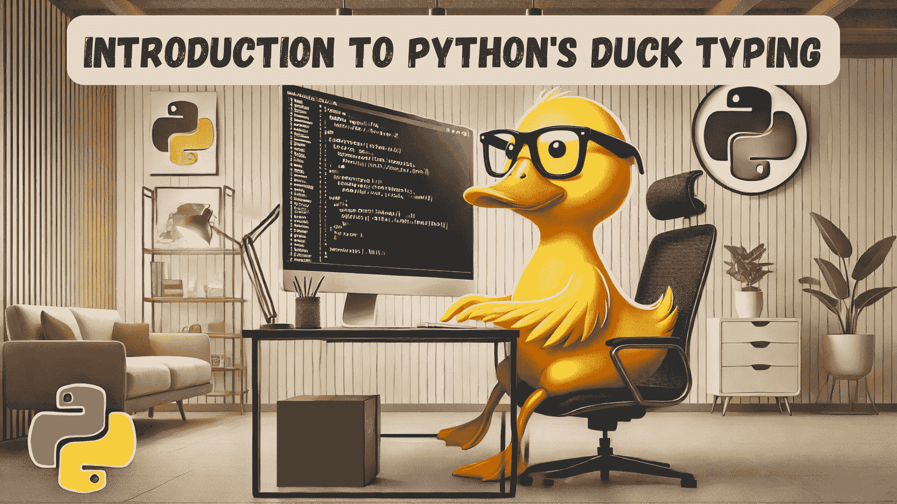

# 《鸭子，鸭子，代码：Python 中的鸭子类型简介》

> 原文：[`www.kdnuggets.com/duck-duck-code-an-introduction-to-pythons-duck-typing`](https://www.kdnuggets.com/duck-duck-code-an-introduction-to-pythons-duck-typing)



图片作者 | DALLE-3 和 Canva

## 什么是鸭子类型？

鸭子类型是编程中的一个概念，通常与像 Python 这样的动态语言相关，它更注重对象的行为而非其类型或类。当你使用鸭子类型时，你会检查对象是否具有某些方法或属性，而不是检查具体的类。这个名字源于一句话，

> 如果它看起来像一只鸭子，游泳像一只鸭子，叫声像一只鸭子，那么它可能就是一只鸭子。

鸭子类型（Duck typing）为 Python 编程带来了几个优势。它允许编写更灵活和可重用的代码，并支持多态性，使得不同的对象类型可以互换使用，只要它们提供了所需的接口。这使得代码更简洁、更简明。然而，鸭子类型也有其缺点。一个主要的缺陷是潜在的运行时错误。此外，它可能会使你的代码更难理解。

## 理解 Python 中的动态行为

在动态类型语言中，变量类型不是固定的。相反，它们是在运行时根据赋值确定的。与之对比，静态类型语言在编译时检查变量类型。例如，如果你尝试将一个变量重新分配为不同类型的值，在静态类型中会遇到错误。动态类型提供了更大的灵活性来使用变量和对象。

让我们考虑一下 `*` Python 操作符；它的行为会根据与之使用的对象的类型而有所不同。当用于两个整数之间时，它会执行乘法。

```py
# Multiplying two integers
a = 5 * 3
print(a)  # Outputs: 15 
```

当与字符串和整数一起使用时，它会重复字符串。这展示了 Python 的动态类型系统和适应性特征。

```py
# Repeating a string
a = 'A' * 3
print(a)  # Outputs: AAA 
```

## 在 Python 中，鸭子类型是如何工作的？

在动态语言中，鸭子类型更受欢迎，因为它鼓励更自然的编码风格。开发者可以专注于设计基于对象能够做什么的接口。在鸭子类型中，类内定义的方法比对象本身更重要。我们通过一个基本的例子来说明这一点。

### 示例编号：01

我们有两个类：Duck（鸭子）和 Person（人）。鸭子可以发出呱呱声，而人类可以说话。每个类都有一个名为 sound 的方法，用于打印各自的声音。函数 `make_it_sound` 接受任何具有 sound 方法的对象并调用它。

```py
class Duck:
    def sound(self):
        print("Quack!")

class Person:
    def sound(self):
        print("I'm quacking like a duck!")

def make_it_sound(obj):
    obj.sound()
```

现在，让我们看看如何利用鸭子类型来处理这个例子。

```py
# Using the Duck class
d = Duck()
make_it_sound(d)  # Output: Quack!

# Using the Person class
p = Person()
make_it_sound(p)  # Output: I'm quacking like a duck!
```

在这个例子中，`Duck` 和 `Person` 类都有一个 `sound` 方法。无论对象是鸭子还是人，只要它有一个 `sound` 方法，`make_it_sound` 函数都会正常工作。

然而，duck typing 可能导致运行时错误。例如，将 Person 类中的 `sound` 方法的名称更改为 speak 会在运行时引发 `AttributeError`。这是因为函数 `make_it_sound` 期望所有对象都有一个 sound 函数。

```py
class Duck:
    def sound(self):
        print("Quack!")

class Person:
    def speak(self):
        print("I'm quacking like a duck!")

def make_it_sound(obj):
    obj.sound()

# Using the Duck class
d = Duck()
make_it_sound(d)

# Using the Person class
p = Person()
make_it_sound(p)
```

**输出：**

```py
AttributeError: 'Person' object has no attribute 'sound'
```

### 示例 No: 02

让我们深入探讨另一个程序，该程序处理不同形状的面积计算，而不必担心它们的具体类型。每个形状（矩形、圆形、三角形）都有自己的类，其中包含一个名为 area 的方法来计算其面积。

```py
class Rectangle:
    def __init__(self, width, height):
        self.width = width
        self.height = height
        self.name = "Rectangle"

    def area(self):
        return self.width * self.height

class Circle:
    def __init__(self, radius):
        self.radius = radius
        self.name = "Circle"

    def area(self):
        return 3.14 * self.radius * self.radius

    def circumference(self):
        return 2 * 3.14 * self.radius

class Triangle:
    def __init__(self, base, height):
        self.base = base
        self.height = height
        self.name = "Triangle"

    def area(self):
        return 0.5 * self.base * self.height

def print_areas(shapes):
    for shape in shapes:
        print(f"Area of {shape.name}: {shape.area()}")
        if hasattr(shape, 'circumference'):
            print(f"Circumference of the {shape.name}: {shape.circumference()}")

# Usage
shapes = [
    Rectangle(4, 5),
    Circle(3),
    Triangle(6, 8)
]

print("Areas of different shapes:")
print_areas(shapes) 
```

**输出：**

```py
Areas of different shapes:
Area of Rectangle: 20
Area of Circle: 28.259999999999998
Circumference of the Circle: 18.84
Area of Triangle: 24.0
```

在上述示例中，我们有一个 `print_areas` 函数，它接受一个形状列表，并打印它们的名称以及计算出的面积。注意，我们不需要在计算面积之前显式检查每个形状的类型。由于 `circumference` 方法仅在 `Circle` 类中存在，因此它仅实现一次。这个例子展示了 duck typing 如何用于编写灵活的代码。

## 最终思考

Duck typing 是 Python 的一个强大特性，使你的代码更加动态和多才多艺，允许你编写更通用和适应性强的程序。尽管它带来了灵活性和简洁性等许多好处，但它也需要仔细的文档和测试以避免潜在的错误。

**[](https://www.linkedin.com/in/kanwal-mehreen1/)**[Kanwal Mehreen](https://www.linkedin.com/in/kanwal-mehreen1/)**** Kanwal 是一位机器学习工程师和技术作家，对数据科学及 AI 与医学的交汇点充满深厚的热情。她是电子书《利用 ChatGPT 最大化生产力》的共同作者。作为 2022 年 APAC Google Generation Scholar，她倡导多样性和学术卓越。她还被认定为 Teradata Diversity in Tech Scholar、Mitacs Globalink Research Scholar 和 Harvard WeCode Scholar。Kanwal 是变革的热情倡导者，创立了 FEMCodes 来赋权女性在 STEM 领域。

* * *

## 我们的前三个课程推荐

 1\. [谷歌网络安全证书](https://www.kdnuggets.com/google-cybersecurity) - 快速进入网络安全职业生涯。

 2\. [谷歌数据分析专业证书](https://www.kdnuggets.com/google-data-analytics) - 提升你的数据分析技能

 3\. [谷歌 IT 支持专业证书](https://www.kdnuggets.com/google-itsupport) - 支持你组织的 IT

* * *

### 更多相关主题

+   [简要介绍 Papers With Code](https://www.kdnuggets.com/2022/04/brief-introduction-papers-code.html)

+   [KDnuggets 新闻，4 月 27 日：简要介绍 Papers With Code;…](https://www.kdnuggets.com/2022/n17.html)

+   [优化 Python 代码性能：深入探讨 Python 性能分析器](https://www.kdnuggets.com/2023/02/optimizing-python-code-performance-deep-dive-python-profilers.html)

+   [作为数据科学家管理你的可重用 Python 代码](https://www.kdnuggets.com/2021/06/managing-reusable-python-code-data-scientist.html)

+   [宣布 PyCaret 3.0：开源、低代码的 Python 机器学习](https://www.kdnuggets.com/2023/03/announcing-pycaret-30-opensource-lowcode-machine-learning-python.html)

+   [使用管道编写干净的 Python 代码](https://www.kdnuggets.com/2021/12/write-clean-python-code-pipes.html)
