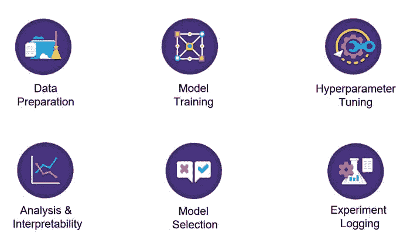
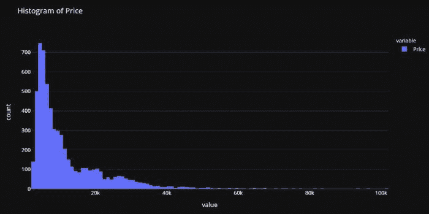
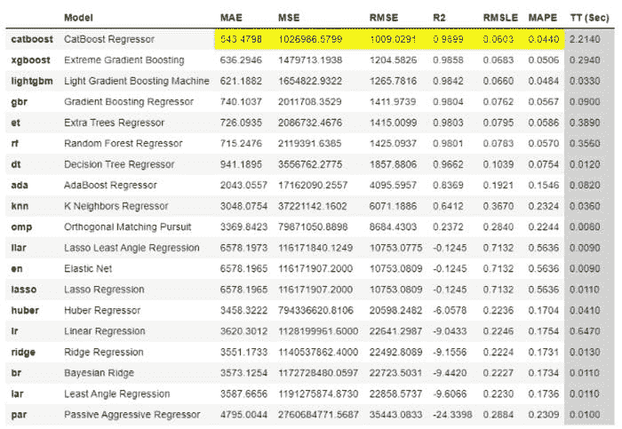
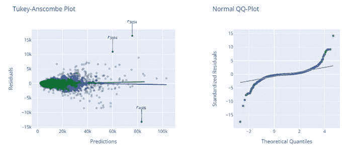
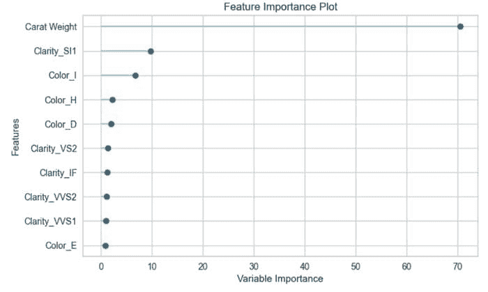
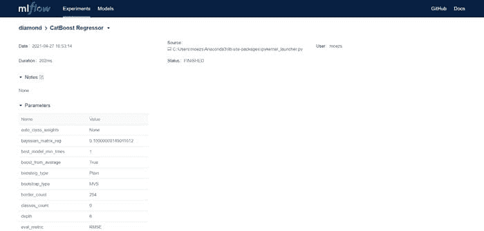
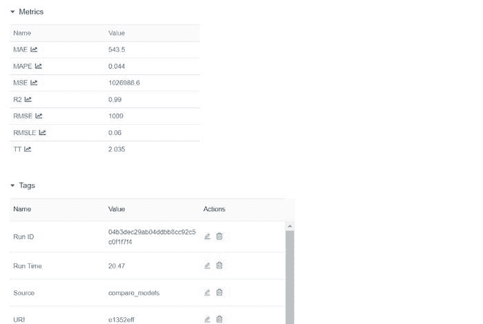
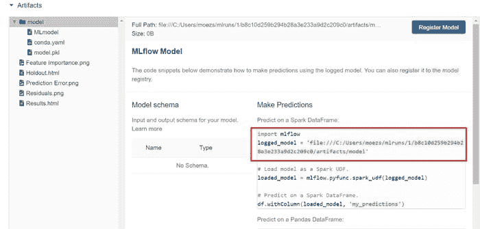
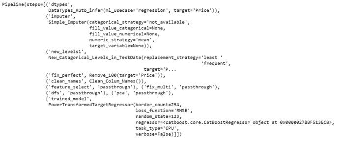
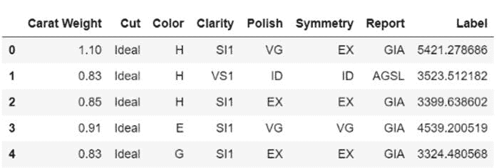

# 使用 PyCaret + MLflow 轻松实现 MLOps

> 原文：[`www.kdnuggets.com/2021/05/easy-mlops-pycaret-mlflow.html`](https://www.kdnuggets.com/2021/05/easy-mlops-pycaret-mlflow.html)

评论

**由 [Moez Ali](https://www.linkedin.com/in/profile-moez/)，PyCaret 创始人及作者**

### PyCaret

PyCaret 是一个开源的低代码机器学习库和端到端模型管理工具，使用 Python 构建，用于自动化机器学习工作流。它以易用性、简洁性和能够快速高效地构建和部署端到端 ML 原型而闻名。

PyCaret 是一个替代性的低代码库，可以用几行代码替代数百行代码。这使得实验周期变得极其快速和高效。



PyCaret — 一个在 Python 中的开源低代码机器学习库

要了解更多关于 PyCaret 的信息，你可以查看他们的 [GitHub](https://www.github.com/pycaret/pycaret)。

### MLflow

MLflow 是一个开源平台，用于管理 ML 生命周期，包括实验、可重复性、部署和中央模型注册。MLflow 目前提供四个组件：


MLflow 是一个开源平台，用于管理 ML 生命周期

要了解更多关于 MLflow 的信息，你可以查看 [GitHub](https://github.com/mlflow/mlflow)。

### 安装 PyCaret

安装 PyCaret 非常简单，只需几分钟时间。我们强烈建议使用虚拟环境，以避免与其他库的潜在冲突。

PyCaret 的默认安装是一个精简版，仅安装硬性依赖项 [列于此处](https://github.com/pycaret/pycaret/blob/master/requirements.txt)。

```py
**# install slim version (default)** pip install pycaret**# install the full version**
pip install pycaret[full]
```

当你安装 PyCaret 的完整版时，所有的可选依赖项也会被安装 [列于此处](https://github.com/pycaret/pycaret/blob/master/requirements-optional.txt)。MLflow 是 PyCaret 的依赖项，因此无需单独安装。

### ???? 让我们开始吧

在我讨论 MLOps 之前，让我们先简单谈谈机器学习生命周期的高层次概述：


机器学习生命周期 — 作者提供的图像（从左到右阅读）

+   **商业问题 —** 这是机器学习工作流的第一步。根据用例和问题的复杂性，完成这一阶段可能需要几天到几周的时间。在这一阶段，数据科学家会与领域专家（SME）会面，以了解问题、采访关键利益相关者、收集信息，并设定项目的整体期望。

+   **数据来源与 ETL —** 一旦理解了问题，就可以利用在面谈中获得的信息从企业数据库中提取数据。

+   **探索性数据分析（EDA） —** 模型还没有开始。EDA 是你分析原始数据的阶段。你的目标是探索数据并评估数据的质量、缺失值、特征分布、相关性等。

+   **数据准备 —** 现在是时候准备数据以进行模型训练了。这包括将数据划分为训练集和测试集、填补缺失值、进行独热编码、目标编码、特征工程、特征选择等。

+   **模型训练与选择 —** 这是每个人都期待的步骤。这包括训练一组模型、调整超参数、模型集成、评估性能指标、模型分析（如 AUC、混淆矩阵、残差等），最后选择一个最佳模型进行生产部署以供业务使用。

+   **部署与监控 —** 这是最后一步，主要涉及 MLOps。这包括将最终模型打包、创建 Docker 镜像、编写评分脚本，然后使它们协同工作，最后将其发布为 API，以便用于对通过管道传入的新数据进行预测。

传统的做法相当繁琐、耗时，并且需要大量的技术知识，可能在一个教程中无法涵盖。不过，在本教程中，我将使用 PyCaret 来演示数据科学家如何高效地完成这些任务。在我们进入实际操作之前，让我们多谈谈 MLOps。

### ???? **什么是 MLOps？**

MLOps 是一种工程学科，旨在将机器学习开发（即实验（模型训练、超参数调整、模型集成、模型选择等），通常由数据科学家执行）与机器学习工程和运维结合起来，以标准化和简化机器学习模型在生产中的持续交付。

如果你是一个完全的初学者，你可能对我说的内容一无所知。没关系。让我给你一个简单、非技术性的定义：

> *MLOps 是一系列技术工程和运维任务，使你的机器学习模型可以被组织内的其他用户和应用程序使用。基本上，这是一种将你的工作（即*机器学习模型*）在线发布的方式，以便其他人可以使用它们并实现一些业务目标。*

这是对 MLOps 的一个非常简化的定义。实际上，它涉及的工作和好处比这要多一些，但如果你对这些内容还不熟悉，这个定义是一个很好的开始。

现在，让我们按照上图所示的相同工作流程进行实际演示，确保你已经安装了 pycaret。

### ???? 商业问题

对于本教程，我将使用达顿商学院发布的一个非常受欢迎的案例研究，已发表在[Harvard Business](https://hbsp.harvard.edu/product/UV0869-PDF-ENG)上。该案例讲述了两个将来要结婚的人的故事。一个名叫*Greg*的男子想买一个戒指向名叫*Sarah*的女孩求婚。问题是要找出 Sarah 会喜欢的戒指，但在得到好友的建议后，Greg 决定购买一颗钻石，让 Sarah 可以自己决定。Greg 随后收集了 6000 颗钻石的数据，包括它们的价格和属性，如切工、颜色、形状等。

### ???? 数据

在本教程中，我将使用一个非常受欢迎的案例数据集，该数据集由达顿商学院发布，已发表在[Harvard Business](https://hbsp.harvard.edu/product/UV0869-PDF-ENG)上。本教程的目标是根据钻石的属性（如克拉重量、切工、颜色等）预测钻石价格。你可以从[PyCaret’s repository](https://github.com/pycaret/pycaret/tree/master/datasets)下载数据集。

```py
**# load the dataset from pycaret** from pycaret.datasets import get_data
data = get_data('diamond')
```


数据的样本行

### ???? 探索性数据分析

我们来做一些快速可视化，以评估独立特征（重量、切工、颜色、清晰度等）与目标变量即`Price`之间的关系。

```py
**# plot scatter carat_weight and Price**
import plotly.express as px
fig = px.scatter(x=data['Carat Weight'], y=data['Price'], 
                 facet_col = data['Cut'], opacity = 0.25, template = 'plotly_dark', trendline='ols',
                 trendline_color_override = 'red', title = 'SARAH GETS A DIAMOND - A CASE STUDY')
fig.show()
```


Sarah 获得一个钻石案例研究

让我们检查一下目标变量的分布情况。

```py
**# plot histogram**
fig = px.histogram(data, x=["Price"], template = 'plotly_dark', title = 'Histogram of Price')
fig.show()
```



注意到 `Price` 的分布是右偏的，我们可以快速检查对数变换是否能使 `Price` 大致符合正态分布，从而给假设正态性的算法一个公平的机会。

```py
import numpy as np**# create a copy of data**
data_copy = data.copy()**# create a new feature Log_Price**
data_copy['Log_Price'] = np.log(data['Price'])**# plot histogram**
fig = px.histogram(data_copy, x=["Log_Price"], title = 'Histgram of Log Price', template = 'plotly_dark')
fig.show()
```


这证实了我们的假设。变换将有助于消除偏斜，使目标变量大致符合正态分布。基于此，我们将在训练模型之前对 `Price` 变量进行变换。

### ???? 数据准备

在 PyCaret 的所有模块中，`setup` 是任何机器学习实验中第一个也是唯一的必需步骤。这个函数处理所有训练模型之前所需的数据准备工作。除了执行一些基本的默认处理任务外，PyCaret 还提供了各种预处理功能。要了解 PyCaret 中所有预处理功能的更多信息，你可以查看这个[链接](https://pycaret.org/preprocessing/)。

```py
**# initialize setup**
from pycaret.regression import *
s = setup(data, target = 'Price', transform_target = True, log_experiment = True, experiment_name = 'diamond')
```


pycaret.regression 模块中的 setup 函数

当你在 PyCaret 中初始化 `setup` 函数时，它会对数据集进行分析，并推断所有输入特征的数据类型。如果所有数据类型都正确推断，你可以按回车继续。

注意：

+   我已传递了`log_experiment = True`和`experiment_name = 'diamond'`，这将告诉 PyCaret 在建模阶段自动记录所有的指标、超参数和模型工件。这是通过与[MLflow](https://www.mlflow.org/)的集成实现的。

+   我还在`setup`中使用了`transform_target = True`。PyCaret 会在后台使用 box-cox 变换来转换`Price`变量。它影响数据分布的方式类似于对数变换（*技术上不同*）。如果你想了解更多关于 box-cox 变换的信息，可以参考这个[链接](https://onlinestatbook.com/2/transformations/box-cox.html)。


从设置中输出 — 为了展示而截断

### ???? 模型训练与选择

现在数据已准备好进行建模，让我们通过使用`compare_models`函数开始训练过程。它将训练模型库中的所有算法，并使用 k 折交叉验证评估多个性能指标。

```py
**# compare all models**
best = compare_models()
```



从`compare_models`的输出

```py
**# check the residuals of trained model**
plot_model(best, plot = 'residuals_interactive')
```



最佳模型的残差和 QQ 图

```py
**# check feature importance**
plot_model(best, plot = 'feature')
```



### 确定并保存 Pipeline

现在我们来确定最佳模型，即在整个数据集（包括测试集）上训练最佳模型，然后将 Pipeline 保存为 pickle 文件。

```py
**# finalize the model**
final_best = finalize_model(best)**# save model to disk** save_model(final_best, 'diamond-pipeline')
```

`save_model`函数会将整个 Pipeline（包括模型）保存为本地磁盘上的 pickle 文件。默认情况下，它会将文件保存到你的 Notebook 或脚本所在的文件夹中，但如果你愿意，也可以传递完整路径：

```py
save_model(final_best, 'c:/users/moez/models/diamond-pipeline'
```

### ???? 部署

记得我们在 setup 函数中传递了`log_experiment = True`和`experiment_name = 'diamond'`。让我们看看 PyCaret 在后台借助 MLflow 完成的神奇操作。要查看这些神奇操作，我们来启动 MLflow 服务器：

```py
**# within notebook (notice ! sign infront)** !mlflow ui**# on command line in the same folder** mlflow ui
```

现在打开你的浏览器并输入“localhost:5000”。它将打开一个像这样的用户界面：


https://localhost:5000

上表中的每一项代表一次训练运行，结果为一个训练好的 Pipeline 以及一堆元数据，如运行的日期时间、性能指标、模型超参数、标签等。让我们点击其中一个模型：



第一部分 — CatBoost 回归器



第二部分 — CatBoost 回归器（续）



第二部分 — CatBoost 回归器（续）

注意你有一个`logged_model`的地址路径。这是使用 Catboost 回归器训练的 Pipeline。你可以使用`load_model`函数来读取这个 Pipeline。

```py
**# load model**
from pycaret.regression import load_model
pipeline = load_model('C:/Users/moezs/mlruns/1/b8c10d259b294b28a3e233a9d2c209c0/artifacts/model/model')**# print pipeline** print(pipeline)
```



从`print(pipeline)`的输出

现在我们使用这个 Pipeline 来生成新数据的预测

```py
**# create a copy of data and drop Price** data2 = data.copy()
data2.drop('Price', axis=1, inplace=True)**# generate predictions** from pycaret.regression import predict_model
predictions = predict_model(pipeline, data=data2)
predictions.head()
```



从管道生成的预测

哇！我们现在可以从训练好的管道中获取推断结果了。恭喜，如果这是你的第一次。注意到所有的转换，如目标转换、独热编码、缺失值填补等，都是在后台自动完成的。你得到一个实际规模的预测数据框，这正是你关心的。

### 敬请期待！

我今天展示的只是众多可以使用 MLflow 从 PyCaret 提供的训练管道中服务的方式之一。在下一个教程中，我计划展示如何使用 MLflow 的本地服务功能来注册你的模型、为其版本并作为 API 提供服务。

使用这个轻量级的 Python 工作流自动化库，你可以实现无限可能。如果你觉得这很有用，请不要忘记在我们的 GitHub 仓库上给我们⭐️。

想了解更多关于 PyCaret 的信息，请关注我们的 [LinkedIn](https://www.linkedin.com/company/pycaret/) 和 [Youtube](https://www.youtube.com/channel/UCxA1YTYJ9BEeo50lxyI_B3g)。

加入我们的 Slack 频道。邀请链接 [这里](https://join.slack.com/t/pycaret/shared_invite/zt-p7aaexnl-EqdTfZ9U~mF0CwNcltffHg)。

### 你可能也会感兴趣：

[使用 PyCaret 2.0 在 Power BI 中构建你自己的 AutoML](https://towardsdatascience.com/build-your-own-automl-in-power-bi-using-pycaret-8291b64181d)

[使用 Docker 在 Azure 上部署机器学习管道](https://towardsdatascience.com/deploy-machine-learning-pipeline-on-cloud-using-docker-container-bec64458dc01)

[在 Google Kubernetes Engine 上部署机器学习管道](https://towardsdatascience.com/deploy-machine-learning-model-on-google-kubernetes-engine-94daac85108b)

[在 AWS Fargate 上部署机器学习管道](https://towardsdatascience.com/deploy-machine-learning-pipeline-on-aws-fargate-eb6e1c50507)

[构建并部署你的第一个机器学习网页应用](https://towardsdatascience.com/build-and-deploy-your-first-machine-learning-web-app-e020db344a99)

[使用 AWS Fargate 无服务器架构部署 PyCaret 和 Streamlit 应用](https://towardsdatascience.com/deploy-pycaret-and-streamlit-app-using-aws-fargate-serverless-infrastructure-8b7d7c0584c2)

[使用 PyCaret 和 Streamlit 构建并部署机器学习网页应用](https://towardsdatascience.com/build-and-deploy-machine-learning-web-app-using-pycaret-and-streamlit-28883a569104)

[在 GKE 上部署使用 Streamlit 和 PyCaret 构建的机器学习应用](https://towardsdatascience.com/deploy-machine-learning-app-built-using-streamlit-and-pycaret-on-google-kubernetes-engine-fd7e393d99cb)

### 重要链接

[文档](https://pycaret.readthedocs.io/en/latest/installation.html)

[博客](https://medium.com/@moez_62905)

[GitHub](https://www.github.com/pycaret/pycaret)

[StackOverflow](https://stackoverflow.com/questions/tagged/pycaret)

[安装 PyCaret](https://pycaret.readthedocs.io/en/latest/installation.html) [Notebook 教程](https://pycaret.readthedocs.io/en/latest/tutorials.html) [贡献于 PyCaret](https://pycaret.readthedocs.io/en/latest/contribute.html)

### 想了解某个特定模块吗？

点击下面的链接查看文档和实际示例。

[分类](https://pycaret.readthedocs.io/en/latest/api/classification.html) [回归](https://pycaret.readthedocs.io/en/latest/api/regression.html)

[聚类](https://pycaret.readthedocs.io/en/latest/api/clustering.html)

[异常检测](https://pycaret.readthedocs.io/en/latest/api/anomaly.html)

[自然语言处理](https://pycaret.readthedocs.io/en/latest/api/nlp.html) [关联规则挖掘](https://pycaret.readthedocs.io/en/latest/api/arules.html)

**个人简介: [Moez Ali](https://www.linkedin.com/in/profile-moez/)** 是数据科学家，同时也是 PyCaret 的创始人和作者。

[原文](https://towardsdatascience.com/easy-mlops-with-pycaret-mlflow-7fbcbf1e38c6)。经授权转载。

**相关：**

+   PyCaret 的多时间序列预测

+   将机器学习管道部署到云端使用 Docker 容器

+   GitHub 是你需要的最佳 AutoML

* * *

## 我们的三大课程推荐

 1\. [Google 网络安全证书](https://www.kdnuggets.com/google-cybersecurity) - 快速进入网络安全职业生涯。

 2\. [Google 数据分析专业证书](https://www.kdnuggets.com/google-data-analytics) - 提升你的数据分析技能

 3\. [Google IT 支持专业证书](https://www.kdnuggets.com/google-itsupport) - 支持你的组织 IT

* * *

### 更多相关主题

+   [如何使用 MLFlow 打包和分发机器学习模型](https://www.kdnuggets.com/2022/08/package-distribute-machine-learning-models-mlflow.html)

+   [使用 PyCaret 进行二分类入门](https://www.kdnuggets.com/2021/12/introduction-binary-classification-pycaret.html)

+   [使用 PyCaret 进行 Python 聚类入门](https://www.kdnuggets.com/2021/12/introduction-clustering-python-pycaret.html)

+   [宣布 PyCaret 3.0：开源、低代码的 Python 机器学习](https://www.kdnuggets.com/2023/03/announcing-pycaret-30-opensource-lowcode-machine-learning-python.html)

+   [PyCaret 入门指南](https://www.kdnuggets.com/2022/11/getting-started-pycaret.html)

+   [TensorFlow 计算机视觉 - 简化迁移学习](https://www.kdnuggets.com/2022/01/tensorflow-computer-vision-transfer-learning-made-easy.html)
