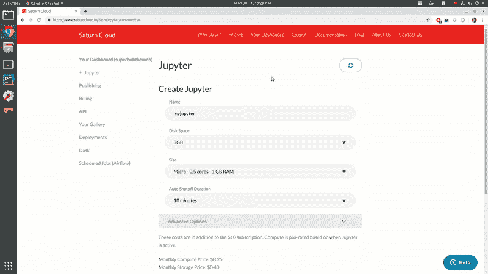
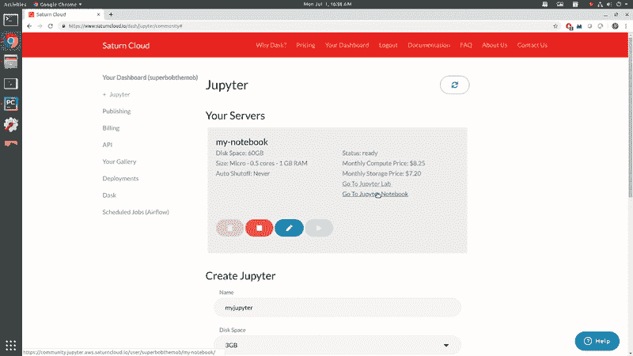

# 简单、一键式 Jupyter 笔记本

> 原文：[`www.kdnuggets.com/2019/07/easy-one-click-jupyter-notebooks.html`](https://www.kdnuggets.com/2019/07/easy-one-click-jupyter-notebooks.html)

 评论社会对数据科学家的印象

数据科学可以是一件有趣的事情！

* * *

## 我们的前三大课程推荐

 1\. [Google 网络安全证书](https://www.kdnuggets.com/google-cybersecurity) - 快速进入网络安全职业生涯。

 2\. [Google 数据分析专业证书](https://www.kdnuggets.com/google-data-analytics) - 提升你的数据分析能力

 3\. [Google IT 支持专业证书](https://www.kdnuggets.com/google-itsupport) - 支持你的组织的 IT 工作

* * *

实际上，我们做的大部分工作就是在探索数据，同时试图提取其中隐藏的信息。这就像我们在未知的丛林中寻找宝藏！

但这并不总是轻松有趣的。

在幕后，为数据科学家工作的平台设置涉及许多内容。创建服务器、安装必要的软件和环境、设置安全协议等等。

完成所有这些工作通常需要一位专门的 DevOps 工程师。他需要了解云服务、操作系统、网络的各个细节，并且对设置数据科学和机器学习软件有一定的了解。

但如果有一种方法可以绕过所有这些繁琐的 DevOps 工作，直接进入数据科学呢？

一项名为[Saturn Cloud](https://www.saturncloud.io/?source=post_page---------------------------)的新服务可以让数据科学家实现这一点：跳过繁琐的设置，直接进入数据科学的工作！

### Saturn Cloud 和数据科学的 DevOps

花点时间想想为数据科学家有效工作而设置环境所需的所有工作。对于许多公司，这看起来像是：

1.  创建和配置服务器。理想情况下，这些服务器应该在服务器性能和实例数量上都能轻松扩展。

1.  在所有服务器上安装软件。软件应该易于更新。

1.  配置安全性。保护任何敏感数据、代码或机器学习模型

1.  配置网络。服务器应在特定端口和特定人员的访问下可用。

所有这些都需要大量时间，尤其是第 1 步和第 2 步。许多数据科学家甚至看不到这些过程的发生——他们只看到最终产品。但建立所有这些基础设施确实是一项挑战，其中一些需要持续更新。

DevOps 工程师不断迎合数据科学家不断变化的需求

Saturn Cloud 自称为*云托管数据科学*，允许数据科学家轻松地在云上配置和托管他们的工作，而无需专门的 DevOps。然后你可以在由系统创建并托管在你指定的服务器上的 Jupyter Notebook 中工作。

软件、网络、安全和库的所有设置都由 Saturn Cloud 系统自动处理。数据科学家可以专注于*实际的*数据科学，而不是繁琐的基础设施工作。

这个想法是，用户（你和我，数据科学家）可以简单地指定我们需要的计算资源，输入我们需要的软件库列表，而 Saturn Cloud 系统将处理其余的设置。

### 如何使用托管的 Jupyter Notebooks

要开始，简单地访问[Saturn Cloud 网站](https://www.saturncloud.io/?source=post_page---------------------------)并创建一个帐户。基本计划完全免费，你可以先在环境中玩耍以熟悉操作。

进入后，点击“Your Dashboard”标签页开始创建一个托管 Jupyter Notebook 的服务器。下面的视频展示了如何创建你的服务器！

你基本上需要经过以下步骤：

1.  为你的 notebook 指定一个名称

1.  指定你想要的存储量

1.  指定你想使用的 CPU 或 GPU

1.  如果需要，设置自动关机

1.  列出你希望在系统上安装的任何软件包或库

一旦你点击创建按钮，你的服务器将自动根据所需的设置和软件创建。当创建完成后——瞧！你的云托管 Jupyter Notebook 已准备好进行数据科学工作！

在仪表板顶部，你会看到启动、停止、编辑和删除你的 Notebook 云服务器的按钮。在本教程的下一部分，我已经编辑了我的服务器以安装 pandas 和 matplotlib。

要访问你的云托管 Jupyter Notebook，请点击“Go To Jupyter Notebook”链接。将打开一个包含 Jupyter Notebook 界面的标签页，你可以在其中创建你的 Python 3 notebook！

我已经在下面的视频中创建了我的 notebook。一旦你的 notebook 创建完成，你就可以开始编码了！我已经准备了一些代码来绘制 Iris 花卉数据集。Saturn Cloud 能够顺利无缝地运行所有内容。

除了托管 Jupyter Notebooks，Saturn Cloud 还允许你[publish your notebooks](https://www.saturncloud.io/docs/publishing?source=post_page---------------------------)，可以选择公开或私密。当你发布笔记本时，你将获得一个网址，可以与任何想要运行你笔记本的人分享：随时随地。看看我的[这个](https://www.saturncloud.io/published/georgeseif94/mynotebook/notebooks/my_notebook.ipynb?source=post_page---------------------------)吧！

### 喜欢学习吗？

在[twitter](https://twitter.com/GeorgeSeif94?source=post_page---------------------------)上关注我，我会发布最新最好的 AI、技术和科学信息！也可以在[LinkedIn](https://www.linkedin.com/in/georgeseif/?source=post_page---------------------------)与我联系！

**简介： [George Seif](https://towardsdatascience.com/@george.seif94)** 是认证极客以及 AI / 机器学习工程师。

[原文](https://towardsdatascience.com/easy-devops-for-data-science-with-saturn-cloud-notebooks-d19e8c4d1772)。经许可转载。

**相关：**

+   数据科学家的 DevOps：驯服独角兽

+   操作性机器学习：成功 MLOps 的七个考虑因素

+   将机器学习应用于 DevOps

### 更多相关主题

+   [2022 年排名前 5 的免费云笔记本](https://www.kdnuggets.com/2022/04/top-5-free-cloud-notebooks-2022.html)

+   [Anaconda 新品！数据科学培训和云托管笔记本](https://www.kdnuggets.com/2022/11/anaconda-new-anaconda-data-science-training-cloud-hosted-notebooks.html)

+   [数据科学的前 7 个免费云笔记本](https://www.kdnuggets.com/top-7-free-cloud-notebooks-for-data-science)

+   [通过集成 Jupyter 和 KNIME 来缩短实施时间](https://www.kdnuggets.com/2021/12/cutting-implementation-time-integrating-jupyter-knime.html)

+   [如何在 Jupyter Notebook 上设置 Julia](https://www.kdnuggets.com/2022/11/setup-julia-jupyter-notebook.html)

+   [10 个 Jupyter Notebook 的小技巧和窍门](https://www.kdnuggets.com/2023/06/10-jupyter-notebook-tips-tricks-data-scientists.html)
