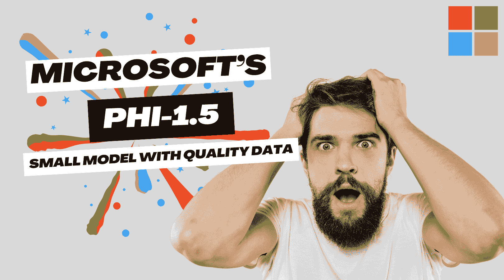
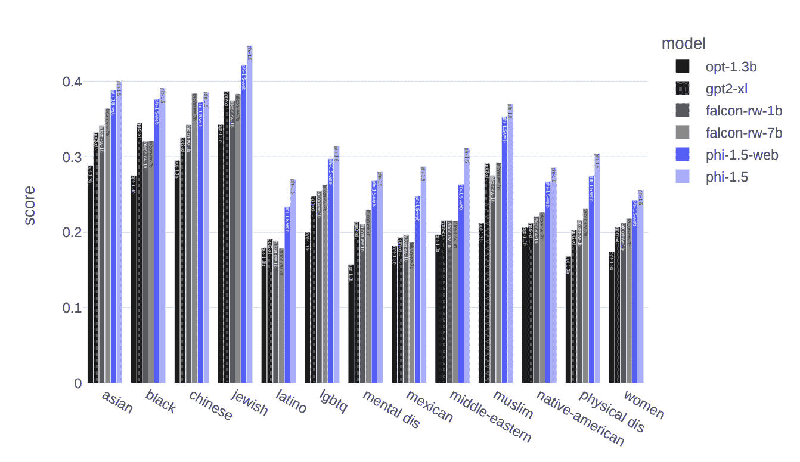

# 高效的小型语言模型：微软的 13 亿参数 phi-1.5

> 原文：[`www.kdnuggets.com/effective-small-language-models-microsoft-phi-15`](https://www.kdnuggets.com/effective-small-language-models-microsoft-phi-15)

图片来源：作者

当你以为你已经听够了有关大型语言模型（LLMs）的新闻时，微软研究院再次搅动了市场。2023 年 6 月，微软研究院发布了一篇名为 “[教材就是你所需的一切](https://arxiv.org/abs/2306.11644)” 的论文，在其中他们介绍了 [phi-1](https://huggingface.co/microsoft/phi-1)，一个新的大型代码语言模型。phi-1 是一个基于 Transformer 的模型，具有 13 亿参数，在 8 个 A100 GPU 上训练了 4 天，使用了来自网络的“教科书质量”数据。

* * *

## 我们的前三大课程推荐

 1\. [Google 网络安全证书](https://www.kdnuggets.com/google-cybersecurity) - 快速进入网络安全职业。

 2\. [Google 数据分析专业证书](https://www.kdnuggets.com/google-data-analytics) - 提升你的数据分析水平

 3\. [Google IT 支持专业证书](https://www.kdnuggets.com/google-itsupport) - 支持你在 IT 领域的组织

* * *

看来 LLM 正变得越来越小。

# 什么是 phi-1.5？

现在，微软研究院向你介绍 [phi-1.5](https://huggingface.co/microsoft/phi-1_5)，这是一个具有 13 亿参数的 Transformer，它使用了与 phi-1 相同的数据来源进行训练。如上所述，phi-1 在高质量的教科书数据上进行训练，而 phi-1.5 仅在合成数据上进行训练。

phi-1.5 使用了 32xA100-40G GPU，并在 8 天内成功训练完成。phi-1.5 的目标是打造一个开源模型，它可以在研究社区中发挥作用，使用一个不受限制的小型模型，这样可以探索与 LLM 相关的不同安全挑战，例如减少有害内容、增强可控性等。

通过使用‘合成数据生成’方法，phi-1.5 在自然语言测试中的表现相当于规模大 5 倍的模型，并且在更困难的推理任务中表现优于大多数 LLM。

相当令人印象深刻，对吧？

该模型的学习过程非常有趣。它从多种来源获取数据，包括 StackOverflow 上的 Python 代码片段、合成的 Python 教科书以及由 GPT-3.5-turbo-0301 生成的练习。

# 处理有害内容和偏见

LLM 的一个主要挑战是有害内容和偏见内容。微软研究院旨在克服这一持续挑战，即有害/冒犯性内容和推广特定意识形态的内容。

用于训练模型的合成数据生成的响应，相较于其他 LLMs 如 Falcon-7B 和 Llama 2–7B，生成有害内容的倾向较低，如下图所示：

图片来源于[教科书就是你所需的 II：phi-1.5 技术报告](https://arxiv.org/pdf/2309.05463.pdf)

# 基准测试

下图展示了 phi-1.5 在 3 个基准测试中表现略优于最先进的模型，如 Llama 2–7B、Llama-7B 和 Falcon-RW-1.3B，测试包括常识推理、语言技能和多步骤推理。

图片来源于[教科书就是你所需的 II：phi-1.5 技术报告](https://arxiv.org/pdf/2309.05463.pdf)

这是怎么做的？

教科书式的数据使用方式使得 LLMs 中对这种数据的使用与从互联网提取的数据有所不同。为了进一步评估模型如何处理有害内容，使用了 ToxiGen，并设计了 86 个提示，手动标记为“通过”、“失败”或“未理解”，以更好地了解模型的局限性。

也就是说，phi-1.5 通过了 47 个提示，失败了 34 个提示，并且没有理解 4 个提示。使用 HumanEval 方法评估模型的结果显示，phi-1.5 的评分高于其他知名模型。

# 主要收获：

以下是你应该了解的关于 phi-1.5 的主要要点：

+   是一个基于 transformer 的模型

+   是一个专注于下一个词预测目标的 LLM

+   经过了 300 亿个 token 的训练

+   使用了 32xA100-40G GPUs

+   成功在 8 天内完成训练

**[Nisha Arya](https://www.linkedin.com/in/nisha-arya-ahmed/)** 是一位数据科学家、自由技术撰稿人以及 KDnuggets 的社区经理。她特别感兴趣于提供数据科学职业建议或教程和理论知识。她还希望探索人工智能如何能够或已经在延长人类寿命方面发挥作用。她是一个热衷学习的人，寻求拓宽技术知识和写作技能，同时帮助指导他人。

### 更多相关话题

+   [PEFT 概述：最先进的参数高效微调](https://www.kdnuggets.com/overview-of-peft-stateoftheart-parameterefficient-finetuning)

+   [如何每天处理 150 亿条日志并将大查询保持在 1 秒以内](https://www.kdnuggets.com/how-to-digest-15-billion-logs-per-day-and-keep-big-queries-within-1-second)

+   [在本地 CPU 上运行小型语言模型的 7 个步骤](https://www.kdnuggets.com/7-steps-to-running-a-small-language-model-on-a-local-cpu)

+   [自然语言处理中的 N-gram 语言建模](https://www.kdnuggets.com/2022/06/ngram-language-modeling-natural-language-processing.html)

+   [顶级开源大型语言模型](https://www.kdnuggets.com/2022/09/john-snow-top-open-source-large-language-models.html)

+   [人工智能：大型语言与视觉模型](https://www.kdnuggets.com/2023/06/ai-large-language-visual-models.html)
