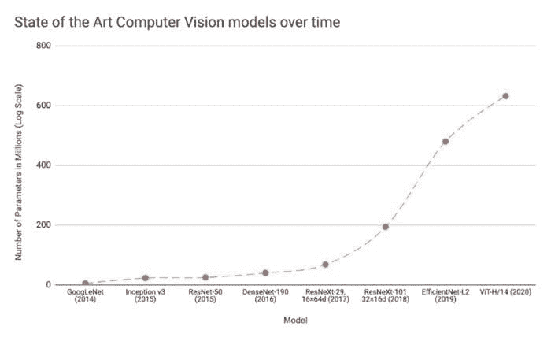
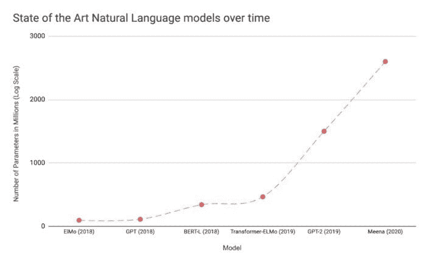

# 高性能深度学习，第一部分

> 原文：[`www.kdnuggets.com/2021/06/efficiency-deep-learning-part1.html`](https://www.kdnuggets.com/2021/06/efficiency-deep-learning-part1.html)

评论

机器学习在今天的应用中无处不在。它在没有单一算法完美解决问题的领域中天然适用，并且在算法需要很好地预测正确输出的情况下，有大量未见过的数据。与我们期望确切最优解的传统算法问题不同，机器学习应用可以容忍近似答案。深度学习与神经网络在过去十年里一直是训练新机器学习模型的主流方法。它的崛起通常归因于 2012 年的 ImageNet [1] 竞赛。那一年，多伦多大学的一个团队提交了一个深度卷积网络（AlexNet [2]，以首席开发者 Alex Krizhevsky 命名），表现比下一个最佳提交好 41%。

* * *

## 我们的前三大课程推荐

 1\. [Google 网络安全证书](https://www.kdnuggets.com/google-cybersecurity) - 快速进入网络安全职业的捷径。

 2\. [Google 数据分析专业证书](https://www.kdnuggets.com/google-data-analytics) - 提升你的数据分析技能

 3\. [Google IT 支持专业证书](https://www.kdnuggets.com/google-itsupport) - 支持你的组织的 IT

* * *

深度和卷积网络之前已经被尝试过，但总是未能兑现承诺。卷积层最早由 LeCun 等人在 90 年代提出 [3]。同样，80 年代、90 年代等也提出了几种神经网络。深度网络为什么花了这么长时间才超越手工调整特征工程的模型？

这次的不同之处在于多个因素的结合：

1.  **计算**：AlexNet 是早期依赖图形处理单元（GPU）进行训练的模型之一。

1.  **算法**：一个关键的修复是激活函数使用了 ReLU。这使得梯度可以更深地反向传播。之前的深度网络使用了 sigmoid 或 tanh 激活函数，这些函数在非常小的输入范围内饱和到 1.0 或 -1.0。因此，输入变量的变化导致梯度非常微小（如果有的话），当层数很多时，梯度实际上消失了。

1.  **数据**：ImageNet 拥有超过 1000 个类别的 100 万张以上的图像。随着互联网产品的出现，从用户行为中收集标注数据也变得更加便宜。

### 深度学习模型的快速增长

由于这项开创性的工作，出现了创建更深网络、参数数量越来越大的竞赛。几种模型架构如 VGGNet、Inception、ResNet 等，在随后的几年中相继打破了 ImageNet 比赛的记录。这些模型也已在实际应用中投入使用。

*图 1：流行的计算机视觉和自然语言深度学习模型参数数量的增长趋势 [4]。*

我们在自然语言理解（NLU）领域看到了类似的效果，其中 Transformer 架构显著超过了 GLUE 任务的之前基准。随后，BERT 和 GPT 模型在 NLP 相关任务上均显示出了改进。BERT 产生了几种优化其各种方面的相关模型架构。GPT-3 通过生成与给定提示相匹配的逼真文本引起了关注。这两者都已投入生产。BERT 用于 Google 搜索以提高结果的相关性，而 GPT-3 作为 API 供感兴趣的用户使用。

如所推测，**深度学习研究一直集中于提高最先进的技术**，因此，我们在图像分类、文本分类等基准测试中看到了持续的进步。**每一次神经网络的新突破都导致了网络复杂度的增加、参数数量的增加**、训练网络所需的资源量、预测延迟等。

像 GPT-3 这样的自然语言模型现在训练一次就需要花费数百万美元 [5]。这还不包括尝试不同超参数组合（调优）或手动或自动实验架构的成本。这些模型通常还拥有数十亿（或万亿）个参数。

与此同时，这些模型的卓越性能也推动了在之前受限于现有技术的新任务上的应用需求。这就产生了一个有趣的问题，即**这些模型的传播受到其效率的限制**。

更具体地说，我们在进入这一深度学习新时代时，面临以下问题，其中模型变得越来越大，并且跨越不同领域：

1.  **可持续的服务器端扩展**：训练和部署大型深度学习模型的成本很高。虽然训练可能是一次性成本（或者使用预训练模型时可能免费），但长时间部署和进行推理仍可能是昂贵的。还有一个非常实际的关注点是用于训练和部署这些大型模型的数据中心的碳足迹。像谷歌、脸书、亚马逊等大型组织每年在数据中心的资本支出上花费数十亿美元。因此，任何效率提升都是非常重要的。

1.  **启用设备端部署**：随着智能手机、物联网设备的普及，部署在这些设备上的应用必须是实时的。因此，需要*设备端*机器学习模型（即模型推理直接在设备上进行），这使得优化模型以适应运行设备变得非常重要。

1.  **隐私与数据敏感性**：在用户数据可能涉及敏感处理或受各种限制（如欧洲的 GDPR 法规）的情况下，使用尽可能少的数据进行训练至关重要。因此，高效地使用少量数据训练模型意味着需要收集的数据更少。类似地，使设备上的模型能够运行意味着模型推理可以完全在用户设备上进行，而无需将输入数据发送到服务器端。

1.  **新应用**：效率还将使得在现有资源约束下无法实现的应用成为可能。

1.  **模型爆炸**：通常，可能会有多个机器学习模型在同一设备上同时服务。这进一步减少了单个模型的可用资源。这可能发生在服务器端，多个模型共存在同一台机器上，或者在应用中，不同的模型用于不同的功能。

### 高效深度学习

我们上述识别出的核心挑战是*效率*。虽然效率可能是一个过载的术语，但让我们探讨两个主要方面。

1.  **推理效率**：这主要涉及部署模型进行*推理*（计算给定输入的模型输出）时需要问的问题。模型是否小巧？是否快速等等？更具体地说，模型有多少参数？磁盘大小、推理期间的内存消耗、推理延迟等是多少？

1.  **训练效率**：这涉及到训练模型时需要问的一些问题，比如模型需要多长时间训练？需要多少设备进行训练？模型是否可以适应内存？还可能包括诸如，模型需要多少数据才能在给定任务上达到预期的性能？

如果我们有两个模型在给定任务上表现相同，我们可能会选择在上述一个或理想情况下两个方面表现更好的模型。如果在推理受限（如移动和嵌入设备）或昂贵（云服务器）的设备上部署模型，关注推理效率可能是值得的。同样，如果在有限或昂贵的训练资源下从头开始训练大型模型，开发针对训练效率设计的模型将有所帮助。

*图 2: 帕累托最优性：绿色点代表帕累托最优模型（共同形成帕累托前沿），其中没有其他模型（红色点）在相同的推理延迟下获得更好的准确性，反之亦然。*

无论我们优化的目标是什么，我们都希望达到*帕累托最优性*。这意味着我们选择的任何模型都是在我们关心的权衡中表现最好的。例如，在图 2 中，绿色点代表帕累托最优模型，其中没有其他模型（红色点）在相同的推理延迟下获得更好的准确性，反之亦然。总之，帕累托最优模型（绿色点）形成了我们的帕累托前沿。帕累托前沿的模型从定义上讲比其他模型更高效，因为它们在给定的权衡中表现最好。因此，当我们寻求效率时，我们应该考虑发现和改进帕累托前沿。

高效的深度学习可以定义为一组算法、技术、工具和基础设施，它们共同作用，使用户能够训练和部署*帕累托最优*模型，这些模型在训练和/或部署时消耗较少的资源，同时达到类似的结果。

现在我们已经激发了这个问题，在下一篇文章中，我们将讨论深度学习效率的五个支柱。

### 参考文献

[1] Jia Deng, Wei Dong, Richard Socher, Li-Jia Li, Kai Li, 和 Li Fei-Fei. 2009\. ImageNet: 一个大规模层次化图像数据库。2009 年 IEEE 计算机视觉与模式识别大会。248–255\. https://doi.org/10.1109/CVPR.2009.5206848

[2] Alex Krizhevsky, Ilya Sutskever, 和 Geoffrey E Hinton. 2012\. 使用深度卷积神经网络进行 Imagenet 分类。神经信息处理系统进展 25 (2012), 1097–1105。

[3] 卷积网络: [`yann.lecun.com/exdb/lenet/index.html`](http://yann.lecun.com/exdb/lenet/index.html)

[4] PapersWithCode: [`paperswithcode.com/`](https://paperswithcode.com/)

[5] Tom B Brown, Benjamin Mann, Nick Ryder, Melanie Subbiah, Jared Kaplan, Prafulla Dhariwal, Arvind Neelakantan, Pranav Shyam, Girish Sastry, Amanda Askell, 等. 2020\. 语言模型是少量样本学习者。arXiv 预印本 arXiv:2005.14165 (2020)。

**简介：** [Gaurav Menghani](http://www.gaurav.im/)（[@GauravML](https://twitter.com/GauravML)）是 Google Research 的高级软件工程师，他领导着旨在优化大型机器学习模型的研究项目，以实现高效的训练和推理，这些模型可以在从微控制器到基于 Tensor Processing Unit（TPU）的服务器等各种设备上运行。他的工作对 YouTube、Cloud、Ads、Chrome 等领域的超过 10 亿活跃用户产生了积极的影响。他还是即将出版的 Manning Publication 的《高效机器学习》一书的作者。在 Google 之前，Gaurav 在 Facebook 工作了 4.5 年，并对 Facebook 的搜索系统和大规模分布式数据库做出了重要贡献。他拥有纽约州立大学石溪分校的计算机科学硕士学位。

**相关：**

+   [视觉变换器：自然语言处理（NLP）提高效率和模型泛化能力](https://www.kdnuggets.com/2021/02/vision-transformers-nlp-efficiency-model-generality.html)

+   [深度学习的最重要思想](https://www.kdnuggets.com/2020/09/deep-learnings-most-important-ideas.html)

+   [关于强化学习的 2 件事——计算效率和样本效率](https://www.kdnuggets.com/2020/04/2-things-reinforcement-learning.html)

### 更多相关主题

+   [数据科学家的高薪副业](https://www.kdnuggets.com/2022/01/high-paying-side-hustles-data-scientists.html)

+   [KDnuggets™ 新闻 22:n04, 1 月 26 日：高薪副业…](https://www.kdnuggets.com/2022/n04.html)

+   [人工智能人员管理：构建高效能 AI 团队](https://www.kdnuggets.com/2022/03/people-management-ai-building-highvelocity-ai-teams.html)

+   [7 个高薪的数据科学副业](https://www.kdnuggets.com/7-high-paying-side-hustles-for-data-scientists)

+   [7 个平台获取高薪数据科学职位](https://www.kdnuggets.com/7-platforms-for-getting-high-paying-data-science-jobs)

+   [Kubernetes 中的高可用性 SQL Server Docker 容器](https://www.kdnuggets.com/2022/04/high-availability-sql-server-docker-containers-kubernetes.html)
