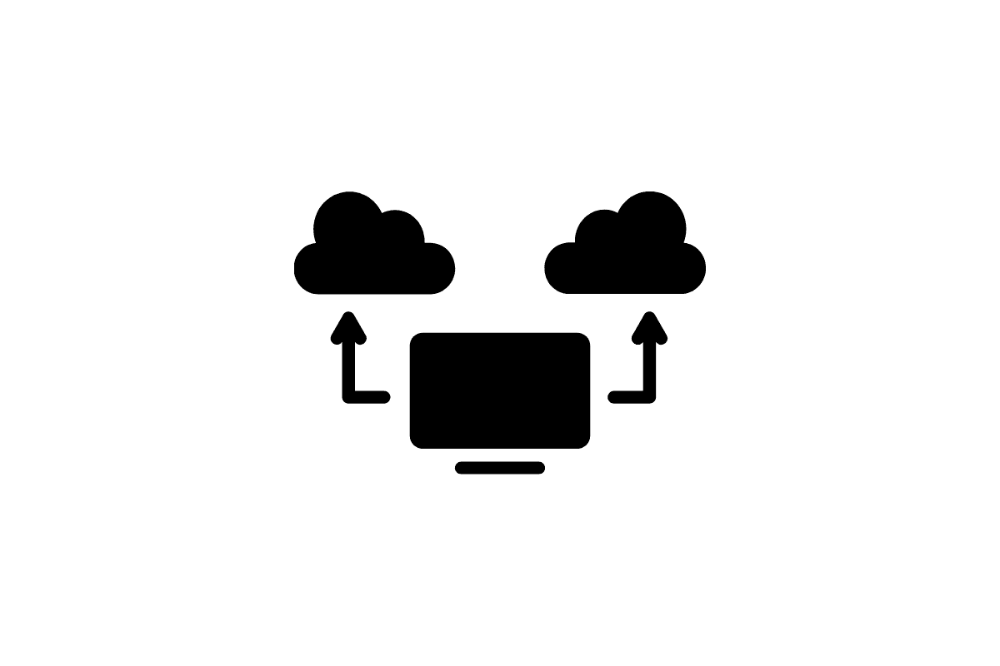
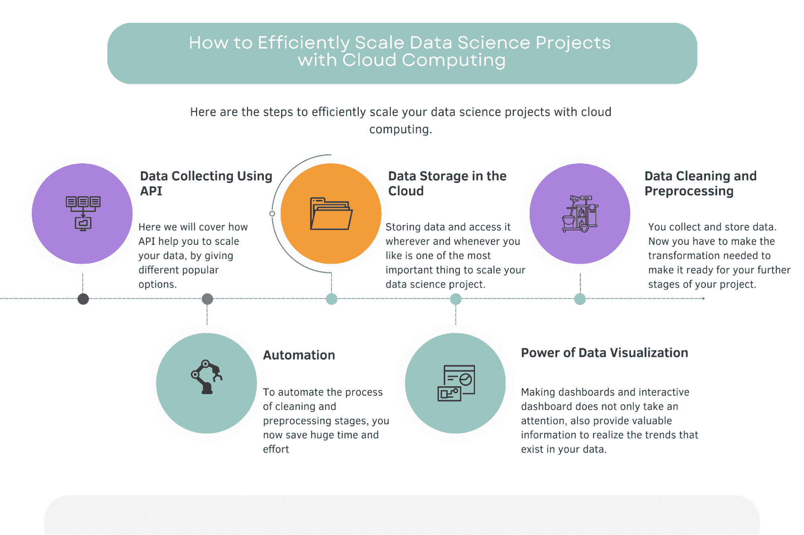
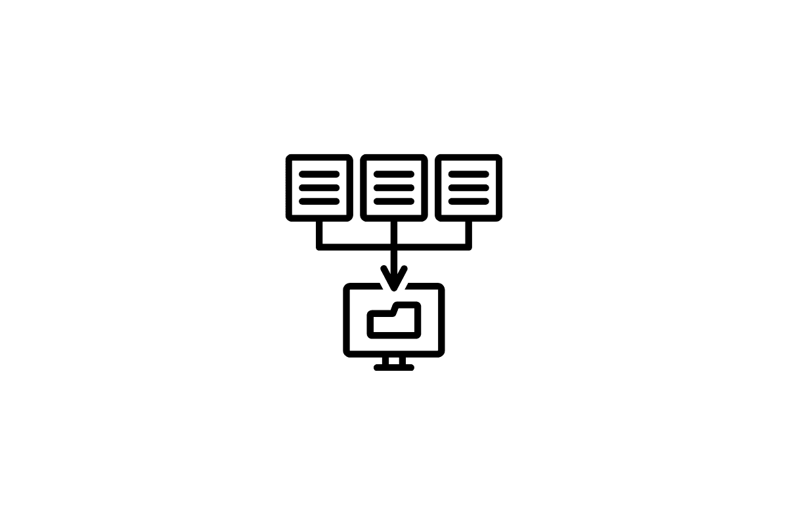

# 如何通过云计算高效扩展数据科学项目

> 原文：[`www.kdnuggets.com/2023/05/efficiently-scale-data-science-projects-cloud-computing.html`](https://www.kdnuggets.com/2023/05/efficiently-scale-data-science-projects-cloud-computing.html)

作者提供的图像

无法过分强调数据在做出明智决策中的重要性。在今天的世界里，企业依赖数据来推动战略、优化运营，并获得竞争优势。

* * *

## 我们的前三个课程推荐

 1\. [Google 网络安全证书](https://www.kdnuggets.com/google-cybersecurity) - 快速进入网络安全职业生涯。

 2\. [Google 数据分析专业证书](https://www.kdnuggets.com/google-data-analytics) - 提升您的数据分析能力

 3\. [Google IT 支持专业证书](https://www.kdnuggets.com/google-itsupport) - 支持您的组织的 IT

* * *

然而，随着数据量的指数增长，组织甚至个人项目中的开发者可能会面临高效扩展数据科学项目以处理大量信息的挑战。

为了应对这一问题，我们将讨论五个关键组件，这些组件有助于成功扩展数据科学项目：

1.  使用 APIs 进行数据收集

1.  云中的数据存储

1.  数据清洗和预处理

1.  使用 Airflow 进行自动化

1.  数据可视化的力量

这些组件对于确保企业收集更多数据并将其安全存储在云端以便于访问、使用预编写的脚本清理和处理数据、自动化流程，以及通过与云存储连接的互动仪表盘利用数据可视化的力量至关重要。

简而言之，这些是我们将在本文中介绍的方法，用于扩展您的 [数据科学项目](https://www.stratascratch.com/blog/19-data-science-project-ideas-for-beginners/)。

但要了解其重要性，我们不妨先看看在云计算出现之前，您可能会如何扩展您的项目。

## 云计算之前

作者提供的图像

在云计算出现之前，企业不得不依赖本地服务器来存储和管理数据。

数据科学家必须将数据从中央服务器移动到他们的系统中进行分析，这是一项耗时且复杂的过程。设置和维护本地服务器可能非常昂贵，并且需要持续的维护和备份。

云计算彻底改变了企业处理数据的方式，通过消除对物理服务器的需求并提供按需扩展的资源。

现在，让我们开始数据收集，以扩展你的数据科学项目。

图片由作者提供

# 使用 API 进行数据收集

图片由作者提供

在每个数据项目中，第一阶段是数据收集。

为你的项目和模型提供持续的、最新的数据对提升模型性能和确保其相关性至关重要。

收集数据的最有效方法之一是通过 API，这样可以程序化地从各种来源访问和检索数据。

API 已成为数据收集的一种流行方法，因为它们能够提供来自各种来源的数据，包括社交媒体平台、金融机构和其他网络服务。

让我们覆盖不同的用例，看看如何完成这些操作。

## Youtube API

在[这个](https://www.youtube.com/watch?v=fklHBWow8vE)视频中，使用了 Google Colab 进行编码，并通过 Requests 库进行测试。

使用了 YouTube API 来检索数据，并获得了 API 调用的响应。

数据发现存储在'items'键下。

数据被解析，并创建了一个循环来遍历这些项目。

进行了第二次 API 调用，数据被保存到 Pandas DataFrame 中。

这是在你的数据科学项目中使用 API 的一个很好的例子。

## Quandl 的 API

另一个例子是 Quandl API，它可以用来访问金融数据。

在 Data Vigo 的视频中，[这里](https://www.youtube.com/watch?v=K3GB1dn4YKk)，他解释了如何使用 Python 安装 Quandl，如何在 Quandl 的官方网站上找到所需的数据，并通过 API 访问金融数据。

这种方法使你可以轻松为你的金融数据项目提供必要的信息。

## Rapid API

正如你所见，通过使用不同的 API，有许多不同的选项可以扩展你的数据。要发现适合你需求的正确 API，你可以探索像 RapidAPI 这样的平台，它提供了覆盖各种领域和行业的广泛 API。通过利用这些 API，你可以确保你的数据科学项目始终提供最新的数据，从而使你能够做出明智的数据驱动决策。

# 云端数据存储

图片由作者提供

现在，你收集了数据，但应该存储在哪里呢？

在数据科学项目中，安全且可访问的数据存储是至关重要的。

确保你的数据既安全，防止未授权访问，又能方便授权用户访问，这样可以确保顺利操作和团队成员之间的高效协作。

基于云的数据库已成为解决这些需求的热门方案。

一些流行的基于云的数据库包括 Amazon RDS、Google Cloud SQL 和 Azure SQL 数据库。

这些解决方案可以处理大量数据。

利用这些基于云的数据库的著名应用程序包括运行在 Microsoft Azure 上的 ChatGPT，展示了云存储的强大和有效性。

让我们看看这个用例。

## Google Cloud SQL

要设置 Google Cloud SQL 实例，请按照以下步骤操作。

1.  前往 Cloud SQL 实例页面。

1.  点击“创建实例”。

1.  点击“选择 SQL Server”。

1.  输入你的实例 ID。

1.  输入密码。

1.  选择你想使用的数据库版本。

1.  选择实例托管的区域。

1.  根据你的偏好更新设置。

有关更详细的说明，请参阅[官方 Google Cloud SQL 文档](https://cloud.google.com/sql/docs/sqlserver/create-instance)。此外，你还可以阅读[这篇文章](https://medium.com/google-cloud/google-cloud-platform-for-sql-practitioners-2b2e4507535e)，它为从业人员解释了 Google Cloud SQL，提供了一个全面的指南，帮助你入门。

通过利用基于云的数据库，你可以确保数据安全存储且易于访问，使你的数据科学项目能够顺利高效地运行。

# 数据清理和预处理

图片由作者提供

你收集了数据并将其存储在云端。现在是时候转换数据以便进行进一步的处理了。

因为原始数据通常包含错误、不一致和缺失值，这些问题可能会对模型的性能和准确性产生负面影响。

适当的数据清理和预处理是确保数据准备好进行分析和建模的关键步骤。

## Pandas 和 NumPy

创建一个用于清理和预处理的脚本涉及使用 Python 等编程语言，并利用 Pandas 和 NumPy 等流行库。

Pandas 是一个广泛使用的库，提供数据处理和分析工具，而 NumPy 是 Python 中用于数值计算的基础库。这两个库提供了清理和预处理数据的基本功能，包括处理缺失值、过滤数据、重塑数据集等。

Pandas 和 NumPy 在数据清理和预处理中至关重要，因为它们提供了一种强大而高效的方法来操作和转换数据，使数据转变为结构化格式，便于机器学习算法和数据可视化工具使用。

一旦你创建了一个数据清理和预处理脚本，你可以将其部署到云端以实现自动化。这确保了你的数据得到一致和自动的清理与预处理，简化了你的数据科学项目。

## AWS Lambda 上的数据清理

要在 AWS Lambda 上部署数据清理脚本，你可以按照这个[初学者示例](https://www.youtube.com/watch?v=TGLrdDW_Dc4)中的步骤来处理 CSV 文件。这个示例演示了如何设置 Lambda 函数、配置必要的资源，并在云中执行脚本。

通过利用基于云的自动化的强大功能和 Pandas、NumPy 等库的能力，你可以确保你的数据是干净、结构良好的，并且准备好进行分析，从而最终提供更准确、更可靠的洞察。

# 自动化

图片由作者提供

那么，我们如何自动化这个过程呢？

## Apache Airflow

Apache Airflow 非常适合这个特定任务，因为它允许编程创建、调度和监控工作流。

它允许你使用 Python 代码定义复杂的多阶段管道，使其成为自动化数据收集、清理和预处理任务的理想工具，在[数据分析项目](https://www.stratascratch.com/blog/data-analytics-project-ideas-that-will-get-you-the-job/?utm_source=blog&utm_medium=click&utm_campaign=kdn+cloud+computing+projects)中尤为重要。

## 使用 Apache Airflow 自动化 COVID 数据分析

让我们在示例项目中看看它的使用情况。

示例项目：使用 Apache Airflow 自动化 COVID 数据分析。

在这个示例项目中，[这里](https://selectfrom.dev/simple-step-to-create-etl-tool-by-using-apache-airflow-and-loading-to-bigquery-f37c6430b698)，作者演示了如何使用 Apache Airflow 自动化 COVID 数据分析管道。

1.  创建 DAG（有向无环图）文件

1.  从数据源加载数据。

1.  清理和预处理数据。

1.  将处理后的数据加载到 BigQuery

1.  发送电子邮件通知：

1.  将 DAG 上传到 Apache Airflow

通过遵循这些步骤，你可以使用 Apache Airflow 创建一个自动化的 COVID 数据分析管道。

这个管道将处理数据收集、清理、预处理和存储，同时在成功完成后发送通知。

使用 Airflow 进行自动化简化了你的数据科学项目，确保你的数据得到一致的处理和更新，使你能够根据最新的信息做出明智的决策。

# 数据可视化的力量

图片由作者提供

数据可视化在数据科学项目中发挥着至关重要的作用，它将复杂的数据转化为易于理解的视觉效果，使利益相关者能够快速掌握洞察，识别趋势，并根据呈现的信息做出更明智的决策。

简而言之，它将以互动的方式为你提供信息。

有几种工具可用于创建交互式仪表板，包括 Tableau、Power BI 和 Google Data Studio。

每种工具都提供了独特的功能和能力，帮助用户创建视觉上吸引人且信息丰富的仪表板。

## 将仪表板连接到你的云数据库

要将云数据集成到仪表板中，首先选择一个符合你需求的云数据集成工具。将该工具连接到你首选的云数据源，并映射你希望在仪表板上显示的数据字段。

接下来，选择合适的可视化工具，以清晰简洁的方式展示你的数据。通过引入筛选器、分组选项和钻取功能来增强数据探索。

确保你的仪表板自动刷新数据，或根据需要配置手动更新。

最后，彻底测试仪表板的准确性和可用性，进行必要的调整以提升用户体验。

## 将 Tableau 连接到你的云数据库 - 用例

Tableau 提供了与云数据库的无缝集成，使你可以轻松将云数据连接到仪表板。

首先，识别你使用的数据库类型，因为 Tableau 支持多种数据库技术，如 Amazon Web Services(AWS)、Google Cloud 和 Microsoft Azure。

然后，建立云数据库和 Tableau 之间的连接，通常使用 API 密钥以确保安全访问。

Tableau 还提供了多种云数据连接器，可以轻松配置以访问来自多个云源的数据。

有关在 AWS 上部署单个 Tableau 服务器的逐步指南，请参考这份[详细文档](https://aws-quickstart.github.io/quickstart-tableau-server/)。

另外，你可以探索一个演示[Amazon Athena 与 Tableau 之间连接](https://tarsolutions.co.uk/blog/connect-to-athena-from-tableau/)的用例，包含截图和解释。

# 结论

扩展数据科学项目的云计算好处包括改进的资源管理、成本节约、灵活性，以及专注于数据分析而非基础设施管理。

通过采用云计算技术并将其整合到你的数据科学项目中，你可以提升可扩展性、效率和数据驱动项目的整体成功。

通过在数据科学项目中采用云计算技术，你还可以实现改进的决策制定和数据洞察。随着你不断探索和采用云解决方案，你将更好地处理不断增长的数据量和复杂性。

这将最终赋能你的组织，基于从结构良好且高效管理的数据管道中获得的有价值洞察，做出更智能的数据驱动决策。

在这篇文章中，我们讨论了使用 API 进行数据收集的重要性，并探索了各种工具和技术以简化云中的数据存储、清理和预处理。我们还涵盖了数据可视化在决策中的强大影响，并突出了使用 Apache Airflow 自动化数据管道的好处。

充分利用云计算的好处来扩展你的数据科学项目，将使你能够完全挖掘数据的潜力，并引导你的组织在日益竞争的数据驱动行业中迈向成功。

**[Nate Rosidi](https://www.stratascratch.com)** 是一名数据科学家和产品战略专家。他还担任分析学兼职教授，并且是 [StrataScratch](https://www.stratascratch.com/) 的创始人，该平台帮助数据科学家通过顶级公司的真实面试问题准备面试。通过 [Twitter: StrataScratch](https://twitter.com/StrataScratch) 或 [LinkedIn](https://www.linkedin.com/in/nathanrosidi/) 与他联系。

### 更多相关话题

+   [云计算如何增强数据科学工作流](https://www.kdnuggets.com/2023/08/cloud-computing-enhances-data-science-workflows.html)

+   [数据科学中的云计算简介](https://www.kdnuggets.com/introduction-to-cloud-computing-for-data-science)

+   [云计算初学者指南](https://www.kdnuggets.com/2023/01/beginner-guide-cloud-computing.html)

+   [云原生超级计算](https://www.kdnuggets.com/2022/03/nvidia-cloud-native-super-computing.html)

+   [如何高效地合并大型 DataFrame 使用 Pandas](https://www.kdnuggets.com/how-to-merge-large-dataframes-efficiently-with-pandas)

+   [拆解量子计算：对数据科学和人工智能的影响](https://www.kdnuggets.com/breaking-down-quantum-computing-implications-for-data-science-and-ai)
